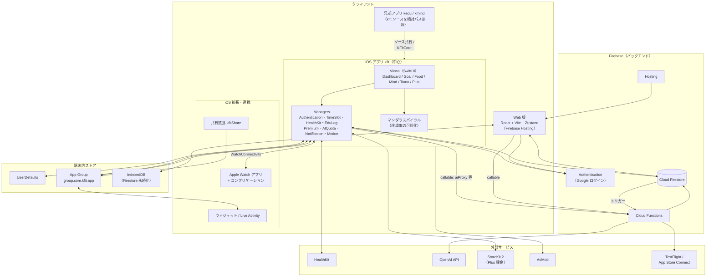

# Fitingo アーキテクチャ

Fitingo（リポジトリ名 `kfit`）は、運動・食事・マインド・学習の習慣化アプリです。iOS アプリを中心に、Apple Watch・ウィジェット・共有拡張・Web 版が **Firebase（Firestore + Cloud Functions + Hosting）** を共通の土台として連携します。

> 本書はソースコードの実装を基に記述しています。ファイル名・関数名は 2026-09 時点のものです。

---

## 1. 全体構成図

---

## 2. レイヤー別の詳細

### 2.1 iOS アプリ（`ios/kfit`）— システムの中心

SwiftUI 製。タブ構成は ROUTIN（時間帯別ルーティン）・FIT・GOAL・FOOD・MIND・TOMO（友達フィード）・Plus などで、`Views/` に画面、`Managers/` に状態とビジネスロジック、`Models/` に設定・進捗のデータ型を置いています。

| Manager | 役割 |
|---|---|
| `AuthenticationManager` | Google ログイン（Firebase Auth）、Firestore の読み書きの入口。トレーニング記録・ポイント・ストリーク・公開プロフィール（`PublicFeedPublisher`）・キャッシュ（30 秒 TTL） |
| `TimeSlotManager` | 朝・昼・午後・夜の時間帯別目標と進捗（`time-slot-progress`）。`MandalaCompletionLogger`（ノード完了の確定記録）もここ |
| `HealthKitManager` | 歩数・睡眠・体重・水分・食事・マインドフルネス・アクティビティリングの取得。取得はタイムアウトと自己回復ウォッチドッグで保護 |
| `EduLogManager` | 勉強・日記・Duolingo・読書などの投稿履歴。`UserDefaults` に保存し、`PublicFeedPublisher` でフィードへ公開 |
| `PendingShareProcessor` | 共有拡張から受け取った内容（テキスト・画像）をキーワードで分類し、`EduLogManager` や食事ログへ振り分け。画像は Vision OCR でフォールバック判定 |
| `DuolingoTextExtractor` | OCR・言語判定・例文生成（AI）などの学習支援 |
| `PremiumManager`（Plus） | StoreKit 2 による課金、シークレットコード解除、Admin 判定 |
| `AIQuotaManager` | AI 呼び出しの回数管理（サーバー側 `AI_QUOTA` と対応） |
| `MotionDetectionManager` | Core Motion による回数自動カウント（腕立て・スクワット等） |
| `iOSWatchBridge` | WatchConnectivity による Watch との双方向同期、ウィジェット用データ更新 |
| `RetentionTracker` / `NotificationManager` / `HabitStackManager` | 継続日数の計測、通知、習慣スタック |

**マンダラスパイラル**（`DashboardView` / `TimeSlotGoalsView.buildNodes`）が習慣の進捗を一つに束ねる中核 UI です。ノードの完了は「保存済みの進捗」だけでなく、次のソースから**導出**されます。

- 時間帯別進捗（`TimeSlotManager.progress`）
- HealthKit のサンプル（瞑想・水分・食事・歩数）
- 実際のトレーニング履歴（時間帯ごとのセット数）
- 投稿履歴（`EduLogManager.history`）と各目標名の名前照合
- 完了ログ（`MandalaCompletionLogger`）による補完

中心の達成率（％）＝完了ノード数 ÷ 全ノード数で、共有画像・履歴カレンダーも同じ算出（`mandalaCompletionPercent`）を参照します。

### 2.2 iOS 拡張・Apple Watch

| ターゲット | 役割 |
|---|---|
| `kfitWatch` / コンプリケーション | Watch 単体でのトレーニング記録（`WatchMotionDetectionManager`）、HealthKit 連携、iPhone との同期（`WatchConnectivityManager`） |
| `kfitWidget` | ホーム画面ウィジェット、Live Activity、コントロール。App Group 経由で最新値を読む |
| `kfitShare` | 共有シート拡張。Duolingo・Audible・日記・食事などを他アプリから送る入口 |

App Group（`group.com.kfit.app`）が拡張とアプリ本体の共有領域です。共有拡張は保留データを書き込み、本体が起動・復帰時に `PendingShareProcessor` で取り込みます。ウィジェットは本体が書いた最新値を読むだけです。

### 2.3 Web 版（`web/`）

React 18 + TypeScript + Vite + Tailwind、状態管理は Zustand。`App.tsx` が画面遷移を管理し、各画面は `lazy()` で分割されています（メインバンドル約 74KB、Firebase と React は別チャンク）。

- `services/firebase.ts`: Firestore・Auth・callable Functions のラッパー（IndexedDB 永続化と 30 秒 TTL のメモリキャッシュ）
- 90 秒モード（`NinetySecondMode`）はログイン不要。`/90s`・`/start` パスで直接開ける
- 動画は `RotatingVideo`（クロスフェード）と `useLoopTrim`（末尾ロゴカットの除去）で再生
- Firebase Hosting で配信。`firebase.json` の Cache-Control は HTML 1 時間、JS/CSS は 1 年 immutable、動画・画像 1 週間

Web は「手動入力が中心」で、モーション検知・HealthKit・Watch 連携は iOS 専用です。iOS アプリの起動は `fitingo://` のディープリンクで行います。

### 2.4 兄弟アプリと共有コード

- `kedu` / `kmind` は別プロジェクトですが、`ios/kfit/...` のソースファイルを**相対パスで参照して自ターゲットにコンパイル**します。kfit 側で共有 View を追加・変更したら、両プロジェクトの `pbxproj` も更新が必要です。
- `Packages/KFitCore` は色・UI・HealthKit・HRV・言語などの共通 Swift Package です。

### 2.5 Firebase バックエンド

**Firestore**（`firebase/firestore.rules`）

| パス | 用途 | アクセス |
|---|---|---|
| `users/{uid}/…` | プロフィール、`completed-exercises`、`completed-sets`、`daily-intake`、`logs`、`settings`、`weekly-goals`、`summaries`、`time-slot-progress` など | 本人のみ読み書き |
| `publicProfiles/{uid}` と `posts` | 友達検索・フィード・ランキング用の公開データ | 本人のみ書き込み、ログイン済みが読める |
| `friendships`、`leaderboards`、`shared-reports` | 友達関係、週間ランキング、週間レポートの共有カード | ルールにより個別制御 |
| `exercises` | 種目マスタ | 全員読み取り可、書き込み不可 |
| `challenge_registrations` など | 90 日チャレンジ LP・統計 | 個別ルール |

**Cloud Functions**（`firebase/functions/index.js`）

| 関数 | 種別 | 内容 |
|---|---|---|
| `calculatePoints` | Firestore トリガー（`completed-exercises` 作成時） | ポイント・ボーナス加算 |
| `checkAchievements` | Firestore トリガー（同上） | 実績バッジの判定 |
| `evaluateStreakOnSummaryWrite` | Firestore トリガー（`summaries` 書き込み時） | 連続記録の評価 |
| `generateWeeklyLeaderboard` | スケジュール（毎週日曜 23:59） | 週間ランキング生成 |
| `computeRetentionStats` | スケジュール（毎週月曜 03:00） | 継続率の集計 |
| `pruneAchievementHistory` | スケジュール（毎月 1 日 04:00） | 実績履歴の整理 |
| `aiProxy` | callable | OpenAI への中継。認証必須、Plus/無料/90 秒モード別のクォータ（`AI_QUOTA`）、ユーザー自身の API キーにも対応 |
| `generateWeeklyReport` | callable | 週次レポートの AI コメント生成 |
| `getRetentionDiagnostics` / `setAdminStreak` / `inviteTestFlightTester` | callable（Admin 限定） | 継続診断、連続記録の手動設定、TestFlight 招待。呼び出し元のメールをサーバー側で再検証 |

---

## 3. 主要なデータフロー

### 3.1 トレーニング記録 → ポイント・ストリーク
1. iOS（Motion / 手動 / Watch）または Web が `users/{uid}/completed-exercises` に書き込む
2. `calculatePoints` と `checkAchievements` がトリガーで起動し、ポイントと実績を更新
3. 日次サマリー（`summaries`）の書き込みで `evaluateStreakOnSummaryWrite` が連続記録を更新
4. 別端末の Firestore リスナーが変更を検知し、UI が更新される（Web ⇄ iOS 同期）

### 3.2 他アプリからの共有 → スパイラル反映
1. 共有拡張（`kfitShare`）が内容を App Group に保存
2. 本体が `PendingShareProcessor` で分類（Duolingo・日記・勉強・食事など。コメントが無い画像は Vision OCR）
3. `EduLogManager.history` に追加、`PublicFeedPublisher` がフィードへ公開
4. `DashboardView` が新規 ID を検知し、スパイラルを**即時に再計算**（履歴との名前照合で完了を導出）、その後に進捗を Firestore へ保存

### 3.3 AI 呼び出し
1. クライアントが `aiProxy` を callable で呼ぶ（プロンプト・カテゴリ・90 秒モードか・連続日数）
2. サーバーが認証を確認し、Plus 判定とカスタム API キーを取得
3. クォータ（90 秒モード 1 / 無料 1 / Plus 3 の日次上限）を確認して OpenAI を呼ぶ
4. API キーは Firebase Secrets（`OPENAI_API_KEY`）で管理し、クライアントには置かない

### 3.4 Watch・ウィジェット同期
- iPhone ⇄ Watch: `WatchConnectivity`（`iOSWatchBridge` ⇄ `WatchConnectivityManager`）。通信はデバウンスで削減
- ウィジェット: 本体が App Group に最新値を書き込み、WidgetKit が読む

---

## 4. キャッシュとオフライン

| 層 | 仕組み |
|---|---|
| iOS | Firestore ローカルキャッシュ、`getTodayExercises()` の 30 秒メモリキャッシュ、HealthKit 再取得の TTL キャッシュ、`UserDefaults`（EduLog 履歴・完了ログ・カスタム目標 ID） |
| Web | IndexedDB 永続化、30 秒 TTL のメモリキャッシュ、ブラウザキャッシュ（ハッシュ付き JS/CSS は immutable） |
| 進捗の競合対策 | 進捗の読み込み中にローカルで行った変更は、Firestore の古い値で巻き戻さない（今日分のローカル進捗を優先マージ） |

---

## 5. ビルド・配信

| 対象 | 手順 |
|---|---|
| Web | `cd web && npm run build` → `firebase deploy --only hosting` |
| Cloud Functions | `firebase deploy --only functions` |
| Firestore ルール | `firebase deploy --only firestore:rules` |
| iOS | `xcodegen generate`（`project.yml`）→ `pod install` → Xcode / `xcodebuild`。TestFlight へは Archive 時にビルド番号を自動加算 |

Xcode プロジェクトは `ios/project.yml`（XcodeGen）から生成され、CocoaPods（Firebase Core/Auth/Firestore/Functions、GoogleSignIn、AdMob）を使います。

---

## 6. 設計上の判断と注意点

- **iOS ファースト**: センサーによる自動カウントと HealthKit が中核価値のため。Web は手動入力＋公開・体験用途
- **Firestore を唯一の正とする**: 端末間同期とサーバー側集計（ポイント・ランキング）を単純化。書き込み時トリガーで集計する
- **AI はサーバー経由**: API キーの秘匿とクォータ制御のため、クライアントから OpenAI を直接呼ばない
- **Admin 機能はサーバーで再検証**: UI の表示制御はあくまで見た目で、実際の権限はメールの検証で担保する
- **スパイラルは「導出」を基本にする**: 完了状態を複数箇所に保存すると食い違うため、履歴・HealthKit・進捗から毎回計算し、完了ログは補完に限定する
- **非同期取得は必ずタイムアウトを付ける**: Firestore・HealthKit の応答が返らないと「読み込みが止まる」ため、タイムアウトと自己回復を入れている
- **kedu / kmind との共有**: 共有 View を kfit 側で変更するときは、両プロジェクトの登録とスタブのシグネチャも合わせる
- **ディスク**: Pods（Firestore/gRPC）のフルビルドで DerivedData が数 GB 膨らむため、空き容量に注意する
