# AppleWatch Diet Ultra2 — 100のダイエット方法

> **著者**: 吉田 顕一  
> Apple Watchで簡単、手軽にダイエット、健康的な生活を送る方法

---

## はじめに

Apple Watch Ultra 2を手首に着けるだけで、あなたのダイエットは「管理するもの」から「楽しむもの」に変わります。

本書では、Apple WatchとFitingo（フィティンゴ）アプリを最大限に活用した100のメソッドを、4つのカテゴリ（エネルギー消費・食事管理・マインドフルネスと睡眠・Fitingo連携）に分けて紹介します。1メソッド＝1ページ完結なので、最初から順に読む必要はありません。気になったページから、今日ひとつだけ試してください。ダイエットに必要なのは強い意志ではなく、記録と継続の仕組みです。その仕組みは、あなたの手首にもう着いています。

> **2026年7月時点の最新情報**
> 本書のメソッドは Apple Watch Ultra 2 を基準に執筆していますが、現行モデルの Series 11・Ultra 3・SE 3（いずれも watchOS 26）でもすべて同様に活用できます。watchOS 26 では、ワークアウト中に AI が音声で励ましてくれる「Workout Buddy」、睡眠の質を毎晩自動採点する「睡眠スコア」（Series 6 以降・SE 第2世代以降・Ultra 全機種）、高血圧の兆候を検知する「高血圧通知」（Series 9 以降・Ultra 2 以降）が追加されました。2026年9月公開予定の watchOS 27 では、Workout Buddy のパーソナルコーチング強化・ワークアウトタイプに応じた Apple Music の自動プレイリスト提案・トレッドミルでの距離/ペース計測精度の向上が発表されています。

---

## 目次


### I. エネルギー消費を増やす
- [No.001 ムーブリングを毎日達成する](#001)
- [No.002 スタンドリングで座り過ぎを防ぐ](#002)
- [No.003 エクササイズリングで運動習慣をつくる](#003)
- [No.004 毎時のスタンドリマインダーをフル活用](#004)
- [No.005 毎日の歩数目標を設定して達成する](#005)
- [No.006 活動カロリー目標を週ごとに少しずつ上げる](#006)
- [No.007 通勤・通学で歩く距離を意識的に増やす](#007)
- [No.008 階段を積極的に使う](#008)
- [No.009 昼休みのウォーキング習慣をつくる](#009)
- [No.010 アクティビティトレンドで進捗を可視化する](#010)
- [No.011 ウォーキングワークアウトで正確にカロリー計測](#011)
- [No.012 ランニングで脂肪燃焼を加速する](#012)
- [No.013 サイクリングで下半身をトレーニング](#013)
- [No.014 水泳で全身をくまなく鍛える](#014)
- [No.015 HIITで短時間・高強度トレーニング](#015)
- [No.016 ヨガで代謝を上げて柔軟性を高める](#016)
- [No.017 筋力トレーニングで基礎代謝を高める](#017)
- [No.018 ダンスフィットネスを楽しみながら燃焼](#018)
- [No.019 縄跳びで全身運動を短時間で](#019)
- [No.020 ハイキングで自然の中でカロリー消費](#020)
- [No.021 ウォーキング会議で「ながら活動」](#021)
- [No.022 立って家事をしながら消費カロリーを稼ぐ](#022)
- [No.023 ゴルフをアクティビティとして記録する](#023)
- [No.024 テニスで楽しくカロリー消費](#024)
- [No.025 ピラティスで体幹と姿勢を改善](#025)
- [No.026 ボクシングエクササイズで全力発散](#026)
- [No.027 太極拳でゆっくり確実に代謝アップ](#027)
- [No.028 ローイングマシンで全身を効率よく鍛える](#028)
- [No.029 バスケットボールで心拍数を上げる](#029)
- [No.030 エリプティカルで関節に優しく運動](#030)
- [No.031 ペット散歩を運動の機会に変える](#031)
- [No.032 ショッピングを歩く機会として活用する](#032)
- [No.033 家の近くの新しいルートを毎週開拓する](#033)
- [No.034 スノーボード・スキーで冬も活動を維持](#034)
- [No.035 クライミングで全身を追い込む](#035)

### II. 食事管理
- [No.036 食事記録アプリとHealthKitを連携する](#036)
- [No.037 Fitingoで食事写真をAI分析する](#037)
- [No.038 水分補給をApple Watchでリマインドする](#038)
- [No.039 食前に心拍数をチェックしてストレス食いを防ぐ](#039)
- [No.040 1日の摂取カロリーをリアルタイムで把握する](#040)
- [No.041 食事リマインダーで規則正しい食事習慣を守る](#041)
- [No.042 空腹感スケールを活用して食べ過ぎを防ぐ](#042)
- [No.043 食物繊維を意識して摂り、満腹感を高める](#043)
- [No.044 カフェイン摂取量を管理して睡眠を守る](#044)
- [No.045 タンパク質摂取量をFitingoで管理する](#045)
- [No.046 血糖値スパイクを防ぐ食事の順番](#046)
- [No.047 アルコール摂取をFitingoで記録して意識する](#047)
- [No.048 食事中にスマートフォンを置いてマインドフルイーティング](#048)
- [No.049 間食の選び方をアップグレードする](#049)
- [No.050 食後30分のウォーキングで血糖値をコントロール](#050)
- [No.051 週次栄養バランスレポートで食生活を改善](#051)
- [No.052 塩分摂取を減らして水分貯留を防ぐ](#052)
- [No.053 糖質量を意識して管理する](#053)
- [No.054 食後の満足感をFitingoのメモで記録する](#054)
- [No.055 食事前の深呼吸3回で食べ過ぎを防ぐ](#055)

### III. マインドフルネスと睡眠
- [No.056 朝のブリーズセッションで1日をスタート](#056)
- [No.057 リフレクトで感謝の気持ちを育む](#057)
- [No.058 心拍変動（HRV）でストレス状態を把握する](#058)
- [No.059 Fitingoのマインドフルネス記録を毎日つける](#059)
- [No.060 ウォーキング瞑想で身体と心を同時に整える](#060)
- [No.061 深呼吸エクササイズを1日3回行う](#061)
- [No.062 睡眠スケジュールを設定して規則正しく眠る](#062)
- [No.063 睡眠の質をApple Watchで毎朝確認する](#063)
- [No.064 就寝前2時間の充電ルーティンを作る](#064)
- [No.065 睡眠コーチング機能でアドバイスを受ける](#065)
- [No.066 フォーカス機能でダイエット生活を管理する](#066)
- [No.067 瞑想タイマーとして活用して集中力を高める](#067)
- [No.068 1日を振り返るショートカットで夜の感謝習慣](#068)
- [No.069 歯磨き中に足踏みしてムーブを稼ぐ](#069)
- [No.070 睡眠前の仕事メール・SNSを断ち切る](#070)

### IV. Fitingoアプリとの連携
- [No.071 Fitingoで腕立て伏せを自動カウントする](#071)
- [No.072 スクワットの回数をFitingoで自動記録](#072)
- [No.073 腹筋の回数をFitingoで自動検出](#073)
- [No.074 Apple WatchのジャイロでFitingoの動作認識精度を上げる](#074)
- [No.075 Fitingoのスパイラルで1日の達成度を確認する](#075)
- [No.076 Fitingoで時間帯別の目標を管理する](#076)
- [No.077 FitingoのWatch文字盤で活動状況を即確認](#077)
- [No.078 Fitingoのポイントシステムでゲームのようにダイエット](#078)
- [No.079 Fitingoの週間ゴールを設定して中期計画を立てる](#079)
- [No.080 Apple Watchから直接Fitingoのワークアウトを開始](#080)
- [No.081 FitingoとHealthKitのデータを統合管理する](#081)
- [No.082 体重をHealthKitと連動してFitingoで記録](#082)
- [No.083 Fitingoの水分補給記録を毎日更新する](#083)
- [No.084 FitingoのAI食事分析でカロリーを自動記録](#084)
- [No.085 Fitingoのストリーク（連続達成）を維持する](#085)
- [No.086 ウォッチコンプリケーションで達成数をリアルタイム確認](#086)
- [No.087 Fitingoの通知でワークアウトリマインダーを設定](#087)
- [No.088 Fitingoで体脂肪率の目標と進捗を管理する](#088)
- [No.089 FitingoのGIFキャラクターでワークアウトを楽しく](#089)
- [No.090 Fitingoの長期ダイエット目標（3ヶ月）を設定する](#090)
- [No.091 Fitingoのダッシュボードで総合進捗を毎朝確認](#091)
- [No.092 Siriでハンズフリーにワークアウト記録を開始](#092)
- [No.093 Apple Watchの完了バッジを毎日集める](#093)
- [No.094 Fitingoのフードフィードで食事アイデアを収集](#094)
- [No.095 Apple Watchのシェアリングで友人と競い合う](#095)
- [No.096 Fitingoのマインドフルネスで食欲を整える](#096)
- [No.097 Fitingo×Apple Watchで就寝前のルーティンを確立](#097)
- [No.098 Fitingoのヘルスサマリーで体調変化を把握する](#098)
- [No.099 Fitingoで「ながら運動」をすべて記録する](#099)
- [No.100 Fitingo×Apple Watchで「ダイエットを楽しむ生活」を作る](#100)

---

### 特別付録 — AIでこの本を作った方法
- [付録1 なぜAIで本を書いたのか](#appendix-1)
- [付録2 使ったAIツールと役割分担](#appendix-2)
- [付録3 プロンプト設計の実際](#appendix-3)
- [付録4 Fitingoアプリとの連携ワークフロー](#appendix-4)
- [付録5 画像・スクリーンショットの管理方法](#appendix-5)
- [付録6 Kindle出版までの全工程](#appendix-6)
- [付録7 AI執筆で気づいたこと・失敗談](#appendix-7)
- [付録8 あなたもAIで本を書ける — 最初の一歩](#appendix-8)

---

## Fitingo アプリ 20の機能

Apple WatchとiPhoneを最大限に活かすFitingoの主要機能を紹介します。これらの機能を組み合わせることで、ダイエットを「楽しく続けられる習慣」に変えられます。

### 01. 🌀 マンダラスパイラル
*達成度の視覚的把握*

1日の運動・食事・水分・マインドフルネスの達成度を、美しいスパイラル（螺旋）形式で可視化。時間帯ごとにアイコンが完了（チェック）になっていく様子が、ゲームのステージクリアのような達成感をもたらします。

### 02. 💪 腕立て伏せ自動カウント
*CoreMotion × プッシュアップ*

iPhoneの加速度センサーとジャイロスコープを使い、腕立て伏せ1回ごとの上下動作を自動検出。セルフカウント不要で「フォームに集中」できます。Apple Watchと連携するとさらに精度が向上します。

### 03. 🦵 スクワット自動カウント
*膝の屈伸を自動認識*

iPhoneをポケットに入れたまま、スクワットの「しゃがむ→立つ」動作を自動カウント。Apple Watchのジャイロと組み合わせることで、ハーフスクワットとフルスクワットも識別できます。

### 04. 🔲 腹筋（シットアップ）自動カウント
*体幹の動きを精密に検出*

床に寝た状態でiPhoneを胸に置くだけで、上体を起こす動作を自動認識。1回ずつリアルタイムに画面に回数が表示されます。腹筋の「効いている感覚」に集中できるのが最大の利点です。

### 05. 📸 フォトログ（AI食事分析）
*写真1枚で栄養素を自動解析*

食事の写真を撮影すると、画像解析AI（OpenAI / Anthropic / Google から選択可能）がカロリー・タンパク質・脂質・炭水化物・水分・カフェイン・アルコールを自動解析。入力の手間なしに食事記録が完了し、HealthKitに自動保存されます。数値は後から1タップで修正できます。

### 06. 💧 水分補給記録
*タップ1回で200ml記録*

スパイラルの💧アイコンをタップするだけで、水分200mlがHealthKitに記録。1日の目標（体重×35ml）に対する進捗がリアルタイムで表示され、時間帯ゴールの達成にもカウントされます。

### 07. 🧘 マインドフルネス記録
*ブリーズ・リフレクトと完全連携*

Apple Watchの「ブリーズ」「リフレクト」セッションを完了すると、Fitingoのマインドフルネス記録が自動更新。スパイラルの🧘アイコンが完了になり、ストリーク管理にも反映されます。

### 08. ⚖️ 体重・体脂肪率管理
*HealthKitと連動してグラフ表示*

毎朝の体重・体脂肪率をHealthKitと連携して自動取得（スマート体重計使用時）または手動入力。週・月単位のトレンドグラフで体組成の変化を可視化し、ダイエットの停滞期も早期に発見できます。

### 09. 🔗 HealthKit完全連携
*全データを一元管理*

ワークアウト・水分・栄養素・体重・カフェイン・アルコールなど、Fitingoが記録するすべてのデータをiPhoneのヘルスケアアプリ（HealthKit）に書き込み・読み込み。他のヘルスアプリとのデータ共有も可能です。

### 10. ⌚ Apple Watchコンプリケーション
*文字盤に達成数をリアルタイム表示*

Apple Watch文字盤にFitingoの達成数（例：「5/10」）をコンプリケーションとして表示。手首を上げるたびに今日の進捗が目に入り、次のゴールへの意識を自然に高めます。

### 11. ⏰ 時間帯別ゴール設定
*朝・昼・夕・夜の4スロット*

1日を「朝（〜11時）」「昼（11〜17時）」「夕方（17〜21時）」「夜（21時〜）」の4つの時間帯に分け、それぞれにゴール（運動・水分・食事など）を設定。スパイラルの各アイコンが時間帯ごとに完了していきます。

### 12. 📅 曜日別ゴール設定
*平日・週末で異なるプランを自動切替*

平日は「軽めのゴール（腕立て10回・スクワット20回・水分5杯）」、週末は「集中トレーニングゴール（腕立て30回・スクワット50回・ランニング30分）」など、曜日によって自動的に目標量が切り替わります。

### 13. 🔥 ストリーク（連続達成）管理
*連続日数で習慣を強化*

毎日のゴールを達成すると「ストリーク（連続達成日数）」がカウントアップ。7日・30日・66日・100日などの節目でバッジが解除されます。「途切れさせたくない」心理が毎日の継続を強力にバックアップします。

### 14. 🏆 ポイント＆バッジシステム
*運動するたびにポイントが貯まる*

腕立て伏せ1回=10pt・スクワット1回=15pt・ストリーク継続ボーナスなど、ゲームのような報酬設計でダイエットにハリが出ます。TOMOフィードで友人・家族と「今日やった」を共有し、励まし合う機能も搭載。

### 15. 🎮 Watch GIFキャラクターアニメーション
*Apple Watch上でキャラクターが躍動*

Apple Watchでワークアウト中、Fitingoのオリジナルキャラクター（Fitingo）がGIFアニメーションで応援。回数が増えるごとにアニメーションが変化し、達成時のセレブレーション演出がモチベーションを高めます。

### 16. ▶️ Apple Watch単体ワークアウト
*iPhoneなしで即座に記録開始*

Apple Watch単体でFitingoのワークアウト（腕立て・スクワット・腹筋）を開始できます。iPhoneを取り出す手間なく、外出先・職場でも手首のタップだけで即座に記録を開始・完了できます。iPhoneが圏外・未接続でも記録はWatch内に保証付きで蓄積され、次に接続した瞬間にすべて自動同期されるため、記録が消える心配はありません。

### 17. 🍽️ フードフィード（食事コレクション）
*成功した食事をお気に入り登録*

フォトログで「FOODフィードに追加」をオンにすると、過去の食事がライブラリに蓄積。「筋トレ後の定番ランチ」「ダイエット成功週の夕食」など、再現したい食事をすぐに参照できます。

### 18. 🔔 スマート通知・リマインダー
*時間帯・曜日別のカスタム通知*

「朝7時：今日の最初のゴールを確認！」「19時：帰宅後のトレーニングタイム！」など、時間帯・曜日に合わせたカスタム通知をApple Watchに送信。「通知を見たらすぐ行動」の習慣ループを作り出します。

### 19. 📊 ダッシュボード総合管理
*運動・食事・睡眠を1画面で俯瞰*

Fitingoのトップ画面（ダッシュボード）で、今日の運動記録・摂取カロリー・水分量・マインドフルネス時間・体重・ストリークを一覧できます。毎朝30秒確認するだけで1日の行動指針が明確になります。

### 20. 📈 週次・月次プログレスレポート
*長期トレンドで本当の進捗を把握*

週・月単位で運動量・消費カロリー・体重変化・水分摂取量・マインドフルネス時間のトレンドを確認。「体重は変わってないが体脂肪率が下がっている」など、数字の裏に隠れた成長を発見できます。

---

## 100のダイエット方法

---

## I. エネルギー消費を増やす

<a id="001"></a>

### No.001 🔴 ムーブリングを毎日達成する

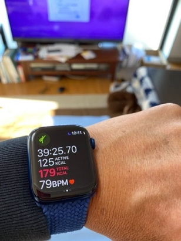

Apple Watchの文字盤に常に表示される3つのリング。中でも赤いムーブリングは「活動カロリー」の目標を示します。最初は低めの目標（300〜400 kcal）から始め、毎日リングを閉じることを習慣化しましょう。達成できた日が続くと、Watchが「目標を上げてみませんか？」と提案してくれます。

#### 📋 やり方

- Watchアプリ →「アクティビティ」→「ムーブゴールを変更」
- 最初は現在の消費量より少し多い値（+50 kcal）に設定
- 毎朝、文字盤でリングの進捗を確認する習慣をつける
- 週7日連続達成でバッジ獲得（モチベーション維持に最適）

#### 💡 ポイント

> 無理に高い目標を設定せず、継続できる値から始めるのがコツ。1か月後には自然に目標値が上がっています。

<a id="002"></a>

### No.002 🔵 スタンドリングで座り過ぎを防ぐ

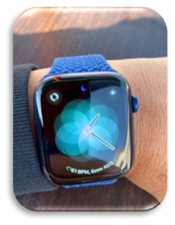

青いスタンドリングは「1時間に1回以上立つ」を12時間達成したかを示します。座り続けることは肥満・生活習慣病のリスクを高めます。Apple Watchが毎時50分に「そろそろ立ちましょう」と優しく教えてくれます。立つだけでも代謝が上がり、1日の消費カロリーを着実に増やせます。

#### 📋 やり方

- Watchの通知設定 →「スタンドリマインダー」をオン
- リマインダーが来たら、その場で立ち上がり30秒〜1分歩く
- 立ったままできる家事（食器洗い、電話対応など）を活用
- スタンディングデスクがあれば午前中だけでも活用

#### 💡 ポイント

> 立つだけで消費カロリーが増えるのは事実。1日12時間リングを閉じると、それだけで基礎代謝を底上げできます。

<a id="003"></a>

### No.003 🟢 エクササイズリングで運動習慣をつくる

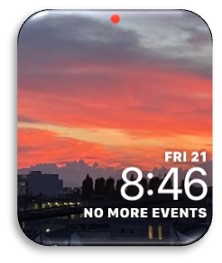

緑のエクササイズリングは「速歩き以上の強度の運動を30分行う」目標です。毎日30分の有酸素運動は、ダイエットの基本中の基本。Apple Watchが心拍数をリアルタイムに計測し、運動強度が十分かどうかを自動判定してくれます。週5日達成を目指しましょう。

#### 📋 やり方

- 1日30分を「ながら運動」で達成（通勤早歩き＋昼休み散歩など）
- Watchのワークアウトアプリで「屋外ウォーク」を開始
- 心拍数が100 bpm以上を維持するペースを保つ
- 毎日同じ時間帯に行うことでリングを閉じる習慣が定着

#### 💡 ポイント

> エクササイズリングは「連続30分」でなくてもOK。細切れでも合計30分達成できればリングは閉じます。

<a id="004"></a>

### No.004 ⏰ 毎時のスタンドリマインダーをフル活用

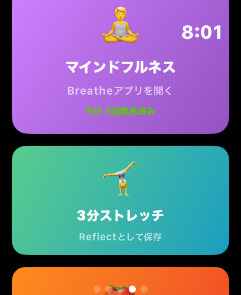

Apple Watchは毎時50分、その時間帯にまだ立っていない場合に「起き上がる時間です」と振動で知らせます。このリマインダーを活かして、立ち上がったついでに軽いストレッチやスクワット5回を追加するだけで、1日の総消費カロリーを目に見えて増やせます。

#### 📋 やり方

- 通知が来たら立つ＋ふくらはぎのストレッチ（各30秒）
- または、いつもより遠いトイレや給水機まで歩く
- スクワット5回を習慣にすれば1日60回以上の筋トレに
- 仕事中はオフィスの端を1周歩いて戻るルーティンを作る

#### 💡 ポイント

> 塵も積もれば山となる。毎時10分の立ち歩きで1日2〜3 km余分に歩けます。

<a id="005"></a>

### No.005 👟 毎日の歩数目標を設定して達成する


WHOは1日8,000〜10,000歩を推奨しています。Apple Watchはフィットネストラッキングで歩数を自動記録。iPhoneのヘルスケアアプリで歩数の推移グラフを確認し、週ごとに500歩ずつ目標を増やす「スモールステップ」戦略が長続きの秘訣です。

#### 📋 やり方

- ヘルスケアアプリ →「アクティビティ」→「歩数」で現状確認
- 現在の平均歩数＋500歩を今週の目標に設定
- 出勤は1駅早めに降りて歩く（500〜1,000歩増加）
- 電話は歩きながら（フォーカス中でも安心）

#### 💡 ポイント

> 1日8,000歩達成すると死亡リスクが大幅に低下すると研究が示しています。まずは7,000歩から始めましょう。

<a id="006"></a>

### No.006 📈 活動カロリー目標を週ごとに少しずつ上げる

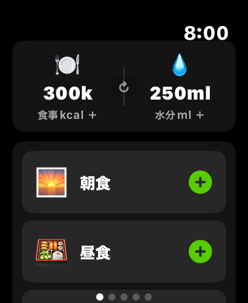

Apple Watchは週単位でムーブゴールの調整を提案します。この機能を積極的に活用し、毎週少しずつ目標カロリーを引き上げましょう。「少し頑張れば達成できる」レベルをキープすることで、達成感を維持しながら確実にカロリー消費量を増やせます。

#### 📋 やり方

- 日曜日にWatchが「目標調整の提案」を通知する場合は受け入れる
- 自分で上げる場合は＋20〜30 kcal/週が適切なペース
- 週5日以上達成できている場合は目標アップのサイン
- 目標が高すぎると感じたら一時的に下げてOK（継続が大切）

#### 💡 ポイント

> 6か月後に最初の目標を振り返ると、驚くほど成長していることに気づくはずです。

<a id="007"></a>

### No.007 🚶 通勤・通学で歩く距離を意識的に増やす

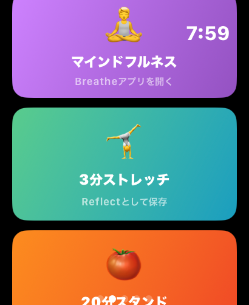

毎日の通勤・通学は最も継続しやすい運動の機会です。電車・バスを1駅分歩く、エスカレーターでなく階段を使う、といった小さな変化でも1日の歩数と消費カロリーが大幅にアップします。Apple WatchのGPSが正確にルートと距離を記録してくれます。

#### 📋 やり方

- 行きか帰りの片道だけでも「1駅早歩き」を実践
- ワークアウトアプリで「屋外ウォーク」を開始してGPS記録
- 毎日同じルートを歩いてタイムを計測（ゲーム感覚で）
- 雨の日はルーフィングがある商業施設のルートを開拓

#### 💡 ポイント

> 往復2駅分歩くだけで約1,500〜2,000歩増え、週5日継続すると月間3万歩以上の上乗せになります。

<a id="008"></a>

### No.008 🪜 階段を積極的に使う

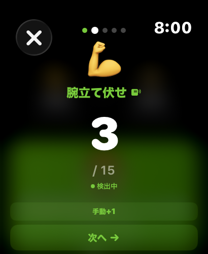

階段の上り下りは、ウォーキングの約3倍のカロリーを消費します。Apple Watchの高度計が「上昇した階数」を自動計測（Watchのアクティビティに表示）。1日10階分の登り降りを目標にすると、脚の筋肉量が増えて基礎代謝も上がります。

#### 📋 やり方

- オフィス・自宅マンション・駅で必ずエスカレーターを使わない
- ヘルスケアアプリ →「歩行」→「上昇した階数」で確認
- ランチに少し遠くのレストランを選び、ビル内の階段を使う
- 最初は1日5階分から始め、毎週1階ずつ増やす

#### 💡 ポイント

> 10階相当の階段を登るだけで約50〜80 kcal消費。週5日続ければ月2,000 kcal以上のボーナス消費です。

<a id="009"></a>

### No.009 🌤 昼休みのウォーキング習慣をつくる

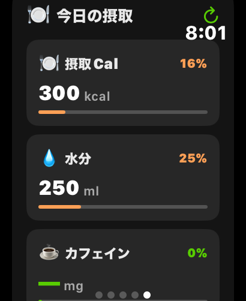

昼食後15〜20分のウォーキングは、血糖値スパイクを抑え、午後の眠気を防ぎ、消費カロリーを増やす一石三鳥の習慣です。Apple WatchでワークアウトをONにして、毎日同じルートを歩くと、ペースの改善を実感できます。

#### 📋 やり方

- 昼食後すぐ（10〜15分以内）に歩き始めると血糖値管理に効果的
- ワークアウトアプリ →「屋外ウォーク」→ 目標時間を15〜20分に設定
- 同僚を誘ってウォーキングランチを提案（社内文化に）
- コンビニをいつもより遠い店にするだけでも習慣になる

#### 💡 ポイント

> 食後ウォーキングは食後の血糖値上昇を平均20〜30%抑える効果があるとされています。

<a id="010"></a>

### No.010 📊 アクティビティトレンドで進捗を可視化する

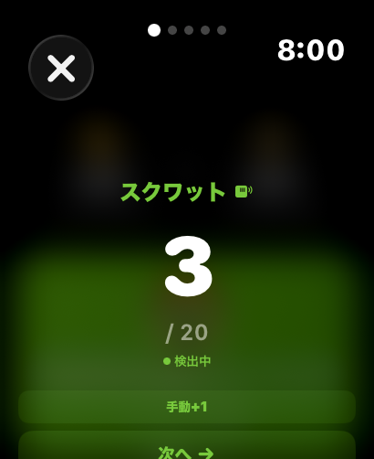

iPhoneのフィットネスアプリには「トレンド」タブがあり、過去90日間の平均と直近の数値を比較できます。「歩行距離」「活動カロリー」「エクササイズ時間」などのトレンドを週1回確認し、改善している項目を自分で褒めてあげましょう。

#### 📋 やり方

- iPhoneのフィットネスアプリ →「概要」→「トレンド」タブ
- 週に1回、日曜日に先週のトレンドをチェックする
- 上がっている指標には「↑」マークが表示される
- 下がっている指標は翌週の重点改善項目にリストアップ

#### 💡 ポイント

> 数字で可視化されると「もっと頑張ろう」という気持ちが自然に湧いてきます。

<a id="011"></a>

### No.011 🏃 ウォーキングワークアウトで正確にカロリー計測

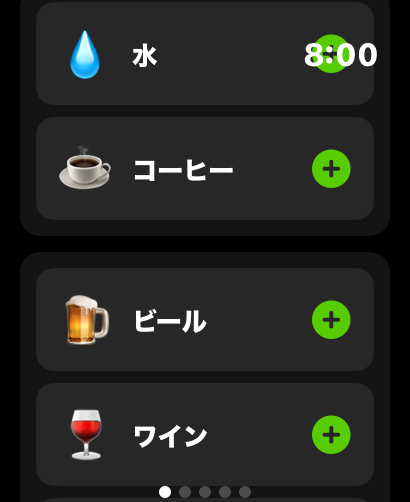

普段の歩きより、ワークアウトを開始した状態での計測の方が正確です。GPSと心拍数を組み合わせることで、消費カロリーの精度が上がります。毎朝30分のウォーキングワークアウトを起動することで、ムーブリングとエクササイズリングの両方を効率よく閉じられます。

#### 📋 やり方

- ワークアウトアプリ →「屋外ウォーク」または「屋内ウォーク」を選択
- 距離目標（2〜3 km）か時間目標（30分）で設定
- 終了後に「概要」で消費カロリー・心拍数・ペースを確認
- 毎日同じルートで「自己ベスト更新」を楽しむ

#### 💡 ポイント

> iPhoneをポケットに入れなくてもApple WatchのGPSで十分。身軽に走れます。

<a id="012"></a>

### No.012 🏅 ランニングで脂肪燃焼を加速する

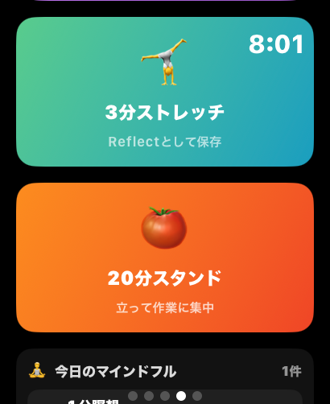

ランニングはウォーキングの約2倍のカロリーを消費し、心肺機能も強化します。Apple Watchはランニングのペース、ストライド長、ケイデンス（歩数）なども計測。「ランニングパワー」指標で最適な負荷を把握し、無理なく継続できます。

#### 📋 やり方

- 最初は「ウォーク＆ラン」（1分ランニング＋2分歩き×10セット）から
- ワークアウトアプリ →「屋外ラン」を選択してGPS追跡開始
- 心拍数を会話できる程度（最大心拍数の60〜70%）に保つ
- 週3回・各20〜30分から始め、徐々に距離を伸ばす

#### 💡 ポイント

> ランニングを始めた最初の1か月で多くの人が体脂肪率2〜3%の低下を実感します。

<a id="013"></a>

### No.013 🚴 サイクリングで下半身をトレーニング

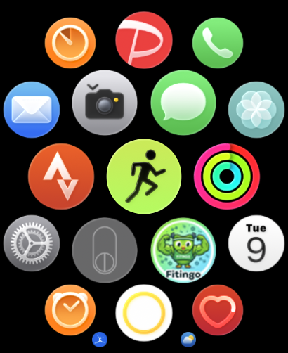

自転車は膝への負担が少なく、体重が多い方でも始めやすい有酸素運動です。Apple Watchが速度・距離・消費カロリーを正確に計測。屋内自転車エルゴメーターでも「屋内サイクリング」モードで心拍数ベースのカロリー計算ができます。

#### 📋 やり方

- ワークアウトアプリ →「屋外サイクリング」または「屋内サイクリング」
- 週2〜3回、45〜60分を目標に設定
- 心拍数120〜140 bpmゾーンが脂肪燃焼に最適
- 週末に近所をサイクリングして新しいルートを開拓する

#### 💡 ポイント

> 45分の自転車で300〜500 kcal消費。週3回継続すると月5,000 kcal以上のプラスになります。

<a id="014"></a>

### No.014 🏊 水泳で全身をくまなく鍛える


Apple Watchシリーズ2以降は防水機能（50メートル耐水圧）を備え、プールでもそのまま使用できます。水泳は全身の筋肉を使い、同じ時間のランニングに匹敵するカロリーを消費。関節への負担が少ないため怪我のリスクも低く、長期継続に向いています。

#### 📋 やり方

- ワークアウトアプリ →「プール水泳」でプールの長さを設定（25m/50m）
- 各泳法（クロール・平泳ぎ等）を自動検出してストローク数を計測
- 週2回・各45分のプールタイムを固定スケジュールに
- 水泳後はウォーキングクールダウン5分を追加

#### 💡 ポイント

> 水泳は脂肪燃焼効果が高く、肩こりや腰痛の改善にも効果的。心身ともにリフレッシュできます。

<a id="015"></a>

### No.015 ⚡ HIITで短時間・高強度トレーニング

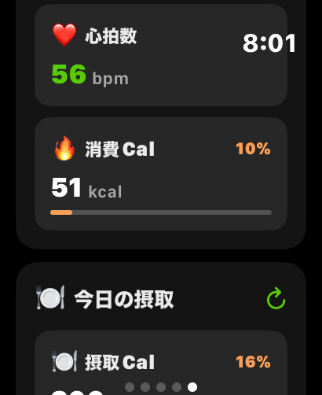

HIIT（高強度インターバルトレーニング）は、20〜30秒の全力運動と10〜20秒の休憩を繰り返す方法。20分間のHIITで通常の1時間ランニングに匹敵するカロリーを消費でき、「アフターバーン効果」で運動後も数時間カロリーを消費し続けます。

#### 📋 やり方

- ワークアウトアプリ →「HIIT」または「機能トレーニング」を選択
- バーピー、マウンテンクライマー、ジャンピングジャックを20秒ずつ
- 心拍数が170〜180 bpmまで上がれば十分な強度
- 週2〜3回・各20〜25分から始める

#### 💡 ポイント

> 時間がない日もHIITなら20分でOK。Apple Watchの心拍数モニタリングで安全な強度を維持しましょう。

<a id="016"></a>

### No.016 🧘 ヨガで代謝を上げて柔軟性を高める

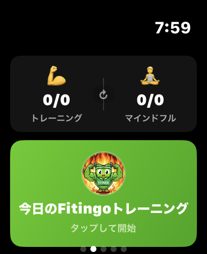

ヨガは直接的な脂肪燃焼効果に加え、筋肉の柔軟性向上・コルチゾール（ストレスホルモン）の低下により、間接的にダイエットをサポートします。Apple Watchが心拍数と消費カロリーをトラッキングし、ヨガのセッションを記録してくれます。

#### 📋 やり方

- ワークアウトアプリ →「ヨガ」を選択してセッションを開始
- 朝のヨガ20分を毎日のルーティンに組み込む
- 太陽礼拝（サンサルテーション）を5〜10セット実施
- Pocket YogaなどのiPhoneアプリと組み合わせて動きをガイド

#### 💡 ポイント

> ヨガを3ヶ月続けると、自然と暴飲暴食が減り食事の質が上がるという研究があります。

<a id="017"></a>

### No.017 💪 筋力トレーニングで基礎代謝を高める


筋肉量が増えると安静時の消費カロリー（基礎代謝）が上がり、寝ている間もカロリーを消費します。Apple Watchのワークアウトで「筋力トレーニング」を記録し、セット数・回数・重量をiPhoneのフィットネスアプリで管理しましょう。

#### 📋 やり方

- 週3回の全身筋トレ（腕・胸・背中・脚・腹部をバランスよく）
- ワークアウトアプリ →「機能トレーニング」で記録開始
- 各エクササイズ10〜15回×3セット、セット間1分休憩
- 器具なしのスクワット・プッシュアップ・腹筋から始めてOK

#### 💡 ポイント

> 筋肉1kgで基礎代謝が1日約50 kcal増加。3kg増やすだけで150 kcal/日の底上げになります。

<a id="018"></a>

### No.018 💃 ダンスフィットネスを楽しみながら燃焼


ダンスは「楽しい」と感じながらカロリーを燃焼できる最高の有酸素運動。Zumba、K-POPダンス、エアロビクスなど好きなジャンルで問題ありません。Apple Watchが心拍数を監視し、十分な運動強度を維持しているか教えてくれます。

#### 📋 やり方

- ワークアウトアプリ →「ダンス」を選択
- YouTubeの無料ダンスフィットネス動画（20〜40分）に合わせて踊る
- 週3〜4回、30〜45分のダンスタイムを設ける
- 友人とオンラインで一緒に踊ってモチベーションを維持

#### 💡 ポイント

> 楽しさがある運動ほど継続率が高い。「ダイエット」と意識せず「趣味」として続けるのが理想です。

<a id="019"></a>

### No.019 🪃 縄跳びで全身運動を短時間で

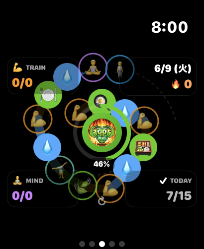

縄跳びは道具代もほぼかからず、家でも外でもできる高強度有酸素運動。10分間の縄跳びは15分のランニングに匹敵するカロリー消費量があります。Apple WatchのHIITモードで記録し、心拍数150〜160 bpmを維持しましょう。

#### 📋 やり方

- ワークアウトアプリ →「HIIT」で記録し、縄跳び30秒＋休憩15秒を繰り返す
- 1セッション10〜15分からスタート
- 二重跳び・交互跳びなど技を増やすと飽きずに継続できる
- 週4〜5回、雨の日でも部屋で実施可能

#### 💡 ポイント

> 縄跳び15分＋ウォーキング15分の組み合わせで毎日500 kcal以上を無理なく消費できます。

<a id="020"></a>

### No.020 ⛰ ハイキングで自然の中でカロリー消費

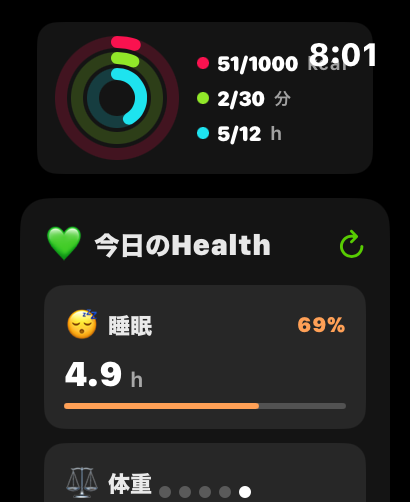

起伏のある山道を歩くハイキングは、平地のウォーキングより30〜50%多くのカロリーを消費します。Apple WatchはGPS・高度計・心拍数で正確なデータを記録し、「最高標高」「累積登り高度」なども表示してくれます。

#### 📋 やり方

- ワークアウトアプリ →「ハイキング」を選択
- 月に2〜3回、日帰り登山（3〜5時間）を計画する
- 事前にマップアプリでルートと標高差を確認
- 水1.5〜2L、行動食（ナッツ・ドライフルーツ）を持参

#### 💡 ポイント

> ハイキングは気分転換にもなり、ストレスホルモンを下げる効果も。心身のリセットに最適です。

<a id="021"></a>

### No.021 🗣 ウォーキング会議で「ながら活動」

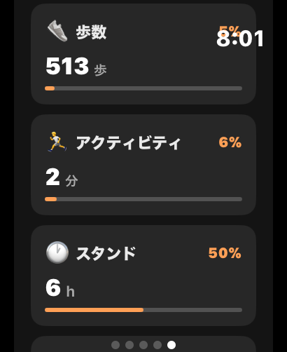

電話会議やアイデア出し会議なら、歩きながら参加できます。「ウォーキング会議」をチームに提案すると、ダイエット効果と同時にクリエイティビティも向上するという研究があります。Apple WatchとAirPodsの組み合わせが最高のウォーキング会議環境です。

#### 📋 やり方

- 会議前にワークアウトアプリ →「屋内ウォーク」を開始
- 社内のフロアを歩きながら電話会議に参加
- 天気の良い日は屋外を歩きながらリモート会議
- Siriでメモを音声入力しながら歩く（手ぶらで効率的）

#### 💡 ポイント

> 30分のウォーキング会議を週5日続けると、月に約6,000〜8,000 kcalの追加消費が可能です。

<a id="022"></a>

### No.022 🏠 立って家事をしながら消費カロリーを稼ぐ

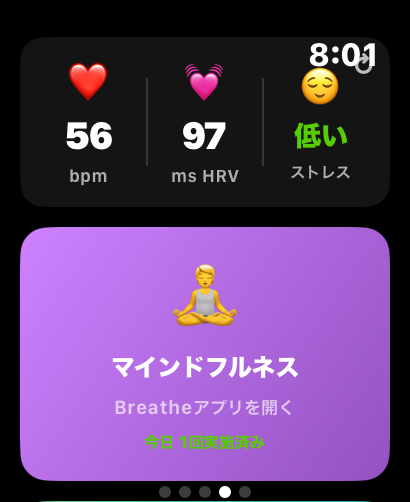

掃除・料理・洗い物などの家事は「NEAT（非運動性活動熱産生）」の代表格。座ってやることを立ってやるだけで消費カロリーが20〜30%増加します。Apple Watchがこれらの活動を歩数・活動カロリーとして自動計測しています。

#### 📋 やり方

- テレビを見る時間を立ちながら家事（アイロン・食器洗い）に充てる
- 電子レンジの待ち時間や洗濯待ちに、部屋を軽く片付ける
- 週末の大掃除をワークアウトとして記録（「その他」を選択）
- 電話中は部屋を歩き回りながら話す癖をつける

#### 💡 ポイント

> 家事1時間で150〜250 kcal消費。毎日きちんとこなすだけでダイエット効果があります。

<a id="023"></a>

### No.023 ⛳ ゴルフをアクティビティとして記録する

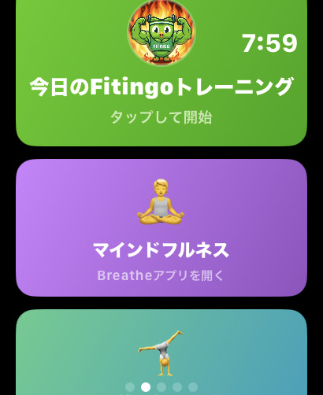

18ホールのゴルフラウンド（カートを使わず歩く）は10〜13 km歩き、約800〜1,200 kcalを消費します。Apple Watchの「ゴルフ」ワークアウトモードでスコア管理もできるため、スポーツとフィットネストラッキングが一体化します。

#### 📋 やり方

- ワークアウトアプリ →「ゴルフ」を選択してスタート
- カートは極力使わず、歩いてラウンドする
- 電動キャディーバッグカートを活用して荷物を軽くしながら歩く
- 月2〜3回のラウンドを定期スケジュールに組み込む

#### 💡 ポイント

> ゴルフはテニスなど他の球技に比べ怪我が少なく、50代以降も継続しやすい理想的なダイエットスポーツです。

<a id="024"></a>

### No.024 🎾 テニスで楽しくカロリー消費

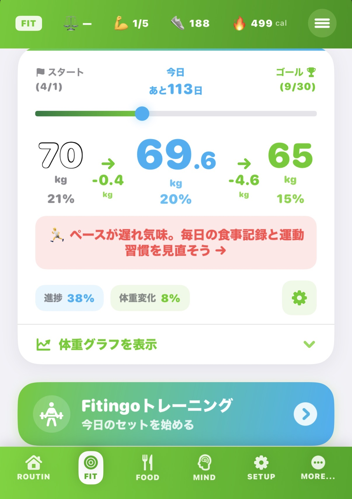

テニスは前後左右のダッシュを繰り返す高強度スポーツ。1時間で400〜700 kcal消費し、反射神経・協調性・骨密度まで鍛えられます。Apple Watchがラリー数・アクティブ時間・心拍数を自動計測します。

#### 📋 やり方

- ワークアウトアプリ →「テニス」を選択
- 地域のテニスサークルや市営コートを活用（費用を抑えられる）
- 週1〜2回・90分のプレーを継続目標に
- シングルスの方がカロリー消費が多いのでおすすめ

#### 💡 ポイント

> テニスを週2回続けた場合、3ヶ月で体脂肪率が平均2〜4%低下するという研究もあります。

<a id="025"></a>

### No.025 🤸 ピラティスで体幹と姿勢を改善

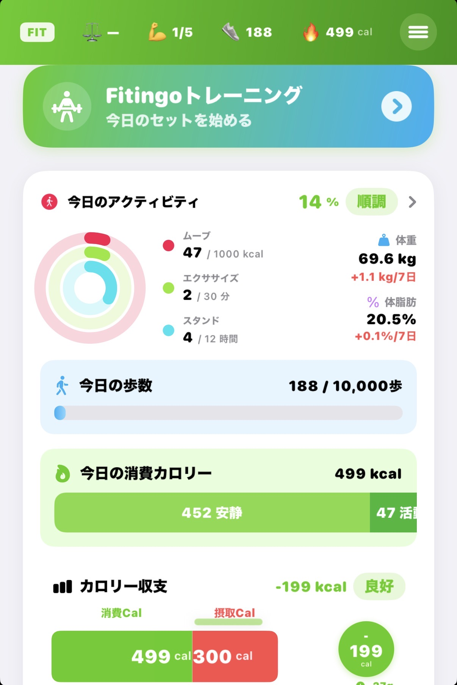

ピラティスは体幹（コア）を中心とした筋肉を鍛え、姿勢改善・腰痛緩和・基礎代謝の向上に効果的です。消費カロリーはヨガより高く、Apple Watchが「機能トレーニング」として心拍数と消費カロリーを記録します。

#### 📋 やり方

- ワークアウトアプリ →「ピラティス」または「機能トレーニング」を選択
- YouTubeで「10分間ピラティス」動画から始める（器具不要）
- 週3〜4回・各30分が理想
- ヨガマット1枚あれば自宅でどこでも実施可能

#### 💡 ポイント

> 体幹が強くなると立ち姿勢・歩き方が変わり、普通の生活でも消費カロリーが増えます。

<a id="026"></a>

### No.026 🥊 ボクシングエクササイズで全力発散

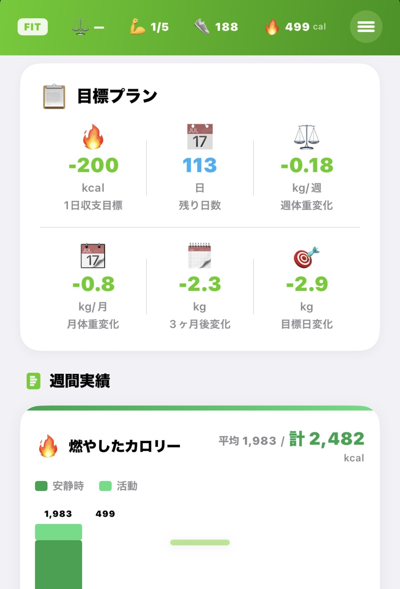

シャドーボクシングやサンドバッグ打ちは高強度のHIITに近い運動。腕・肩・体幹・脚を同時に使い、30分で300〜500 kcal消費します。ストレス発散効果も高く、ダイエットのモチベーション維持に効果的です。

#### 📋 やり方

- ワークアウトアプリ →「ボクシング」を選択
- 3分間全力でシャドーボクシング＋1分休憩を5〜8セット
- ボクシングジムの無料体験で正しいフォームを学ぶ
- 自宅用マイクロサンドバッグ（5,000〜10,000円）があると本格的

#### 💡 ポイント

> ボクシング系エクササイズは「キツイけど楽しい」と感じる人が多く、継続率が高いジャンルです。

<a id="027"></a>

### No.027 ☯ 太極拳でゆっくり確実に代謝アップ

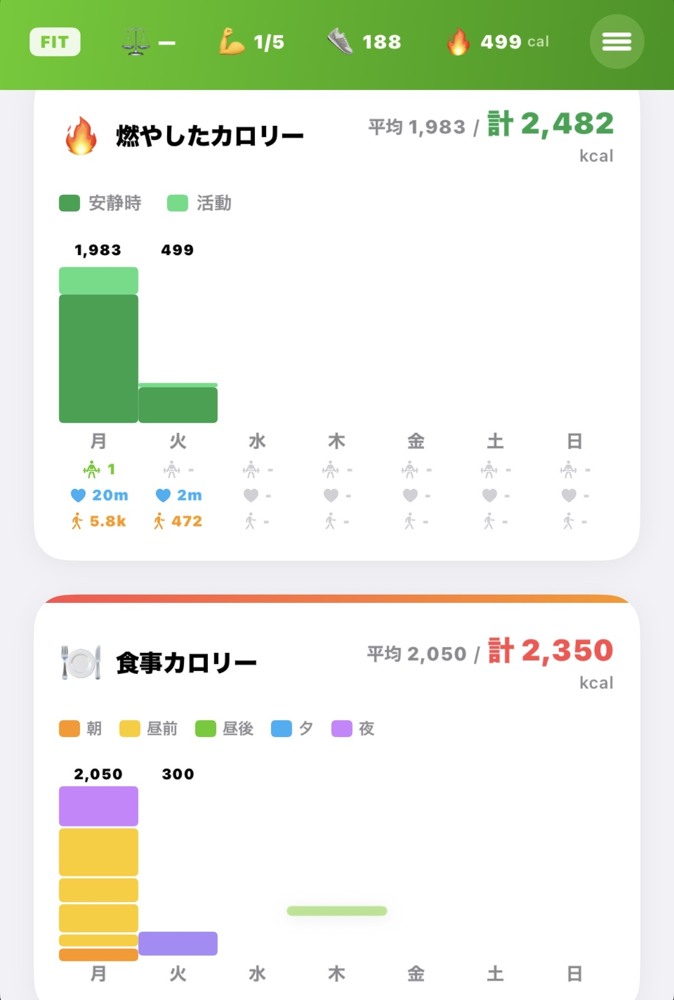

ゆっくりとした動作の太極拳でも、全身の筋肉を使い続けるため消費カロリーはウォーキングと同程度。60歳以上でも安全に継続でき、バランス感覚・柔軟性・精神的安定にも効果的です。Apple Watchが活動カロリーとして記録します。

#### 📋 やり方

- ワークアウトアプリ →「太極拳」または「ダンス」を選択
- 地域の公民館や公園の太極拳グループに参加（無料〜格安）
- 毎朝20〜30分、空が明るくなったら外で練習するのが理想的
- YouTubeの「太極拳 初心者」動画で基本形を学ぶ

#### 💡 ポイント

> 太極拳を習慣にした高齢者は転倒リスクが低下するという研究も。長期的な健康投資として最適です。

<a id="028"></a>

### No.028 🚣 ローイングマシンで全身を効率よく鍛える

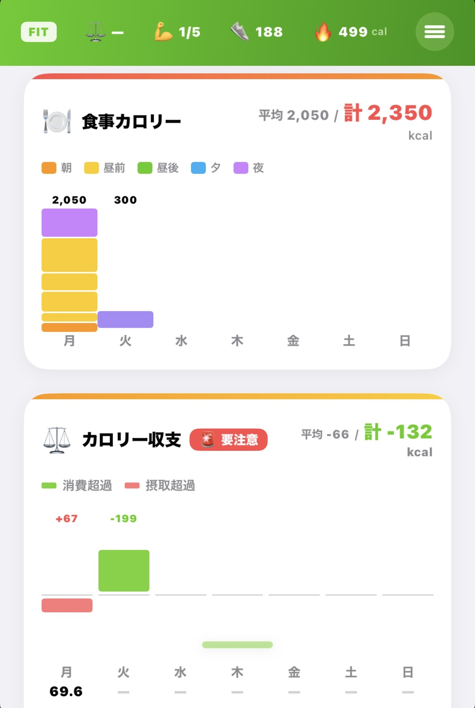

ローイング（ボート漕ぎ）エルゴメーターは全身の85%の筋肉を使い、30分で350〜550 kcal消費する非常に効率的なエクササイズです。Apple Watchの「ローイング」モードで心拍数・カロリーをリアルタイム計測できます。

#### 📋 やり方

- ワークアウトアプリ →「ローイング」を選択
- フォームが重要なため最初はジムでインストラクターに確認
- 20分間・心拍数130〜150 bpmを維持するペースで漕ぐ
- 週2〜3回を継続することで体幹と有酸素能力が格段にアップ

#### 💡 ポイント

> ローイングは関節への負担が少なく、ランニングが辛い方にも最適な全身運動です。

<a id="029"></a>

### No.029 🏀 バスケットボールで心拍数を上げる

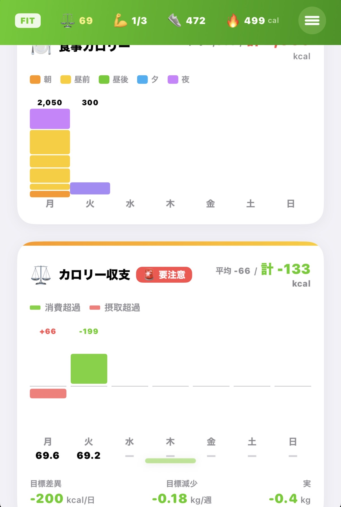

バスケットボールは瞬発的なダッシュ・ジャンプを繰り返すため、1時間で500〜700 kcal消費します。チームスポーツの楽しさで継続しやすく、Apple Watchが消費カロリーと心拍数を自動で計測します。

#### 📋 やり方

- ワークアウトアプリ →「バスケットボール」を選択
- 地域のバスケットコート（無料）で3対3を楽しむ
- 週1〜2回・1時間のプレーを目標に
- チームを組まなくても一人でドリブル練習やシュート練習で消費可能

#### 💡 ポイント

> 友人と一緒に楽しむことでダイエットのコミットメントが強まり、挫折しにくくなります。

<a id="030"></a>

### No.030 🔄 エリプティカルで関節に優しく運動


エリプティカル（クロストレーナー）は走る動きに似ているが着地衝撃がなく、膝・腰への負担が最小。30分で280〜400 kcal消費し、全身を均等に鍛えます。Apple Watchの「エリプティカル」モードで正確なデータを記録できます。

#### 📋 やり方

- ワークアウトアプリ →「エリプティカル」を選択
- ジムのエリプティカルで週3〜4回・各30〜45分を目標に
- 傾斜（インクライン）を上げると消費カロリーが20〜30%増加
- 音楽やポッドキャストを聴きながら続けると時間が早く感じる

#### 💡 ポイント

> エリプティカルは体重が重くても膝に優しく、ダイエット初期段階から安全に使えます。

<a id="031"></a>

### No.031 🐕 ペット散歩を運動の機会に変える


犬を飼っている人は、毎日の散歩が自然な運動習慣になります。ペットのために歩くことは「義務感」があるため継続しやすく、犬のペースに合わせると意外と早歩きになります。Apple Watchが毎回のルートと消費カロリーを記録。

#### 📋 やり方

- 1日2回・各20〜30分の散歩ルートを決める
- ワークアウトアプリ →「ウォーク」で記録を残す
- 週末はロングコース（45〜60分）を追加
- ペットがいない場合は友人のペットを借りる「ペットシッター」も一策

#### 💡 ポイント

> 犬を飼っている人は飼っていない人より1日平均2,800歩多く歩くという研究データがあります。

<a id="032"></a>

### No.032 🛒 ショッピングを歩く機会として活用する


スーパーや商業施設でのショッピングは、気づかないうちに大量の歩数を稼ぐ好機。遠くの駐車場に停める、エスカレーターを使わない、複数フロアを回るだけで1回のショッピングで3,000〜5,000歩稼げます。

#### 📋 やり方

- 駐車場では一番遠いスペースを選んで停める
- カゴ（バスケット）を使い、重いものをあえて持って歩く（筋トレ効果）
- ウィンドウショッピングも積極的に全フロアを巡る
- Apple Watchのアクティビティで帰宅後に歩数と消費カロリーを確認

#### 💡 ポイント

> 週2回のショッピングを「歩く機会」と捉えるだけで月1万歩以上のボーナスが生まれます。

<a id="033"></a>

### No.033 🗺 家の近くの新しいルートを毎週開拓する


同じルートを歩き続けると慣れて飽きてしまいます。毎週1つ新しい散歩コースを開拓することで、ウォーキングに新鮮さが生まれ継続しやすくなります。Apple WatchのGPSがルートを地図に記録し、「今日は〇km」と可視化してくれます。

#### 📋 やり方

- 地図アプリで自宅周辺の公園・川沿い・商店街を事前に確認
- 毎週日曜日に「今週の新ルート」を決めて月曜日から実施
- ルートごとの消費カロリーを記録し、効率の良いコースを把握
- 地元の隠れスポットを発見する楽しみも追加される

#### 💡 ポイント

> 新しい環境を歩くことで脳も活性化し、認知症予防にもなるという研究結果もあります。

<a id="034"></a>

### No.034 ⛷ スノーボード・スキーで冬も活動を維持


冬場に運動量が落ちがちな人にとって、ウインタースポーツはベストな解決策。スノーボードやスキーは全身を使い、1時間で400〜600 kcal消費します。Apple Watchはジャイロセンサーで滑走スピード・距離・垂直ドロップも計測。

#### 📋 やり方

- ワークアウトアプリ →「スノーボード」または「ダウンヒルスキー」を選択
- シーズン券を購入して月2〜3回の定期通いを計画
- スキー場内は可能な限りエスカレーターを使わずリフトまで歩く
- 日帰りバスツアーを利用すれば交通費・手間も削減

#### 💡 ポイント

> ウインタースポーツを楽しみにすることで、冬のダイエットモチベーションが大幅に上がります。

<a id="035"></a>

### No.035 🧗 クライミングで全身を追い込む


ボルダリング・クライミングは腕・体幹・脚をフル動員する全身運動。頭も使うため集中力が高まり、ストレス解消にも効果的です。1時間で400〜600 kcal消費し、Apple WatchはHIITとして記録できます。

#### 📋 やり方

- 近くのボルダリングジムの「無料体験」に参加（シューズ貸し出しあり）
- ワークアウトアプリ →「クライミング」を選択
- 週1〜2回・各2時間のクライミングを習慣に
- 仲間と一緒に行くと課題をクリアする楽しさが倍増

#### 💡 ポイント

> クライミングは始めた直後から達成感が得られ、継続率が非常に高い運動として知られています。

---

## II. 食事管理

<a id="036"></a>

### No.036 📱 食事記録アプリとHealthKitを連携する

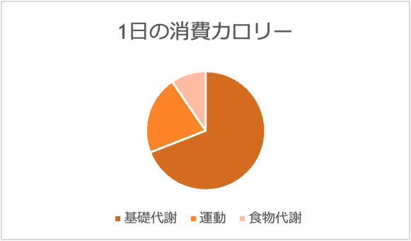

Apple Watchはカロリー消費を計測しますが、摂取カロリーは別途記録が必要です。MyFitnessPalなどの食事記録アプリをHealthKitと連携させることで、消費と摂取の両方をiPhoneのヘルスケアアプリで一元管理できます。

#### 📋 やり方

- MyFitnessPalまたはFatSecretをAppStoreからダウンロード
- ヘルスケアアプリとの連携をONにする
- 毎食後すぐに食べたものを記録（習慣化が重要）
- 「消費カロリー − 摂取カロリー」が500 kcalの赤字を目標に

#### 💡 ポイント

> 食事を記録するだけで摂取カロリーが平均15〜20%減るという研究があります。「見える化」が最大の武器です。

<a id="037"></a>

### No.037 📸 Fitingoで食事写真をAI分析する


iOSのFitingoアプリには「フォトログ」機能があり、食事の写真を撮影するとAIが自動的に栄養素（カロリー・タンパク質・脂質・炭水化物）を分析します。入力の手間を大幅に減らし、食事記録が継続しやすくなります。

#### 📋 やり方

- Fitingoアプリを開き「フォトログ」をタップ
- 食事の写真を撮影またはアルバムから選択
- AIの分析結果を確認し、必要に応じてコメントを追記
- 結果はHealthKitに自動連携される

#### 💡 ポイント

> 写真を撮るだけで栄養素が自動入力される便利さが、食事記録習慣の定着を助けます。

<a id="038"></a>

### No.038 💧 水分補給をApple Watchでリマインドする


適切な水分摂取（体重×30〜40ml/日）は代謝を高め、食欲を抑える効果があります。水を飲む量が少ない人は食欲と口の渇きを混同しがち。Apple Watchで水分補給のリマインダーを設定し、意識的に摂取量を増やしましょう。

#### 📋 やり方

- ヘルスケアアプリ →「水分」で1日の目標量を設定（体重×35mlが目安）
- Fitingoアプリで水分200mlを記録するたびにHealthKitに反映
- デスクに常に水のボトルを置き、1時間に1杯（200ml）飲む
- 起床直後・食前・入浴前後に必ず1杯の水を習慣化

#### 💡 ポイント

> 食前に500mlの水を飲むと自然に食事量が減り、摂取カロリーを15〜20%削減できるという実験結果があります。

<a id="039"></a>

### No.039 ❤️ 食前に心拍数をチェックしてストレス食いを防ぐ

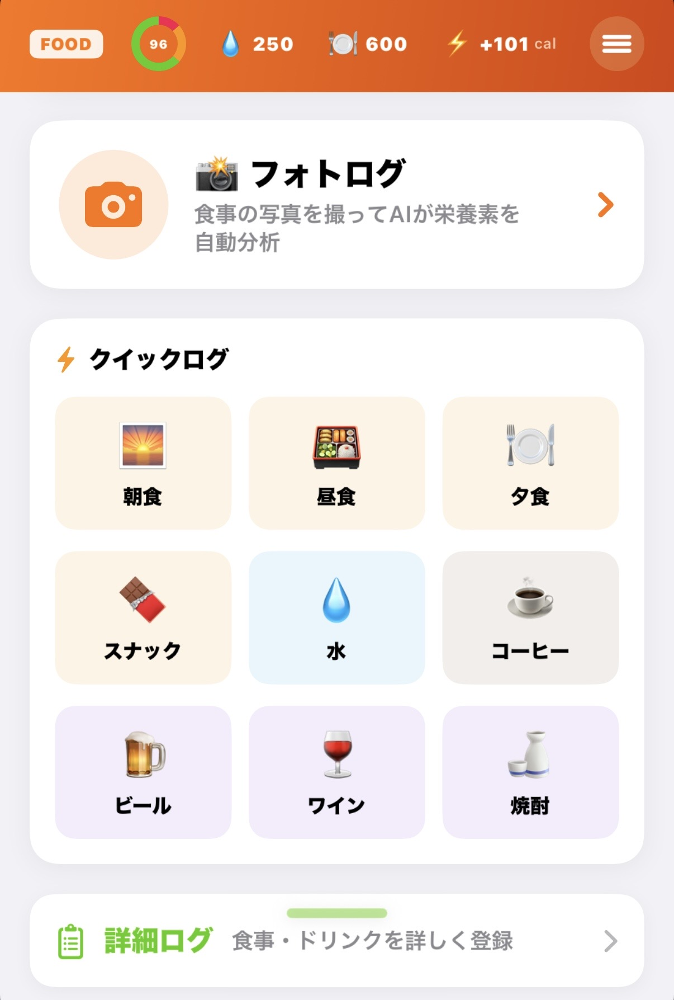

ストレスを感じているとき（心拍数が高いとき）は感情的な過食をしやすい状態です。食事の前にApple Watchで心拍数を確認し、80 bpm以上であれば食べる前に1〜2分の深呼吸で落ち着いてから食事を始める習慣をつけましょう。

#### 📋 やり方

- Watchの文字盤で「心拍数」コンプリケーションを表示させる
- 食事の前にApple Watchで心拍数を確認
- 80 bpm以上なら3〜5回の深呼吸（4秒吸い、4秒止め、8秒で吐く）
- 落ち着いた状態（70 bpm以下）で食事を始める

#### 💡 ポイント

> ストレス食いの多くは「本当の空腹」ではなく「感情の空腹」。心拍数チェックがその見極めを助けます。

<a id="040"></a>

### No.040 🔢 1日の摂取カロリーをリアルタイムで把握する

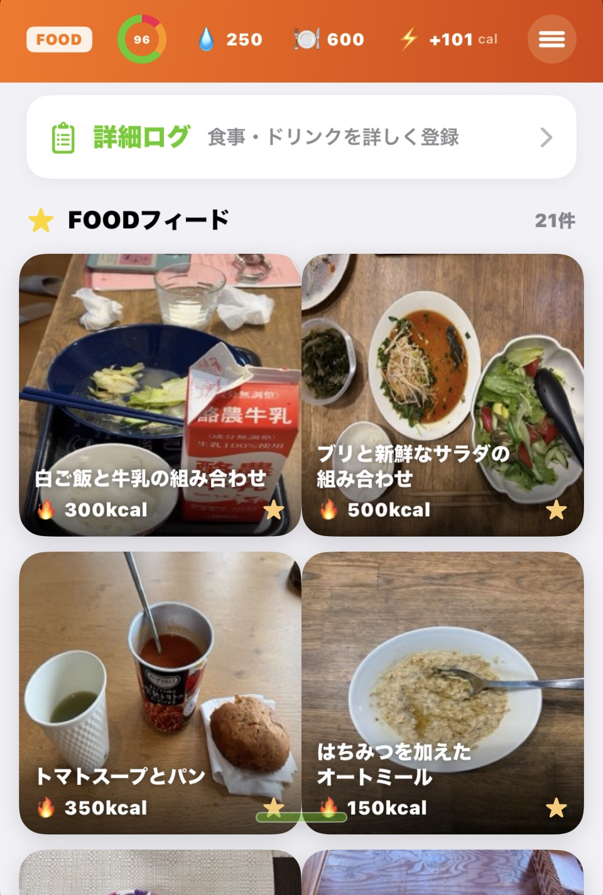

「カロリーは気にしているが、実際の数字は知らない」という方が多いです。食事記録アプリとApple Watchを連携させ、現時点の消費カロリーと摂取カロリーのリアルタイムバランスを確認することで、夕食の食べ過ぎを事前に防げます。

#### 📋 やり方

- 昼食後に「今日の摂取カロリー合計」を記録アプリで確認
- 夕食前に「残り食べられるカロリー」を計算して料理量を決める
- 1日の目標摂取カロリー＝基礎代謝×1.2〜1.4（活動量で調整）
- 週1回、週単位での収支バランスを振り返る

#### 💡 ポイント

> 1日500 kcalの赤字を1週間続けると体脂肪約0.5kgが減る計算。焦らず積み上げましょう。

<a id="041"></a>

### No.041 🕐 食事リマインダーで規則正しい食事習慣を守る

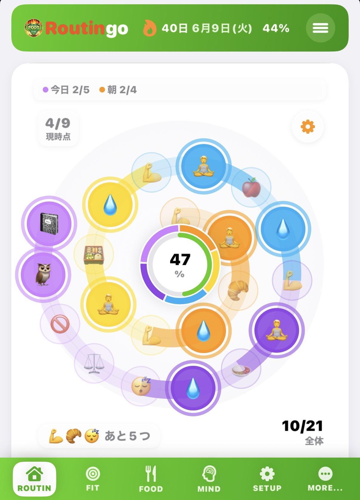

食事時間が不規則だと体内時計が乱れ、脂肪が蓄積されやすくなります。Apple Watchに「朝食・昼食・夕食」のリマインダーを設定し、毎日同じ時間帯に食事することで体内時計を整え、代謝を安定させましょう。

#### 📋 やり方

- Watchアプリ →「アラーム」で朝食（7:30）・昼食（12:00）・夕食（18:30）を設定
- 夕食は就寝の3時間前までに完了させる（21時就寝なら18時に夕食）
- 休日も±30分以内で同じ食事時間を維持する
- 深夜の間食は消化が悪く脂肪になりやすいため最小限に

#### 💡 ポイント

> 時間制限食事法（インターミッテントファスティング）の基本は「食べる時間帯を決めること」です。

<a id="042"></a>

### No.042 🤔 空腹感スケールを活用して食べ過ぎを防ぐ

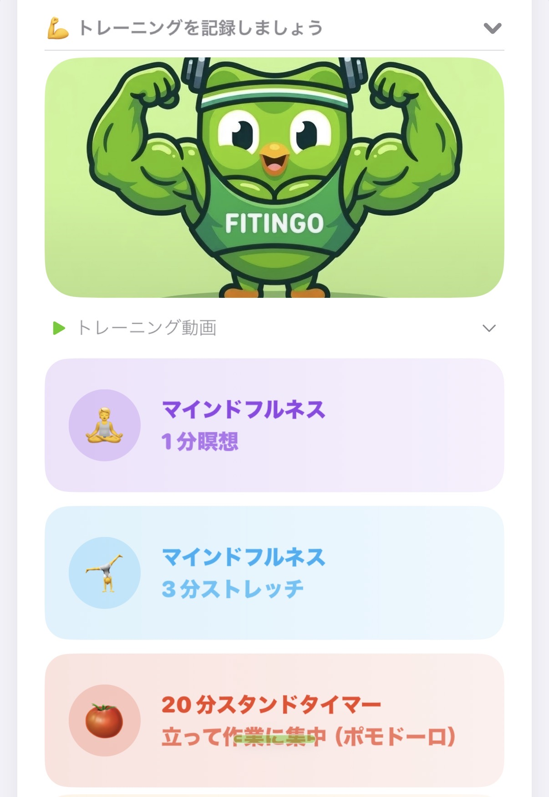

0（空腹）〜10（満腹）のスケールで食前・食後の空腹感を記録します。「4〜5になったら食べ始め、7〜8になったら食べるのをやめる」ルールを設けることで自然と適切な量を食べる習慣が身につきます。Fitingoのメモ機能で記録できます。

#### 📋 やり方

- 食事前に1〜10で現在の空腹感を心の中でスコアリング
- 3以下（かなり空腹）のときに食べると過食しやすいため注意
- 7〜8（やや満腹）で食べるのをやめ、20分後に空腹感を再確認
- 食事中は20分かけてゆっくり食べる（満腹シグナルが届く時間）

#### 💡 ポイント

> 脳の満腹中枢への信号は食事開始後20分かかります。ゆっくり食べるだけで自然に食べ過ぎを防げます。

<a id="043"></a>

### No.043 🥦 食物繊維を意識して摂り、満腹感を高める

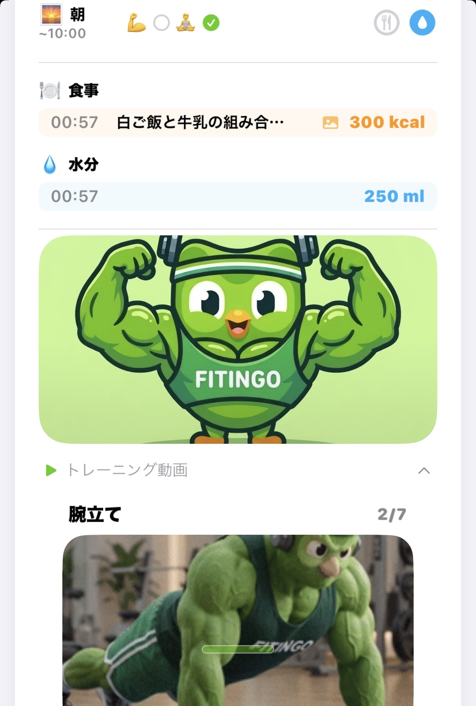

食物繊維は低カロリーで満腹感が高く、血糖値の急上昇を防ぎます。ヘルスケアアプリの「栄養素」で食物繊維の摂取量を記録し、1日の目標（20〜25g）を達成できているか確認しましょう。野菜・豆類・全粒穀物が主な供給源です。

#### 📋 やり方

- 食事に必ず野菜（サラダ・煮物・炒め物）を1〜2品追加
- 白米を玄米・雑穀米に変える（食物繊維量が約3倍に）
- 豆腐・納豆・豆類をおかずに積極的に使う
- 間食をスナック菓子からナッツ類に変える

#### 💡 ポイント

> 食物繊維が豊富な食事は腸内環境を改善し、免疫力向上・コレステロール低下にも効果があります。

<a id="044"></a>

### No.044 ☕ カフェイン摂取量を管理して睡眠を守る

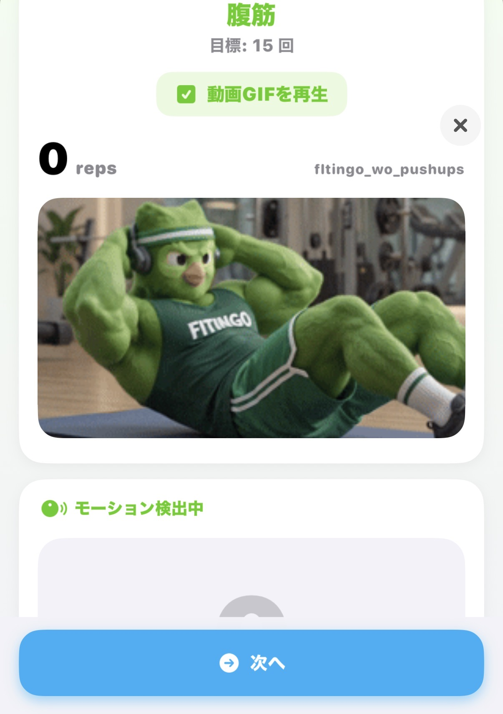

カフェインは覚醒作用が強く、摂りすぎると睡眠の質を低下させます。睡眠の質が落ちると食欲増進ホルモン（グレリン）が増加し、ダイエットに逆効果。Apple Watchの睡眠データとFitingoのカフェイン記録を照合しましょう。

#### 📋 やり方

- Fitingoの「飲み物を記録」でコーヒー・紅茶・エナジードリンクを入力
- カフェインは午後2時以降は摂らない（半減期が6〜8時間のため）
- 1日のカフェイン上限は400mg（コーヒー約4杯）が目安
- 夕方以降はデカフェやハーブティーに切り替える

#### 💡 ポイント

> カフェイン管理と睡眠の質改善だけでダイエット効果が高まるという研究データがあります。

<a id="045"></a>

### No.045 🍗 タンパク質摂取量をFitingoで管理する

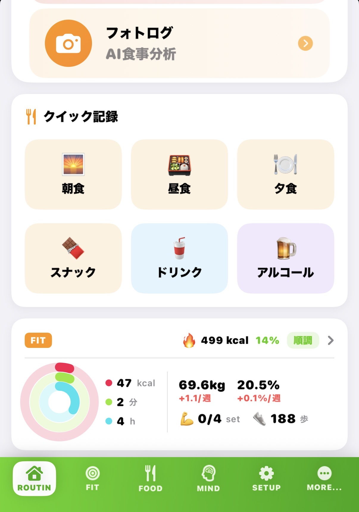

タンパク質は満腹感が長続きし、筋肉の合成を促進し、消化に多くのカロリーを消費（食事誘発性熱産生）。ダイエット中は体重1kgあたり1.2〜1.6gのタンパク質摂取が理想です。Fitingoの食事記録でタンパク質量を毎日確認しましょう。

#### 📋 やり方

- Fitingoのフォトログで各食事のタンパク質量を確認
- 毎食に鶏胸肉・魚・卵・豆腐などのタンパク源を含める
- 体重60kgの場合、1日の目標は72〜96g（鶏胸肉なら約300〜400g相当）
- プロテインパウダーで1日の不足分を補う

#### 💡 ポイント

> タンパク質を多く摂る食事は脂質や炭水化物を中心とした食事より代謝が15〜30%高まります。

<a id="046"></a>

### No.046 🥗 血糖値スパイクを防ぐ食事の順番

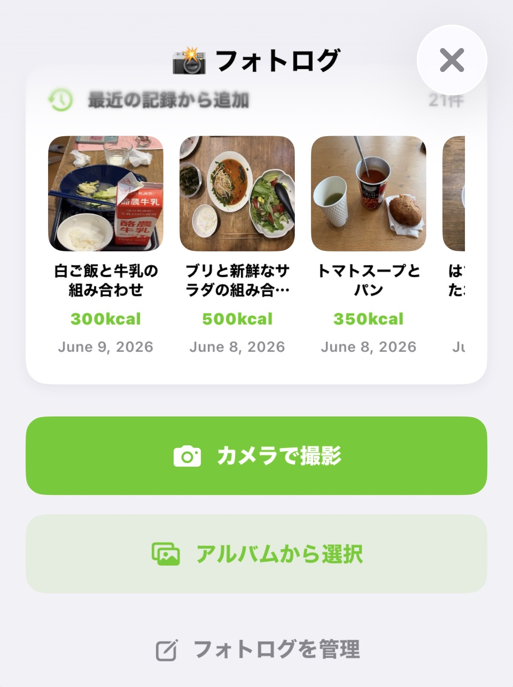

食事の順番を変えるだけで血糖値の急上昇（スパイク）を防ぎ、脂肪蓄積を抑えられます。「野菜→タンパク質・脂質→炭水化物」の順で食べることが基本。Apple Watchで食後のアクティブカロリーも監視しましょう。

#### 📋 やり方

- 最初にサラダ・味噌汁などの野菜・汁物を食べる（5〜10分）
- 次に肉・魚・卵などのタンパク質・脂質を食べる
- 最後にご飯・パン・麺類などの炭水化物を食べる
- 食後15分後に軽く歩くとさらに血糖値の上昇が抑制される

#### 💡 ポイント

> 食事順序を変えるだけで食後血糖値が最大30〜50%低下するという臨床研究があります。コスト0の改善策です。

<a id="047"></a>

### No.047 🍺 アルコール摂取をFitingoで記録して意識する

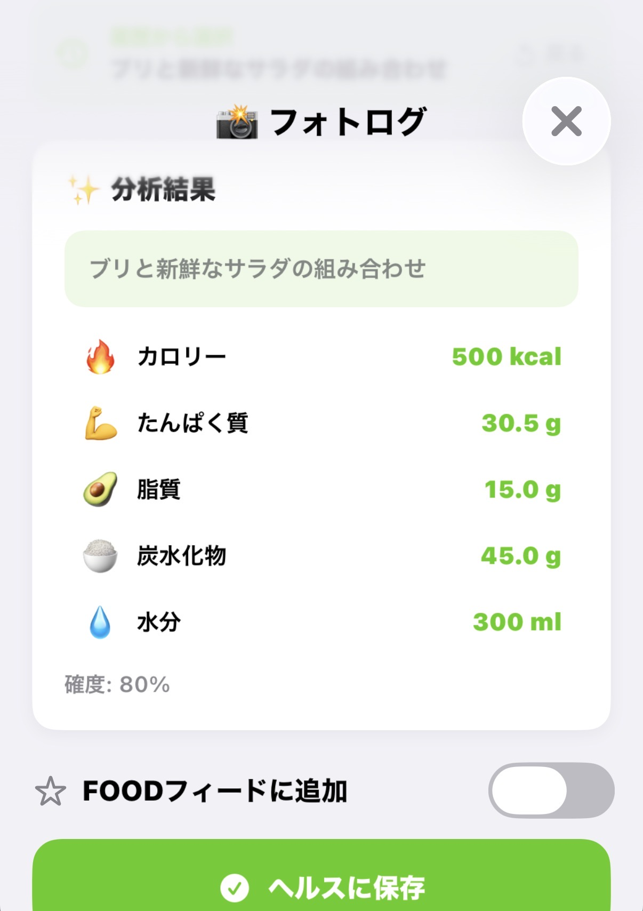

アルコール1gあたりのカロリーは7 kcal（脂質の約8 kcal近い）。ビール中瓶1本（500ml）で約200 kcal、ワイン1杯（150ml）で約110 kcalになります。「飲み会に行ったのに体重が減らない」の原因の多くはアルコールカロリーの見落としです。

#### 📋 やり方

- Fitingoの「飲み物を記録」でアルコールを記録
- 週の飲酒日を3日以内に制限するルールを設ける
- 飲むならカロリーの低いハイボール・ウォッカソーダ・辛口ワインを選択
- 乾杯の1杯をノンアルコールビールに変えるだけで大幅カット

#### 💡 ポイント

> 禁酒でなく「記録」することから始めましょう。数字で見えると自然に量が減ります。

<a id="048"></a>

### No.048 🧠 食事中にスマートフォンを置いてマインドフルイーティング

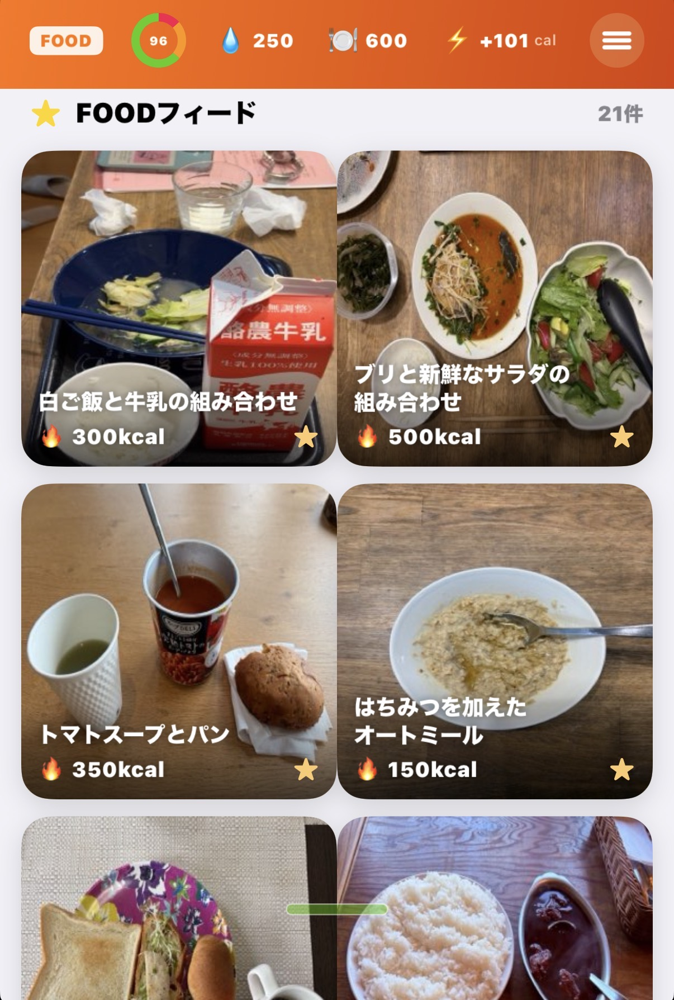

スマートフォンを見ながら食べると「ながら食い」になり、満腹感を感じにくくなります。食事中はApple Watchの通知もサイレントにし、食べることだけに集中。味・食感・香りを意識することで少量でも満足感が高まります。

#### 📋 やり方

- 食事中はApple Watchを「集中モード」に設定
- スマートフォンはテーブルに置かず、かばんや別の部屋へ
- 食事中は「今食べているものの味・食感」を意識して噛む（20回以上）
- 食事時間を最低20分確保する（満腹シグナルが届く時間）

#### 💡 ポイント

> マインドフルイーティングを習慣にした人は、食べ過ぎが平均25%減少したという研究があります。

<a id="049"></a>

### No.049 🥜 間食の選び方をアップグレードする

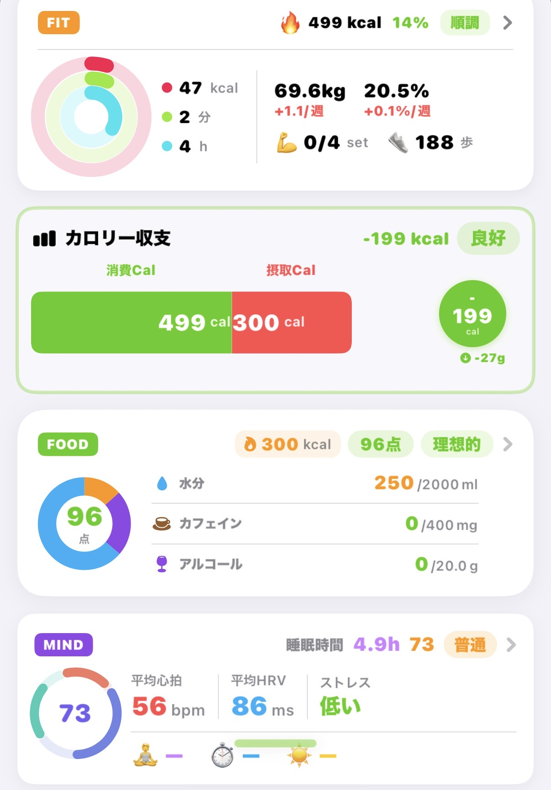

完全に間食をゼロにしようとすると反動で暴食しやすくなります。「間食を禁止」するのではなく「質の良い間食」に変えることが長期継続のコツ。ナッツ・チーズ・ゆで卵などの低糖質・高タンパクな選択肢に変えましょう。

#### 📋 やり方

- スナック菓子・チョコレート→ミックスナッツ（20〜30g）に変更
- 甘いもの→ギリシャヨーグルト＋ブルーベリーに変更
- 間食の時間を決める（15時など）と「ダラ食い」を防げる
- Fitingoの食事ログに間食も忘れず記録する

#### 💡 ポイント

> 間食を完全にやめる必要はありません。「何を食べるか」を変えるだけで劇的に変わります。

<a id="050"></a>

### No.050 🏃 食後30分のウォーキングで血糖値をコントロール

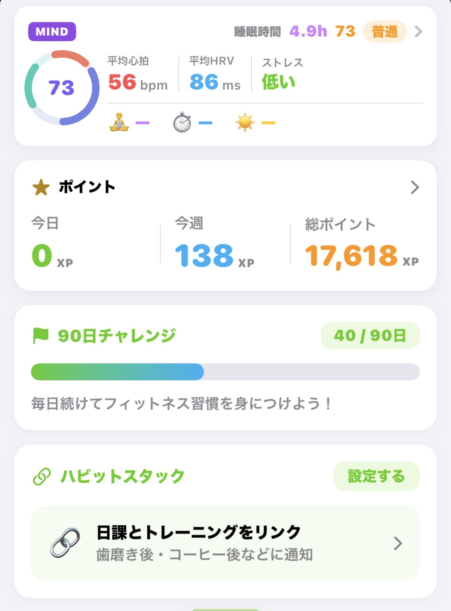

食後30分以内に10〜15分のウォーキングをすると、食後血糖値の上昇を効果的に抑えられます。インスリンの過剰分泌を防ぎ、体脂肪の蓄積を抑制する科学的に証明された方法です。Apple Watchでワークアウトを開始するだけで記録されます。

#### 📋 やり方

- 昼食後と夕食後、それぞれ10〜15分のウォーキングを習慣に
- ワークアウトアプリ →「屋外ウォーク」を選択
- 「食後ウォーク」というショートカットを作成すると起動が楽
- 雨の日は室内をゆっくり歩くだけでも効果あり

#### 💡 ポイント

> 食後ウォーキングを1週間続けるだけで、多くの人が食後の倦怠感・眠気の減少を実感します。

<a id="051"></a>

### No.051 📋 週次栄養バランスレポートで食生活を改善


HealthKitは週単位の栄養摂取データを蓄積しています。毎週日曜日にiPhoneのヘルスケアアプリで1週間の栄養バランスを振り返り、翌週の「改善ポイント」を1つだけ決めて実行しましょう。

#### 📋 やり方

- iPhoneのヘルスケアアプリ →「栄養素」→「週次」を確認
- タンパク質・脂質・炭水化物のPFCバランスをチェック（理想：P:20%, F:25%, C:55%）
- 不足している栄養素を翌週に意識して補う食材を計画
- 毎週同じ体重計で体重・体脂肪率を計測して変化と照合

#### 💡 ポイント

> 週次レビューを習慣にすると、1〜2ヶ月で自分の食生活パターンが明確に見えてきます。

<a id="052"></a>

### No.052 🧂 塩分摂取を減らして水分貯留を防ぐ


塩分の過剰摂取は体内に水分を貯留させ、体重増加・むくみの原因になります。外食・加工食品の塩分が多いことを意識し、自炊を増やすことで自然に塩分を減らせます。減塩だけで体重が0.5〜1kg減るケースも多いです。

#### 📋 やり方

- Fitingoの食事記録で「ナトリウム」量をチェック（1日目安2,000mg以下）
- しょうゆ・塩の代わりにレモン・ハーブで風味をプラス
- 加工食品・インスタント食品のラベルで「食塩相当量」を確認
- 外食では「塩分控えめ」「薄口」を注文時にリクエスト

#### 💡 ポイント

> むくみが取れると一気に「痩せた感」が出ます。減塩は見た目改善の即効策のひとつです。

<a id="053"></a>

### No.053 🍞 糖質量を意識して管理する

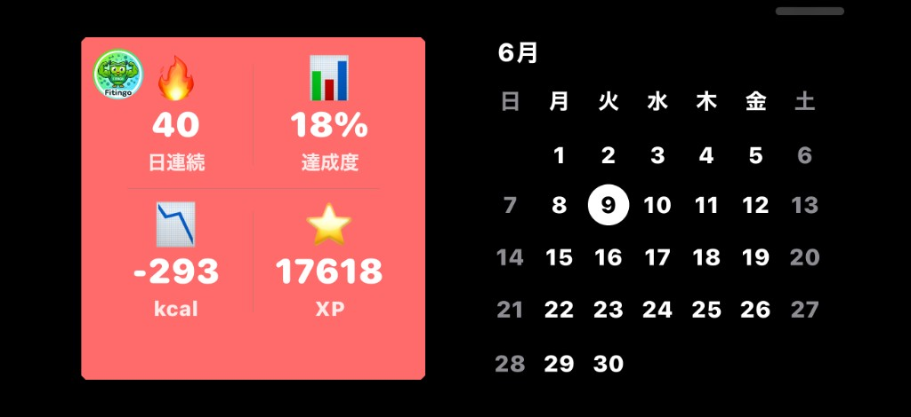

糖質を完全に断つ必要はありませんが、白米・パン・砂糖の量を意識するだけでカロリーコントロールが楽になります。HealthKitの「炭水化物」追跡機能で1日の糖質量を把握し、適正範囲（100〜150g/日）を目指しましょう。

#### 📋 やり方

- 白米を0.5〜0.8膳分に減らして野菜・おかずの量を増やす
- 砂糖入り飲料（ジュース・甘いコーヒー）をゼロにする
- お菓子は週1回のご褒美デーにまとめる（毎日の少量より効果的）
- 「低糖質パン」「こんにゃく麺」など代替食品を上手に活用

#### 💡 ポイント

> 糖質制限は「完全カット」より「適量管理」の方が継続しやすく、リバウンドも少ない方法です。

<a id="054"></a>

### No.054 📝 食後の満足感をFitingoのメモで記録する


毎食後に「満足度（1〜5）」「食べた量の感想（多い/ちょうど/少ない）」をFitingoのコメント欄に記録します。2週間後に振り返ると、自分の「食べ過ぎパターン」（特定の曜日・時間・感情）が見えてきます。

#### 📋 やり方

- Fitingoで食事記録後にコメント欄に満足度と量感を入力
- 「仕事が忙しい水曜夜は間食が増える」などのパターンを特定
- パターンが見えたら予防策を考える（水曜は早めの夕食を準備など）
- 月1回、記録を読み返して食生活の変化を確認する

#### 💡 ポイント

> データに基づいた自己分析は、感覚だけのダイエットより2〜3倍の効果があると言われています。

<a id="055"></a>

### No.055 🌬 食事前の深呼吸3回で食べ過ぎを防ぐ


食事前に深呼吸3回することで副交感神経が優位になり、早食い・過食を防ぎます。Apple Watchのブリーズ（マインドフルネス）アプリを使って、食前に1分間の深呼吸セッションを行うのが効果的です。

#### 📋 やり方

- 食事を始める前にApple Watchのマインドフルネスアプリ →「ブリーズ」を起動
- 1分間のガイドに合わせてゆっくり深呼吸（4秒吸い・7秒止め・8秒吐く）
- 食事中も最初の5分間はゆっくり意識的に食べる
- 食事後に「食べ終わった実感」を確認してから席を立つ

#### 💡 ポイント

> 深呼吸3回でストレスホルモンが低下し、感情的な食べ過ぎを予防する効果があります。

---

## III. マインドフルネスと睡眠

<a id="056"></a>

### No.056 🌅 朝のブリーズセッションで1日をスタート

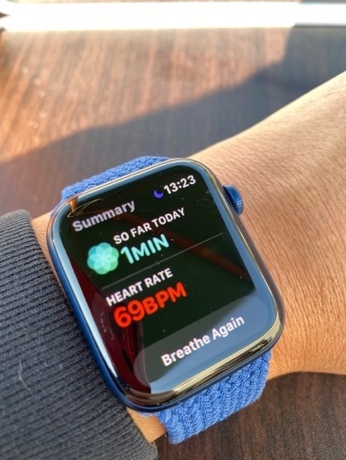

Apple Watchのマインドフルネスアプリ「ブリーズ」を毎朝使うことで、1日のスタートをリラックスした状態で始められます。ストレスホルモン（コルチゾール）が低い状態を朝から作ることで、1日を通じて感情的な食べ過ぎをしにくくなります。

#### 📋 やり方

- 起床後5〜10分以内にApple Watchのマインドフルネスアプリを起動
- 「ブリーズ」を選択し、3〜5分間のガイド付き深呼吸を実施
- 目を閉じ、体の感覚に集中する（考え事は後回し）
- 毎日同じ時間・同じ場所で実施すると習慣化が速い

#### 💡 ポイント

> 朝のマインドフルネスを3週間続けると、ストレス食い・過食が減るという研究が多数あります。

<a id="057"></a>

### No.057 🌟 リフレクトで感謝の気持ちを育む


Apple Watchの「リフレクト」は1分間の視覚的な瞑想ガイドです。毎日リフレクトセッションを完了すると「マインドフルネスの時間」として記録され、月間の達成数が可視化されます。感謝の感情を育てることはダイエットのモチベーション維持にも間接的に寄与します。

#### 📋 やり方

- マインドフルネスアプリ →「リフレクト」を毎朝または就寝前に実施
- セッション中は「今日うまくいったこと3つ」を心の中で思う
- 月末に「今月のマインドフルネス時間」を確認して目標達成を祝う
- リフレクトのバッジを集めるゲーム感覚で継続

#### 💡 ポイント

> 感謝の実践は幸福感を高め、暴飲暴食のトリガーとなるネガティブな感情を減らします。

<a id="058"></a>

### No.058 💓 心拍変動（HRV）でストレス状態を把握する

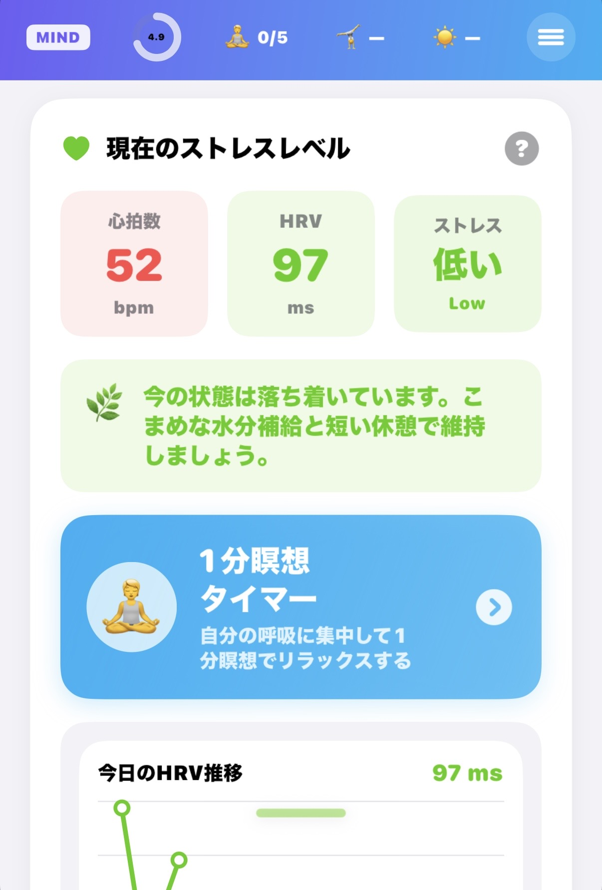

心拍変動（HRV）は心臓の拍動間隔のばらつきを示し、高いほど自律神経のバランスが良く、ストレスが低い状態を示します。Apple WatchはHRVを自動計測し、HealthKitに記録。数値が低い日はアクティブ回復（軽いウォーキングや瞑想）を優先しましょう。

#### 📋 やり方

- ヘルスケアアプリ →「心臓」→「心拍変動」でトレンドを確認
- HRVが自分の平均より20%以上低い日は激しい運動を避ける
- 低HRVの日はウォーキング・ストレッチ・瞑想で回復を優先
- 睡眠をしっかり取るとHRVが改善しやすい

#### 💡 ポイント

> HRVを理解して使いこなすことで、過剰な運動による疲労蓄積やダイエット停滞を防げます。

<a id="059"></a>

### No.059 📓 Fitingoのマインドフルネス記録を毎日つける

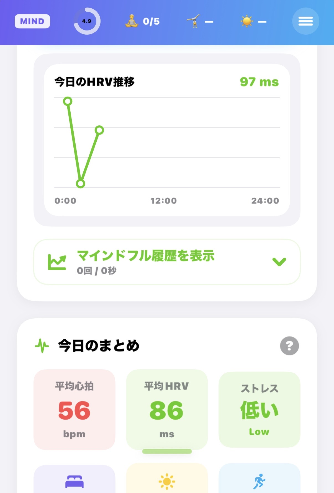

Fitingoアプリの「マインド」機能を使って、毎日のマインドフルネスセッション（Apple Watchのブリーズ・リフレクト）を記録します。継続日数（ストリーク）が可視化され、ゲーム感覚で継続意欲が高まります。

#### 📋 やり方

- 毎朝または就寝前にApple Watchでブリーズ/リフレクトを完了
- Fitingoアプリのマインドフルネス記録でセッションを確認
- 週7日継続でスパイラルのマインドフルネスアイコンが全て完了に
- 連続達成日数を家族や友人と競い合ってモチベーションを高める

#### 💡 ポイント

> マインドフルネスの連続記録が途切れそうな日も「1分だけブリーズ」で記録を守りましょう。

<a id="060"></a>

### No.060 🚶 ウォーキング瞑想で身体と心を同時に整える

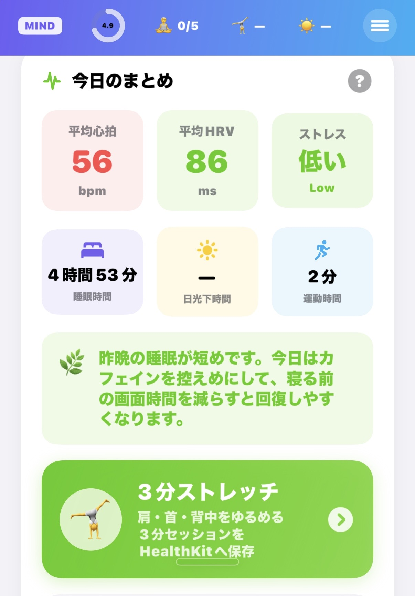

歩きながら瞑想する「ウォーキング瞑想」は、運動と心のケアを同時にできる効率的な習慣です。足の感覚・呼吸・周囲の音に意識を向けながら歩くことで、思考がリセットされストレスホルモンが低下します。

#### 📋 やり方

- ウォーキングワークアウト開始後、スマホをしまってAirPodsも外す
- 足の裏が地面に触れる感覚、腕の振り、呼吸のリズムに集中
- 思考が浮かんだら「考え事が来た」と気づき、また歩きに意識を戻す
- 最初は5〜10分から始め、徐々に20〜30分に延長

#### 💡 ポイント

> ウォーキング瞑想後は頭がスッキリし、仕事や食事の選択においてもより賢明な判断ができます。

<a id="061"></a>

### No.061 🌬 深呼吸エクササイズを1日3回行う

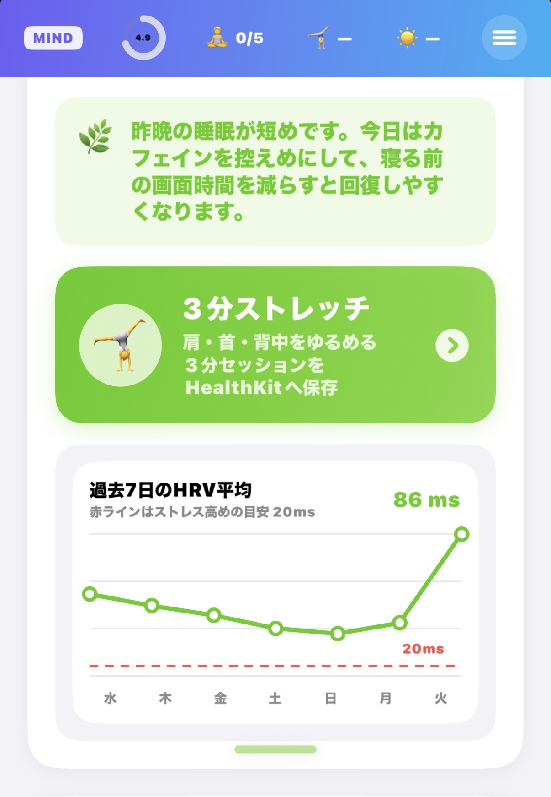

朝・昼・夜に各1〜2分の深呼吸エクササイズを行うことで、コルチゾールを抑制しストレス食いを予防します。Apple Watchのブリーズアプリは「4〜7〜8呼吸法」（4秒吸い・7秒止め・8秒かけて吐く）のガイドに最適です。

#### 📋 やり方

- 朝食前・昼食前・夕食前の3回、各1〜2分のブリーズセッション
- ストレスを感じたとき（会議前・締め切り前）は追加で実施
- Apple Watchの「マインドフルネス通知」を1日1〜2回に設定
- iPhoneのリマインダーで「12時：昼食前のブリーズ」を設定

#### 💡 ポイント

> 4-7-8呼吸法を1ヶ月継続した人の多くが「食欲の波」が穏やかになったと報告しています。

<a id="062"></a>

### No.062 🌙 睡眠スケジュールを設定して規則正しく眠る

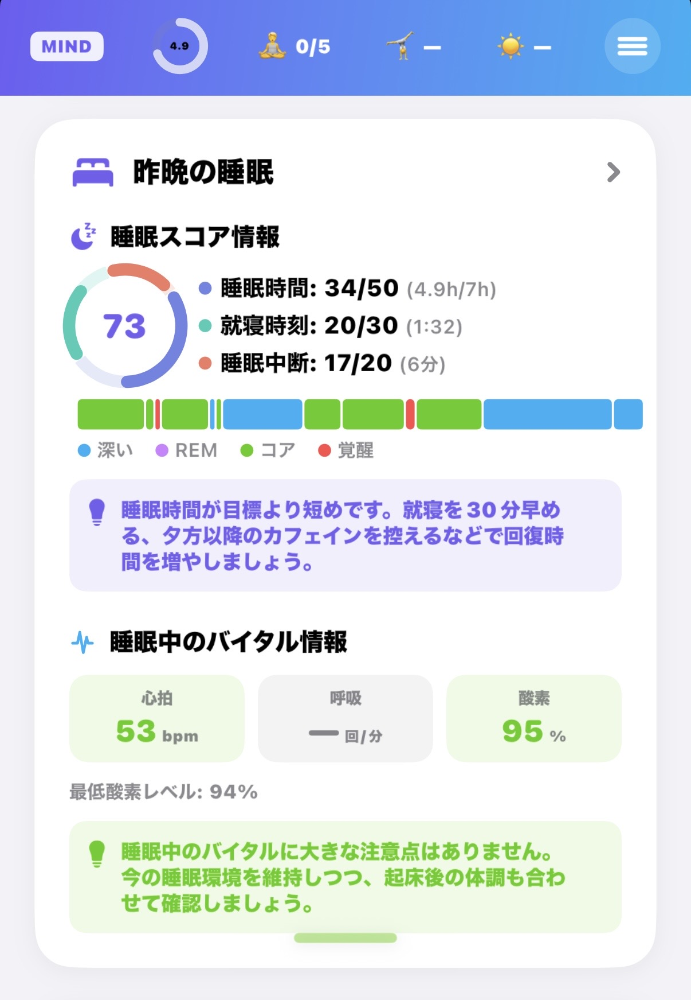

睡眠不足（7時間未満）はグレリン（食欲増進ホルモン）を増加させ、ダイエットの大敵です。Apple WatchのiPhoneアプリで「睡眠スケジュール」を設定し、毎日同じ時間に眠り、同じ時間に起きる習慣を作りましょう。

#### 📋 やり方

- ヘルスケアアプリ →「睡眠」→「スケジュール」で就寝・起床時間を設定
- 就寝30分前に「おやすみモード」が自動オンになるよう設定
- 平日・休日ともに起床時間を±30分以内にキープ
- Apple Watchを装着したまま眠ると睡眠ステージが自動記録される

#### 💡 ポイント

> 7〜8時間の睡眠を1ヶ月継続するだけで、食欲が安定し体重が自然に落ちやすくなります。

<a id="063"></a>

### No.063 📊 睡眠の質をApple Watchで毎朝確認する

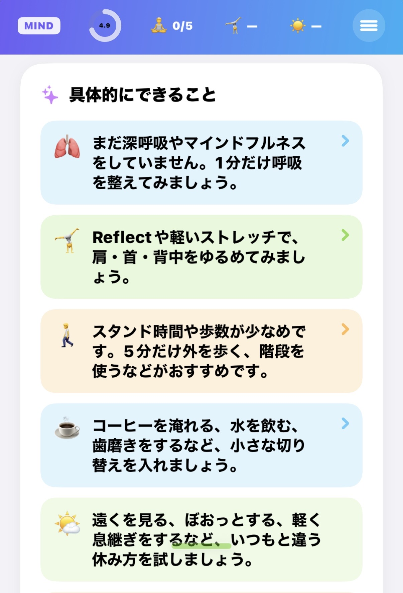

Apple Watchは睡眠中の心拍数・呼吸数・体動を計測し、睡眠の質を分析します。watchOS 26 からは「睡眠スコア」（0〜100点）が正式機能となり、睡眠時間・就寝時刻の一貫性・中途覚醒・睡眠段階をもとに毎晩自動で算出されます（Series 6 以降・SE 第2世代以降・Ultra 全機種）。毎朝ヘルスケアアプリで「昨夜の睡眠スコア」を確認し、睡眠の質が悪い原因（アルコール・就寝前のスマートフォン・就寝時間のズレ）を特定しましょう。

#### 📋 やり方

- 起床後にWatchの文字盤で「睡眠」コンプリケーションを確認
- ヘルスケアアプリ →「睡眠」→「各ステージの時間」を週次で確認
- 深睡眠が少ない日は翌日の活動量を抑えて回復を優先
- 就寝前2時間のアルコール・スマートフォン・高カロリー食を避ける

#### 💡 ポイント

> 睡眠データを継続して見ることで、何が睡眠の質を下げているかパターンが掴めます。

<a id="064"></a>

### No.064 🛁 就寝前2時間の充電ルーティンを作る


就寝前2時間の過ごし方が睡眠の質を大きく左右します。「ぬるめのお風呂（38〜40℃）→ストレッチ→読書」などのリラックスルーティンを確立し、Apple Watchでアラームを設定して就寝時間を守りましょう。

#### 📋 やり方

- Apple Watchに「22時：就寝ルーティン開始」のアラームを設定
- 22時にスマートフォン・PC・テレビをすべてオフ
- 38〜40℃のぬるめのお風呂に15〜20分浸かる（体温の低下で眠くなる）
- 入浴後に5〜10分のストレッチ＋Apple Watchのリフレクトで就寝

#### 💡 ポイント

> ルーティン化された就寝前の行動は「脳への眠りのシグナル」になり、寝つきが良くなります。

<a id="065"></a>

### No.065 🧑‍🏫 睡眠コーチング機能でアドバイスを受ける


Apple Watchの「睡眠コーチング」は、睡眠データを分析して改善のアドバイスを提供します。「先週の平均睡眠時間は〇時間でした」「就寝時間が一定でない日がありました」など、具体的なフィードバックでより良い睡眠習慣を構築できます。

#### 📋 やり方

- ヘルスケアアプリ →「睡眠」→「アドバイス」タブを定期確認
- コーチングの推奨事項を週に1つだけ実践する（欲張らない）
- 睡眠スコアを週次トレンドで確認し改善を数値で確認
- 毎週月曜日に「今週の睡眠目標」を1つ設定する

#### 💡 ポイント

> データドリブンなアドバイスは個人差を考慮してくれるため、一般的な睡眠本より効果的です。

<a id="066"></a>

### No.066 🎯 フォーカス機能でダイエット生活を管理する


iPhoneのフォーカス機能（集中モード）を使って「仕事中は食事アプリを通知のみ」「就寝前は食事関連通知をオフ」など、シチュエーション別の設定が可能。Apple Watchにも同期され、生活全体のデジタルウェルビーイングを管理できます。

#### 📋 やり方

- 設定 →「フォーカス」→「ワーク」を作成し、仕事時間の通知を最小限に
- 「睡眠フォーカス」で就寝30分前から食欲系・ゲーム系アプリの通知をカット
- Apple Watchと自動同期されるため、両方の設定が一元管理可能
- 週末は「個人フォーカス」で運動リマインダーをアクティブに

#### 💡 ポイント

> 不要な通知を減らすと集中力が上がり、衝動的なストレス食いの誘惑も減ります。

<a id="067"></a>

### No.067 ⏱ 瞑想タイマーとして活用して集中力を高める


Apple Watchを瞑想タイマーとして使うと、スマートフォンを触らずに瞑想セッションを管理できます。振動での開始・終了合図により、目を閉じたまま時間を管理でき、本格的なマインドフルネス瞑想の習慣化を助けます。

#### 📋 やり方

- マインドフルネスアプリ →「ブリーズ」→「カスタム時間」を5分に設定
- また、Watchアプリ →「タイマー」で任意の瞑想時間を設定する方法も
- 瞑想中はWatchを裏返しにして画面が見えないようにする
- 終了の振動を感じたらゆっくりと目を開け、深呼吸1回してから立ち上がる

#### 💡 ポイント

> 5分間の瞑想でもコルチゾール（ストレスホルモン）が有意に低下することが実証されています。

<a id="068"></a>

### No.068 ✨ 1日を振り返るショートカットで夜の感謝習慣


就寝前に「今日良かったこと3つ」「今日達成したこと1つ」を振り返る習慣は幸福感を高め、翌日のモチベーションを自動的に高めてくれます。iPhoneのショートカットアプリでApple Watch通知と連動できます。

#### 📋 やり方

- iPhoneのショートカットアプリで「夜の振り返り」ショートカットを作成
- 就寝30分前に「今日良かったこと3つ」を書き留める（メモアプリでOK）
- Fitingoアプリで今日の運動・食事記録を見返し、達成感を味わう
- 翌朝のウォーキング計画を1行メモして就寝

#### 💡 ポイント

> 感謝日記を3週間続けた人は幸福度が平均25%向上するという心理学研究があります。

<a id="069"></a>

### No.069 🦷 歯磨き中に足踏みしてムーブを稼ぐ


歯磨きの2〜3分間は何もしない時間です。この時間に足踏み・かかと上げ・スクワットを行うだけで、毎日のムーブリングとスタンドリングの達成を助けます。Apple Watchが足踏みをアクティブカロリーとして計測します。

#### 📋 やり方

- 歯磨き中にかかと上げ（30秒）→足踏み（30秒）→その場ジョギング（1分）
- 洗面台の前に「歯磨きエクサ」のメモを貼って忘れないようにする
- 朝・夜2回の歯磨きで1日計5〜6分の追加運動が実現
- Apple Watchでその日の最後のスタンドリングを閉じる機会にもなる

#### 💡 ポイント

> 1日5分の「ながら運動」を365日続けると、年間で約30〜40時間の追加アクティビティになります。

<a id="070"></a>

### No.070 📵 睡眠前の仕事メール・SNSを断ち切る


仕事のメールやSNSを就寝直前まで確認することは、脳を「ウォーモード」に保ち睡眠の質を大幅に下げます。Apple Watchのおやすみモード・DND設定を使って、デジタルデトックスを自動化しましょう。

#### 📋 やり方

- 設定 →「フォーカス」→「睡眠」→ 21:30に自動で有効に設定
- Apple WatchのDND設定と同期し、重要な連絡以外は通知カット
- 就寝前の「スクリーンタイム」の確認をiPhoneで週次に行い制限を設ける
- 替わりに紙の本・ストレッチ・ルームアロマでリラックス

#### 💡 ポイント

> 就寝1時間前のスマートフォン断ちで入眠時間が平均20〜30分短縮し、睡眠の質が改善します。

---

## IV. Fitingoアプリとの連携

<a id="071"></a>

### No.071 🤸 Fitingoで腕立て伏せを自動カウントする


iOSのFitingoアプリ（kfit）はiPhoneのCoreMotionセンサーを使って、腕立て伏せ（プッシュアップ）の回数を自動でカウントします。自分でカウントする必要がなく、フォームに集中して正確な回数を記録できます。

#### 📋 やり方

- FitingoアプリのiOS版を起動し「ワークアウト」→「腕立て伏せ」を選択
- iPhoneを床に置いた状態でスタートボタンをタップ
- 動作が完了するたびに画面に「1回！」と表示される
- 完了後に回数・消費カロリー・ポイントが記録され、HealthKitにも反映

#### 💡 ポイント

> 自動カウントにより「何回できるか？」に集中できるため、自己ベストを更新しやすくなります。

<a id="072"></a>

### No.072 🦵 スクワットの回数をFitingoで自動記録


Fitingoのモーション検出機能はスクワットにも対応。iPhoneのジャイロスコープ・加速度センサーで膝の曲げ伸ばし動作を検出し、正確な回数を自動でカウントします。下半身強化とカロリー消費を同時に達成。

#### 📋 やり方

- Fitingoアプリ →「スクワット」を選択してスタート
- iPhoneはポケットに入れた状態でOK（センサーが動作を検出）
- 1日50回を目標に、朝・昼・夜に分けて実施
- 記録はApple WatchのFitingoアプリでもリアルタイム確認可能

#### 💡 ポイント

> スクワット100回が1日の習慣になると、臀部・太もも・体幹が鍛えられ基礎代謝が大幅にアップします。

<a id="073"></a>

### No.073 🔲 腹筋の回数をFitingoで自動検出


Fitingoの加速度センサーを使ったシットアップ（腹筋）カウントは、背中を起こす動作を精度高く検出します。毎日の腹筋ルーティンを記録・数値化することで、体幹強化の進捗を可視化できます。

#### 📋 やり方

- Fitingoアプリ →「腹筋（シットアップ）」を選択
- iPhoneをお腹の上または胸ポケット（シャツ）に置いてスタート
- 背中を起こすたびにカウントされる
- 1日30〜50回×3セットを目標に毎日継続

#### 💡 ポイント

> 腹筋は毎日少しずつでも継続することが大切。Fitingoの記録が「今日もやろう」という動機付けになります。

<a id="074"></a>

### No.074 ⌚ Apple WatchのジャイロでFitingoの動作認識精度を上げる


FitingoはApple WatchのジャイロスコープとiPhoneのモーションデータを組み合わせて運動の動作認識精度を向上させます。Apple WatchをiPhoneと連携することで、腕の動き（腕立て伏せ・スクワット中の手首の傾き）をより正確に検出できます。

#### 📋 やり方

- FitingoアプリをiPhoneとApple Watchの両方にインストール
- ワークアウト開始時にiPhone・Apple Watch両方でアプリを起動
- Apple Watch側の「ワークアウト」アプリからFitingoを起動して連携
- 終了後はApple Watch側でも完了を確認してデータを同期

#### 💡 ポイント

> センサーの組み合わせにより、認識精度が単独使用時と比べて大幅に向上します。

<a id="075"></a>

### No.075 🌀 Fitingoのスパイラルで1日の達成度を確認する


FitingoのダッシュボードにはApple Watchのリングに似た「マンダラスパイラル」が表示され、運動・食事・水分・マインドフルネスの達成度を視覚的に確認できます。全セクションが完了すると花が咲くようなアニメーションが表示され、達成感を演出します。

#### 📋 やり方

- Fitingoアプリを開くと最初に「マンダラスパイラル」が表示される
- 各アイコン（💪🧘🍱💧）の進捗を1日の中で確認
- スパイラルを見て「どの時間帯でどのゴールを達成したか」を把握
- 全ゴール達成した日はスクリーンショットを撮って記録

#### 💡 ポイント

> 視覚的な達成表示はモチベーションを高める強力なツール。スパイラルを毎日「満開」にする目標が習慣化を促します。

<a id="076"></a>

### No.076 ⏰ Fitingoで時間帯別の目標を管理する


Fitingoは1日を「朝・昼・夕方・夜」の時間帯に分け、各時間帯に運動・食事・水分補給などのゴールを設定できます。時間帯別の達成が積み重なることで、スパイラルの各アイコンが完了（チェック）になる仕組みです。

#### 📋 やり方

- Fitingoアプリ →「ゴール設定」→ 時間帯別のゴールを設定
- 朝：腕立て伏せ10回、昼：水分補給200ml、夕方：ウォーキング20分、夜：マインドフルネス5分
- 各時間帯のゴール達成後にスパイラルのアイコンが完了になるのを確認
- 達成できなかった時間帯を翌日の優先課題にする

#### 💡 ポイント

> 時間帯を分けることで「後でまとめてやろう」を防ぎ、1日を通じたバランスある活動が実現します。

<a id="077"></a>

### No.077 ⌚ FitingoのWatch文字盤で活動状況を即確認


Apple WatchのFitingoコンプリケーション（ウィジェット）を文字盤に追加すると、手首を上げるだけで今日の達成数（例：「3/8 完了」）が一目でわかります。スマートフォンを取り出さずに進捗確認できる、超効率的な活動管理法です。

#### 📋 やり方

- Apple Watchの文字盤を長押し →「カスタマイズ」→ コンプリケーションを編集
- 「Fitingo」コンプリケーションを選択して文字盤に追加
- 手首を上げるたびに「今日の達成数/総ゴール数」が確認できる
- 数値が低い場合は即座に未達成のゴールを確認して行動

#### 💡 ポイント

> 「見える化」は行動変容の最強ツール。文字盤に表示されるだけでゴール達成意識が高まります。

<a id="078"></a>

### No.078 🏆 Fitingoのポイントシステムでゲームのようにダイエット


Fitingoはワークアウト完了・ゴール達成・連続記録（ストリーク）に応じてポイントを付与。ポイントランキングで友人・家族と競い合うことで、ゲーム感覚でダイエットを楽しめます。「楽しいから続ける」が最も効果的な継続戦略です。

#### 📋 やり方

- Fitingoの「ランキング」タブで週次ポイントを確認
- 腕立て伏せ1回=10ポイント、スクワット1回=15ポイントを目指して記録
- 連続達成（ストリーク）でボーナスポイントをゲット
- Fitingoの達成バッジをコレクションする楽しみも

#### 💡 ポイント

> ゲーミフィケーションはダイエットの継続率を劇的に高めます。ランキング1位を目指しましょう！

<a id="079"></a>

### No.079 📅 Fitingoの週間ゴールを設定して中期計画を立てる


Fitingoでは週単位のゴール（例：「週5回のワークアウト」「水分補給7日連続」）を設定できます。週次ゴールを達成する計画を日曜日の夜に立てることで、翌週の行動が明確になり、ダイエット効果が加速します。

#### 📋 やり方

- 毎週日曜日にFitingoのゴール設定を確認・更新
- 今週の達成状況をレビューし、できなかった原因を1つ特定
- 翌週は「1つの改善」だけに集中する（複数の変更は混乱のもと）
- 週間ゴール達成時はスモールご褒美（好きな映画・入浴剤など）を設定

#### 💡 ポイント

> 週次レビューと計画立案を10分行うだけで、ダイエットの成功率が大幅に高まります。

<a id="080"></a>

### No.080 ▶️ Apple Watchから直接Fitingoのワークアウトを開始


Apple Watch単体でFitingoのワークアウトを開始できます。iPhoneを取り出す手間なく、手首のタップだけで腕立て伏せ・スクワット・腹筋のカウントを開始。外出先や職場でも素早くワークアウトを記録できます。

#### 📋 やり方

- Apple Watch側でFitingoアプリを開く
- 「🤸 腕立て伏せ」「🦵 スクワット」などのメニューを選択
- Watch単独でカウントが始まり、完了時にiPhoneに同期
- Apple Watchのデジタルクラウンでスクロールして種目を選択

#### 💡 ポイント

> iPhoneがなくてもApple Watch単体でFitingoが使えることが、外出先での継続を可能にします。

<a id="081"></a>

### No.081 🔗 FitingoとHealthKitのデータを統合管理する


FitingoはiPhoneのHealthKitと完全連携し、ワークアウト・水分・体重・栄養素をすべてHealthKitに書き込みます。他のヘルスアプリ（Oura・Garmin・Fitbitなど）のデータと組み合わせて、より包括的な健康管理が可能になります。

#### 📋 やり方

- iPhoneのヘルスケアアプリ →「プライバシー」→「App」でFitingoの書き込み権限を確認
- Fitingo側でHealthKit連携設定をONにする（初回起動時に設定）
- ヘルスケアアプリで全データが一元管理されていることを確認
- 週1回、ヘルスケアアプリのダッシュボードで総合データを確認

#### 💡 ポイント

> データの統合管理により、運動・食事・睡眠の相関関係が見えてきます。

<a id="082"></a>

### No.082 ⚖️ 体重をHealthKitと連動してFitingoで記録


FitingoはHealthKitの「体重」データを読み込み、ダッシュボードに表示します。体重計のスマート機能（Wi-Fi連携）を使って自動記録するか、毎朝の体重をFitingoまたはヘルスケアアプリに手動入力しましょう。

#### 📋 やり方

- 毎朝起床後・トイレ後・食事前の決まった時間に体重を計測
- ヘルスケアアプリ →「体重」→「データを追加」で手動入力
- FitingoのダッシュボードでHealthKitの体重データが表示されることを確認
- 週の平均体重でトレンドを判断（1日の変動は誤差が大きい）

#### 💡 ポイント

> 毎日計測する「体重ウォッチング」の習慣がある人はダイエット成功率が約2倍高いという研究があります。

<a id="083"></a>

### No.083 🚰 Fitingoの水分補給記録を毎日更新する


Fitingoアプリのスパイラルの「水分」アイコンをタップすると、水分200mlがHealthKitに記録されます。1日に8回タップすれば1,600mlの水分記録が完了。視覚的なフィードバックが水分補給を楽しい習慣に変えます。

#### 📋 やり方

- Fitingoのスパイラル画面で「💧水分」アイコンをタップ→200ml記録
- 水を飲むたびにApple WatchからFitingoの水分ログを更新
- 1日の水分目標（体重×35ml）を設定してゴールを可視化
- Fitingoの水分記録が時間帯目標を達成するとスパイラルアイコンが完了

#### 💡 ポイント

> 十分な水分補給は代謝を3〜7%高めます。水を飲む習慣がFitingoのポイントと連動すると継続しやすい。

<a id="084"></a>

### No.084 🤖 FitingoのAI食事分析でカロリーを自動記録


FitingoのフォトログAI機能を使うと、食事の写真からカロリー・タンパク質・脂質・炭水化物を自動解析し、HealthKitに保存します。面倒な手入力が不要になり、食事記録の継続率が劇的に向上します。

#### 📋 やり方

- Fitingoアプリ →「📸フォトログ」をタップ
- 食事の写真を撮影（またはアルバムから選択）してAI分析開始
- 分析結果を確認し「ヘルスに保存」をタップ
- カメラ→AI分析→保存まで30秒以内で完了

#### 💡 ポイント

> 食事記録にかかる時間を「数十秒」にすることが、継続の最大の鍵です。

<a id="085"></a>

### No.085 🔥 Fitingoのストリーク（連続達成）を維持する


Fitingoは毎日の目標達成を「ストリーク（連続日数）」として記録します。7日・30日・100日などの節目でバッジが解除されます。「ストリークを途切れさせたくない」心理が、毎日の行動を後押しします。

#### 📋 やり方

- Fitingoのダッシュボードで現在の連続達成日数を確認
- 旅行中・体調不良時も「最低限のゴール（水分記録1回）」だけ達成してストリーク継続
- Fitingoのストリーク記録を友人にシェアしてアカウンタビリティを確保
- 途切れてしまっても「また1日目」と気持ちを切り替えて再スタート

#### 💡 ポイント

> 66日間継続で行動が「習慣化」するという研究があります。まず66日ストリークを目指しましょう。

<a id="086"></a>

### No.086 🕐 ウォッチコンプリケーションで達成数をリアルタイム確認


Apple Watch文字盤にFitingoのコンプリケーションを表示し、現在の達成数/総ゴール数（例：5/10）をリアルタイムで確認できます。数字が「目に入るだけ」で次のゴールへの意識が高まり、自然な行動変容につながります。

#### 📋 やり方

- Watch文字盤を長押し →「カスタマイズ」→ コンプリケーション枠にFitingoを設定
- 「Modular」「Infograph」など大きめのコンプリケーション枠を選ぶ
- 達成数が増えるたびにコンプリケーションの数字が変わるのを楽しむ
- 全達成後は🎉アニメーションが表示されてご褒美感を演出

#### 💡 ポイント

> 行動のトリガーは「頻繁に見るもの」。Watch文字盤は最強のリマインダー媒体です。

<a id="087"></a>

### No.087 🔔 Fitingoの通知でワークアウトリマインダーを設定


Fitingoアプリは設定した時間帯にワークアウトのリマインダーをApple Watchに送信できます。「21時になったら腕立て伏せを10回やろう」という具体的な通知が、習慣の定着を強力にサポートします。

#### 📋 やり方

- Fitingoアプリの設定 →「通知」→ ワークアウトリマインダーの時刻を設定
- 起床後（朝7時）・昼休み（12時）・帰宅後（19時）・就寝前（21時）の4回設定
- 通知が来たらApple Watchから即座にFitingoのワークアウトを開始
- 「通知を受けたら3秒以内に行動」のルールで習慣を定着させる

#### 💡 ポイント

> 行動の「きっかけ（トリガー）」を自動化することが習慣形成の最も重要なステップです。

<a id="088"></a>

### No.088 📉 Fitingoで体脂肪率の目標と進捗を管理する


体重より重要なのは「体脂肪率」です。筋肉量が増えると体重が変わらなくても体脂肪率が下がり、見た目が大きく変わります。HealthKitで体脂肪率を記録し、Fitingoのダッシュボードでトレンドを確認しましょう。

#### 📋 やり方

- 体脂肪率を計測できる体重計（スマート体重計）を使ってHealthKitに自動連携
- 手動入力の場合：ヘルスケアアプリ →「体脂肪率」→「データを追加」
- 理想的な体脂肪率：男性10〜20%、女性18〜28%を長期目標に
- 週1回、同じ条件で計測してトレンドを確認（毎日の変動は誤差が大きい）

#### 💡 ポイント

> 体脂肪率1%低下には約1〜1.5ヶ月かかります。焦らず長期視点でデータを見ましょう。

<a id="089"></a>

### No.089 🎮 FitingoのGIFキャラクターでワークアウトを楽しく


FitingoのApple Watch版ではワークアウト中に可愛いキャラクター（Fitingo）がアニメーション表示され、運動の「楽しさ」を演出します。ゲームのようなビジュアルフィードバックが、単調になりがちなエクサの継続を後押しします。

#### 📋 やり方

- Apple WatchのFitingoアプリでスクワット・腕立て伏せを選択
- ワークアウト中にキャラクターが動き、回数が増えるとアニメーションが変化
- ワークアウト完了でゴールセレブレーションアニメーションを楽しむ
- お子様と一緒にやると「ゲームとして」運動が続く

#### 💡 ポイント

> 楽しい体験は記憶に残り、「またやりたい」という動機を生み出します。

<a id="090"></a>

### No.090 🗓 Fitingoの長期ダイエット目標（3ヶ月）を設定する


「1ヶ月で5kg痩せる」ではなく「3ヶ月で体脂肪率2%低下」などの現実的な長期目標を設定することが、挫折しないダイエットの秘訣。Fitingoは3ヶ月スパンの目標管理に対応し、週次進捗を可視化します。

#### 📋 やり方

- Fitingoアプリ →「ゴール」→「3ヶ月目標」を設定
- 体重目標：現在−3〜5kg（月−1kg〜1.5kgペース）
- 体脂肪率目標：現在−2〜3%（3ヶ月で）
- 毎月末に進捗を確認し、目標を現実に合わせて調整する

#### 💡 ポイント

> 3ヶ月の継続で体が変わり「習慣が定着」します。最初の90日が最も重要な期間です。

<a id="091"></a>

### No.091 📱 Fitingoのダッシュボードで総合進捗を毎朝確認


Fitingoのダッシュボードは、運動・食事・水分・マインドフルネスの全データを1画面で俯瞰できます。毎朝コーヒーを飲みながらダッシュボードを眺める「朝の確認」習慣が、1日の目標意識を高めます。

#### 📋 やり方

- 起床後・朝食中にFitingoアプリを開いてダッシュボードをチェック
- 「昨日の達成数」「今日のゴール」「連続記録」を順に確認
- 達成できなかったゴールを今日のトップ優先事項にする
- 週末の朝は「今週の総まとめ」として少し長めに確認する

#### 💡 ポイント

> 毎朝のダッシュボード確認を習慣にするだけで、ダイエットへの意識が劇的に高まります。

<a id="092"></a>

### No.092 🗣 Siriでハンズフリーにワークアウト記録を開始


「Hey Siri、腕立て伏せを記録して」「Hey Siri、ワークアウトを開始して」とApple Watchに話しかけるだけで、ハンズフリーでワークアウトを開始できます。料理中・準備中など、手が塞がっている場面でも即座に記録を開始できます。

#### 📋 やり方

- Apple Watchの設定でSiriをオンに（手首を上げて「Hey Siri」で起動）
- 「Hey Siri、腕立て伏せのワークアウトを開始して」と話しかける
- 運動終了後は「Hey Siri、ワークアウトを終了して」で完了
- Fitingoと連携している場合はデータが自動同期される

#### 💡 ポイント

> 操作の摩擦を最小限にすることが継続の秘訣。Siriなら「やろうと思った瞬間」に開始できます。

<a id="093"></a>

### No.093 🥇 Apple Watchの完了バッジを毎日集める


Apple Watchはアクティビティリングの達成・月間完走・早朝ワークアウトなど様々なバッジを用意しています。Fitingoと組み合わせて「今月のバッジ全制覇」を目標にすることで、ゲーム感覚でダイエットを継続できます。

#### 📋 やり方

- フィットネスアプリ →「アーチーブメント」でバッジ一覧を確認
- 今月獲得可能なバッジを確認して、計画的に達成する
- 「月曜日のムーブゴール達成バッジ」「新年最初のワークアウト」など限定バッジを狙う
- Fitingoのバッジとダブルで集めてコレクション化

#### 💡 ポイント

> バッジのコレクションはダイエットの「ゲーム化」に不可欠な要素。遊び心が継続を支えます。

<a id="094"></a>

### No.094 🍽️ Fitingoのフードフィードで食事アイデアを収集


Fitingoのフォトログで「FOODフィードに追加」をオンにすると、過去に記録した食事が「マイフードコレクション」として保存されます。ダイエットに成功した食事を繰り返すことが最も効率的な食事管理法です。

#### 📋 やり方

- フォトログで食事を記録する際に「⭐ FOODフィードに追加」をオン
- 成功した食事のレシピ・組み合わせをコレクションに貯める
- 迷ったときはフィードから「先週うまくいった食事」を再現する
- カロリーが低くて満足度が高い食事を「マイベスト食事」としてピン留め

#### 💡 ポイント

> 「何を食べるか」に迷う時間をなくすことが、ダイエット継続の意外な落とし穴をふさぎます。

<a id="095"></a>

### No.095 👥 Apple Watchのシェアリングで友人と競い合う


Apple Watchのフィットネスシェアリング機能を使って、友人・家族のリングの達成状況をリアルタイムで確認できます。お互いの進捗を見ることで社会的プレッシャーと励ましが生まれ、1人でのダイエットより継続しやすくなります。

#### 📋 やり方

- フィットネスアプリ →「シェアリング」→ 友人をフォローして招待
- 友人のリングを毎朝確認して「今日も頑張ろう」の気持ちを高める
- 友人が週間活動量1位のときはメッセージで「バーン！」スタンプを送る
- 週1回、友人と「今週の成果報告会」をLINE等で実施

#### 💡 ポイント

> アカウンタビリティパートナー（共にダイエットする仲間）がいる人は成功率が65%高いという研究があります。

<a id="096"></a>

### No.096 🧘 Fitingoのマインドフルネスで食欲を整える


Fitingoのマインドフルネス記録機能は、Apple Watchのブリーズ・リフレクトセッションと連動します。1日のマインドフルネス目標を達成することで、ストレスホルモンが低下し食欲の乱れを防ぐ効果があります。

#### 📋 やり方

- Fitingoのスパイラルの🧘アイコンが完了になるまでマインドフルネスセッションを実施
- 朝1回・夕方1回の計2回のブリーズセッション（各3分）を目標に
- 食欲が乱れそうな時刻（14時頃・21時頃）にセッションを追加
- Fitingoの時間帯別マインドフルネス目標を達成してスパイラルを完成させる

#### 💡 ポイント

> マインドフルネスを毎日続けた人は、3ヶ月後に食欲のコントロール能力が有意に向上するという研究があります。

<a id="097"></a>

### No.097 🌜 Fitingo×Apple Watchで就寝前のルーティンを確立


就寝30分前の「Fitingoチェック→ブリーズ→歯磨き→就寝」という固定ルーティンを作ることで、脳が「眠る準備」を自動開始します。Fitingoで1日の達成数を確認することが、翌日のモチベーションにもなります。

#### 📋 やり方

- 就寝30分前にFitingoを開き、今日の達成数・未達成ゴールを確認
- 軽い達成感を得られる小さなゴール（水分記録1回）を最後に完了させる
- Apple Watchのマインドフルネス →「ブリーズ5分」で心を落ち着ける
- 翌朝の「最初のアクション」（何をするか）を1つ決めて就寝

#### 💡 ポイント

> 就寝前の「明日の計画を1つ決める」習慣が、翌日の行動を劇的にスムーズにします。

<a id="098"></a>

### No.098 📊 Fitingoのヘルスサマリーで体調変化を把握する


Fitingoは体重・体脂肪率・活動量・睡眠・水分補給などのデータを総合的にダッシュボードに表示します。体調の良い日・悪い日のパターンを読み取り、「何が体に合っているか」を自分で発見することが長期的なダイエットの鍵です。

#### 📋 やり方

- 月1回、Fitingoのダッシュボードで1ヶ月のデータを振り返る
- 体重が下がった週の活動量・食事内容・睡眠時間を分析
- 体重が増えた週の共通点（睡眠不足・外食多め・運動なし等）を特定
- 良かった週のパターンを意識的に再現する翌月の計画を立てる

#### 💡 ポイント

> 自分の体のデータを読むスキルが上がるほど、ダイエットの精度が高まります。

<a id="099"></a>

### No.099 ✅ Fitingoで「ながら運動」をすべて記録する


家事・通勤・子供との遊びなど、意識していない日常活動もすべてFitingoとApple Watchで記録することで、実際の消費カロリーを正確に把握できます。「意外と動いている」「思ったより動いていない」どちらも重要な発見です。

#### 📋 やり方

- 大掃除・庭仕事・子供の送り迎えも「その他」ワークアウトとして記録
- Apple Watchの「ワークアウトを追加」機能で事後に記録することも可能
- iPhoneのヘルスケアで「1日のアクティブカロリー」の内訳を確認
- 記録をきっかけに「では次にやることは？」と自然に行動計画が立つ

#### 💡 ポイント

> 「ながら運動」を含めた全活動を把握すると、実際の消費カロリーが予想より多いことに驚くはずです。

<a id="100"></a>

### No.100 🎉 Fitingo×Apple Watchで「ダイエットを楽しむ生活」を作る


100の方法を紹介してきましたが、最も重要なのは「楽しみながら続けること」。Apple WatchとFitingoは、ダイエットを苦行ではなく、毎日のゲームのような体験に変えてくれます。完璧を目指さず、今日1つだけ新しいことを試してみましょう。その積み重ねが、半年後の自分を変えます。

#### 📋 やり方

- 今日、Apple WatchとFitingoを使って1つだけ新しいことを試す
- うまくいったことは続け、合わなかったことは変える（正解は人それぞれ）
- 数字の変化より「今日も動いた」という事実を誇りに思う
- 半年後の自分に「続けてくれてありがとう」と言えるよう、今日を過ごす

#### 💡 ポイント

> Apple WatchとFitingoがあれば、ダイエットは「苦しい制限」ではなく「ワクワクする毎日の挑戦」になります。

---

## おわりに

100の方法を最後まで読んでいただき、ありがとうございます。

ダイエットに「魔法」はありません。しかし、Apple WatchとFitingoがあれば、地道な努力を「楽しい習慣」に変える魔法はあります。

Apple Watchをはめて、Fitingoを開いて、さあ今日も始めましょう。

*　　　　　　　　　　　　　　　　　吉田 顕一*

---

<a id="appendix"></a>

## 特別付録 — AIでこの本を作った方法

> この付録は、本書 *AppleWatch Diet Ultra2 — 100のダイエット方法* の本編には一切手を加えず、執筆プロセスの舞台裏を記録したドキュメントです。

---

<a id="appendix-1"></a>

### 付録1 なぜAIで本を書いたのか

本書の100メソッドは、筆者がFitingoアプリを実際に開発・運用してきた中で得た知見の集大成です。しかし「知っていること」と「読者に伝わる形で書くこと」の間には、大きな壁があります。

2024年末にClaude（Anthropic社のAI）とCursor（AIネイティブなIDE）を組み合わせて開発ワークフローを確立したとき、「これはアプリ開発だけでなく、執筆にも使えるのではないか」と気づきました。

**AI執筆を選んだ理由は3つです。**

1. **速度**: 100本のメソッドを一定品質で書き上げるには、人間だけでは数ヶ月かかります。AIとのペアライティングで、その時間を大幅に短縮できました。
2. **一貫性**: 各メソッドのフォーマット（やり方・ポイント）を揃えることで、読者が読み進めやすい構造を維持できました。
3. **実体験との融合**: AIが生成した骨格に、筆者自身のFitingo開発・使用体験を肉付けすることで、リアリティのある内容になりました。

---

<a id="appendix-2"></a>

### 付録2 使ったAIツールと役割分担

本書の制作には以下のツールを使いました。

| ツール | 役割 |
|--------|------|
| **Cursor** | Markdownファイルの編集・管理・バージョン管理（Git連携） |
| **Claude Sonnet 4.5** | 各メソッドの本文生成・構成レビュー・校正 |
| **Claude Opus 4** | 章構成の設計・付録の執筆・品質チェック |
| **Xcode / Fitingo** | スクリーンショット撮影・アプリ動作確認 |
| **iPhone + Apple Watch** | 全スクリーンショットの実機撮影 |
| **Kindle Direct Publishing** | 最終出版・フォーマット変換 |

**Cursorを中枢に置いた理由**: 本書は単独のドキュメントではなく、Fitingoアプリのリポジトリ（GitHubで管理）の `docs/` フォルダ内に置かれています。アプリの機能追加・スクリーンショット更新と本書の改訂を、同一リポジトリで管理することで、「アプリの実態と本の内容のズレ」を防ぎました。

---

<a id="appendix-3"></a>

### 付録3 プロンプト設計の実際

AI執筆で最も重要なのは「プロンプト設計」です。本書で使った主なプロンプトパターンを紹介します。

#### ■ メソッド生成プロンプト（基本形）

```
以下の条件でApple Watchダイエットメソッドを書いてください。

- メソッド番号: No.XXX
- タイトル: 〇〇〇〇〇
- カテゴリ: エネルギー消費 / 食事管理 / マインドフルネス / Fitingo連携
- 文体: 実践的・親しみやすい・前向き
- 構成:
  - 導入文（2〜3行）: このメソッドが有効な理由
  - 📋 やり方（箇条書き4項目）: 具体的な手順
  - 💡 ポイント（引用形式1行）: 記憶に残るひと言
- Fitingoアプリとの連携がある場合は言及する
- Apple Watch固有の機能（ワークアウト・HealthKit・通知など）を盛り込む
```

このプロンプトを100回繰り返すのではなく、一度に10〜15本のメソッドをバッチで生成し、その後筆者が個別に実体験を追記・修正しました。

#### ■ 品質チェックプロンプト

```
以下のメソッド群を読んで、以下の観点で問題があれば指摘してください。
1. 内容の重複（似たメソッドが2つ以上ないか）
2. Fitingoアプリと関係ない内容が混入していないか
3. Apple Watch固有の機能に言及しているか
4. 「やり方」が抽象的すぎて実践できないものがないか
```

#### ■ 目次整合性チェックプロンプト

```
この目次と本文を照合して、
- アンカーリンク（#001形式）が正しく対応しているか
- カテゴリ分類が適切か
- ページ流れとして自然な並び順か
を確認してください。
```

---

<a id="appendix-4"></a>

### 付録4 Fitingoアプリとの連携ワークフロー

本書は「Fitingoアプリの機能を最大限に活かす」ことをテーマにしています。そのため、アプリの実際の画面と本文が一致している必要がありました。

**連携ワークフロー:**

1. **機能確認**: Fitingo（kfit）のコードベースを Cursor で開き、実際に実装されている機能をリストアップ
2. **スクリーンショット撮影**: iPhone実機でFitingoを操作し、各メソッドに対応する画面を撮影
3. **本文との照合**: 「Fitingoの○○機能を使う」という記述が、実際に存在する機能かを確認
4. **バージョン管理**: `screenshots/main/` フォルダに連番で保存し、Markdownから参照

```
# ディレクトリ構造
docs/
  AppleWatchDiet_100methods.md  ← 本書
  screenshots/
    main/
      IMG_3400.jpg 〜 IMG_3502.jpg  ← 各メソッドのスクリーンショット
```

Gitでアプリのコードと本書を同一リポジトリで管理しているため、機能変更時に本書の該当箇所も一緒に更新できます。

---

<a id="appendix-5"></a>

### 付録5 画像・スクリーンショットの管理方法

本書の各メソッドには、対応するFitingoアプリのスクリーンショットが1枚ずつ添付されています。以下が管理方針です。

#### 撮影ルール

- **デバイス**: iPhone（最新モデル）＋ Apple Watch Ultra 2
- **解像度**: 高解像度（Retina）のまま保存（Kindleはwebp/jpeg対応）
- **ファイル名**: `IMG_XXXX.jpg`（iPhoneのカメラロール番号をそのまま使用）
- **Altテキスト**: `` 形式で本文に記述

#### Kindle向け最適化

Kindle Direct Publishing（KDP）のガイドラインに従い：

- 画像の横幅は最大 1600px
- ファイルサイズ合計が 650MB 以下
- `` 形式で参照（絶対パスは使わない）

#### AIによる画像説明生成

スクリーンショットの `Alt` テキストはClaude Visionを使って生成しました：

```
この画像はFitingoアプリのスクリーンショットです。
このメソッド「〇〇〇〇」の説明として適切な
日本語のAltテキスト（30文字以内）を書いてください。
```

---

<a id="appendix-6"></a>

### 付録6 Kindle出版までの全工程

本書をKindle（KDP）で出版するまでの工程を時系列で記録します。

#### Step 1: 構成設計（AIと共同）

Claudeと対話しながら「100メソッドをどう分類するか」を設計。最終的に4カテゴリ（エネルギー消費・食事管理・マインドフルネス・Fitingo連携）に落ち着きました。

```
プロンプト例:
「Apple Watchを使ったダイエットメソッドを100個考えます。
 重複なく、読者が実践しやすい順に4カテゴリに分類してください。」
```

#### Step 2: 本文執筆（バッチ生成＋手修正）

Cursorの「コンポーザー」機能を使い、Markdownファイルを直接編集しながらAIに追記させました。1回のセッションで15〜20メソッドを生成→レビュー→修正のサイクルを回しました。

#### Step 3: スクリーンショット統合

iPhone実機でFitingoを操作しながら、各メソッドに対応するスクリーンショットを撮影。`` としてMarkdownに埋め込み。

#### Step 4: 目次の整合性チェック

Kindle向けには `## 見出し` がNCX（Kindle目次）に自動登録されます。そのため：

- `##` → 大章（目次に登場）
- `###` → 小節（目次には登場しない）
- `<a id="001">` → アンカーリンク（目次内リンク用）

この3階層を守ることで、Kindleアプリ上で正しいジャンプが機能します。

#### Step 5: KDPアップロード

1. MarkdownをDocx（Word形式）に変換（`pandoc` コマンドを使用）
2. KDPの「原稿をアップロード」からDocxを選択
3. プレビューで目次・画像・文字サイズを確認
4. 表紙画像（2560×1600px）を別途アップロード
5. 価格設定・カテゴリ設定後に出版申請

```bash
# Markdown → Docx 変換コマンド
pandoc AppleWatchDiet_100methods.md \
  -o AppleWatchDiet_Ultra2.docx \
  --toc \
  --toc-depth=2 \
  -V lang=ja
```

---

<a id="appendix-7"></a>

### 付録7 AI執筆で気づいたこと・失敗談

AIを使った執筆は便利ですが、いくつかの落とし穴もありました。正直に記録しておきます。

#### ✅ うまくいったこと

- **フォーマットの統一**: 100本すべてで「やり方4項目＋ポイント1行」の構成を維持できた
- **バリエーション**: 似たテーマ（例：ウォーキング系）でも内容が重複しないよう、AIが自然に言い回しを変えてくれた
- **校正の速度**: 誤字・文体の不一致・敬体と常体の混在を数秒で検出できた

#### ⚠️ 失敗・注意点

- **ハルシネーション**: 「Apple Watchにはない機能」をAIが自信満々に書いてしまうことがあった。実機確認は必須。
- **メソッドの重複**: 初稿では「食後のウォーキング」系のメソッドが3つ存在していた。品質チェックプロンプトで発見・統合。
- **Fitingo固有の機能名の間違い**: AIは正式な機能名を知らないため、「マンダラスパイラル」を「スパイラルチャート」などと書いてしまうことがあった。用語集を最初に渡すと改善する。

#### 📝 教訓

> AIは「たたき台」を高速で作る道具として最強。しかし「実体験に基づくレビュー」と「最終チェック」は人間にしかできない。

---

<a id="appendix-8"></a>

### 付録8 あなたもAIで本を書ける — 最初の一歩

この付録を読んで「自分も試してみたい」と思った方のために、最初の一歩を紹介します。

#### 必要なツール（無料で始められるもの）

| ツール | 費用 | 用途 |
|--------|------|------|
| Cursor（無料プラン） | 無料 | Markdownエディタ兼AIアシスタント |
| Claude.ai（無料プラン） | 無料 | 本文生成・校正 |
| Pandoc | 無料 | Markdown→Docx変換 |
| KDP（Kindle Direct Publishing） | 無料 | 出版・販売 |

#### 30分で試せるミニ実験

1. Cursorをインストールして `my-book.md` を新規作成
2. Claude に「私の専門知識は〇〇です。10個のTipsをMarkdown形式で書いてください」と入力
3. 生成されたテキストをCursorで開いて編集・加筆
4. `pandoc my-book.md -o my-book.docx` でWord形式に変換
5. KDPに無料アカウントを作り、原稿をアップロードしてプレビューを見る

この5ステップが完了したとき、「本を作る」ことのハードルが劇的に下がっているはずです。

#### 筆者からのひと言

> AIは「アイデアを形にする速度」を10倍にしてくれます。しかし本の価値の源泉は、あなたの実体験と洞察です。AIはその器を作る道具——中身はあなたにしか書けません。

---

*本付録は 2026年6月 執筆。AIツールの機能・料金は変更される場合があります。*

---

## 著者プロフィール

**吉田 顕一（よしだ けんいち）**

Apple Watchユーザー歴10年以上。Fitingo（kfit）アプリ開発者。Apple Watch・iOSアプリを活用した習慣形成と健康管理の専門家として、数千人のユーザーのダイエット・健康改善をサポート。「テクノロジーを使って、無理なく楽しく健康になる」をモットーに、Apple WatchとFitingoの機能を最大限に活かしたメソッドを研究・実践中。

