# Apple Watch Mindfulness アップルウォッチ・マインドフルネス

> **著者**: 吉田 顕一（Ken Yoshida）  
> Apple Watchを使ってマインドフルな生活を送る100の方法

---

## はじめに

Apple Watch を手首に着けるだけで、「マインドフルネス」は特別なことではなくなります。

マインドフルネスとは、「今この瞬間」に意識を向け、判断せずにありのままを観察する能力です。科学的に、ストレス軽減・集中力向上・睡眠改善・免疫機能強化・慢性疼痛の緩和など、多岐にわたる健康効果が証明されています。しかし多くの人は「瞑想には特別な環境が必要」「30分間じっと座り続けなければいけない」という誤解を持ち、一歩を踏み出せずにいます。

Apple Watch と kmind アプリが、その常識を変えます。

Apple Watch に搭載された光学式心拍センサーは、24時間・365日、あなたの心拍数と心拍変動（HRV: Heart Rate Variability）を計測し続けています。HRV は自律神経のバランスを数値化したもので、ストレスレベル・リカバリー状態・睡眠の質を客観的に評価できる、最も信頼性の高い生体指標のひとつです。kmind アプリはこのデータをリアルタイムで解析し、「今日のあなたに最適なマインドフルネス」をガイドします。

本書では、Apple Watch と kmind アプリを最大限に活用した 100 のメソッドを、4 つのカテゴリに分けて紹介します。

**I. 朝のマインドフルネス習慣（No.001〜025）** — 一日の始まりを「意図的に設計」する朝のルーティン。

**II. ストレス管理と HRV 活用（No.026〜050）** — ストレスを「感じる」のではなく「数値で観察」して対処する技術。

**III. 睡眠とリカバリーの最適化（No.051〜075）** — 質の高い睡眠が、翌日のマインドフルネスの土台を作る。

**IV. kmind アプリと Apple Watch 徹底活用（No.076〜100）** — テクノロジーを味方につけて、マインドフルな生活を「続ける」仕組みを作る。

1 メソッド＝1 ページ完結なので、最初から順に読む必要はありません。気になったページから、今日ひとつだけ試してください。マインドフルネスに必要なのは、完璧な静寂でも 1 時間の瞑想でもありません。今この瞬間に、1 回深く呼吸するだけで始められます。その道具は、すでにあなたの手首についています。

> **2026年7月時点の最新情報**
> 現行の Apple Watch は Series 11・Ultra 3・SE 3（いずれも watchOS 26）です。watchOS 26 では、睡眠の質を毎晩自動採点する「睡眠スコア」（Series 6 以降・SE 第2世代以降・Ultra 全機種）や、高血圧の兆候を検知する「高血圧通知」（Series 9 以降・Ultra 2 以降）が追加され、本書で紹介する HRV・睡眠・マインドフルネスの実践をさらに深められます。2026年9月公開予定の watchOS 27 では、Apple Intelligence による新しい Siri や、習慣に応じて表示が変わる Smart Stack の改善が発表されています。

---

## 目次

### I. 朝のマインドフルネス習慣
- [No.001 朝のブリーズで1日を「意図的に」始める](#001)
- [No.002 リフレクトセッションで感謝の心を育む](#002)
- [No.003 起床後のHRVチェックで今日のコンディションを把握する](#003)
- [No.004 睡眠スコアを朝一番に確認してリカバリー状態を知る](#004)
- [No.005 起き抜けの深呼吸5回で自律神経をリセットする](#005)
- [No.006 朝日を浴びながらウォーキング瞑想を実践する](#006)
- [No.007 Apple Watchのマインドフルネスアプリを毎朝開く習慣](#007)
- [No.008 ボディスキャン瞑想で身体感覚への気づきを深める](#008)
- [No.009 起床直後の安静時心拍数で睡眠の質を推測する](#009)
- [No.010 朝のストレッチとブリーズを組み合わせたルーティン](#010)
- [No.011 朝食前の3分間リフレクションで1日の意図を設定する](#011)
- [No.012 マインドフルな水分補給で身体と心を目覚めさせる](#012)
- [No.013 感謝の3つをApple Watchに音声メモする習慣](#013)
- [No.014 朝のヨガとApple Watchワークアウト記録を連携する](#014)
- [No.015 カフェイン摂取前の15分間の静寂を楽しむ](#015)
- [No.016 通勤中のマインドフルウォーキングで移動を修行に変える](#016)
- [No.017 朝のマインドフルネスストリークを継続する](#017)
- [No.018 朝のHRV傾向で今日の運動強度を決める](#018)
- [No.019 Apple Watchのアラームを振動のみに切り替える](#019)
- [No.020 朝のアクティビティリング確認で1日を意図的にスタート](#020)
- [No.021 5-5-5呼吸法で交感神経から副交感神経へ切り替える](#021)
- [No.022 kmindの昨夜の睡眠レポートを起床後すぐに確認する](#022)
- [No.023 Mindful Minutes目標を「1分から」始める](#023)
- [No.024 睡眠中の安静時心拍数でリカバリー状態を把握する](#024)
- [No.025 朝空を5分間眺めるマインドフル観察を実践する](#025)

### II. ストレス管理とHRV活用
- [No.026 HRVの個人ベースラインを把握する](#026)
- [No.027 ストレスが高いときのSOS深呼吸ルーティン](#027)
- [No.028 心拍数が上がったらブリーズで即座に対処する](#028)
- [No.029 仕事中のマイクロブリーズで集中力を維持する](#029)
- [No.030 HRVトレンドで週単位のストレス傾向を把握する](#030)
- [No.031 食後の心拍数変化でストレス食いを発見する](#031)
- [No.032 呼吸ペーシングでHRVを能動的に高める](#032)
- [No.033 怒りを感じたら6秒ブリーズで鎮める](#033)
- [No.034 午後2時のアフタヌーンブリーズで集中力を回復する](#034)
- [No.035 心拍ゾーンを理解してストレス反応を正確に評価する](#035)
- [No.036 HRVが低い日は回復日として予定を調整する](#036)
- [No.037 慢性ストレスのサインを心拍変動トレンドで早期発見する](#037)
- [No.038 瞑想前後のHRV比較で心身への効果を数値で確認する](#038)
- [No.039 職場での1分間マインドフルポーズを習慣化する](#039)
- [No.040 ランチ後のウォーキングでストレスホルモンをリセットする](#040)
- [No.041 完璧主義をHRVで客観視し休む勇気を持つ](#041)
- [No.042 会議前の深呼吸でHRVを上げてパフォーマンスを高める](#042)
- [No.043 ネガティブな感情とHRVの関係をkmindで学ぶ](#043)
- [No.044 仕事終わりのブリーズルーティンでオンオフを切り替える](#044)
- [No.045 長時間作業後のリセットブリーズ5分間](#045)
- [No.046 4-7-8呼吸法でHRVを即時向上させる](#046)
- [No.047 週間HRVグラフで働き過ぎの週を可視化する](#047)
- [No.048 ストレスレベル高の日に食べるものを意識的に変える](#048)
- [No.049 デジタルデトックス時間をApple Watchで計測する](#049)
- [No.050 フォーカスモードでマインドフルな集中環境を整える](#050)

### III. 睡眠とリカバリーの最適化
- [No.051 就寝前30分のブリーズセッションで眠りを深める](#051)
- [No.052 Apple Watchで睡眠スケジュールを設定する](#052)
- [No.053 睡眠スコアをkmindで毎朝数値化して追跡する](#053)
- [No.054 就寝2時間前のカフェインとアルコールを断つ](#054)
- [No.055 就寝前の10分間ボディスキャン瞑想で深睡眠を促す](#055)
- [No.056 睡眠コーチング機能でパーソナライズされたアドバイスを受ける](#056)
- [No.057 レム睡眠と深い睡眠の割合を週単位で最適化する](#057)
- [No.058 Apple Watchのおやすみモードでデジタルノイズを断つ](#058)
- [No.059 週末の寝だめをやめて社会的時差ぼけを防ぐ](#059)
- [No.060 就寝前の入浴とHRV向上の関係を活用する](#060)
- [No.061 就寝前の3つの良かったこと日記で睡眠の質を上げる](#061)
- [No.062 夜間心拍数の急上昇を早期察知する](#062)
- [No.063 翌日のパフォーマンス予測にHRVと睡眠スコアを使う](#063)
- [No.064 午後の仮眠15分で夜の睡眠の質も上げる](#064)
- [No.065 入眠時刻の安定性がHRVを向上させる理由を知る](#065)
- [No.066 日中の日光暴露を増やして夜の睡眠を深める](#066)
- [No.067 起床時HRVが低い場合の緊急回復プロトコル](#067)
- [No.068 運動後のクールダウン呼吸法で睡眠を最適化する](#068)
- [No.069 月経周期とHRVと睡眠の相関をkmindで追跡する](#069)
- [No.070 慢性的な睡眠不足をkmindのトレンドで客観視する](#070)
- [No.071 寝室の環境をApple Watchの睡眠データで最適化する](#071)
- [No.072 就寝前のブルーライトブロックとナイトシフトを活用する](#072)
- [No.073 週次睡眠レポートで生活習慣を微調整する](#073)
- [No.074 Apple Watchの自動就寝検知で睡眠を正確に計測する](#074)
- [No.075 休暇中の睡眠データで本当の適切睡眠時間を発見する](#075)

### IV. kmindアプリとApple Watch徹底活用
- [No.076 kmindダッシュボードで今日のコンディションを一目で把握する](#076)
- [No.077 Apple Watch文字盤にHRVコンプリケーションを追加する](#077)
- [No.078 Apple Watch単体でブリーズセッションを完了する](#078)
- [No.079 kmindのムーミンメッセージで心を癒す](#079)
- [No.080 kmindの週間マインドフルネスレポートを習慣活用する](#080)
- [No.081 HealthKitとkmindの完全連携でデータを一元管理する](#081)
- [No.082 Siriでハンズフリーにマインドフルネスを記録する](#082)
- [No.083 kmindのストリークで毎日1分の継続を積み上げる](#083)
- [No.084 Apple Watchの新マインドフルネス機能を最大活用する](#084)
- [No.085 kmindのTOMOフィードでマインドフルネスを友人と共有する](#085)
- [No.086 職場でのApple Watchこっそりブリーズ活用術](#086)
- [No.087 FitingoとkmindでトータルウェルネスをApple Watch管理する](#087)
- [No.088 kmindのAIコーチに週次マインドフルネスアドバイスを求める](#088)
- [No.089 Watch GIFキャラクターでマインドフルネスを楽しく続ける](#089)
- [No.090 kmindのHRVカレンダーで月単位の傾向を把握する](#090)
- [No.091 Apple WatchとAirPodsで没入型瞑想体験を作る](#091)
- [No.092 kmindの習慣トラッカーで付属習慣を設定する](#092)
- [No.093 家族やパートナーとマインドフルネスチャレンジを共有する](#093)
- [No.094 kmindでマインドフルイーティングルーティンを作る](#094)
- [No.095 自然の中でのウォーキング瞑想をkmindで記録する](#095)
- [No.096 Apple Watchの心電図機能とkmindの連携活用](#096)
- [No.097 kmindのHRVアラートで休息が必要なサインを受け取る](#097)
- [No.098 kmindとApple Watchでフロー状態を可視化する](#098)
- [No.099 年間マインドフルネス目標をkmindで設定し追跡する](#099)
- [No.100 kmind×Apple Watchでマインドフルな生活を完成させる](#100)

---

## kmind アプリ 20の機能

Apple Watch と iPhone を最大限に活かす kmind の主要機能を紹介します。これらの機能を組み合わせることで、マインドフルネスを「特別な時間」ではなく「生活の一部」に変えられます。

### 01. 🧘 マインドフルネスダッシュボード
*今日のコンディションを一目で把握*

HRV・安静時心拍数・睡眠スコア・マインドフル分数・ストレスレベルを1画面に集約。毎朝30秒確認するだけで、今日の自律神経の状態を数値と視覚（グラフ・カラーバー）で把握できます。「今日は回復日」「今日は集中できる日」の判断を直感ではなくデータで行えます。

### 02. 💓 HRV（心拍変動）リアルタイム計測
*自律神経バランスを数値で可視化*

Apple Watch の光学式心拍センサーが計測した HRV データを、kmind がリアルタイム解析。HRV が高いほど自律神経のバランスが良く、ストレス耐性・集中力・回復力が高い状態です。kmind は個人のベースライン（過去30日平均）と比較し、今日の HRV 状態を「高い/普通/低い」で評価します。

### 03. 😌 ストレスレベルインジケーター
*HRVからストレス状態を3段階で評価*

kmind は HRV 値から「良好（緑）・注意（黄）・要回復（赤）」の3段階でストレスレベルを評価。閾値は RMSSD 60ms（優秀）・40ms（標準）・20ms（注意）を基準に、個人差を考慮した補正を行います。「赤判定の日は無理をしない」という新しい自己管理の習慣が生まれます。

### 04. 😴 睡眠スコア分析
*レム・深い睡眠・覚醒時間を自動計算*

Apple Watch の加速度センサーと心拍データを組み合わせ、睡眠段階（覚醒・レム・浅い・深い）を自動分類。kmind は総睡眠時間・深い睡眠比率・睡眠効率・入眠時刻の一貫性を総合した「睡眠スコア（0〜100点）」を算出し、毎朝グラフで表示します。

### 05. 🌿 ムーミンメッセージ（HRV連動）
*ストレス状態に応じたやさしいメッセージ*

HRV の状態に合わせて、ムーミンのキャラクターたちが一言メッセージをくれます。HRV が高い日は「今日は調子いいね！フルで楽しもう」、低い日は「今日はゆっくりしていいんだよ」など。データに基づきながらも、温かみのある言葉で日常に寄り添います。

### 06. 🌊 Apple Watch ブリーズ連携
*セッション完了を自動でkmindに記録*

Apple Watch の「ブリーズ」（Breathe）または「マインドフルネス」アプリでセッションを完了すると、kmind が HealthKit 経由でデータを取得し、自動記録します。手動入力不要で、1分間のブリーズ完了がマインドフル分数に即加算されます。

### 07. 🔮 リフレクト連携
*感謝・気づきのセッションを自動記録*

Apple Watch の「リフレクト」セッション（映像を眺めながら意識を向けるマインドフルネス）も、ブリーズと同様に kmind へ自動記録。ブリーズとリフレクトを組み合わせて毎日のマインドフル分数目標を達成する使い方が人気です。

### 08. ⌚ Apple Watch コンプリケーション
*文字盤にHRVとマインドフル分数をリアルタイム表示*

Apple Watch の文字盤に kmind の HRV（今日の値）・マインドフル分数（今日の累計）をコンプリケーションとして表示。手首を上げるたびに「今日はどのくらいマインドフルに過ごしているか」が一目でわかります。

### 09. 📊 週次・月次トレンドグラフ
*HRV・睡眠・マインドフル分数の長期変化を追跡*

週・月・年単位で HRV・睡眠スコア・マインドフル分数・安静時心拍数のトレンドグラフを確認。「マインドフルネスを続けるとHRVが向上する」という変化を自分の数値で体験できます。

### 10. 🔥 マインドフルネスストリーク
*連続達成日数で習慣を強化*

毎日のマインドフルネス目標（1分以上のブリーズ/リフレクト完了）を達成すると、ストリーク（連続達成日数）がカウントアップ。「途切れさせたくない」という心理が、習慣継続を強力にサポートします。7日・30日・66日・100日でバッジが解除されます。

### 11. 🎯 時間帯別マインドフルネスゴール
*朝・昼・夕・夜に最適なメソッドを提案*

1日を4つの時間帯（朝・昼・夕方・夜）に分け、それぞれに最適なマインドフルネス活動を設定できます。「朝はブリーズ、昼はウォーキング瞑想、夜はリフレクト」のような個人化されたプランが、無理なく継続する鍵です。

### 12. 🤝 TOMOフィード
*マインドフルネスの記録を友人・家族と共有*

kmind の TOMOフィードでは、今日のマインドフル分数・HRV スコア・ストリークを友人や家族と共有できます。「今日のHRVは62ms！」「100日ストリーク達成！」など、健康的な情報を身近な人とシェアすることで、お互いに継続を応援し合えます。

### 13. 🤖 AI週次コーチングレポート
*あなたのデータに基づくパーソナライズされたアドバイス*

週次で kmind の AI が HRV・睡眠・マインドフル分数のトレンドを解析し、「今週は睡眠が不足気味でHRVが低下しています。就寝時刻を30分早めてみましょう」などのパーソナライズされたコーチングコメントを提供します。OpenAI の最新モデルを活用した精度の高いアドバイスが特徴です。

### 14. 💧 水分補給とマインドフルネスの連携
*水を飲む瞬間を「意識のリセット」に変える*

kmind では水分補給の記録ができ、「水を飲む前に1回深呼吸する」というマイクロマインドフルネスを習慣化できます。HealthKit の水分データと連携し、1日の水分摂取量もダッシュボードで確認できます。

### 15. 📱 Watch アプリ単体動作
*iPhoneなしでApple Watch単体でkmindを使う*

Apple Watch 単体で kmind の主要機能（HRV 確認・ブリーズ開始・マインドフル分数確認）にアクセス可能。ジムや外出先でも手首だけで完結し、iPhoneを取り出す手間なく瞑想セッションを開始・記録できます。

### 16. 🔔 スマートマインドフルネスリマインダー
*時間帯・HRVに応じたカスタム通知*

「朝9時にHRVが低い日は『ブリーズしてみませんか？』という通知」「午後2時に集中力が低下するタイミングでリマインダー」など、HRV データと連動したインテリジェントな通知設定が可能です。

### 17. 🌙 睡眠準備モード
*就寝前ルーティンをApple Watchがガイド*

就寝30分前に kmind が「睡眠準備モード」に入ります。Apple Watch が「画面を暗くする」「通知を止める」「ブリーズを開始する」の3ステップをガイド。睡眠の質を向上させる就寝前ルーティンを自動化します。

### 18. 🏃 運動後のリカバリー分析
*ワークアウト後のHRV回復速度を追跡*

激しい運動後、HRV が正常値に戻るまでの時間（HRV リカバリー）を kmind が追跡。「運動強度が適切か」「オーバートレーニングになっていないか」を数値で判断できます。翌日の運動計画を科学的に調整する指針になります。

### 19. 📅 マインドフルネスカレンダー
*過去のHRV・睡眠・マインドフル分数を日別に確認*

月カレンダービューで、毎日の HRV・睡眠スコア・マインドフル分数を色分けして表示。「先月のいつが一番コンディションが良かったか」「ストレスが高かった週はどこか」を一目で振り返ることができます。

### 20. 🧠 マインドフルイーティングガイド
*食事の瞬間をマインドフルネスの実践の場にする*

食事記録と連動して、「今の食欲はストレス由来か、本当の空腹か」を心拍数とストレスレベルから推測。食前のワンブリーズ（深呼吸1回）を習慣化するためのリマインダーと記録機能を提供します。

---

## 100のマインドフルネスメソッド

---

## I. 朝のマインドフルネス習慣

### No.001 🌅 朝のブリーズで1日を「意図的に」始める

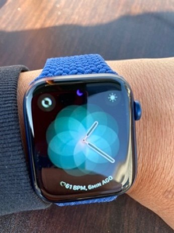

Apple Watch のブリーズ（Breathe）アプリは、呼吸のリズムをガイドしながら心拍変動を高め、副交感神経を優位にします。朝一番の1分間ブリーズが、1日のコルチゾール（ストレスホルモン）の分泌ピークを穏やかに乗り越える手助けをします。目覚めてから10分以内に行うことで、朝の慌ただしさに飲み込まれる前に「意図的な1日」を始められます。kmind がこのセッションを自動記録し、マインドフル分数に加算します。

#### 📋 やり方

- Apple Watch の「マインドフルネス」アプリを開き「ブリーズ」を選択
- セッション時間を1〜5分に設定（初心者は1分から）
- Watch が振動と円のアニメーションで呼吸をガイドする
- 完了後、kmind のダッシュボードでマインドフル分数が更新されることを確認

#### 💡 ポイント

> 朝のブリーズは起きてから最初の「自動操縦を止める瞬間」です。たった1分でも、脳の前頭前野（判断・意思決定を司る部位）の活性化を促し、1日を「反応的」でなく「意図的」に過ごすための準備になります。

### No.002 🙏 リフレクトセッションで感謝の心を育む

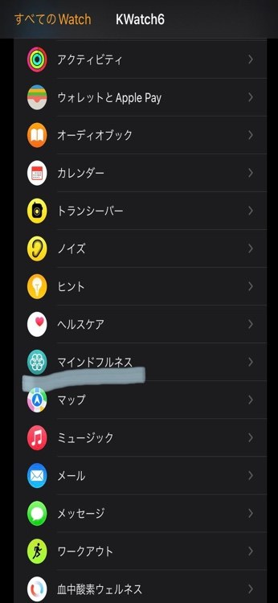

Apple Watch の「リフレクト」は、自然の映像を眺めながら「今この瞬間に意識を向ける」マインドフルネスセッションです。ブリーズが「呼吸を整える」機能であるのに対し、リフレクトは「意識を広げる」機能です。毎朝どちらか一方を行い、kmind に記録することで、マインドフルネスの多様な効果を享受できます。感謝の感情を持ちながらリフレクトを行うと、HRV が顕著に向上することが研究で示されています。

#### 📋 やり方

- Apple Watch の「マインドフルネス」アプリ →「リフレクト」を選択
- 画面の映像（波・木々・空など）に静かに意識を向ける
- 今日1日に感謝したいことを1つだけ心の中で思い浮かべる
- 終了後、kmind がHealthKit経由で自動記録

#### 💡 ポイント

> 「感謝日記」が幸福感と睡眠の質を向上させることは多くの研究で証明されています。リフレクト中に感謝を重ねることで、日記を書く時間がなくても、朝のルーティンに感謝の実践を組み込めます。

### No.003 💓 起床後のHRVチェックで今日のコンディションを把握する

心拍変動（HRV）は、前夜の睡眠の質・回復状態・ストレスレベルを最も正確に反映する生体指標のひとつです。Apple Watch は睡眠中に自動で HRV を計測し、kmind がその値を「今日のコンディション」として表示します。HRV が個人ベースラインより高ければ「今日はフルスロットル」、低ければ「今日は無理をしない日」と判断できます。この習慣が積み重なると、体の声に耳を傾ける「内受容感覚」が自然に育ちます。

#### 📋 やり方

- 起床後、kmind アプリを開いてダッシュボードのHRV値を確認
- 今日のHRVと過去30日平均を比較してコンディションを評価
- HRV が「高い（緑）」→ チャレンジングな活動もOK
- HRV が「低い（赤）」→ 軽いブリーズと回復中心の1日に切り替える

#### 💡 ポイント

> HRV の「絶対値」より「自分のベースラインとの比較」が重要です。平均HRVが低い人でも、自分の高い日・低い日を知ることで適切なセルフマネジメントができます。

### No.004 🌙 睡眠スコアを朝一番に確認してリカバリー状態を知る

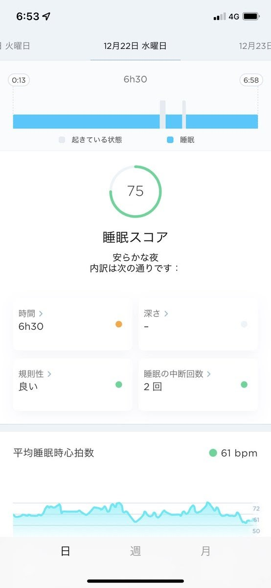

kmind の睡眠スコアは、Apple Watch が計測した睡眠データ（段階・時間・一貫性）を総合的に評価した0〜100点のスコアです。毎朝このスコアを確認することで、「昨夜の睡眠が今日のパフォーマンスにどう影響するか」を数値で理解できます。70点以上なら通常のパフォーマンス、55点以下なら午後に注意力低下が予想されます。スコアを日記代わりに確認する習慣が、自分の睡眠パターンの理解を深めます。なお watchOS 26 からは Apple 純正の「睡眠スコア」も追加され（Series 6 以降・SE 第2世代以降・Ultra 全機種）、kmind のスコアと併せて確認することで、より多角的に睡眠を評価できます。

#### 📋 やり方

- 起床後、kmind アプリ →「睡眠」タブで昨夜のスコアを確認
- 睡眠段階の内訳（深い睡眠が15〜20%が理想）もチェック
- スコアが低い日は「今日は集中力が落ちやすい」と心づもりをする
- 週末にスコアのトレンドを確認して生活習慣を調整

#### 💡 ポイント

> 睡眠スコアを毎朝確認するだけで、「今日の疲れは睡眠不足が原因かもしれない」という客観的な視点が得られます。自己批判ではなく、データとして受け入れる練習がマインドフルネスそのものです。

### No.005 🌬️ 起き抜けの深呼吸5回で自律神経をリセットする

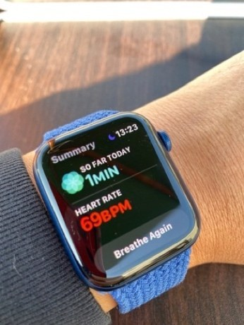

起床直後は、コルチゾールの分泌が1日のピークを迎える「コルチゾール覚醒反応（CAR）」が起きています。この自然なストレス反応を穏やかに乗り越えるために、起き上がる前にベッドの中で5回の深呼吸を行います。吸気4秒・呼気6秒のリズムで行うと副交感神経が優位になり、心拍数が安定し、HRV が向上します。Apple Watch で即座に確認できる心拍数の変化が、深呼吸の効果をリアルタイムでフィードバックします。

#### 📋 やり方

- 目が覚めたらベッドの中でそのまま仰向けに
- 鼻から4秒で吸い、口から6秒かけてゆっくり吐く
- これを5回繰り返す（合計約50秒）
- Apple Watch のハートレートアプリで心拍数が下がることを確認

#### 💡 ポイント

> 吸気より呼気を長くする呼吸は「副交感神経スイッチ」とも呼ばれます。1日の最初に5回実践するだけで、その後の HRV 測定値が平均5〜10ms向上するケースが多く報告されています。

### No.006 🌳 朝日を浴びながらウォーキング瞑想を実践する

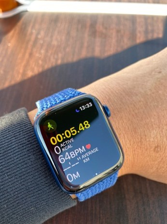

朝日（ブルーライトを含む自然光）は、体内時計をリセットし、セロトニンの分泌を促します。ウォーキング瞑想は、歩くという行為に完全に意識を向け、足の裏の感覚・風の感触・聞こえる音を「ただ観察する」実践です。Apple Watch でウォーキングを記録しながら、ワークアウトではなく「移動するマインドフルネス」として意識することで、運動とマインドフルネスの一石二鳥を実現します。

#### 📋 やり方

- 起床後30分以内に屋外に出て朝日を浴びる（最低5分）
- Apple Watch「ワークアウト」→「屋外ウォーク」を開始
- 歩きながら足の裏の接地感・腕の振り・呼吸のリズムに意識を向ける
- 考えが浮かんだら「考えが来たな」と気づき、歩く感覚に戻す

#### 💡 ポイント

> ウォーキング瞑想中は目的地を決めないのが理想です。「どこかへ向かう」意識が、「今ここにいる」マインドフルネスを妨げます。近所を15分間ただ歩くだけで十分です。

### No.007 🍏 Apple Watchのマインドフルネスアプリを毎朝開く習慣

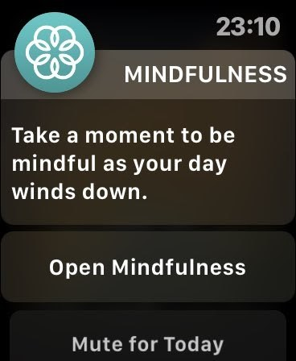

watchOS 8 以降に搭載された「マインドフルネス」アプリ（旧称：「呼吸」アプリ）は、ブリーズとリフレクトの2モードを提供します。毎朝 Apple Watch を腕に着けたら、まず最初にマインドフルネスアプリを開くことを「トリガー習慣」にしましょう。すでに定着している「時計を見る」行動にマインドフルネスを紐づけることで、新しい習慣が自然に定着します。kmind がこの習慣の継続を可視化します。

#### 📋 やり方

- Apple Watch を腕に着けるという毎朝のルーティンに注目
- 着けたらすぐ、マインドフルネスアプリを開くルールを決める
- 1分間だけブリーズを行い、完了と同時に1日がスタート
- kmind のストリーク（連続日数）でこの習慣の継続を確認

#### 💡 ポイント

> 習慣の定着には「既存の行動に新しい行動を紐づける（習慣の積み重ね）」が効果的です。「Watch を着ける→ブリーズを開く」というシンプルなルールが、習慣化の最大の近道です。

### No.008 🫁 ボディスキャン瞑想で身体感覚への気づきを深める

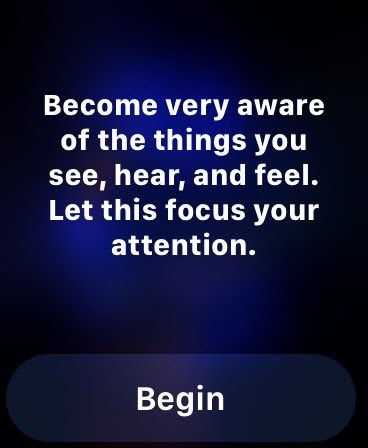

ボディスキャン瞑想は、足の先から頭の天辺まで、身体の各部位に順番に意識を向けていく実践です。特別な道具は必要なく、ベッドに横たわったまま行えます。Apple Watch の心拍モニターを活用して、瞑想前後のHRV変化を計測すると、実践の効果をデータで実感できます。1日の最初に身体全体をスキャンすることで、緊張している部位・痛みのサイン・感情の体への現れを早期に発見できます。

#### 📋 やり方

- 朝起きてベッドで仰向けになり、目を閉じる
- 足の指先から意識を向け、感覚（温かさ・重さ・感触）をただ感じる
- ゆっくりと足首→膝→腹部→胸→肩→顔へと5〜10分かけて移行
- 終了後に Apple Watch でハートレートを確認、kmind に手動記録

#### 💡 ポイント

> 「感覚を変えよう」とするのではなく「ただ感じる」のがボディスキャンの本質です。張っている肩を見つけたら、それを問題として解決しようとせず、「張っているな」とただ観察しましょう。

### No.009 ❤️ 起床直後の安静時心拍数で睡眠の質を推測する

安静時心拍数（RHR: Resting Heart Rate）は、心臓が1分間に拍動する最低回数で、健康の重要な指標です。Apple Watch は睡眠中の最低心拍数を自動計測します。この値が普段より5〜10 bpm以上高い場合、十分に回復できていないサイン（睡眠の質低下・発症初期の風邪・アルコールの影響など）かもしれません。kmind でこの値を追跡することで、身体の変化を数日前に察知できます。

#### 📋 やり方

- kmind のダッシュボード →「安静時心拍数」を毎朝確認
- 自分のベースライン値（例：55 bpm）を把握しておく
- ベースラインより5以上高い日は「回復優先デー」に設定
- 高い日が3日以上続く場合は医療機関への相談も検討する

#### 💡 ポイント

> 安静時心拍数の長期トレンドを見ることも重要です。継続的なマインドフルネスと有酸素運動の習慣で、数ヶ月後に安静時心拍数が3〜5 bpm低下するケースは珍しくありません。

### No.010 🧘 朝のストレッチとブリーズを組み合わせたルーティン

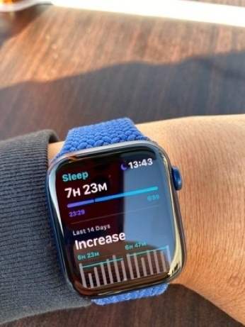

ストレッチは筋肉の緊張を解き、血行を促進しますが、それだけでは自律神経への働きかけが不十分です。ブリーズと組み合わせることで、身体的なリラクゼーションと自律神経の調整を同時に行えます。ストレッチ中に呼吸に意識を向けることがマインドフルネスの実践そのものになり、Apple Watch のガイドで呼吸リズムを保ちながらストレッチすることで、慌ただしい朝のルーティンが瞑想の時間に変わります。

#### 📋 やり方

- 起床後に5分間の軽いストレッチ（首・肩・股関節・背骨）を行う
- Apple Watch でブリーズを開始し、呼吸ガイドに合わせてストレッチ
- 吸気でストレッチを深め、呼気でリリース（脱力）するリズムを意識
- 5分後に kmind でマインドフル分数に記録

#### 💡 ポイント

> ストレッチ中の「呼吸を忘れてしまう」現象は、無意識の交感神経優位の証拠です。「吸って、伸ばして、吐いて、ゆるめる」というシンプルな意識を保つだけで、ストレッチの効果が2倍になります。

### No.011 🎯 朝食前の3分間リフレクションで1日の意図を設定する

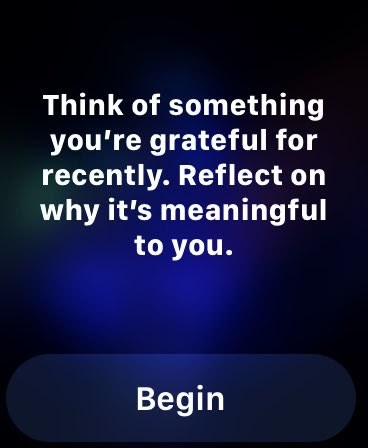

マインドフルネスの最終目標のひとつは、「刺激に自動的に反応する」から「意識的に選択する」生き方への移行です。朝食前の3分間を使って「今日1日、何を大切にしたいか」「今日の自分に何を許可するか」を静かに考えます。Apple Watch のリフレクトセッションを使いながら、今日の意図（インテンション）を心の中で言語化する習慣が、マインドフルネスを生活の軸にしていきます。

#### 📋 やり方

- 朝食の前に椅子に座り、Apple Watch でリフレクトを開始
- 3分間、今日1日について「今日大切にしたいことは？」と問いかける
- 答えは言葉でなくてよい。感覚として浮かんだものを観察するだけでOK
- 終了後にkmindのメモ機能で今日のキーワードを一言記録

#### 💡 ポイント

> 「意図の設定」は目標設定とは異なります。達成しなければならないものではなく、「今日の羅針盤」として機能します。完璧に守れなくてもよく、ただ時々思い出すだけで十分です。

### No.012 💧 マインドフルな水分補給で身体と心を目覚めさせる

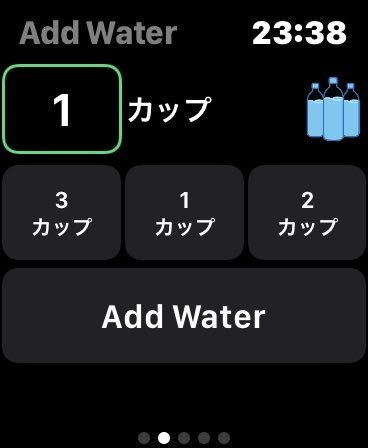

起床後、身体は6〜8時間の断水状態にあります。この状態で最初に飲む水は、消化機能のスタートと細胞の水分補給に最も重要です。ただ水を飲むのではなく、「水の温度・喉を通る感覚・胃に広がる感覚」に完全に意識を向けることで、マイクロマインドフルネスを実践できます。Apple Watch のリマインダー機能と kmind の水分記録機能を組み合わせて、この習慣を毎朝の儀式にしましょう。

#### 📋 やり方

- 起床後、最初の行動として常温〜ぬるま湯を1杯（200ml）用意する
- コップを両手で持ち、3回深呼吸してから飲み始める
- 飲みながら「水の感触・温度・喉の動き」だけに意識を集中する
- kmind の水分記録に +200ml を追加して朝のルーティン完了

#### 💡 ポイント

> 起床直後の水1杯は、胃腸の活動を起動する「モーニングキックスタート」です。毎日同じように行うことで、身体が「水を飲んだ→1日が始まる」というシグナルを受け取るようになります。

### No.013 🙏 感謝の3つをApple Watchに音声メモする習慣

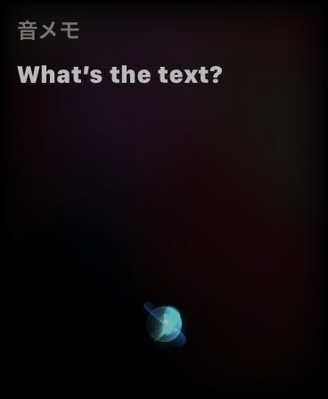

感謝の実践（グラティチュード・プラクティス）は、幸福感・楽観性・人間関係の質を向上させ、さらに HRV を上昇させることが多くの研究で示されています。朝の通勤中や家事をしながら、Apple Watch の Siri を使って「今日感謝していること3つ」を音声メモするだけで、この実践をゼロ時間で日常に取り入れられます。日記を書く時間がない人でも、30秒で感謝の習慣が始められます。

#### 📋 やり方

- 朝の支度中に Apple Watch の Siri を起動（「Hey Siri」または側面ボタン長押し）
- 「メモを取って：感謝1. ○○ 2. ○○ 3. ○○」と話す
- iPhoneのメモアプリに保存されたことを確認
- 週に一度、過去の感謝メモを読み返す時間を設ける

#### 💡 ポイント

> 感謝は「大きなことへの感謝」でなくてよいのです。「今日も温かいコーヒーが飲めた」「電車が時間通り来た」—— 小さな感謝を見つける習慣が、人生全体の幸福感を底上げします。

### No.014 🧘 朝のヨガとApple Watchワークアウト記録を連携する

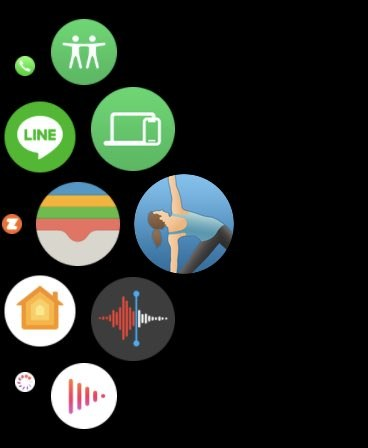

ヨガは身体の柔軟性と強さを高めるだけでなく、呼吸と動作を連動させることで深いマインドフルネス状態を生み出します。Apple Watch で「ヨガ」ワークアウトを記録しながら行うことで、心拍数・消費カロリー・アクティブ時間が自動記録され、HealthKit を通じて kmind にも反映されます。15分間のヨガフローは、朝のブリーズと組み合わせることで、自律神経のバランスを整える最強の朝ルーティンになります。

#### 📋 やり方

- Apple Watch「ワークアウト」→「ヨガ」を選択してセッションを開始
- 太陽礼拝（Surya Namaskar）を3〜5セット行う
- 各ポーズで「吸気・保持・呼気」の呼吸リズムを意識する
- ワークアウト終了後、kmind でその日の HRV 変化を確認

#### 💡 ポイント

> ヨガのポーズ（アーサナ）は、身体の特定の部位を刺激することで自律神経に働きかけます。特に「前屈」系のポーズは副交感神経を、「後屈」系のポーズは交感神経を活性化します。目覚めには後屈から始め、落ち着きには前屈で終わるのが理想です。

### No.015 ☕ カフェイン摂取前の15分間の静寂を楽しむ

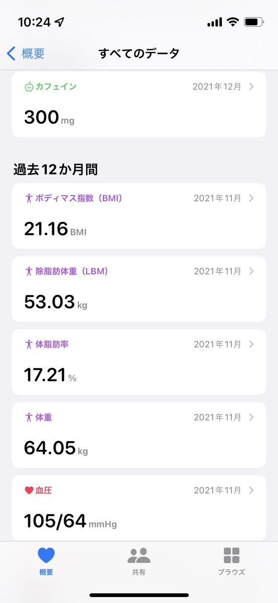

カフェインはアデノシン受容体をブロックして眠気を抑制しますが、覚醒反応には摂取後30〜45分かかります。この「待機時間」に急いでコーヒーを飲み干すのではなく、カフェインが効き始めるまでの15分間を「静寂の時間」にしましょう。コーヒーや緑茶を両手で包み、香り・温度・色・一口ごとの味に完全に意識を向けるマインドフルティーイングが、1日の最初の瞑想実践になります。

#### 📋 やり方

- カフェイン飲料（コーヒー・紅茶・緑茶）を用意したら、スマートフォンを置く
- 椅子に座り、両手でカップを包んで温かさを感じる
- 一口飲むごとに、味・香り・温度の変化だけに注意を向ける
- Apple Watch のブリーズを1分間行いながら飲んでもよい

#### 💡 ポイント

> 「作業しながら飲む」のではなく「ただ飲む」15分が、最も贅沢な朝の時間です。スマートフォンを見ながら飲むコーヒーより、ゆっくり味わうコーヒーの満足感が驚くほど高いことに気づきます。

### No.016 🚶 通勤中のマインドフルウォーキングで移動を修行に変える

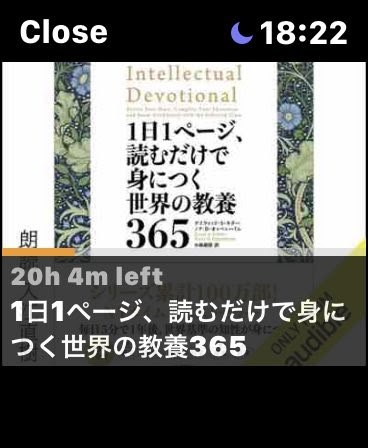

通勤という時間は多くの人にとって「失われた時間」ですが、マインドフルウォーキングの実践の場として最適です。歩きながら思考の中に迷い込む代わりに、足の裏の接地感・風の感触・周囲の音・呼吸のリズムに意識を向けます。Apple Watch でウォーキングを自動記録しながら、AirPods でガイド瞑想を聴くか、完全なサイレンスを選ぶかを日によって選択します。

#### 📋 やり方

- 通勤中、スマートフォンをバッグに入れてポケットから取り出さない
- 歩きながら足の「かかと→母趾球→指先」の重心移動に意識を向ける
- 5歩ごとに吸って、5歩ごとに吐く「カウントウォーク」を試してみる
- Apple Watch のウォーキング自動検知でムーブリングへの貢献を確認

#### 💡 ポイント

> 通勤中のスマートフォン閲覧をやめた最初の週は、不思議と時間が長く感じられます。これは「今この瞬間」に意識が戻った証拠です。しばらく経つと、通勤が1日で最も心が落ち着く時間になります。

### No.017 🔥 朝のマインドフルネスストリークを継続する

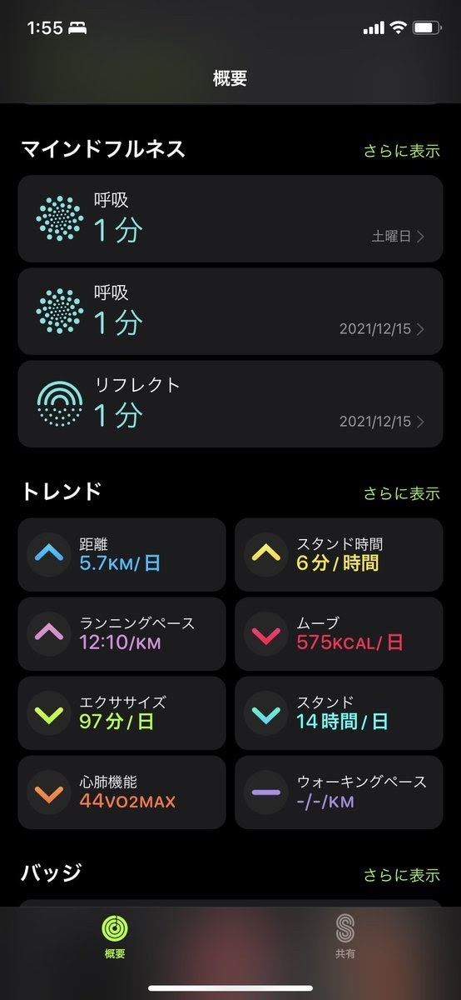

kmind のストリーク（連続達成日数）は、マインドフルネスを継続する最強のモチベーションシステムです。「今日でストリークが途切れる」という焦りではなく、「昨日も続けられた。今日も1分だけ」という小さな達成感の積み重ねがストリークを育てます。朝のブリーズ1分をストリークの条件にすることで、「忙しくてもこれだけはやる」という最低ラインが生まれ、マインドフルネスが生活の一部として根付きます。

#### 📋 やり方

- kmind でマインドフルネスの最低目標を「1分以上のブリーズ/リフレクト」に設定
- 毎朝起床後、まず1分間のブリーズを完了させてからストリークを確認
- ストリークの区切り（7日・30日・66日・100日）でセルフ祝福する
- 万が一途切れても自己批判せず、翌日から淡々と再スタート

#### 💡 ポイント

> ストリークは「続けること」を目的にするツールではなく、「習慣の可視化ツール」として使いましょう。途切れることを恐れて無理をするより、「今日は1分だけ」という柔軟さを持つことが長期継続の秘訣です。

### No.018 📊 朝のHRV傾向で今日の運動強度を決める

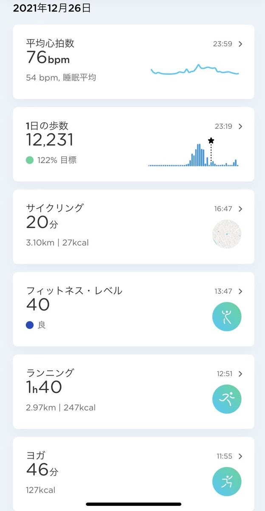

HRV は、今日どのくらいの強度で運動すべきかを教えてくれるパーソナルトレーナーです。HRV が高い日は心身ともに回復が進んでいる状態で、高強度トレーニング（HIIT・ランニング）に最適です。HRV が低い日は身体がまだ回復途中で、無理な運動はオーバートレーニングになるリスクがあります。kmind のHRVデータを毎朝確認することで、「今日は全力で走る日」か「今日はヨガで整える日」かを科学的に判断できます。

#### 📋 やり方

- kmind の HRV 値を起床後に確認
- HRV が高い（ベースライン+10%以上）→ 高強度トレーニングを計画
- HRV が普通（ベースライン±10%以内）→ 中強度の有酸素運動
- HRV が低い（ベースライン-10%以下）→ ウォーキング・ヨガ・マインドフルネスのみ

#### 💡 ポイント

> プロアスリートが HRV を使ったトレーニング計画（HRV-guided training）を採用しているのはこのためです。我々一般人こそ、無理をしない「休む勇気」をデータで得ることが大切です。

### No.019 ⏰ Apple Watchのアラームを振動のみに切り替える

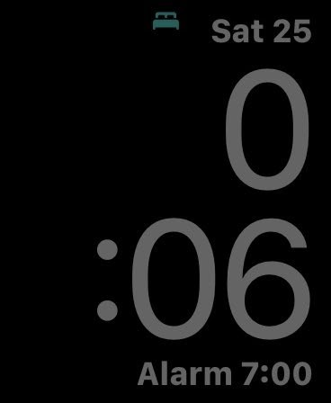

アラーム音による急激な覚醒は、コルチゾールの急激な分泌を引き起こし、交感神経を一気に優位にします。Apple Watch のタップ式（触覚フィードバック）アラームは、より穏やかな覚醒を促します。音ではなく振動で目覚めることで、朝の最初の数分が「闘争か逃走か」ではなく、穏やかに意識が浮かび上がる自然な覚醒になります。kmind の睡眠データで、この変更前後の睡眠スコアの変化を比較してみましょう。

#### 📋 やり方

- iPhone の「時計」アプリ →「アラーム」→ 編集 →「サウンドと触覚」
- サウンドをオフ、触覚（バイブレーション）のみをオンに設定
- Apple Watch 側でも「設定」→「サウンドと触覚」→ 音量を0にする
- 1週間試してから kmind の睡眠スコアを比較する

#### 💡 ポイント

> 振動アラームに慣れると、二度寝の罪悪感が減ります。「また鳴る前に起きなきゃ」という焦りから解放され、自然に意識が浮かび上がったタイミングで起き上がれるようになります。

### No.020 🔴 朝のアクティビティリング確認で1日を意図的にスタートする

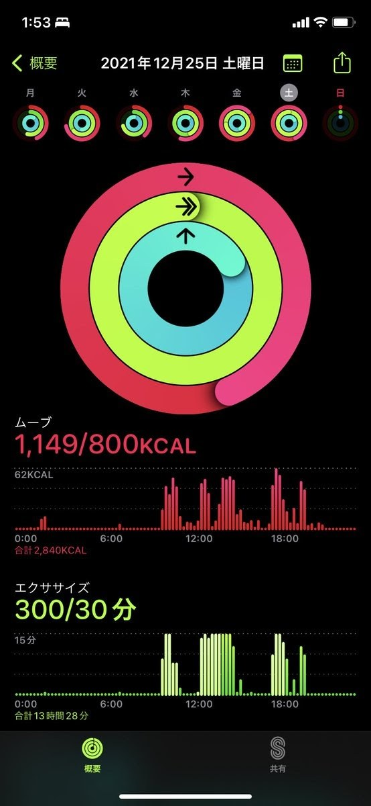

Apple Watch の3つのリング（ムーブ・エクササイズ・スタンド）は、今日の活動目標の達成状況をリアルタイムで可視化します。朝にこれを確認することは、「今日もアクティブに生きる」という意図の再確認です。昨日の達成状況を振り返り、今日どう行動するかをマインドフルに計画することで、日々の活動が単なる「こなす習慣」から「意図的な選択」に変わります。

#### 📋 やり方

- 起床後、Apple Watch の文字盤を確認してリングの状態を一目チェック
- kmind のダッシュボードと合わせて昨日の総合コンディションを振り返る
- 「今日のムーブゴールを達成するためにどこで体を動かせるか」を考える
- 1日の行動計画にマインドフルな視点でアクティビティを組み込む

#### 💡 ポイント

> リングをただ「閉じる」ことを目標にするのではなく、「今日どう生きたいか」を体現するツールとして活用しましょう。リングが閉じた日より「意図を持って動いた日」の方が、深い充実感をもたらします。

### No.021 🫁 5-5-5呼吸法で交感神経から副交感神経へ切り替える

5-5-5呼吸法（5秒吸う・5秒止める・5秒吐く）は、迷走神経を活性化して副交感神経を優位にする最も効果的な呼吸テクニックのひとつです。この呼吸パターンはほぼ0.1Hz の周波数（毎分6回の呼吸）に相当し、HRV の上昇と深いリラクゼーション状態を誘導します。Apple Watch のブリーズはこれに近い呼吸ガイドを提供しており、特に朝の交感神経優位状態を穏やかに解除するのに最適です。

#### 📋 やり方

- 椅子に座り、背筋を伸ばして目を閉じる
- 鼻から5秒かけてゆっくり吸い込む（お腹を膨らませる腹式呼吸）
- 5秒間、胸に空気を保つ（無理なく、軽く止める）
- 口から5秒かけてゆっくり吐き出す
- これを5〜10回繰り返す（合計2〜3分）

#### 💡 ポイント

> 「5-5-5呼吸」は職場や電車の中でも、口を閉じたまま鼻だけで行えます。目立たず実践できるため、緊張した場面での「こっそりブリーズ」として活用できます。

### No.022 📱 kmindの昨夜の睡眠レポートを起床後すぐに確認する

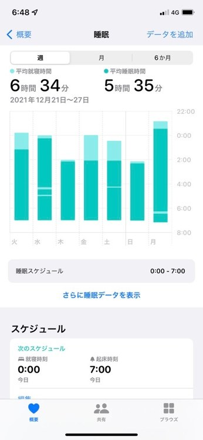

kmind の睡眠レポートには、総睡眠時間・深い睡眠時間・REM 睡眠時間・覚醒回数・睡眠スコアが表示されます。このレポートを毎朝起床後すぐに確認する習慣が、「自分の睡眠パターンを知る」という自己認識の土台を作ります。「深い睡眠が少ない日はどんな前夜だったか」を観察するうちに、睡眠の質を下げる行動（就寝前の飲酒・スクリーン使用・遅い夕食）が自然に明らかになります。

#### 📋 やり方

- 起床後にkmindを開き「睡眠」タブのレポートを30秒確認
- 特に「深い睡眠（最低60〜90分が理想）」と「REM睡眠（最低90分が理想）」をチェック
- 前夜の行動（就寝時刻・飲酒・運動）と照合してパターンを観察
- 週末に1週間分のレポートを見渡して傾向をつかむ

#### 💡 ポイント

> 睡眠データは「判断」のためではなく「観察」のために使います。スコアが低くても自己批判せず、「何が原因か」という好奇心を持って観察することが、マインドフルな睡眠管理の本質です。

### No.023 ⏱️ Mindful Minutes目標を「1分から」始める

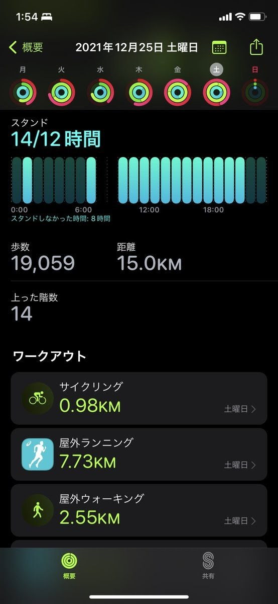

「毎日30分瞑想しなければならない」というプレッシャーがマインドフルネスの最大の障壁です。kmind では1日のマインドフル分数（Mindful Minutes）目標を自由に設定できます。最初は「1分」から始め、それが習慣になったら「2分」「5分」と少しずつ増やしていきましょう。「1分の継続」は「30分の挫折」より遥かに価値があります。Apple Watch が1分間のブリーズを毎日完了することをサポートします。

#### 📋 やり方

- kmind の設定から1日のマインドフル分数目標を「1分」に設定
- 毎朝Apple Watch でブリーズを1分間完了してマイルストーンを達成
- 7日間連続達成したら目標を「3分」に引き上げる
- 1ヶ月後の目標を「10分」に設定して長期計画を立てる

#### 💡 ポイント

> マインドフルネスの効果は「量」より「質」と「継続性」によります。毎日1分の高質なブリーズは、週1回の30分よりも脳の灰白質の増加（マインドフルネスの神経学的効果）に貢献することが研究で示されています。

### No.024 💤 睡眠中の安静時心拍数でリカバリー状態を把握する

Apple Watch は睡眠中の最低心拍数（安静時心拍数）を自動計測します。この値は、心臓が最も効率よく機能しているときの「アイドリング回転数」であり、心臓血管系の健康と回復状態を示します。健康な成人の安静時心拍数は60〜80 bpm が標準で、マインドフルネスや有酸素運動の継続により50〜60 bpm 台に低下することが多くあります。kmind でこのトレンドを追うことで、健康改善の進捗を客観的に確認できます。

#### 📋 やり方

- kmind で「安静時心拍数」のグラフを週次で確認
- 過去30日の最低値と最高値の差に注目する
- 前日のストレス・アルコール摂取・運動強度との相関を観察する
- 値が高い日が続く場合、睡眠環境や生活習慣を見直す

#### 💡 ポイント

> 安静時心拍数は毎日変動します。1日だけの値に一喜一憂せず、週・月単位のトレンドに注目することが大切です。毎日確認する習慣そのものが、身体への継続的な気づきを育てます。

### No.025 🌤️ 朝空を5分間眺めるマインドフル観察を実践する

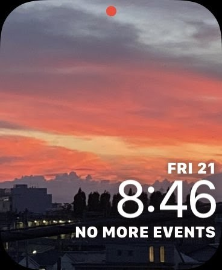

視覚を通じたマインドフルネスは、思考の渦から抜け出す最もシンプルな方法のひとつです。雲の形・空の色・光の変化を「ただ見る」だけで、脳のデフォルト・モード・ネットワーク（自動思考を司る回路）の活動が低下し、「今この瞬間」への意識が高まります。Apple Watch のタイマーで5分間を計りながら、屋外や窓の外に立って空を眺める習慣が、ゼロコストのマインドフルネス実践になります。

#### 📋 やり方

- Apple Watch のタイマーアプリで5分間をセット
- 外に出るか窓の前に立ち、空をただ眺める
- 雲の動き・色の微妙な変化・光の差し込み方に意識を向ける
- 考えが浮かんだら「考えが来たな」とひとり言を言って空に戻る

#### 💡 ポイント

> 「空を見る」という行為は、遠くを見ることで目の筋肉を弛緩させ、視覚的緊張を解放します。スクリーンに向かい続けた翌朝には特に効果的で、眼精疲労の軽減にも繋がります。

---

## II. ストレス管理とHRV活用

### No.026 📈 HRVの個人ベースラインを把握する

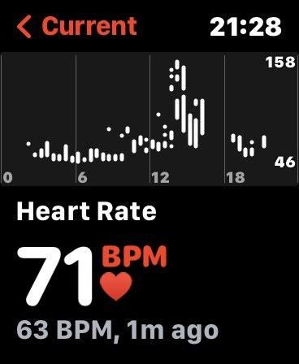

HRV（心拍変動）の「平均値」は人によって大きく異なります。HRV が40ms の人でも、その人の平均が40msであれば「正常」です。kmind は過去30日間のデータから個人ベースラインを自動計算し、今日の値との差分で状態を評価します。まず2週間、毎朝 kmind でHRV を確認してベースラインを把握することが、すべてのHRV活用の出発点です。

#### 📋 やり方

- kmind をインストールして Apple Watch と連携する
- 2週間、毎朝同じ時刻（起床後10分以内）にkmindでHRVを確認
- 2週間後に「自分のベースラインHRV範囲（例：45〜55ms）」をメモする
- このベースラインと毎日の値を比較してコンディションを判断する基準にする

#### 💡 ポイント

> HRV は年齢・体重・フィットネスレベルなどの影響を受けます。他人の値と比較するのは意味がありません。「自分の昨日と今日」の比較だけが、正確なコンディション管理につながります。

### No.027 🆘 ストレスが高いときのSOS深呼吸ルーティン

強いストレスを感じた瞬間、交感神経は「闘争か逃走か」モードに切り替わり、心拍数が上昇・呼吸が浅く速くなります。このときに意識的に呼吸をコントロールすることで、迷走神経を活性化し、ストレス反応の連鎖を断ち切ることができます。Apple Watch のブリーズを即座に起動して1〜3分間のセッションを行うことが、ストレスのその場での応急処置になります。

#### 📋 やり方

- ストレスを感じた瞬間、Apple Watch の「マインドフルネス」アプリを開く
- ブリーズを1〜3分間開始する
- 呼吸ガイドに完全に集中し、思考から呼吸への意識の切り替えを実践
- セッション後、kmind でHRVの変化を確認して効果を数値で実感する

#### 💡 ポイント

> ブリーズの代わりに「吐く:吸う = 2:1」のリズムを覚えておくと、Apple Watch がなくても即実践できます。6秒吐いて→3秒吸う、これだけで副交感神経が優位になります。

### No.028 ❤️ 心拍数が上がったらブリーズで即座に対処する

Apple Watch は心拍数が設定値以上に上昇すると通知を送る機能があります。この通知を「ストレスアラート」として活用し、受信した瞬間にブリーズを開始するルールを決めておきましょう。仕事中・会議中・移動中でも、Apple Watch のブリーズは最小限の動作で完結します。心拍数の上昇という客観的なシグナルを「ブリーズのトリガー」にすることで、感情的な判断を排除した自動ストレス管理が実現します。

#### 📋 やり方

- iPhone「ヘルスケア」→「心拍数」→「高心拍数の通知」でアラート値を設定（例：100bpm）
- 通知を受け取ったらすぐに Apple Watch でブリーズを開始
- 深呼吸中に「何がこの心拍上昇を引き起こしたか」を観察する
- セッション後に心拍数が通知値以下に戻ったことを確認

#### 💡 ポイント

> 心拍数の上昇は、身体がストレスを「すでに感じている」サインです。感情的に認識するより数秒早く、Apple Watch がストレスを検知してくれます。このタイムラグを活用した早期介入が、ストレスの連鎖を防ぎます。

### No.029 💼 仕事中のマイクロブリーズで集中力を維持する

90分間集中して作業した後、人間の脳は休息を必要とします（ウルトラディアンリズム）。この自然なサイクルに合わせて、Apple Watch でマイクロブリーズ（1〜2分の短いセッション）を行うことで、集中力を長時間維持しながらストレスを蓄積させない働き方が実現します。ポモドーロテクニック（25分作業・5分休憩）の「5分休憩」にブリーズを組み合わせるのが最も効果的です。

#### 📋 やり方

- 仕事中、Apple Watch のタイマーで25分を設定してポモドーロ作業を開始
- タイマーが鳴ったら5分間の休憩を取り、そのうち2分をブリーズに充てる
- 残り3分は立ち上がって軽くストレッチ・水を飲む
- 4セット（2時間）後には15〜20分の長めの休憩を取る

#### 💡 ポイント

> 「休憩を取る=サボる」という感覚は生産性の幻想です。マイクロブリーズを含む定期的な休憩が、1日のトータルアウトプットを最大化することは神経科学で証明されています。

### No.030 📉 HRVトレンドで週単位のストレス傾向を把握する

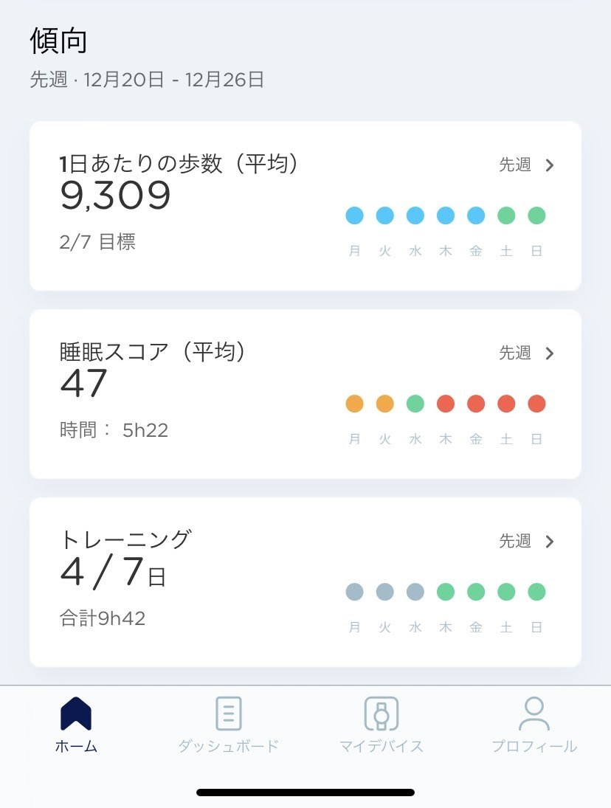

単日の HRV 値は様々な要因で変動しますが、週単位のトレンドはより信頼性の高い「生活習慣の健全さ」の指標です。kmind の週間グラフで HRV が下降トレンドを示している場合、睡眠不足・過労・栄養不足・慢性ストレスのいずれかが進行している可能性があります。このトレンドに早期に気づいて行動を変えることで、バーンアウト（燃え尽き症候群）を予防できます。

#### 📋 やり方

- 毎週日曜日にkmindの「週間HRVトレンド」を確認する時間を設ける
- 先週と比較してHRVが上昇・維持・低下のどれかを判断
- 下降トレンドの場合、来週のスケジュールに「回復日」を意図的に入れる
- 月次のトレンドも合わせて確認し、季節・プロジェクト単位の傾向をつかむ

#### 💡 ポイント

> HRV の週間トレンドは「身体が経営者に見せるKPI」です。売上だけでなく「従業員（身体）の健康状態」を定期的にレビューして戦略を修正するように、自分の身体もデータで管理しましょう。

### No.031 🍽️ 食後の心拍数変化でストレス食いを発見する

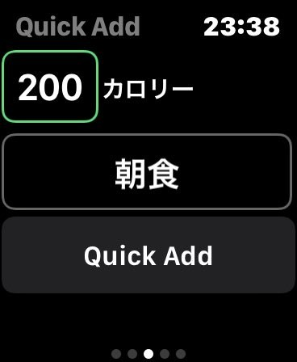

「お腹が空いているから食べる」のではなく「ストレスや退屈から食べる」場合、食前の心拍数が通常より高い傾向があります。Apple Watch で食事前の心拍数を確認し、「今の食欲はストレスから来ているのか、本当の空腹からなのか」を観察する習慣が、意識的な食行動を促します。kmind の水分記録と合わせて、「水を飲んで5分後に食欲が残っているか」を試す実践も効果的です。

#### 📋 やり方

- 食事をしたいという衝動を感じたら、Apple Watch で心拍数を確認
- 安静時より10以上高ければ、ストレス由来の可能性を疑う
- 水を200ml飲んで5分待ち、それでも食欲があれば本物の空腹と判断
- 食欲の「種類」を観察するだけで（食べるかどうかに関わらず）マインドフルな食行動が始まる

#### 💡 ポイント

> 「ストレス食い」は意志の弱さではなく、コルチゾール（ストレスホルモン）が脳の食欲中枢を刺激する生理的反応です。この仕組みを知ったうえで、データを使って客観的に観察することが最も効果的な対処法です。

### No.032 🌊 呼吸ペーシングでHRVを能動的に高める

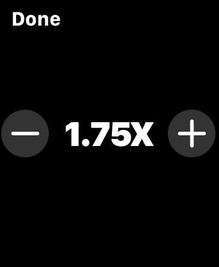

呼吸ペーシング（Resonance Breathing）は、毎分約6回（1回の呼吸を約10秒）の超低速呼吸を意識的に行うことで、HRV を短時間で最大化するテクニックです。この呼吸パターンは心臓・呼吸・血圧調節の間にある自然な共鳴現象（バロフレックス感受性）を最大化します。Apple Watch のブリーズは4秒吸い・4秒吐きで設定できますが、より効果的なのは5秒吸い・5秒吐きのカスタム設定です。

#### 📋 やり方

- Apple Watch のブリーズアプリで呼吸レートを設定（毎分6回=10秒/回）
- または iPhone の「呼吸」アプリで5秒吸い・5秒吐きのカスタム設定を行う
- 10分間の呼吸ペーシングを実施（最低5分で効果発現）
- セッション前後のHRV値をkmindで比較する

#### 💡 ポイント

> 呼吸ペーシングは練習が必要ですが、2週間毎日行うと HRV が平均10〜20%向上するというデータがあります。HRV バイオフィードバックとも呼ばれ、心臓病リハビリや PTSD 治療にも使用されている医学的に確立したテクニックです。

### No.033 😤 怒りを感じたら6秒ブリーズで鎮める

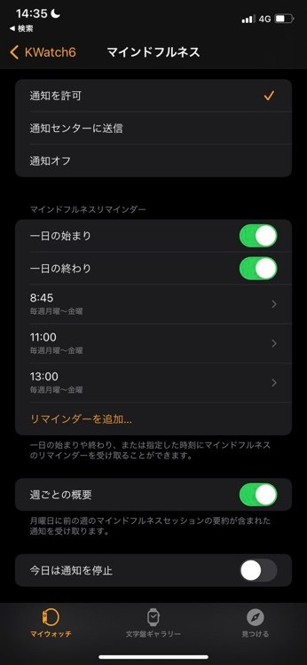

感情が爆発するまでの間には「6秒のウィンドウ」があります。怒りの感情が発生してから行動に出るまでの6秒間に割り込む介入が、感情的な失言・判断ミスを防ぎます。Apple Watch でブリーズを起動する必要もなく、「6秒間ゆっくり吐く」というシンプルな呼吸だけで迷走神経を活性化し、扁桃体の過活性を抑制できます。kmind の HRV データで、感情的な出来事の後に値が下がっているパターンを観察しましょう。

#### 📋 やり方

- 怒りや強いフラストレーションを感じた瞬間、6秒間かけてゆっくり息を吐く
- 吐き切ったら自然に吸い、また6秒かけて吐く（3〜5回繰り返す）
- 可能であれば Apple Watch のブリーズを起動して1〜2分続ける
- 落ち着いた後で「何がトリガーだったか」をkmindのメモに記録する

#### 💡 ポイント

> 感情の管理は「感情を押さえ込む」ことではなく、「感情と行動の間にスペースを作る」ことです。6秒の呼吸は、この「スペース」を作る最も実践的な方法のひとつです。

### No.034 ☀️ 午後2時のアフタヌーンブリーズで集中力を回復する

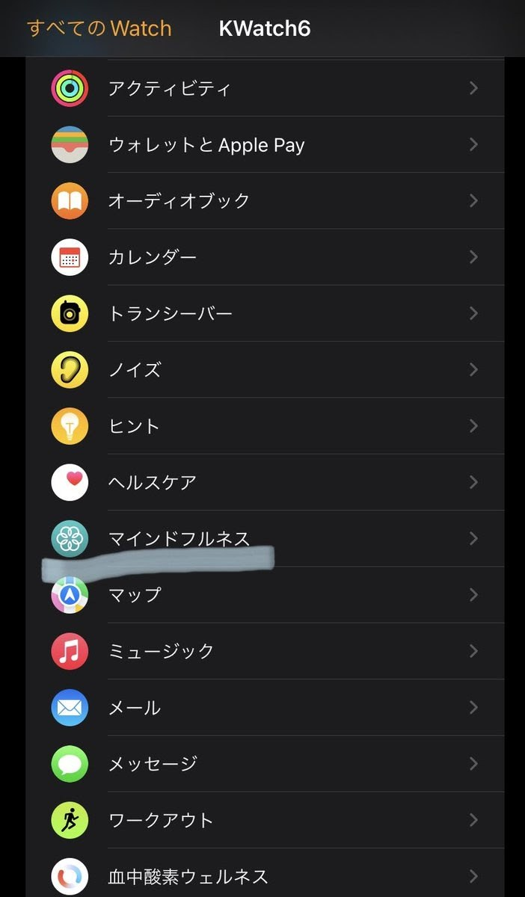

人間の覚醒リズム（サーカディアンリズム）には、午後2〜3時に自然な眠気と集中力の低下が訪れます。これは「ポストランチディップ」と呼ばれ、食事の量に関わらず発生します。このタイミングに2〜3分のブリーズセッションを行うことで、副交感神経を一時的に優位にしてリセットし、その後の集中力を回復させることができます。コーヒーに頼るより持続時間が長く、カフェインの睡眠への悪影響もありません。

#### 📋 やり方

- Apple Watch に「午後2時のブリーズリマインダー」を設定する
- 通知を受けたら、できれば席を立って2〜3分のブリーズを行う
- 目を閉じることができない場合は、呼吸だけに意識を向けながら目を開けたまま実施
- ブリーズ後に水を一杯飲んで、午後の後半戦に向けて気持ちを切り替える

#### 💡 ポイント

> 午後のブリーズを「弱さのサイン」として隠れて実践する必要はありません。「2時になったらブリーズする」というルーティンを同僚に話すことで、職場全体のマインドフルネス文化が広がることもあります。

### No.035 💓 心拍ゾーンを理解してストレス反応を正確に評価する

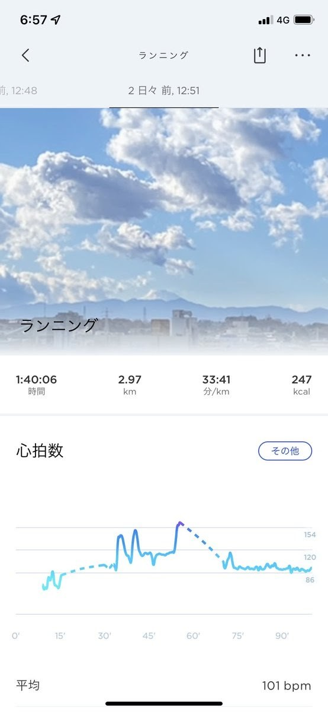

Apple Watch は5つの心拍ゾーン（安静・軽強度・中強度・高強度・最大）を定義しています。ストレス時に心拍数がゾーン2（軽強度）に入ることは珍しくなく、このとき適切なマインドフルネス介入で ゾーン1（安静）に戻す能力が「ストレス回復力」です。kmind の HRV と Apple Watch の心拍ゾーンを組み合わせることで、「自分のストレス反応パターン」を詳細に把握できます。

#### 📋 やり方

- Apple Watch のワークアウトアプリで心拍ゾーンの設定値を確認・調整
- ストレスを感じた時に Apple Watch でハートレートを確認してゾーンを特定
- ゾーン2以上になっているときにブリーズを1〜2分行ってゾーン1に戻す
- kmind でこの「ゾーン2→ブリーズ→ゾーン1」のパターンをメモで記録

#### 💡 ポイント

> 心拍ゾーンは運動中だけのものではありません。日常生活でのストレス反応も心拍ゾーンとして現れます。「今ゾーン2に入った」という客観的な認識が、感情に飲み込まれる前の「気づき」を提供してくれます。

### No.036 🛌 HRVが低い日は回復日として予定を調整する

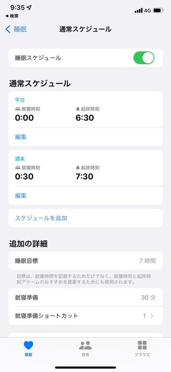

HRV が個人ベースラインを大きく下回る日は、自律神経が十分にリカバリーできていないサインです。このような日に無理を重ねると、ストレスの負債が蓄積し、バーンアウトや体調不良のリスクが高まります。kmind で「今日のHRVが低い」と確認したら、意図的に今日の予定を見直して「回復優先の1日」に組み換える習慣が、長期的な健康と高いパフォーマンスを両立させます。

#### 📋 やり方

- 朝の HRV がベースラインより15%以上低い場合「回復デー」を宣言する
- 今日の予定リストを見直し、先送りできるタスクを翌日に移す
- 昼休みに10〜15分の仮眠（パワーナップ）を取る
- 夜はブリーズ5分＋就寝時刻を通常より30分早める

#### 💡 ポイント

> 「休む」という選択は弱さではなく、最高のパフォーマンスを維持するための戦略的投資です。HRV という客観的なデータが、「今日は休んでいい」という許可を出してくれます。

### No.037 🔍 慢性ストレスのサインを心拍変動トレンドで早期発見する

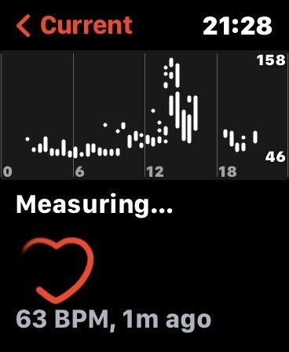

慢性ストレスは、HRV が数週間にわたって徐々に低下するパターンとして現れます。1日の値では気づけないこのトレンドを、kmind の月次グラフで視覚的に確認できます。「先月より今月の平均HRVが10%低い」という事実は、「何か生活習慣で変えるべきことがある」という早期警告です。早期に対処することで、バーンアウトを未然に防げます。

#### 📋 やり方

- 月に一度、kmind の「月次HRVトレンド」グラフを確認する
- 3ヶ月前との平均値を比較してトレンドが上昇・横ばい・下降かを判断
- 下降している場合、何が変化したか（仕事量・睡眠・運動・人間関係）を振り返る
- 改善策を一つだけ決めて翌月のHRVトレンドで効果を確認する

#### 💡 ポイント

> 人間は慢性的なストレスに「慣れて」しまうため、自分では気づきにくいのです。データという客観的な鏡が、「最近調子がいまいち」という漠然とした感覚の正体を明らかにします。

### No.038 🔬 瞑想前後のHRV比較で心身への効果を数値で確認する

マインドフルネスの効果を「気持ちよかった」という主観だけでなく、データで確認することで、継続するモチベーションが格段に高まります。10分間のブリーズセッション前後の HRV を計測することで、「マインドフルネスが実際に自律神経を変えている」という具体的なエビデンスを体験できます。この「自分実験」の習慣が、マインドフルネスへの深い理解を生みます。

#### 📋 やり方

- ブリーズを開始する前に、kmind でHRV値を確認してメモする
- 10〜15分のブリーズセッションを実施する
- セッション終了直後、再びkmindでHRV値を確認する
- 前後の差分（多くの場合5〜15ms向上）を記録して蓄積していく

#### 💡 ポイント

> 「瞑想が科学的に効果がある」という情報より、「自分の体でHRVが上がった」という体験の方が、習慣継続に100倍強力に働きます。あなた自身のデータが最良の証拠です。

### No.039 🏢 職場での1分間マインドフルポーズを習慣化する

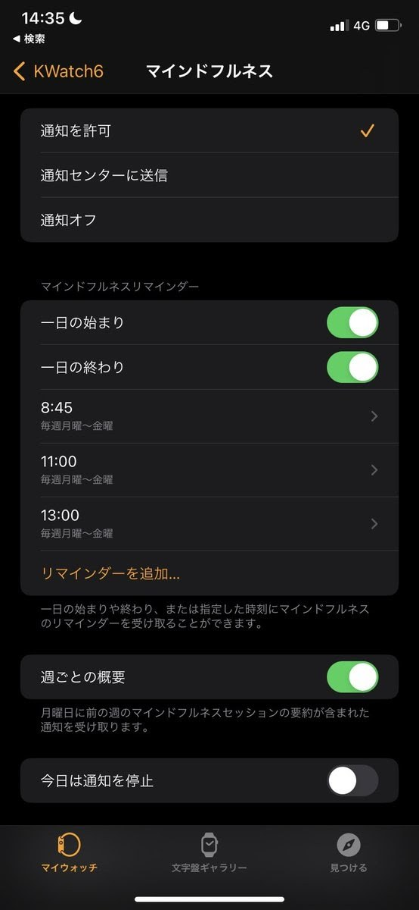

「マインドフルポーズ」とは、1分間だけ作業を止めて、今この瞬間の感覚（椅子の感触・足が床に触れる感覚・呼吸の動き）に意識を向けるシンプルな実践です。デスクで目立たず行え、Apple Watch でタイマーを計るだけで完結します。1分間のポーズで副交感神経が活性化し、その後の30分の集中力と創造性が向上することが複数の研究で示されています。

#### 📋 やり方

- Apple Watch でタイマーを1分間にセット
- 椅子に座ったまま目を閉じる（無理なら半眼でもOK）
- 足の裏が床に触れている感覚→椅子のクッション→呼吸の順に意識を向ける
- タイマーが鳴ったら目を開けて作業に戻る

#### 💡 ポイント

> 1分間のマインドフルポーズは、10分間の会議の前に行うだけで発言の質と聞く力の両方を高めます。アイデアを出す会議、重要な意思決定の前に実践してみてください。

### No.040 🚶 ランチ後のウォーキングでストレスホルモンをリセットする

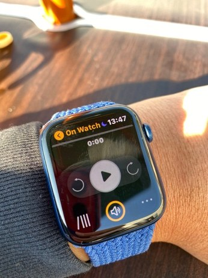

食後のウォーキングは、血糖値スパイクの抑制・消化促進・コルチゾール低減という三重の効果があります。特にランチ後の15〜20分のウォーキング中に行うマインドフルウォーキングは、午後のストレス蓄積を「ゼロにリセット」する最高の機会です。Apple Watch でウォーキングを記録しながら、思考ではなく感覚（歩く音・風・景色）に意識を集中させることで、真の休息になります。

#### 📋 やり方

- ランチ後15〜20分を「ウォーキング瞑想タイム」として確保する
- Apple Watch「ワークアウト」→「屋外ウォーク」を開始
- 歩きながらスマートフォンを一切見ない（ポケットに入れたまま）
- 足の感触・景色・呼吸だけに意識を向けてウォーキングする

#### 💡 ポイント

> ランチ後の眠気（ポストランチディップ）を「20分のウォーキング瞑想」で乗り越えた後は、カフェインなしで午後3〜4時まで高い集中力を維持できます。コーヒーより効果が長続きします。

### No.041 🎯 完璧主義をHRVで客観視し休む勇気を持つ

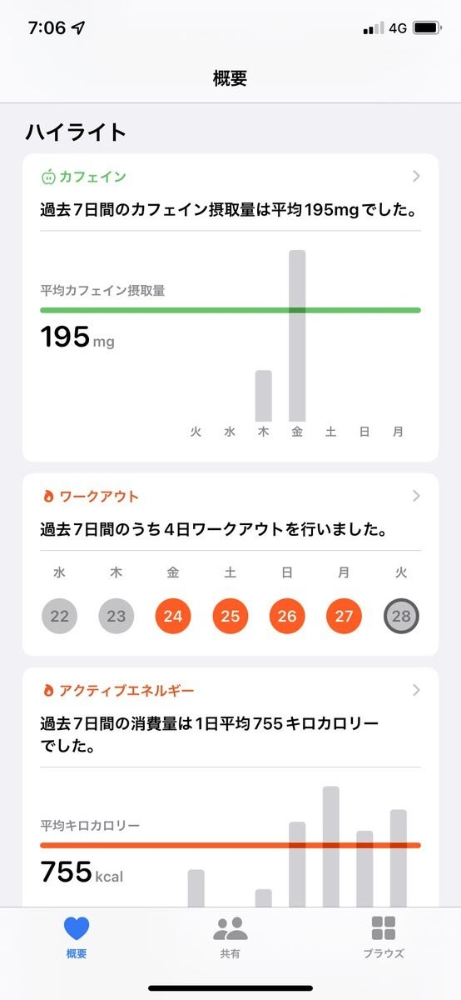

完璧主義者は「疲れていても休んではいけない」という信念を持ちがちです。しかし HRV データは、休まなかった翌日に HRV が著しく低下し、結果的にパフォーマンスが落ちることを客観的に示します。kmind の HRV と実際の生産性（主観評価）を数週間記録して比較することで、「休む=損」という思い込みがデータで崩れ、休むことへの許可が生まれます。

#### 📋 やり方

- 毎日の HRV 値と「今日の生産性：1〜5点」をkmindのメモに記録する
- 2週間後にデータを見返し、HRVが高い日の生産性と低い日を比較する
- 「HRVが低い日は生産性も低い」というパターンを確認する
- このデータを「休む許可証」として使う

#### 💡 ポイント

> 「頑張った=価値がある」という信念をデータで問い直すことは、非常に深いマインドフルネスの実践です。休むことが「怠惰」ではなく「戦略的」であることをデータが教えてくれます。

### No.042 📋 会議前の深呼吸でHRVを上げてパフォーマンスを高める

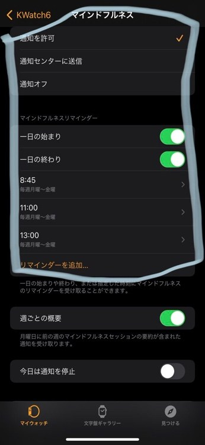

重要な会議やプレゼンの前、多くの人は緊張でHRVが低下しています。会議室に入る2分前に外廊下でブリーズを行うだけで、HRV が上昇し、前頭前野（論理的思考・言語処理・感情制御を司る）の活動が高まります。「自信があるように見える」ではなく、「実際に脳が最高の状態で会議に臨む」ために、Apple Watch のブリーズが使えます。

#### 📋 やり方

- 重要な会議・交渉・プレゼンの2〜3分前にトイレや廊下に移動する
- Apple Watch でブリーズを2分間開始する（誰にも気づかれずに実践可能）
- 深呼吸中に「今日の会議で伝えたい最も重要な1点」を心の中で確認する
- 会議室に入り、落ち着いた状態で着席する

#### 💡 ポイント

> 「緊張している自分」を見てパニックになる代わりに、「緊張=心拍上昇=チャンスのサイン」とリフレームして、ブリーズで交感神経を穏やかに整えることが、最もシンプルなパフォーマンス戦略です。

### No.043 🧠 ネガティブな感情とHRVの関係をkmindで学ぶ

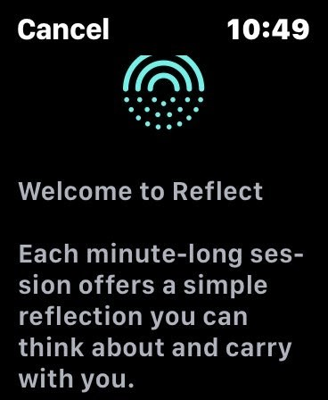

怒り・不安・悲しみなどのネガティブな感情は、HRV を顕著に低下させます。逆に、感謝・思いやり・喜びなどのポジティブな感情は、HRV を上昇させます。kmind で「感情の記録」と「HRV 値」を照合することで、特定の感情パターンと自律神経の反応の関係を「自分のデータ」で理解できます。この理解が、感情の自己調整能力（感情知性）を高めます。

#### 📋 やり方

- kmind のメモ機能で毎日の感情状態を一言記録（例：「怒り」「不安」「平穏」「喜び」）
- その日のHRV値と照合して相関パターンを観察する
- 「不安を感じた日はHRVが低い」というパターンを自分のデータで確認する
- 感情が高まった直後にブリーズを行い、HRVの変化を確認する

#### 💡 ポイント

> 感情は「感じないようにする」より「観察する」ことで自然に穏やかになります。kmind のデータが「感情を観察するツール」として機能することで、感情との健全な距離感が生まれます。

### No.044 🌇 仕事終わりのブリーズルーティンでオンオフを切り替える

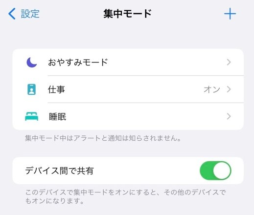

在宅勤務や長時間労働で「仕事が終わったのに気持ちが切り替えられない」という人が増えています。仕事終わりに3〜5分のブリーズセッションを行う「シャットダウン・リチュアル」を確立することで、脳が「仕事モード終了」のシグナルを受け取り、プライベートの時間を本当の意味で楽しめるようになります。このルーティンが、翌日の仕事へのモチベーションを高める効果もあります。

#### 📋 やり方

- 仕事の最後のタスクを完了した直後にApple Watch でブリーズを起動
- 3〜5分間のセッションを行いながら「今日の仕事はすべて完了した」と心の中で確認
- セッション終了と同時に仕事用デバイスのスクリーンをオフにする
- kmind でその日のマインドフル分数とHRVの合計を確認して1日を締める

#### 💡 ポイント

> 「シャットダウン・リチュアル」は、脳の「未完了タスク処理システム（ツァイガルニク効果）」を意図的に終了させる儀式です。このルーティンがないと、就寝中も脳が仕事のことを考え続け、睡眠の質が低下します。

### No.045 ⏰ 長時間作業後のリセットブリーズ5分間

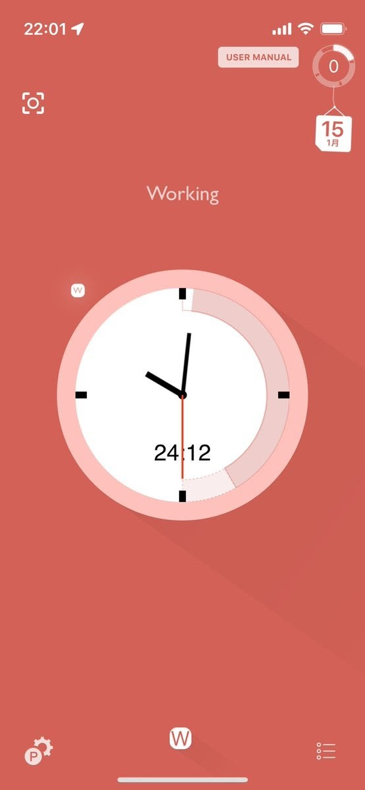

3〜4時間以上の集中作業後、脳はグルコース（エネルギー）の枯渇と神経疲労の状態にあります。このタイミングで5分間のブリーズを行うことは、コーヒーより効果的なエネルギー補充です。深い呼吸が血中の酸素濃度を上げ、前頭前野への血流を増加させ、認知機能を部分的にリセットします。Apple Watch のブリーズで「5分間だけ仕事を止める」ルールが生産性を最大化します。

#### 📋 やり方

- Apple Watch のタイマーを3時間に設定して集中作業を開始
- タイマーが鳴ったら即座に作業を止め、ブリーズを5分間開始
- セッション中は「次のタスク」を考えることを完全に禁止する
- ブリーズ終了後に5分間の軽い運動（スクワット・ストレッチ）を加える

#### 💡 ポイント

> 「5分間作業を止める」ことへの抵抗感自体が、すでに疲弊のサインです。その抵抗感をデータ（HRV・心拍数）で客観的に見ることで、「止めることが最善の戦略」という確信が生まれます。

### No.046 🫁 4-7-8呼吸法でHRVを即時向上させる

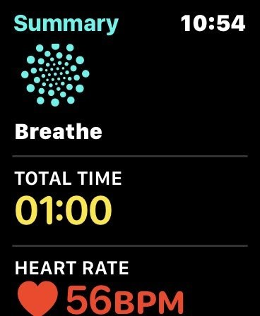

4-7-8呼吸法（4秒吸う・7秒止める・8秒吐く）は、Dr. Andrew Weilが「自然の精神安定剤」と呼ぶ呼吸テクニックです。特に長い呼気（8秒）が強力な迷走神経刺激をもたらし、HRV を急速に上昇させます。ストレスの急性対処として最も即効性が高く、kmind でセッション前後のHRV を比較すると、明確な上昇が確認できます。Apple Watch のブリーズより個人的にカスタマイズしたいときに最適です。

#### 📋 やり方

- 鼻から4秒かけて息を吸い込む（お腹を膨らませる腹式呼吸）
- 息を7秒間保持する（無理のない範囲で）
- 口を軽く開けて8秒かけてゆっくり吐ききる
- これを4回繰り返す（最初は1セットから）

#### 💡 ポイント

> 7秒の保持が難しい場合は「2-3.5-4」の比率で短縮してOKです。大切なのは「吸気:保持:呼気=1:1.75:2」の比率を守ることです。比率を維持していれば効果は同様です。

### No.047 📊 週間HRVグラフで働き過ぎの週を可視化する

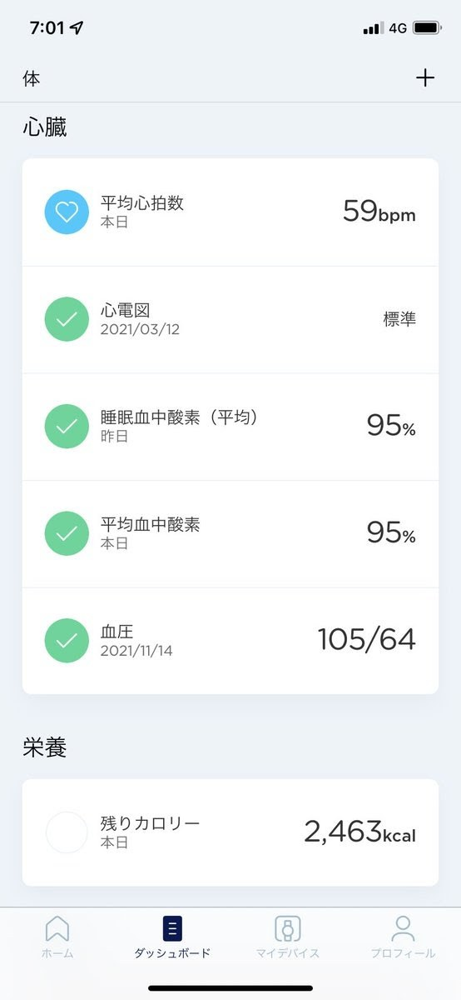

「今週は頑張りすぎた」という感覚は主観的ですが、kmind の週間 HRV グラフは客観的な証拠を示します。月曜日に高かったHRVが金曜日には15〜20%低下しているパターンが続く場合、週単位での作業量と回復が釣り合っていないサインです。このデータを上司や自分自身に示すことで、「頑張りすぎ」を感情論ではなくデータで議論できます。

#### 📋 やり方

- 毎週金曜日の夜に kmind の「週間HRVグラフ」を確認する
- 月曜日と金曜日のHRVの差が10%以上ある場合は「消耗週」と記録
- 消耗週が2週連続した場合は翌週の作業量を意識的に10〜20%削減する
- 月に一度、消耗週と回復週のパターンを振り返って調整する

#### 💡 ポイント

> 生産性の向上は「より多く働く」ではなく「消耗と回復を適切にサイクルさせる」ことで実現します。HRV グラフはその「回復サイクル」を管理するための最も信頼性の高いツールです。

### No.048 🥗 ストレスレベル高の日に食べるものを意識的に変える

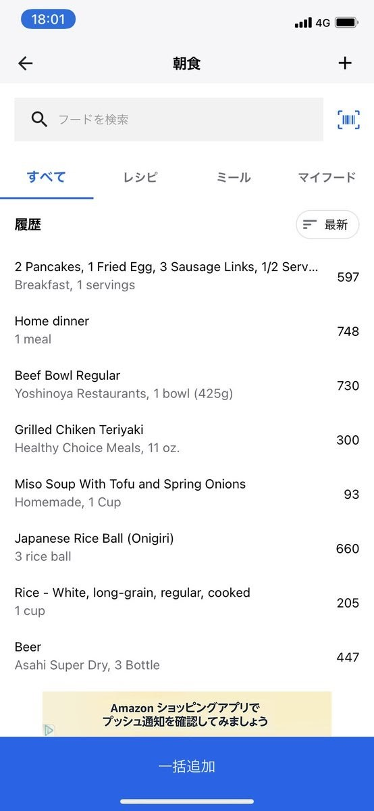

HRVが低くストレスレベルが高い日は、コルチゾールの影響で甘いもの・脂肪分の高いものへの欲求が高まります。このような日に「マインドフルに食事を選ぶ」習慣が、長期的な体重管理とメンタルヘルスを同時に守ります。kmind で「ストレスレベル高」と判定された日の食事を意識的に「ストレス対策食（マグネシウム・オメガ3・発酵食品）」に切り替えるプランを準備しておきましょう。

#### 📋 やり方

- 朝のHRVが低く（ベースライン-15%以下）、ストレス赤判定の日を特定
- その日の食事に「抗ストレス栄養素」を意識的に取り入れる
  - マグネシウム（ナッツ類・緑葉野菜・豆類）
  - オメガ3（青魚・亜麻仁油）
  - トリプトファン（バナナ・卵・乳製品）
- 甘い間食への衝動を感じたら「水→5分待つ→それでも欲しければ小量」のルールを適用

#### 💡 ポイント

> ストレスが高い日に良い食事を選ぶことは、最も難しいマインドフルネスの実践のひとつです。だからこそ「ストレス赤判定の日専用の食事プラン」を事前に決めておくことが、意志力に頼らない行動設計の要です。

### No.049 📵 デジタルデトックス時間をApple Watchで計測する

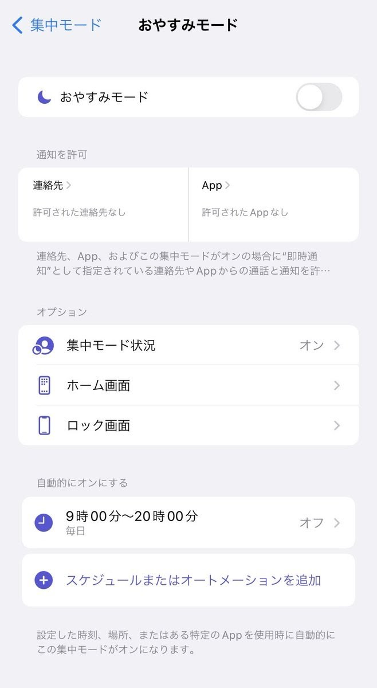

SNSやニュースの過剰消費は、HRVを低下させ、不安・比較・情報過多によるストレスを蓄積させます。Apple Watch の「スクリーンタイム」機能を使って、iPhoneの使用時間を確認し、意図的なデジタルデトックス時間（スマートフォンを触らない時間）を設けることで、自律神経が回復します。逆説的に、Apple Watch はウォッチで完結する機能（ブリーズ・心拍確認・タイマー）のみに絞って使うことで、スマートフォン依存を減らしながら健康管理を継続できます。

#### 📋 やり方

- iPhone の「スクリーンタイム」で1日のSNS使用時間を確認
- 毎日「デジタルデトックスタイム」（1〜2時間）をカレンダーに入れる
- このデトックスタイム中は iPhone をベッドの反対側に置き、Apple Watch のみ着用
- Apple Watch でブリーズや読書・散歩などのオフライン活動をトラッキングする

#### 💡 ポイント

> デジタルデトックスの効果を kmind の HRV で定量化しましょう。「週に2日のデトックスデーの翌朝は HRV が高い」という自分のデータが、継続の最強の動機になります。

### No.050 🎯 フォーカスモードでマインドフルな集中環境を整える

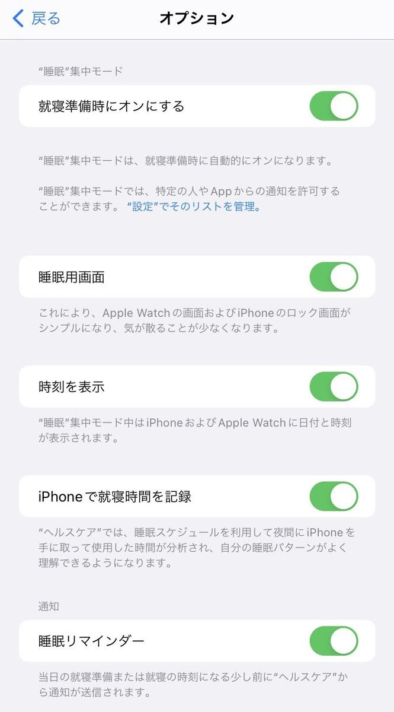

iPhone と Apple Watch の「フォーカス」機能は、特定の通知のみを許可するモードです。「マインドフルネスフォーカス」をカスタムで作成し、ブリーズのリマインダーと緊急連絡のみを許可することで、集中とマインドフルネスを両立させる環境が整います。フォーカスモード中は Apple Watch の文字盤もシンプルな「瞑想モード」に切り替えることで、デジタルノイズから完全に解放された時間が生まれます。

#### 📋 やり方

- iPhone「設定」→「フォーカス」→ 新しいフォーカスを「マインドフルネス」として作成
- 許可する通知を「ブリーズリマインダー」と「緊急連絡のみ」に限定
- Apple Watch の文字盤を「シンプルアナログ」に設定してコンプリケーションを最小化
- 毎朝30分・昼休み・就寝前にこのフォーカスモードを有効にする

#### 💡 ポイント

> フォーカスモードは「通知から守ってくれる壁」ではなく「意図的な環境を作るツール」です。「マインドフルネス」という名前でフォーカスモードを作ることで、毎回設定するたびに「今から集中する」という意図の確認になります。

---

## III. 睡眠とリカバリーの最適化

### No.051 🌙 就寝前30分のブリーズセッションで眠りを深める

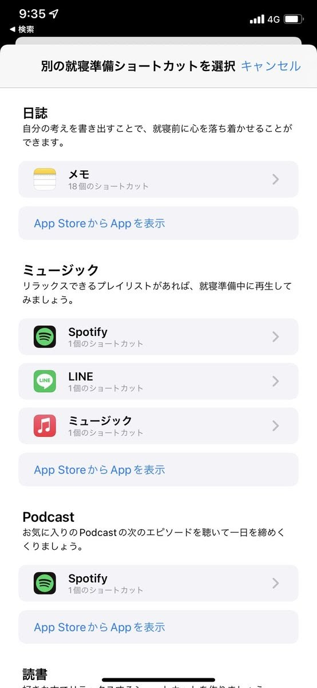

睡眠の質は「入眠前の自律神経の状態」によって大きく左右されます。就寝30分前に5〜10分のブリーズセッションを行うことで、副交感神経を優位にし、心拍数が自然に低下して入眠しやすい生理的状態が整います。Apple Watch のブリーズを就寝前のルーティンに組み込むことで、脳が「ブリーズ=眠る準備」というシグナルを学習し、入眠がスムーズになります。

#### 📋 やり方

- 就寝30分前にスマートフォンを置き、Apple Watch でブリーズを5〜10分開始
- 照明を落とし、横になった状態で行うとより効果的
- セッション中に「今日1日を振り返って感謝する」と静かに心の中で行う
- ブリーズ終了後そのまま目を閉じて眠りにつく

#### 💡 ポイント

> 「就寝前のブリーズ」を始めてから入眠時間が平均10〜15分短縮されたという報告が多くあります。特に「仕事のことが頭から離れない」タイプの人に最も効果的です。

### No.052 ⏰ Apple Watchで睡眠スケジュールを設定する

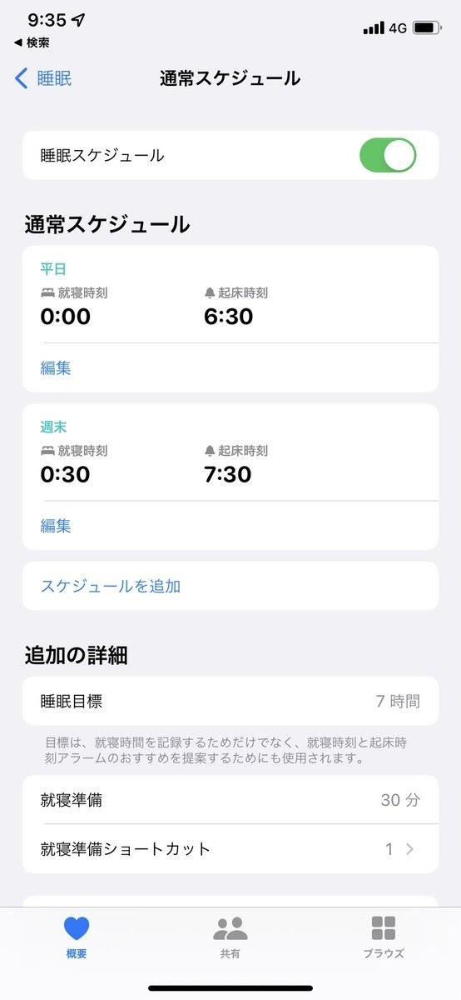

Apple Watch の「睡眠」アプリで就寝・起床時刻を設定することで、毎日同じリズムで眠るリマインダーが届きます。体内時計（サーカディアンリズム）は一定のリズムを好み、入眠・起床時刻が一定なほど深い睡眠の比率が高まります。kmind のデータで「睡眠スケジュールを守った夜」と「守らなかった夜」のスコアを比較することで、規則性の効果を実感できます。

#### 📋 やり方

- Apple Watch「睡眠」アプリ→「スケジュール」で就寝・起床時刻を設定
- 就寝30分前にwatchがRemindしてくれる「おやすみモード」も設定
- 週末も平日と1時間以内の差で就寝・起床を維持する
- kmindで「睡眠スケジュール守守/不守」を記録して睡眠スコアと照合する

#### 💡 ポイント

> 入眠時刻の安定性（毎日同じ時刻に寝る）は、睡眠の「量」よりも睡眠の「質」に大きく影響することが最新の研究で明らかになっています。30分のズレでも翌日の認知機能に影響します。

### No.053 📊 睡眠スコアをkmindで毎朝数値化して追跡する

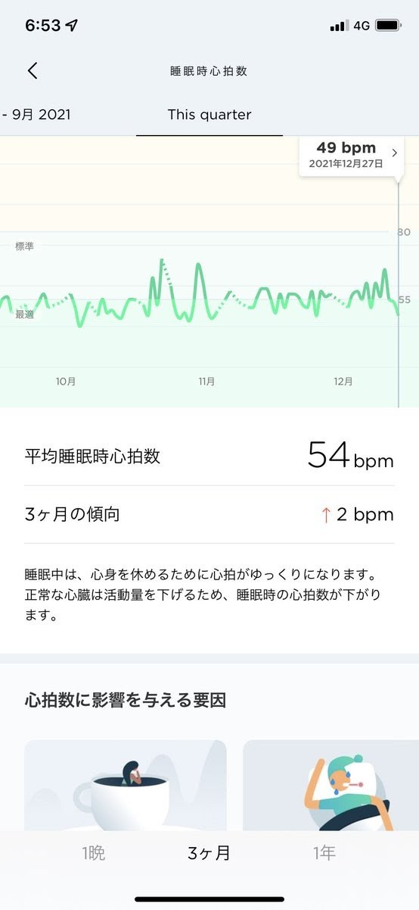

kmind の睡眠スコア（0〜100点）は、総睡眠時間・深い睡眠割合・REM 睡眠割合・入眠一貫性・覚醒回数を加重平均して算出します。このスコアを毎朝確認して週次・月次トレンドを追うことで、「何が睡眠を改善・悪化させるか」という自分専用のインサイトが蓄積されます。スコアの変化を「失敗/成功」ではなく「データポイント」として観察するマインドセットが重要です。

#### 📋 やり方

- 毎朝起床後にkmindで睡眠スコアを確認してスクリーンショットを撮る（週次比較用）
- スコアが70以上なら「良質な睡眠」、55〜69なら「普通」、54以下なら「要改善」と分類
- スコアが低かった日の前夜の行動（飲酒・就寝時刻・食事・運動）を記録
- 月次でパターンを分析して1つの改善策を実施する

#### 💡 ポイント

> 睡眠スコアは「今日どれだけよく眠れたか」を知るためのツールです。スコアが低い日に「だから今日はダメだ」とネガティブになるのではなく、「なぜ低かったか」を好奇心を持って観察することが、真のマインドフルな睡眠管理です。

### No.054 ☕ 就寝2時間前のカフェインとアルコールを断つ

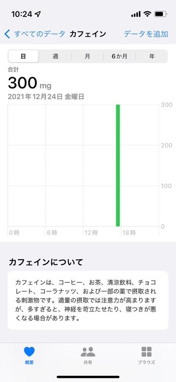

カフェインの半減期は5〜7時間です。午後3時に飲んだコーヒーの半分は、午後8〜10時にまだ体内に残っています。アルコールは入眠を早める一方、REM 睡眠を著しく阻害し、睡眠の後半（深夜2〜4時）に睡眠が浅くなる「リバウンド覚醒」を引き起こします。kmind の睡眠スコアで「カフェイン・アルコールを控えた夜」と「摂取した夜」を比較することで、その影響を自分のデータで確認できます。

#### 📋 やり方

- カフェイン（コーヒー・緑茶・エナジードリンク）は就寝6〜8時間前を最終にする
- アルコールは就寝2時間以上前まで（理想は3時間）
- Apple Watch の睡眠記録で深い睡眠の時間を確認して「飲んだ夜/控えた夜」と照合
- kmind でこの記録を月単位で振り返り、睡眠スコアの相関を確認

#### 💡 ポイント

> 「夜のワインが眠れる気がする」という感覚は、アルコールが入眠を5〜20分早める効果からきています。しかし深い睡眠が減るため、翌朝の疲れが取れていない感覚に繋がります。kmind のデータがこの錯覚を解いてくれます。

### No.055 🛏️ 就寝前の10分間ボディスキャン瞑想で深睡眠を促す

就寝前のボディスキャン瞑想は、身体の各部位の緊張を意識的に解放することで、全身の筋肉をリラクゼーション状態に導きます。この実践により、入眠後すぐに深い睡眠（徐波睡眠）に入りやすくなり、成長ホルモンの分泌が促進されます。Apple Watch のブリーズと組み合わせることで、呼吸の落ち着きとともに全身がリラックスする「睡眠スイッチ」を作れます。

#### 📋 やり方

- 就寝時、照明を落とした寝室でベッドに横たわり目を閉じる
- Apple Watch でブリーズを3分間行い、呼吸を整える
- 足先から順番に「○○がリラックスしている」と心の中で唱えながら上へ移動
- 頭のてっぺんまで到達したら、そのまま眠りにつく

#### 💡 ポイント

> 多くの場合、ボディスキャン瞑想の途中で眠りに落ちます。「最後まで完成させなければ」というプレッシャーは不要です。どこかで眠れた場合、それがボディスキャンの「成功」です。

### No.056 🎓 睡眠コーチング機能でパーソナライズされたアドバイスを受ける

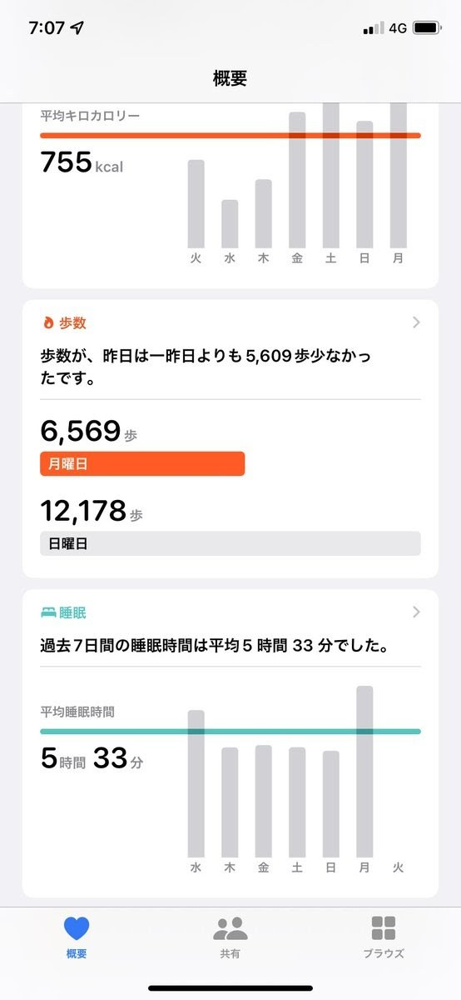

kmind の AI 睡眠コーチングは、あなたの睡眠データ（HRV・睡眠スコア・睡眠スケジュール・深い睡眠割合）を週次で分析し、パーソナライズされたアドバイスを提供します。「今週は深い睡眠が少ないので就寝前の運動強度を下げてみてください」「入眠時刻が30分遅れています。20時以降のカフェインを控えてみましょう」など、一般的なアドバイスではなく、あなたのデータに基づいた具体的な提案が特徴です。

#### 📋 やり方

- kmind の「週次レポート」を毎週月曜日の朝に確認する
- AIコーチングコメントを読み、最も実践しやすい1つのアドバイスを選ぶ
- そのアドバイスを翌週7日間試してみる
- 次の週次レポートで効果（睡眠スコアの変化）を確認する

#### 💡 ポイント

> AIコーチングを最大限活用するには、データの入力（毎日の kmind 確認）と、提案を実際に試す意思が必要です。「アドバイスを読む」と「試してみる」の差が、睡眠改善の速度を決めます。

### No.057 🌙 レム睡眠と深い睡眠の割合を週単位で最適化する

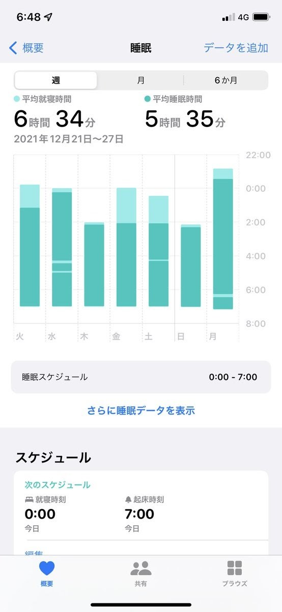

理想的な睡眠構造は、「深い睡眠（徐波睡眠）15〜20%・REM 睡眠20〜25%・浅い睡眠55〜60%」の割合とされています。Apple Watch と kmind でこれらの割合を追跡することで、「何を変えれば深い睡眠が増えるか」というパーソナルな睡眠最適化が可能です。深い睡眠は身体の修復と免疫機能強化に、REM 睡眠は記憶の固定と感情処理に重要です。

#### 📋 やり方

- kmind で1週間分の睡眠段階データを確認
- 深い睡眠が60分未満の夜が続く場合：就寝前の運動・カフェイン・アルコールを見直す
- REM睡眠が90分未満の夜が続く場合：睡眠の後半（4〜7時）の光・音・温度を改善する
- 1つの要因を変えて2週間後に睡眠段階への影響を確認する

#### 💡 ポイント

> 深い睡眠は睡眠の前半（入眠から3〜4時間）に多く、REM 睡眠は睡眠の後半（起床2〜3時間前）に集中します。早起きすると REM 睡眠を犠牲にしてしまいます。「必要な睡眠時間を確保した上で早起きする」ことが理想です。

### No.058 🌙 Apple Watchのおやすみモードでデジタルノイズを断つ

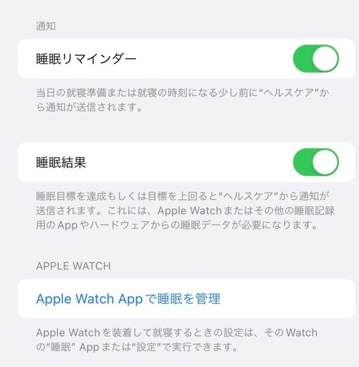

就寝中の通知・メッセージ・アラートは、睡眠の浅い段階での覚醒を引き起こし、深い睡眠の断片化を招きます。Apple Watch の「おやすみモード」（または「集中モード：睡眠」）を設定することで、就寝時刻から起床時刻まで通知が完全にオフになります。緊急連絡のみを例外として設定できるため、安心してすべての通知をオフにできます。

#### 📋 やり方

- Apple Watch「設定」→「集中モード」→「睡眠」を就寝時刻に合わせて設定
- 「緊急連絡」のみ例外として設定（特定の連絡先からのみ通知を許可）
- Apple Watch の画面輝度を「夜間自動暗くする」に設定
- kmind の睡眠記録で「おやすみモード使用前後」の覚醒回数を比較する

#### 💡 ポイント

> 「夜中の通知で起こされた」という経験がある人は特に、おやすみモードの設定が急務です。一度も夜間通知で起きない週を過ごした後の睡眠スコアの改善は、データで明確に現れます。

### No.059 📅 週末の寝だめをやめて社会的時差ぼけを防ぐ

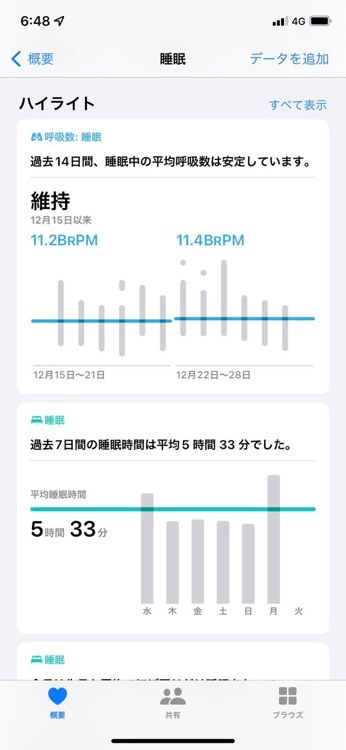

平日と週末で2時間以上の睡眠時刻のズレがある状態を「社会的時差ぼけ（Social Jet Lag）」と呼びます。これは体内時計を混乱させ、平日の朝の眠気・集中力低下・HRV 低下の主要因のひとつです。kmind のデータで「月曜朝のHRV」を確認すると、週末の過ごし方（就寝時刻）との相関が明確に現れます。週末も平日と±1時間以内で就寝・起床することが、週全体のパフォーマンスを最適化します。

#### 📋 やり方

- kmind で「曜日別の平均HRV」を確認し、月曜日が特に低くないかチェック
- 週末の就寝時刻を平日より最大1時間遅い範囲に留める
- 週末に遅く起きたい場合は「寝る時刻を同じに保ちつつ起きる時刻のみ遅くする」
- これを4週間続けて月曜日のHRVトレンドを観察する

#### 💡 ポイント

> 「週末くらい好きなだけ寝たい」という気持ちはよくわかります。ただし、金曜深夜2時就寝→日曜深夜0時就寝→月曜朝6時起床という週末パターンは、月曜に2時間の「時差ぼけ」を発生させます。楽しむためにも、規律ある睡眠が必要です。

### No.060 🛁 就寝前の入浴とHRV向上の関係を活用する

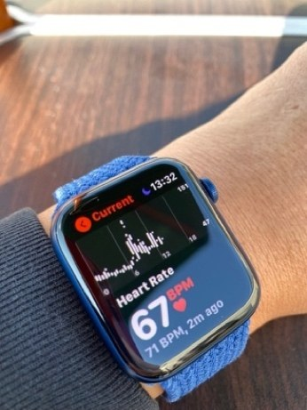

38〜40℃のぬるめのお湯への入浴（10〜15分）は、血管拡張を促して深部体温を一時的に上昇させます。入浴後、深部体温が急速に低下する過程（体温の「降下」）が、脳の眠気スイッチをオンにし、深い睡眠への移行を促進します。さらにこの入浴後の副交感神経優位の状態が HRV を上昇させ、翌朝のコンディションの向上に繋がります。

#### 📋 やり方

- 就寝1〜1.5時間前に38〜40℃のシャワーまたはお風呂に10〜15分入る
- 入浴中に軽いブリーズ（鼻呼吸のみ）を行い、湯船の温かさに意識を向ける
- 入浴後は照明を落として涼しい環境で過ごし、体温の低下を助ける
- kmindで入浴した夜の睡眠スコアと入浴しなかった夜を比較する

#### 💡 ポイント

> シャワーでも入浴と同様の効果が得られます。「温かいシャワー→冷水30秒」の交互浴は、さらに迷走神経を刺激してHRVを向上させる効果があり、入眠前の最強ルーティンのひとつです。

### No.061 📔 就寝前の3つの良かったこと日記で睡眠の質を上げる

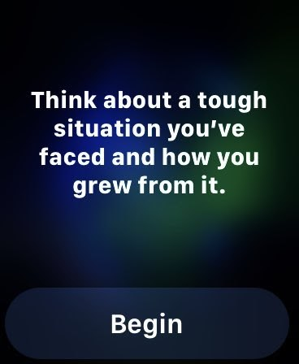

「3 Good Things」（今日起きた良いことを3つ書く）は、ポジティブ心理学の代表的な実践のひとつです。ネガティブな思考反芻（反省会・心配事の整理）は交感神経を刺激して入眠を妨げますが、ポジティブな出来事に意識を向けることで副交感神経が優位になり、深い睡眠を促進します。Apple Watch でブリーズを行いながら、今日の3つの良いことを心の中で振り返る「デジタル版 3 Good Things」が最も手軽な実践です。

#### 📋 やり方

- 就寝前のブリーズセッション中に目を閉じながら今日の良かったことを3つ思い浮かべる
- 「良かったこと」は大きなことでなくてよい（「電車に座れた」「美味しいランチ」でOK）
- 思い浮かんだことをiPhoneのメモアプリに短く記録する（30秒で完了）
- kmindのメモ機能を活用して睡眠スコアと感情状態を連動して記録する

#### 💡 ポイント

> 就寝前の「3 Good Things」を習慣にすると、1ヶ月で幸福感が顕著に向上するという研究があります。同時に kmind の睡眠スコアの改善も期待できます。小さな感謝が、大きな変化をもたらします。

### No.062 📈 夜間心拍数の急上昇を早期察知する

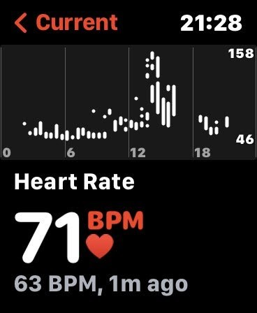

通常、睡眠中の心拍数は安静時心拍数に近い値で安定します。ところが発熱の初期・過度のアルコール摂取・就寝前のハードな運動・睡眠時無呼吸の可能性がある場合、夜間の心拍数が急上昇することがあります。Apple Watch の睡眠心拍データを kmind で確認することで、「昨夜は心拍が急上昇していた」という気づきが、体調管理の早期警告として機能します。

#### 📋 やり方

- kmind の睡眠詳細画面で「夜間心拍数のグラフ」を週次で確認
- 通常より10 bpm以上高い夜が1〜2晩続く場合は体調チェックを行う
- 夜間心拍の急上昇パターンが毎晩続く場合は睡眠時無呼吸を疑う（医師に相談）
- 原因として心当たりのある行動（飲酒・遅い運動・カフェイン過多）を記録

#### 💡 ポイント

> 睡眠時無呼吸（SAS）は日本人の2〜3%に見られ、放置すると高血圧・心疾患のリスクを高めます。Apple Watch の夜間心拍データは、SAS の早期発見の手がかりになることがあります。気になるパターンが続く場合は専門医に相談しましょう。なお watchOS 11 以降には睡眠時無呼吸の兆候を通知する公式機能（Series 9 以降・SE 3・Ultra 2 以降）、watchOS 26 には高血圧の兆候を30日間の計測から検知する「高血圧通知」（Series 9 以降・Ultra 2 以降）が追加されています。

### No.063 🏆 翌日のパフォーマンス予測にHRVと睡眠スコアを使う

起床後に HRV と睡眠スコアの両方を確認することで、「今日どれだけパフォーマンスが発揮できるか」の予測精度が格段に上がります。HRV が高く睡眠スコアも高い日は「フルパフォーマンスデー」、どちらかが低い日は「適度に調整デー」、両方低い日は「回復優先デー」として1日の計画を立てます。この習慣がマインドフルな自己管理の核心です。

#### 📋 やり方

- 起床後、kmind でHRVと睡眠スコアを確認する（30秒）
- HRV高×睡眠スコア高 → 今日は重要な決断・難しい交渉に最適
- HRV普通×睡眠スコア普通 → 通常業務・ルーティンタスクを中心に
- HRV低×睡眠スコア低 → 重要な意思決定は明日に先延ばし、回復を優先

#### 💡 ポイント

> 「疲れているときに重要な決断を避ける」のは、マインドフルな意思決定の基本ルールです。データに基づいてその日の「エネルギーの使い方」を決める習慣が、後悔のない選択を増やします。

### No.064 ⏰ 午後の仮眠15分で夜の睡眠の質も上げる

15〜20分のパワーナップ（仮眠）は、その後2〜3時間の認知機能・反応速度・創造性を向上させます。しかし30分以上の仮眠は「睡眠慣性」（目覚め後のぼんやり感）を引き起こし、夜の睡眠を妨げます。Apple Watch のタイマーを18分（15分眠れる計算で）にセットし、午後1〜3時の間に実践することが最適です。kmind で仮眠した日としなかった日の夜の睡眠スコアを比較しましょう。

#### 📋 やり方

- 昼休みまたは午後の空き時間に、静かな場所（椅子・車内・仮眠室）を確保する
- Apple Watch のタイマーを18分にセット
- 目を閉じてブリーズを1〜2分行い、呼吸を整えてから自然に眠りに落ちる
- タイマーが鳴ったらすぐに起き上がり（長引かせない）、水を飲む

#### 💡 ポイント

> NASA の研究で、26分のパワーナップがパイロットのパフォーマンスを34%向上させたことが報告されています。日本では「昼寝」に対して「怠惰」のイメージがありますが、科学は「パワーナップ=高い自己管理」を示しています。

### No.065 🕙 入眠時刻の安定性がHRVを向上させる理由を知る

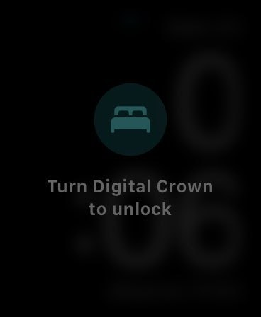

毎日同じ時刻に寝ることは、体内時計（視交叉上核）を安定させ、メラトニン分泌のリズムを強化します。このリズムが安定すると、入眠が容易になり、深い睡眠の量が増え、HRV が向上します。kmind で「入眠時刻のばらつき（標準偏差）」と「HRV の平均値」の相関を観察することで、「規則的な睡眠スケジュールがHRVに与える影響」を自分のデータで確認できます。

#### 📋 やり方

- 4週間、毎日の就寝時刻をkmindにメモして記録する
- Apple Watch の睡眠アプリで「平均就寝時刻」と「ばらつき」を確認
- ばらつきが60分以内に収まるよう、就寝時刻を固定する目標を設定する
- 4週間後にHRV平均値が改善しているか kmind のトレンドで確認

#### 💡 ポイント

> 睡眠スケジュールの安定性は、睡眠「時間」の確保より優先されます。7時間でも毎日バラバラな時刻に寝る人より、6.5時間でも毎日同じ時刻に寝る人の方が HRV が高いケースが多くあります。

### No.066 ☀️ 日中の日光暴露を増やして夜の睡眠を深める

朝の自然光（特に400〜500nmの青色光）は、体内時計のリセットとセロトニン産生を促進します。このセロトニンが夜にメラトニン（睡眠ホルモン）に変換されることで、自然な眠気が生まれます。Apple Watch の「日光下の時間（Time in Daylight）」機能（watchOS 10 以降・Series 6 以降/SE 第2世代以降/Ultra 全機種）で1日の屋外時間を記録し、目標値（1日1〜2時間）を意識的に達成することが、夜の睡眠を科学的に改善します。

#### 📋 やり方

- Apple Watch「ヘルスケア」→「日光暴露」で今日の屋外時間を確認
- 目標：起床後2時間以内に最低15分の屋外活動（朝の散歩・通勤等）
- 昼休みに屋外ランチまたは15分の散歩を習慣化する
- kmindで日光暴露時間と睡眠スコアの相関を1ヶ月間記録して観察する

#### 💡 ポイント

> 屋外の曇りの日でも、室内照明の10〜20倍の明るさがあります。窓越しのガラス越しでは有効な波長が半減するため、実際に外に出ることが重要です。たった15分の朝の屋外活動が、夜の睡眠を劇的に改善することがあります。

### No.067 🆘 起床時HRVが低い場合の緊急回復プロトコル

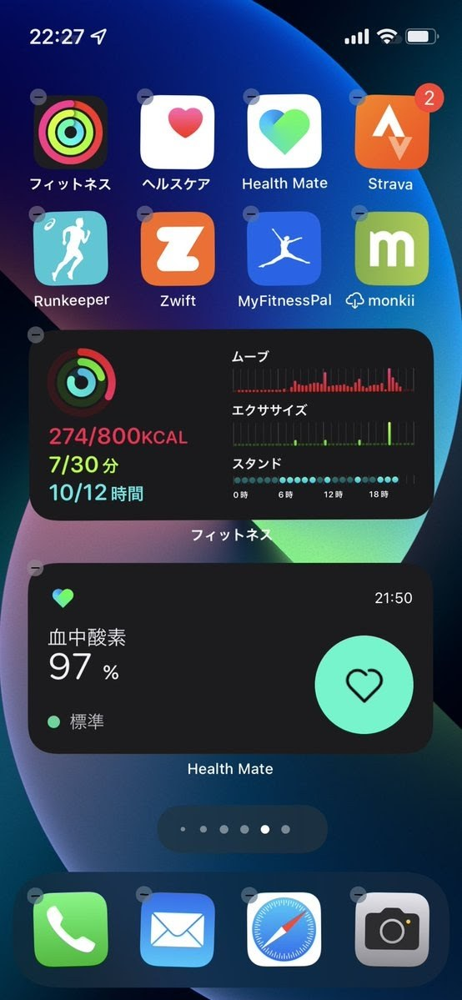

HRV が個人ベースラインより20%以上低い朝は、緊急の回復措置が必要です。この状態で通常のルーティンを続けると、免疫機能の低下・思考の明瞭度の低下・怪我のリスク増加につながります。kmind が「要回復」と判定した朝には、特別な「緊急回復プロトコル」を実施して身体の回復を最優先にしましょう。

#### 📋 やり方

- HRV がベースライン-20%以下の場合：高強度運動を中止してウォーキングのみ
- 朝のブリーズを通常の2倍（10分間）行い、副交感神経を最大化する
- カフェインを控え、水分を通常より500ml多く摂取する
- 可能であれば昼休みに20分の仮眠を追加して回復を加速する

#### 💡 ポイント

> 「緊急回復プロトコル」は「弱さ」ではなく「最高の自己管理」です。プロスポーツチームが選手の HRV を毎日測定して練習強度を調整するのと同じ原則を、日常生活に適用しているだけです。

### No.068 🏃 運動後のクールダウン呼吸法で睡眠を最適化する

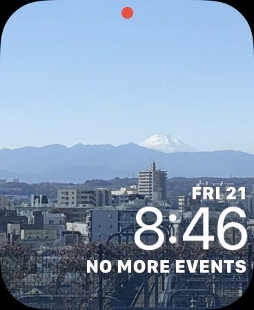

激しい運動は HRV を一時的に低下させますが、適切なクールダウン（特に呼吸法）によって副交感神経への切り替えを加速し、運動後の HRV 回復を早められます。Apple Watch でワークアウト終了後にブリーズを5分行うことで、心拍数の低下が速まり、運動が夜の睡眠に与える悪影響（入眠困難・深睡眠の減少）を軽減できます。

#### 📋 やり方

- ワークアウト終了後、Apple Watch でブリーズを5分間開始する
- 立ったまま、または軽く歩きながら呼吸を整える（歩きブリーズ）
- 心拍数が100bpm以下に戻るまでブリーズを続ける
- kmind で「クールダウンブリーズあり/なし」の日の睡眠スコアを比較する

#### 💡 ポイント

> 就寝4〜6時間前の運動は睡眠に好影響ですが、就寝2時間以内の激しい運動は入眠を妨げます。「5分間のクールダウンブリーズ」がこの悪影響を緩和し、夜の運動でも睡眠の質を守れます。

### No.069 📅 月経周期とHRVと睡眠の相関をkmindで追跡する

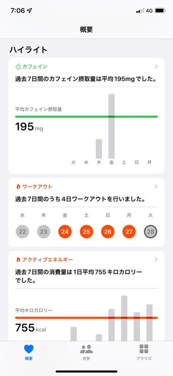

女性の HRV は月経周期によって自然に変動します。卵胞期（月経後〜排卵前）は HRV が上昇し、黄体期（排卵後〜月経前）は低下する傾向があります。kmind でこのサイクルを追跡することで、「なぜ月経前は疲れやすいのか」をデータで理解し、その時期に意識的に回復を優先するスケジュールを立てることができます。

#### 📋 やり方

- 月経周期の開始日をkmindのメモまたは別の健康アプリで記録する
- 毎日のHRVとの相関を3ヶ月間記録・観察する
- HRVが低下する黄体期に回復日・マインドフルネス強化デーを自動設定する
- このデータを医師に見せることで、ホルモンバランスの相談が具体的になる

#### 💡 ポイント

> 月経周期と HRV の相関を知ることは、「調子が悪い日」の原因をデータで理解することです。自己批判ではなく、「今日は黄体期だからHRVが低い、休もう」という客観的な自己理解が生まれます。

### No.070 😴 慢性的な睡眠不足をkmindのトレンドで客観視する

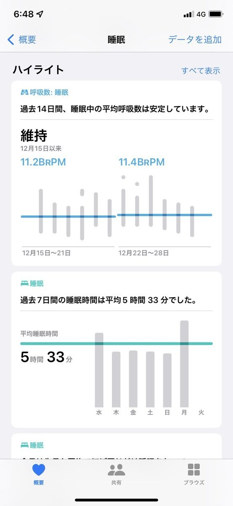

「6時間睡眠で大丈夫」と思っている人の多くは、睡眠不足に「慣れて」しまい、自分のパフォーマンスが低下していることに気づかない状態にあります。kmind の月次睡眠スコアトレンドで「平均睡眠時間が6時間以下の月」のHRV平均値が、「7時間以上の月」と比較して有意に低いことを確認できます。このデータが、「睡眠はコストではなく最高の投資」という気づきをもたらします。

#### 📋 やり方

- kmindで過去3ヶ月の平均睡眠時間とHRV平均値を確認する
- 睡眠時間が短い月と長い月のHRV平均の差を比較する
- 差が大きい場合、「睡眠時間の確保」を最優先のウェルネス目標に設定する
- 目標：7〜8時間の睡眠を週に5日以上達成することを3ヶ月間継続する

#### 💡 ポイント

> 睡眠を削って生まれた「時間」は、翌日以降の認知機能低下で失われます。「6時間×5日=30時間の睡眠」より「8時間×5日=40時間の睡眠」の方が週間の生産性が高いことを、あなた自身のHRVデータが証明します。

### No.071 🌡️ 寝室の環境をApple Watchの睡眠データで最適化する

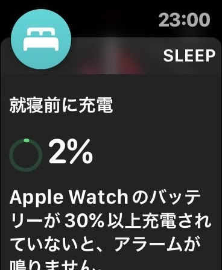

睡眠に最適な寝室の温度は16〜19℃、湿度は50〜60%、完全な暗闇または赤みがかった薄暗さとされています。kmind の睡眠スコアと睡眠段階データを使って、寝室環境の変更（温度調整・遮光カーテン・ホワイトノイズ）前後の改善を数値で確認することができます。「感覚的に快適な環境」ではなく「HRVと睡眠スコアが最も高くなる環境」を科学的に発見しましょう。

#### 📋 やり方

- 現在の就寝時の寝室温度・光量・音環境をメモする
- 1つの要因（例：温度を2℃下げる）を変えて7日間睡眠スコアを記録する
- 7日前との睡眠スコア・HRV平均を比較して改善・悪化を判断する
- 最もスコアが高かった環境の設定を「マイベスト睡眠環境」として固定する

#### 💡 ポイント

> 寝室の温度が1〜2℃低いだけで深い睡眠が増えるケースは珍しくありません。エアコンの「就寝モード」（一定時間後に自動で温度を下げる機能）との組み合わせが実践しやすい方法です。

### No.072 📵 就寝前のブルーライトブロックとナイトシフトを活用する

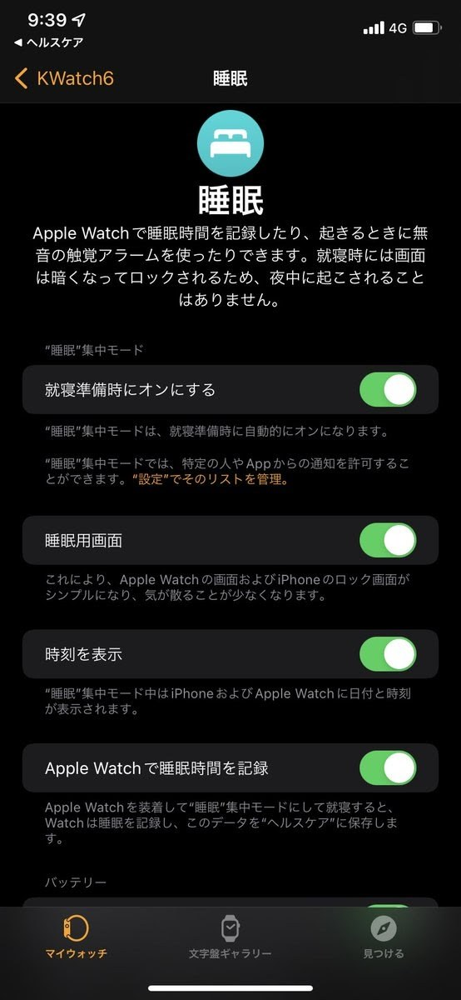

ブルーライト（400〜490nm）はメラトニンの分泌を抑制し、脳が「まだ昼間だ」と勘違いするため、入眠を遅らせます。iPhoneとApple Watchの「ナイトシフト」機能を就寝2時間前に自動でオンにすることで、ブルーライトを暖色光に変換できます。これに合わせてkmindで「ナイトシフト使用後の睡眠スコアの変化」を観察することで、この変更の効果を数値で確認できます。

#### 📋 やり方

- iPhone「設定」→「画面表示と明るさ」→「ナイトシフト」→ 就寝2時間前から自動ON
- Apple Watch も「設定」→「画面表示と明るさ」で夜間の明るさを最低に
- ナイトシフト開始後はスクリーン使用を最小化し、読書・会話・ブリーズを優先
- ブルーライトカットメガネとの併用でさらに効果的

#### 💡 ポイント

> ナイトシフトだけでは完全にブルーライトを除去できないため、就寝1時間前はスクリーンを一切見ないことが理想です。「スクリーンのない1時間」を持てた夜のkmind睡眠スコアは、持てなかった夜より平均10〜15点高くなることが多いです。

### No.073 📊 週次睡眠レポートで生活習慣を微調整する

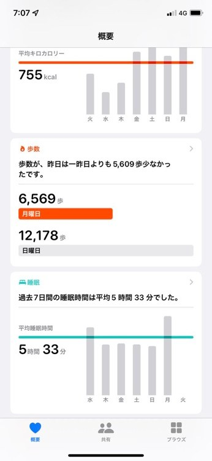

kmind の週次睡眠レポートは、7日間の平均睡眠スコア・平均HRV・平均深い睡眠時間・平均入眠時刻を一覧で表示します。毎週日曜日の夜にこのレポートを確認して「来週に1つだけ改善する習慣」を決めることが、睡眠の継続的な改善を実現する最もシンプルな方法です。完璧な睡眠を目指すのではなく、毎週少しずつ改善していくアプローチが長続きします。

#### 📋 やり方

- 毎週日曜日夜にkmindの「週次睡眠レポート」を確認する時間を予定に入れる
- 今週の最も低かった日の原因（就寝時刻・飲酒・残業など）を特定する
- 来週に試す「1つの改善策」を決めて Apple Watch のリマインダーに設定
- 次の週次レポートで効果を確認する（PDCA サイクル）

#### 💡 ポイント

> 週次レポートを1ヶ月分並べてみると、「睡眠スコアが向上している週」と「低下している週」のパターンが見えてきます。このパターンを理解することで、自分の生活リズムと睡眠の関係を深く理解できます。

### No.074 ⌚ Apple Watchの自動就寝検知で睡眠を正確に計測する

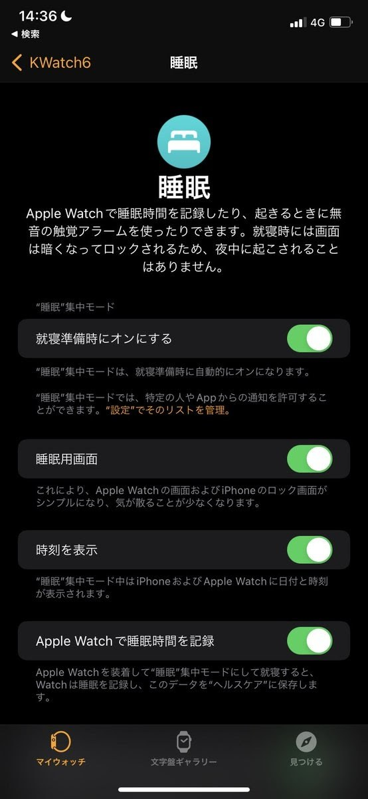

Apple Watch Series 4 以降は、加速度センサーと心拍センサーを組み合わせて睡眠を自動検知します。「睡眠スケジュール」を設定して就寝中も Apple Watch を着けることで、毎日の睡眠データが自動蓄積され、kmind がこれを解析します。Apple Watch を充電するタイミングを「起床後の朝のルーティン中」に変えることで、就寝中は常に着けていられます。

#### 📋 やり方

- Apple Watch の就寝中充電を「朝の支度中（6〜7時台）」に変更する
- 就寝時にApple Watch を着けて「睡眠モード」を設定する
- kmind で自動収集された睡眠データが翌朝反映されることを確認
- 7日間蓄積したら週次レポートで睡眠パターンを初めて確認する

#### 💡 ポイント

> 「Apple Watch を着けて寝るのは違和感がある」という方も、軽量モデルなら多くの場合すぐに慣れます。2〜3日で気にならなくなる人がほとんどです。睡眠データの価値は、この小さな不快感を大幅に上回ります。

### No.075 🏖️ 休暇中の睡眠データで本当の適切睡眠時間を発見する

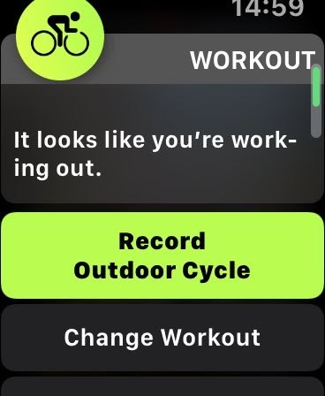

仕事の義務もアラームもない休暇中に、身体が自然に何時間眠るかを測定することで、あなたの「真の適切睡眠時間」がわかります。kmind で休暇中（連続5日以上）の平均睡眠時間を確認し、それをベースラインとして普段の睡眠時間と比較してみましょう。多くの人は「休暇中は平日より1〜2時間多く眠る」ことで、慢性的な睡眠負債の存在に気づきます。

#### 📋 やり方

- 休暇（最低5日）中はアラームなしで自然に目覚める生活を実践する
- Apple Watch で毎日の睡眠時間を自動記録する
- 5日間の平均睡眠時間を算出する（これがあなたの理想睡眠時間）
- 普段の睡眠時間との差=毎日の「睡眠負債」として認識する

#### 💡 ポイント

> 休暇中に毎日9時間眠っている人は、普段7時間しか眠れていないとすると、1週間で14時間の睡眠負債があります。休暇明けに「なぜか疲れが取れた」と感じる理由は、この睡眠負債の返済です。

---

## IV. kmindアプリとApple Watch徹底活用

### No.076 📱 kmindダッシュボードで今日のコンディションを一目で把握する

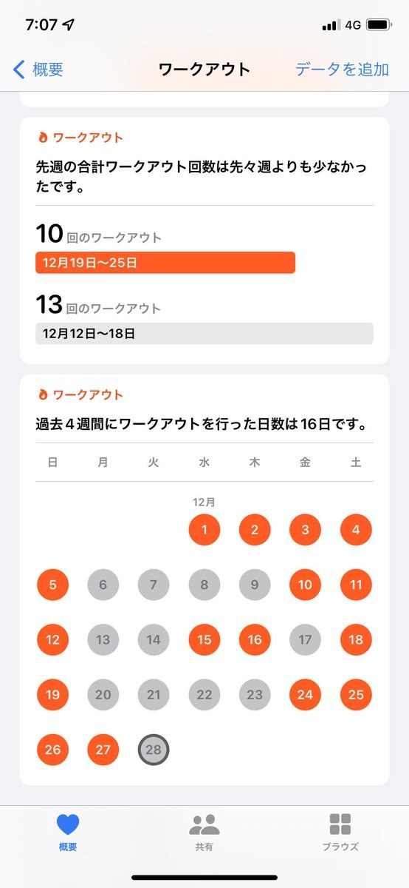

kmind のダッシュボードは、HRV・安静時心拍数・睡眠スコア・マインドフル分数・ストレスレベルインジケーターを1画面に集約したコントロールセンターです。毎朝起床後30秒このダッシュボードを確認するだけで、「今日の体と心の状態」を包括的に把握できます。このデータを基に「今日はどんな1日にするか」を意図的に設計することが、マインドフルな生活の基盤です。

#### 📋 やり方

- kmind を起動して「ダッシュボード」を朝の最初の30秒で確認する習慣を作る
- 各指標の「ステータス（高/普通/低）」を確認する
- 1つでも「低」があれば今日の活動計画を調整する
- ダッシュボードのスクリーンショットを週次で撮って変化を観察する

#### 💡 ポイント

> ダッシュボードを確認する習慣は、「身体の声に耳を傾ける」というマインドフルネスの根本を、30秒・データという形で実践することです。「なんとなく調子が悪い」ではなく「HRVが低い」という客観的な言語化が、自己理解を深めます。

### No.077 ⌚ Apple Watch文字盤にHRVコンプリケーションを追加する

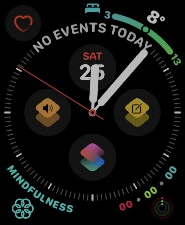

Apple Watch の文字盤に kmind の HRV コンプリケーション（今日の HRV 値・ステータス）を追加することで、手首を上げるたびに今日のコンディションが一目でわかります。「時計を見る」という毎日何十回も行う行動に、自己モニタリングを紐づけることで、コンディション管理が無意識の習慣になります。

#### 📋 やり方

- Apple Watch「文字盤」を長押し →「コンプリケーションを編集」
- kmind のコンプリケーションをいずれかのスロットに追加
- HRV値とステータスカラー（緑/黄/赤）が常に文字盤に表示される
- 「時計を見る→HRVを確認→今日のコンディションを認識」の流れを習慣化

#### 💡 ポイント

> 文字盤のコンプリケーションは「見えるものを意識する」という心理を活用しています。HRV が常に目に入ることで、「今日は無理をしないようにしよう」という思いやりある自己管理が自然に生まれます。

### No.078 ⌚ Apple Watch単体でブリーズセッションを完了する

Apple Watch 単体（iPhoneなし）でブリーズセッションを開始・完了できます。ジム・会議室・外出先・就寝前と、iPhoneを取り出す必要なく、手首のタップだけで即座にマインドフルネスを実践できます。この「どこでもブリーズ」の能力が、マインドフルネスを「特別な場所・特別な時間」から「いつでも・どこでも」へと転換させます。

#### 📋 やり方

- Apple Watch の「マインドフルネス」アプリをウォッチフェイスのアプリ一覧に追加
- 1タップで即座にブリーズを開始できるよう文字盤のショートカットを設定
- 1日中、気づいたタイミングでWatch単体でブリーズをする習慣を実践
- kmindが自動的にこれらのセッションを記録してマインドフル分数に加算

#### 💡 ポイント

> iPhoneがなければマインドフルネスできない、というのは思い込みです。Apple Watch単体のブリーズ機能は、「道具の最小化＝実践のハードルを下げる」を体現しています。手首にある道具だけで、いつでもどこでも瞑想が始められます。

### No.079 🏠 kmindのムーミンメッセージで心を癒す

kmind のストレスレベルに応じて表示されるムーミンキャラクターのメッセージは、データドリブンなウェルネスにやさしさを加えます。HRV が「高い（良好）」の日には前向きなメッセージが、「低い（要回復）」の日には「ゆっくりしていいよ」という温かい言葉が届きます。この機能は、セルフコンパッション（自己への思いやり）という、マインドフルネスの核心的な要素を日常に埋め込みます。

#### 📋 やり方

- kmind のダッシュボードを開き、今日のムーミンメッセージを読む
- メッセージが「回復が必要」を示している日は、それを「今日の行動指針」として受け取る
- 特に響いたメッセージをスクリーンショットして保存する（弱気になったときの励みに）
- 友人や家族にシェアしてコミュニケーションのきっかけにする

#### 💡 ポイント

> 「データが回復を必要としているといっている」というメッセージを、アニメキャラクターのやさしい言葉で受け取ることで、「休む」ことへの罪悪感が和らぎます。セルフコンパッションの実践として、このメッセージを毎朝読む習慣が心のマインドフルネスを育てます。

### No.080 📊 kmindの週間マインドフルネスレポートを習慣活用する

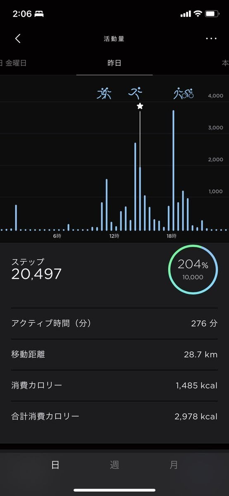

kmind の週間レポートは、7日間のマインドフル分数合計・HRV 平均・睡眠スコア平均・ストリーク状況・最も達成できた日/最も達成できなかった日を表示します。毎週月曜日の朝にこのレポートを5分間確認して「来週に1つだけ改善する習慣」を決めることが、継続的なウェルネス向上の最もシンプルなルーティンです。

#### 📋 やり方

- 毎週月曜日の朝、kmind で「週間レポート」を確認する15分を予定に入れる
- 「先週のベストデー」と「最も難しかった日」の条件（曜日・イベント）を比較する
- 来週の改善目標を1つ設定して Apple Watch のリマインダーに入れる
- このサイクルを4週間続けてから「月次振り返り」を行う

#### 💡 ポイント

> 週間レポートの確認は「自分のウェルネスの定例会議」です。1ヶ月間欠かさず行うだけで、「自分はどのような生活をすると最も調子が良いか」というパターンが明確に見えてきます。

### No.081 🔗 HealthKitとkmindの完全連携でデータを一元管理する

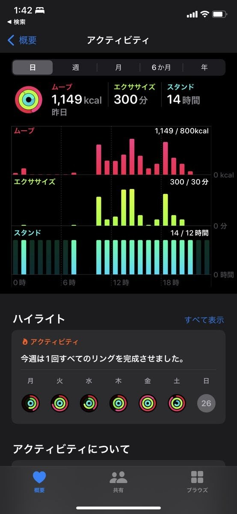

kmind は Apple の HealthKit と完全連携しており、Apple Watch が収集したすべての健康データ（HRV・心拍数・睡眠・ワークアウト・マインドフル分数・活動カロリー）をリアルタイムで読み込みます。これにより、運動・睡眠・栄養・マインドフルネスのデータが1つのプラットフォームで連携し、「なぜ今日のHRVが低いか」を多角的なデータから分析できます。

#### 📋 やり方

- kmind の「設定」→「HealthKit連携」ですべての読み取り権限を許可する
- kmindダッシュボードにHealthKitのすべての主要指標が表示されていることを確認
- 「昨日のワークアウト強度×睡眠スコア×今日のHRV」の三角関係を週次で観察
- 一つの指標だけでなく、複数指標の相関から洞察を得る習慣を作る

#### 💡 ポイント

> 健康データのサイロ化（アプリごとにバラバラ）が解消されると、「運動が睡眠を改善し、睡眠がHRVを高め、HRVが翌日の集中力を向上させる」という健康の好循環が数値で可視化されます。

### No.082 🗣️ Siriでハンズフリーにマインドフルネスを記録する

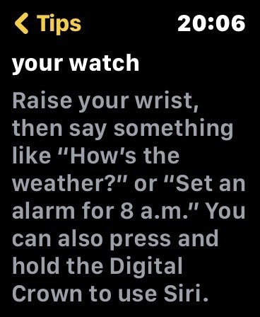

料理中・ドライブ中・子供の世話中など、手が塞がっている場面でも「Hey Siri、ブリーズを始めて」「Hey Siri、kmindを開いて」と話しかけるだけで、Apple Watch のマインドフルネス機能を起動できます。Siri を使いこなすことで、マインドフルネスへのアクセス障壁をさらに下げ、「どんな状況でも1分のブリーズができる」環境を整えられます。

#### 📋 やり方

- Apple Watch「設定」→「Siri」→「Hey Siriを聞き取る」をオン
- 「Hey Siri、ブリーズを始めて」でブリーズを即座に開始
- 「Hey Siri、今日のHRVを教えて」でHMV値を音声確認（kmind連携時）
- 「Hey Siri、1分のタイマーをかけて」で手動マインドフルポーズのタイマーに活用

#### 💡 ポイント

> ハンズフリー操作は「マインドフルネスの言い訳を減らす」最高のツールです。「今は手が離せないからできない」という障壁がなくなれば、1日に実践できるマインドフルネスの回数が自然に増えます。

### No.083 🔥 kmindのストリークで毎日1分の継続を積み上げる

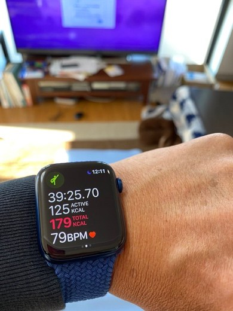

kmind のマインドフルネスストリーク（連続達成日数）は、「続けること」の視覚的な記録です。最低条件を「1日1分のブリーズ」に設定することで、どんなに忙しい日でも達成可能なハードルを設けます。ストリークが30日・100日と積み上がるにつれ、「このストリークを守るために今日も1分だけやろう」という動機が、マインドフルネスを「義務」から「誇り」へと変えていきます。

#### 📋 やり方

- kmindの「目標設定」でマインドフルネスの最低目標を「1分」に設定
- 毎朝起床後、まず1分間のブリーズを完了してストリークを守る
- 7日・30日・66日・100日のマイルストーンで自分をお祝いする（好きなものを食べるなど）
- ストリークが途切れた場合は「昨日の自分は最善を尽くした」と認めて翌日から再開

#### 💡 ポイント

> 「66日以上同じ行動を繰り返すと自動的な習慣になる」というLondon大学の研究があります。kmindのストリークが66日を越えた頃に、「マインドフルネスをしないと落ち着かない」という変化が生まれるかもしれません。

### No.084 🆕 Apple Watchの新マインドフルネス機能を最大活用する

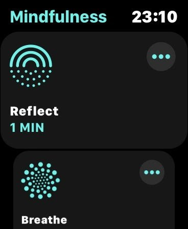

watchOS 10 以降のマインドフルネスアプリには「心の状態」（State of Mind）記録機能が追加され、1日の感情状態を簡単に記録できます。kmind はこの感情データを HRV・睡眠・活動データと組み合わせて、「どんな生活パターンが最も幸福感に繋がるか」を分析します。感情の記録がデータ化されることで、主観的な「幸せ」が客観的に理解できるようになります。

#### 📋 やり方

- Apple Watch「マインドフルネス」→「State of Mind」を1日2回（朝/夜）記録する
- 「今の気分はどうですか？」のプロンプトに1タップで回答（5段階評価）
- kmind でこの感情データと HRV・睡眠スコアの相関を確認する
- 「幸福感が高い日のHRVと睡眠のパターン」を自分のデータから発見する

#### 💡 ポイント

> 「State of Mind」の記録を続けることは、感情への「気づき」を育てるマインドフルネスの実践です。記録すること自体が、「今この瞬間、自分はどう感じているか」を意識する契機になります。

### No.085 🤝 kmindのTOMOフィードでマインドフルネスを友人と共有する

kmind の TOMOフィードでは、今日のマインドフル分数・HRV ステータス・ストリーク・感謝の言葉を友人や家族と共有できます。マインドフルネスは「孤独な実践」というイメージがありますが、仲間と共有することで継続率が大幅に向上します。友人の「今日のブリーズ完了！」という投稿を見て「私も！」と実践するという正の連鎖が、コミュニティ全体のウェルネスを高めます。

#### 📋 やり方

- kmind の「TOMO」タブで友人をフォローする
- 毎日のマインドフルネス達成をTOMOフィードにシェアする
- 友人の投稿に「❤️」で応援し、コメントで励まし合う
- 月に一度、友人とマインドフルネスの体験を話し合う機会を設ける

#### 💡 ポイント

> 「他の人が見ている」という社会的プレッシャーではなく、「仲間と一緒に成長している」という感覚が、最も持続的なモチベーションです。TOMOフィードをジャッジではなくサポートの場として活用しましょう。

### No.086 💼 職場でのApple Watchこっそりブリーズ活用術

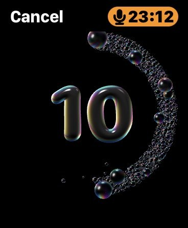

職場で「瞑想しています」と言いにくい文化があっても、Apple Watch のブリーズなら会議室の隅・トイレ・エレベーターの中でも誰にも気づかれずに実践できます。「こっそりブリーズ」は、目を完全に閉じなくても効果があります。呼吸リズムだけに意識を向け、Apple Watch のガイドに従って4秒吸い・4秒吐くことを繰り返すだけで、副交感神経が優位になります。

#### 📋 やり方

- 会議の待ち時間・エレベーター内・トイレ休憩中にApple Watchのブリーズを起動
- 目を半開きにして手元の Watch を見ながら呼吸ガイドに従う
- 1〜2分でも十分な効果があるため「30秒でも試す」習慣を作る
- 「こっそりブリーズした」日のパフォーマンスと疲労感をkmindにメモする

#### 💡 ポイント

> 「瞑想は特別な空間でするもの」という固定観念こそが、マインドフルネスを日常から遠ざけています。エレベーターの中の1分間が、最も効果的な瞑想の場になることがあります。

### No.087 🏃 FitingoとkmindでトータルウェルネスをApple Watch管理する

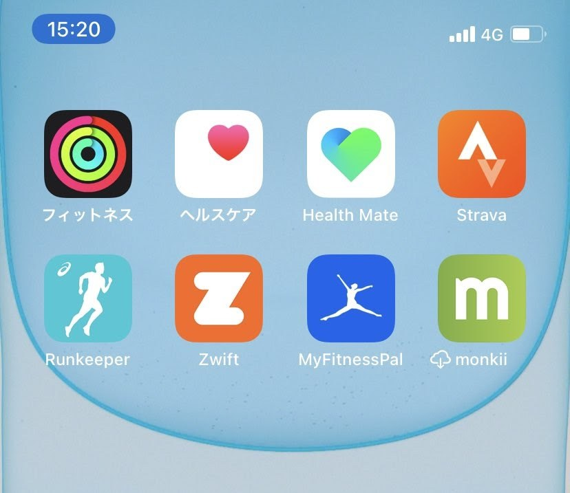

Fitingo（フィティンゴ）はエクササイズ・食事・体重管理を、kmind はマインドフルネス・HRV・睡眠をカバーします。両アプリを HealthKit を通じて連携することで、「運動がHRVに与える影響」「食事が睡眠に与える影響」「マインドフルネスが運動パフォーマンスに与える影響」というトータルウェルネスの相互作用を、Apple Watch 中心のエコシステムで管理できます。

#### 📋 やり方

- Fitingo と kmind の両方に HealthKit の読み取り・書き込み権限を付与する
- Fitingo でエクササイズを記録した日の kmind の HRV と睡眠スコアを確認する
- kmind の「高HRV日」と「低HRV日」の Fitingo データ（運動・食事）を比較する
- 「最もコンディションが良い日のライフスタイルパターン」を両アプリのデータから発見する

#### 💡 ポイント

> フィットネスとマインドフルネスは別々のものではありません。最高のパフォーマンスを出すには、身体の鍛錬と心の安定の両方が必要です。Fitingo + kmind の組み合わせが、このトータルウェルネスを Apple Watch で完結させます。

### No.088 🤖 kmindのAIコーチに週次マインドフルネスアドバイスを求める

kmind の AI コーチング機能は、週次で HRV・睡眠・マインドフル分数・ストレスレベルのトレンドを分析し、パーソナライズされたマインドフルネスアドバイスを生成します。「今週は HRV が上昇傾向で素晴らしい！来週は瞑想時間をさらに5分増やしてみましょう」や「睡眠の質が低下しています。就寝前のデジタルデトックスを試してみませんか？」など、あなただけのコーチングが届きます。

#### 📋 やり方

- kmind の「週間レポート」画面で AI コーチングコメントを確認する
- コメントを読んで「今週実践したい1つのアドバイス」を選ぶ
- 7日間そのアドバイスを試した結果をkmindのメモに記録する
- 翌週のレポートで「AIのアドバイスが正しかったか」を確認する

#### 💡 ポイント

> AI コーチングは「正解を教えてくれる機械」ではなく「次の実験を提案してくれる相棒」として使いましょう。あなたの身体への最終的な理解者はあなた自身です。AIの提案を参考にしながら、自分の感覚も大切にしてください。

### No.089 🎭 Watch GIFキャラクターでマインドフルネスを楽しく続ける

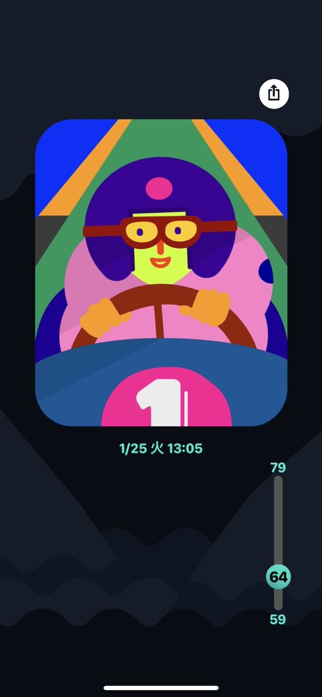

kmind の Apple Watch アプリでは、HRV のコンディションに応じてオリジナルキャラクター（Fitingo）がアニメーションで表示されます。HRV が高い日には元気なアニメーション、低い日にはゆったりとしたアニメーションが表示され、視覚的なフィードバックとして機能します。「かわいい」「楽しい」という感情がマインドフルネスへの親しみを育て、継続率を高めます。

#### 📋 やり方

- Apple Watch の kmind アプリを文字盤から1タップで開けるよう設定
- HRVのコンディションに応じて表示されるキャラクターアニメーションを毎朝楽しむ
- 「今日のキャラクター」をスクリーンショットしてTOMOフィードにシェアする
- 7日連続達成でキャラクターが特別なセレブレーションアニメーションを行う

#### 💡 ポイント

> ゲーミフィケーション（ゲーム的要素の導入）は、習慣形成の最強ツールのひとつです。「楽しいから続ける」という自発的な動機が、「やらなければならない」という義務感より圧倒的に強力です。

### No.090 📅 kmindのHRVカレンダーで月単位の傾向を把握する

kmind の月次カレンダービューでは、毎日の HRV 値を色分けして表示します（高い=緑・普通=黄・低い=赤）。一か月分を俯瞰することで、「月曜日は常に赤が多い（週明けの疲労）」「満月の頃に赤が増える（睡眠の質の低下）」「特定のイベントの後に連続して赤になる（回復に必要な期間）」というパターンが視覚的に明らかになります。

#### 📋 やり方

- 月末にkmindの「カレンダービュー」で先月の HRV カラーパターンを確認
- 「赤が多い週」と「緑が多い週」の生活習慣の違いを比較する
- 来月の「赤になりやすい週」を予測して、前の週に回復日を入れる
- 3ヶ月分のカレンダーを並べて季節・仕事サイクル・個人イベントとの相関を探す

#### 💡 ポイント

> カレンダーで見ることで初めて「自分の HRV のリズム」が見えてきます。このリズムを理解すれば、「来週は重要な仕事があるから今週のうちにしっかり回復しておこう」という先読みの自己管理が可能になります。

### No.091 🎧 Apple WatchとAirPodsで没入型瞑想体験を作る

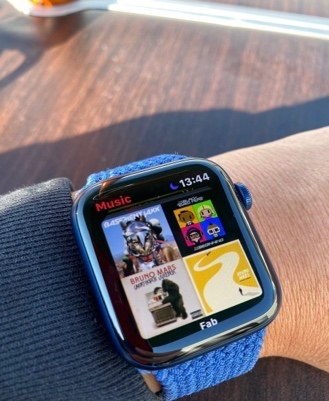

Apple Watch のブリーズとAirPodsのノイズキャンセリングを組み合わせることで、周囲のノイズを完全にシャットアウトした没入型瞑想環境が整います。AirPodsで自然音（波・雨・森）を流しながらブリーズを行うと、脳波がアルファ波（リラックス状態）に移行しやすくなります。通勤中・昼休みでも、この「パーソナル瞑想ルーム」をいつでも展開できます。

#### 📋 やり方

- AirPodsをつけてノイズキャンセリングをオン、音楽は自然音か無音を選ぶ
- Apple Watch でブリーズを5〜10分開始する
- 呼吸のリズムと自然音の音に同時に意識を向ける（二点フォーカス）
- ブリーズ終了後、AirPodsを外してそのままの静けさを30秒楽しむ

#### 💡 ポイント

> AirPodsのノイズキャンセリングは、騒がしいオフィス・カフェ・電車の中を、個人の瞑想スペースに変える魔法のスイッチです。これを使いこなすことで、「静かな環境がないとできない」というマインドフルネスの最大の言い訳がなくなります。

### No.092 📋 kmindの習慣トラッカーで付属習慣を設定する

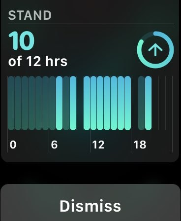

マインドフルネスの効果を最大化するには、関連する「付属習慣」（サポーティングハビット）を合わせて実践することが重要です。kmind の習慣トラッカーで「ブリーズ完了・水2リットル・就寝前ブルーライトオフ・感謝3つ」などの付属習慣をセットで管理することで、マインドフルなライフスタイル全体を1つのアプリで追跡できます。

#### 📋 やり方

- kmind の「習慣」タブで今月実践したいサポーティングハビットを3〜5個設定する
- 毎日のチェックインで各習慣の達成・未達成を記録する
- 週次レポートで「最も達成できていない習慣」を特定する
- 来週はその習慣だけを重点的に実践する（シングルフォーカス戦略）

#### 💡 ポイント

> 習慣は「量」より「スタック（積み重ね）」が重要です。「ブリーズ→水1杯→感謝3つ」という3つの小さな習慣を毎朝連続して行うルーティンが、3つバラバラに行うより遥かに定着しやすいです。

### No.093 👨‍👩‍👧 家族やパートナーとマインドフルネスチャレンジを共有する

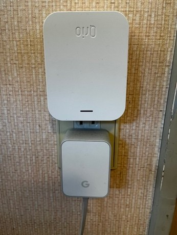

マインドフルネスを家族全員で実践することで、家族全体のウェルネスが高まり、コミュニケーションの質も向上します。kmind の TOMOフィードで家族をつなぎ、「家族全員が今日のブリーズを完了する」というチャレンジを毎朝行うことが、家族の新しいモーニングルーティンになります。子供でも Apple Watch のブリーズは直感的に使えます。

#### 📋 やり方

- 家族全員がkmindをインストールしてTOMOフィードで繋がる
- 家族グループの共通目標（例：「7日間連続ブリーズ達成」）を設定する
- 朝食時に「今日のブリーズ完了した人？」というチェックインを行う
- 月に一度、家族でマインドフルネスの効果（変化・発見）を話し合う

#### 💡 ポイント

> 親がマインドフルネスを実践している姿を見せることは、子供に「感情の調整スキル」を教える最も効果的な方法のひとつです。データを通じて「今日ちょっと疲れてるかも」と話せる家族関係が、心の安全基地になります。

### No.094 🍽️ kmindでマインドフルイーティングルーティンを作る

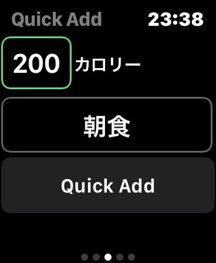

マインドフルイーティングは、食事をしながらスマートフォンを見るのをやめ、食べ物の色・形・香り・温度・味・食感に完全に意識を向ける実践です。kmind でストレスレベルを確認してから食事を始めることで、「今の食欲はストレス由来か、本当の空腹か」を判断でき、無意識の過食を防げます。Apple Watch でタイマーを計りながら「最低20分かけて食事する」というルールを設けることも効果的です。

#### 📋 やり方

- 食事の前にkmindのダッシュボードでストレスレベルを確認する（30秒）
- Apple Watch でタイマーを20分にセット（食事の最低時間を確保）
- 食事中はスマートフォンをポケットに入れ、Apple Watch だけ着用
- 一口食べたら箸・フォークを置き、完全に飲み込んでから次の一口

#### 💡 ポイント

> 「20分以上かけて食べると満腹感が得られやすい」のは、満腹中枢が活性化するまでに約20分かかるからです。Apple Watch のタイマーが、この科学的な事実を習慣に変える最もシンプルなツールです。

### No.095 🌿 自然の中でのウォーキング瞑想をkmindで記録する

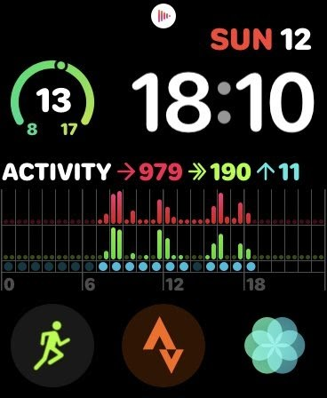

自然環境（森林・公園・川辺・海岸）でのウォーキングは、都市環境と比較してコルチゾール（ストレスホルモン）を顕著に低下させ、HRV を向上させることが研究で示されています。「森林浴（shinrin-yoku）」は世界的に注目される科学的に有効なウェルネス実践です。Apple Watch でこのウォーキングを記録し、kmind でその日のHRV変化を確認することで、自然の癒し効果をデータで実感できます。

#### 📋 やり方

- 週に一度、自然の中（公園・森・海辺）での30〜60分のウォーキングを計画する
- Apple Watch「ワークアウト」→「屋外ウォーク」を開始してトラッキング
- ウォーキング中はスマートフォンを使わず、周囲の自然（木・鳥・風）に意識を向ける
- ウォーキング後にkmindでHRV値を確認し、通常のウォーキングとの差を比較する

#### 💡 ポイント

> 日本の研究で、自然の中での15〜20分のウォーキングが、都市のウォーキングと比較してコルチゾールを12%、血圧を7%低下させることが確認されています。週1回の「森林ブリーズウォーク」をkmindで習慣化しましょう。

### No.096 ❤️ Apple Watchの心電図機能とkmindの連携活用

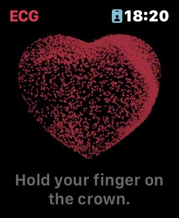

Apple Watch Series 4 以降（SE シリーズを除く）の心電図（ECG）機能は、心房細動（AFib）という不整脈を検知できます。この機能を週に一度使って記録することで、心臓の健康状態を継続的にモニタリングできます。kmind の HRV データと ECG 記録を組み合わせることで、「HRV が異常に低い日に ECG も確認する」という包括的な心臓健康管理が可能です。

#### 📋 やり方

- Apple Watch「心電図」アプリを週に1〜2回開いて30秒間記録する
- 記録した ECG データがiPhone の「ヘルスケア」→「心電図」に保存されることを確認
- kmind でその日の HRV と合わせて記録・観察する
- 「不規則なリズム」の通知が来た場合は速やかに医師に相談する

#### 💡 ポイント

> Apple Watch の ECG は医療診断ツールではありませんが、心房細動の早期発見に大きく貢献した事例が世界中で報告されています。「念のため記録する」という習慣が、予防医療の入り口になることがあります。

### No.097 🔔 kmindのHRVアラートで休息が必要なサインを受け取る

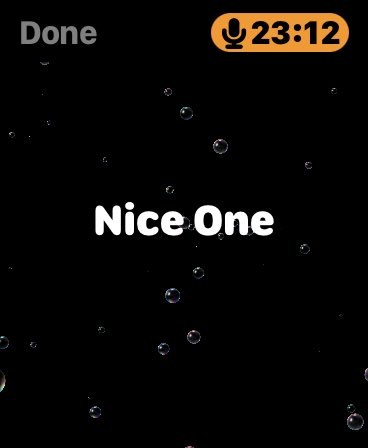

kmind は HRV がベースラインから一定以上低下した場合、「今日は回復日にしましょう」というアラートを送信する設定が可能です。このアラートを無視しないことが、マインドフルな自己管理の実践です。「アラートが来たからといって必ず休まなければならない」わけではありませんが、「アラートが来た」という事実を認識した上で意識的に選択することが重要です。

#### 📋 やり方

- kmind の「通知設定」→「HRVアラート」を有効化してアラート閾値を設定
- アラートが届いたら15秒立ち止まり、「今日の自分の状態」を身体で感じてみる
- 「確かに疲れている」と感じたら今日の予定を調整する
- アラートを無視した日と回復優先にした日のHRVの翌日の回復速度を比較する

#### 💡 ポイント

> アラートは命令ではなく「情報提供」です。アラートを受け取ってどう行動するかは常に自分が決めます。しかし「アラートが来た」という事実を意識する習慣が、身体の声への感受性（内受容感覚）を育てます。

### No.098 🌊 kmindとApple Watchでフロー状態を可視化する

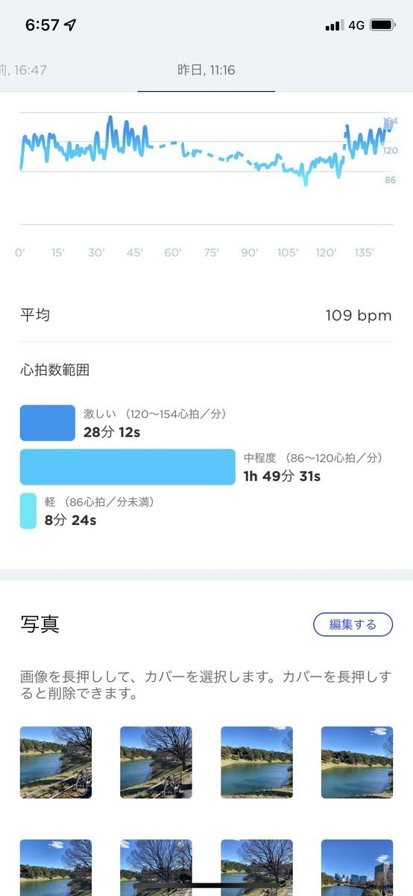

「フロー状態」（ゾーン）は、能力と課題の難易度が完璧にマッチしたときに自然に生まれる、深い集中と喜びを伴う状態です。kmind の HRV と Apple Watch の心拍ゾーンデータを使って、フロー状態が発生しやすいコンディション（HRV 値・心拍ゾーン・時間帯）を特定できます。フロー体験の前後の HRV 変化を記録することで、「自分がフローに入りやすい条件」が明らかになります。

#### 📋 やり方

- 「フロー状態に入った」と感じた活動の前後にkmindでHRV値をメモする
- その日の時間帯・活動内容・前夜の睡眠スコアも記録する
- 10回分のデータが蓄積したら「自分のフロー条件」を分析する
- フローに入りやすい条件（高HRV・特定の時間帯・特定の活動）を来週の予定に活かす

#### 💡 ポイント

> フロー状態のデータ化は、「最高の仕事をするための科学的なスケジューリング」に直結します。「高HRVの朝に最も難しい創造的な仕事を入れ、低HRVの午後はルーティンタスクにあてる」という戦略が生産性と幸福感を同時に高めます。

### No.099 🎯 年間マインドフルネス目標をkmindで設定し追跡する

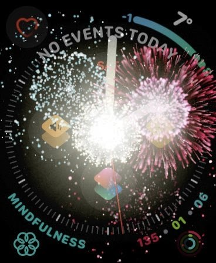

1月1日（または誕生日）に「今年のマインドフルネス目標」をkmindに設定することで、365日の長期的な視点でウェルネスを追跡できます。「年間マインドフル分数3,650分（1日10分）」「年間HRV平均55ms以上を維持」「毎日の達成率80%以上のストリーク」など、測定可能な目標を設定します。kmind の年次サマリーで「今年のウェルネス成長」を振り返る年末の儀式が、来年への動機になります。

#### 📋 やり方

- 1月1日にkmindで「今年のマインドフルネス目標」を3つ設定する（具体的な数値目標）
- 四半期ごとにkmindのデータで進捗を確認する（Q1・Q2・Q3・Q4レビュー）
- 年末に年次サマリーを確認して「今年最もウェルネスが高かった月」を特定する
- 達成した目標と未達成の目標を振り返り、来年の目標に活かす

#### 💡 ポイント

> 年間目標は「達成すること」より「方向性を持って1年を過ごすこと」が目的です。途中で状況が変わったら目標を修正してOKです。データという軸を持ちながら、柔軟に1年を生きることがマインドフルな目標設定の本質です。

### No.100 🌟 kmind×Apple Watchでマインドフルな生活を完成させる

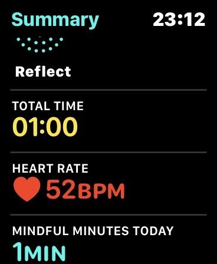

100のメソッドを読み終えたあなたは、すでにマインドフルな生活への地図を手にしています。Apple Watch は今も手首の上で心拍変動を計測し続け、kmind はその声を解析して、あなたに最適なマインドフルネスを提案し続けています。大切なのは、100すべてを完璧に実践することではありません。今日、1つだけ試してみることです。

#### 📋 やり方

- 本書の100メソッドの中で「これは続けられそう」と感じた3つを書き出す
- まずその3つだけを1週間集中して実践する
- 1週間後にkmindのデータで変化を確認して「どれを続けるか」を選ぶ
- 少しずつメソッドを追加して、自分だけのマインドフルライフスタイルを育てていく

#### 💡 ポイント

> マインドフルネスとは「完璧な心の平和を得ること」ではなく、「今この瞬間に意識を向ける能力を少しずつ育てること」です。Apple Watch の振動が教えてくれる呼吸のリズム、kmind の数字が示すコンディション——これらはすべて、「今この瞬間の自分」に気づくための道具です。今日から、たった1分、あなたの手首にある道具を信頼して、深呼吸してみてください。

---

## おわりに

本書を手に取ってくださり、ありがとうございます。

100のメソッドを読み進める中で、「Apple Watch が単なる時計ではなく、自分の身体と心の通訳者である」ということを感じていただけたなら、著者として最高の喜びです。

HRV という数値は、あなたの自律神経が「今日はどんな状態か」を正直に教えてくれます。睡眠スコアは「昨夜どれだけ回復できたか」を示してくれます。ブリーズの1分間は「今この瞬間に立ち返るための扉」です。

しかしデータはあくまで「道具」です。データに支配されるのではなく、データを使って自分の身体と心の声をより繊細に聴けるようになることが、本書の最終的な目標です。

kmind アプリは、あなたのウェルネスの旅のパートナーとして、毎日進化し続けています。新しい機能・AIコーチングの精度向上・コミュニティ機能の拡張など、あなたのフィードバックが kmind をより良くします。アプリのレビューやフィードバックをぜひお寄せください。

最後に、マインドフルネスの世界に一歩踏み出すことを選んだあなたへ。

今日の1分間のブリーズが、1ヶ月後、1年後の「より穏やかで、より集中でき、よりよく眠れる自分」への最初の一歩です。Apple Watch と kmind を相棒に、あなた自身のペースで、マインドフルな生活を育ててください。

吉田 顕一（Ken Yoshida）

---

## 免責事項・著作権表示

<small>

本書の内容は、著者の個人的な経験・調査・研究に基づいており、医療的なアドバイス・診断・治療の代替を意図するものではありません。健康上の問題については、必ず医師などの医療専門家にご相談ください。

Apple Watch・HealthKit・Siri・AirPods は Apple Inc. の商標です。

kmind アプリおよび watchOS に関する記述は、執筆時点（2026年7月・watchOS 26 / Apple Watch Series 11・Ultra 3・SE 3 世代）の情報に基づいています。アプリ・OS の機能は予告なく変更される場合があります。

心拍変動（HRV）・睡眠スコアの数値は個人差が大きく、本書に記載された閾値はあくまで一般的な参考値です。自分の個人ベースラインとの比較を最も重視してください。

本書の全部または一部を無断で転載・複製することを禁じます。

©2026 Ken Yoshida / Fitingo Inc. All Rights Reserved.

</small>
