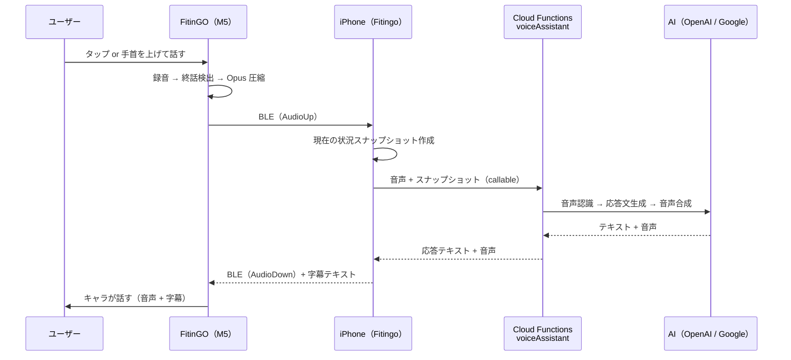

# FitinGO（M5Stack CoreS3）アクセサリー連携 設計書（案）

M5Stack CoreS3 を「**FitinGO**」という名前の Fitingo **追加アクセサリー**として使い、①体温・脈拍、②筋トレの回数、③食事の写真を、Fitingo と Apple Health に連携する構成の設計案です。**持ち運んでどこでも記録でき、後から Fitingo アプリにつないでデータを取り込む**（オフラインファースト）ことを前提にしています。実装前の提案であり、コードはまだありません。

> 前提: 「M5StackS3」は **M5Stack CoreS3** を指すものとして設計します（ESP32-S3、2.0 インチタッチ画面、カメラ GC0308 0.3MP、6 軸 IMU BMI270 + 磁気センサー、内蔵マイクとスピーカー、BLE 5 / Wi-Fi、RTC、バッテリー内蔵、Grove ポート）。カメラ付きの機種はこれです。AtomS3 系にはカメラも十分な画面もありません。

---

## 1. 最重要の制約: Apple Health には iPhone アプリからしか書けない

HealthKit は iPhone / Apple Watch 上のアプリ経由でのみ書き込めます。**M5Stack から直接 Apple Health へは書けません**。したがって経路は必ず次の形になります。

```
FitinGO（M5Stack CoreS3）──BLE──▶ Fitingo（iPhone）──┬─▶ Apple Health（HealthKit）
                                            └─▶ Firestore（Web・ポイント・スパイラル）
```

Fitingo が「ゲートウェイ」になります。これは既存の構成とも相性が良く、Fitingo にはすでに HealthKit 書き込み（`HealthKitManager.saveExercise` / `saveMealNutrition` など）、食事写真の AI 解析（`PhotoLogManager.analyzePhoto`）、トレーニング記録（`AuthenticationManager.recordExercise`）があります。M5 は「入力デバイス」に徹し、判断・保存・課金制御は iPhone 側に置きます。

---

## 2. 全体構成


---

## 3. 機能ごとの設計

### 3.1 体温・脈拍 → Fitingo / Apple Health

**センサー案（Grove Port A の I2C に接続）**

| 用途 | 候補 | 備考 |
|---|---|---|
| 体温（非接触） | MLX90614（M5Stack の NCIR ユニット） | 額・手首の皮膚温。体温計の値とは差が出る |
| 体温（接触） | MAX30205 / TMP117 | ±0.1℃ 級。腋下・指で測る用途向き |
| 脈拍・SpO2 | MAX30102（M5Stack の Heart ユニット） | 指を当てる PPG。動きに弱い |

I2C アドレスは重複しない組み合わせ（MLX90614 0x5A、MAX30102 0x57、MAX30205 0x48）ですが、同一バスの共存は**実機で要確認**です。

**BLE**: 標準プロファイルを使います。

- Heart Rate Service（0x180D）: 脈拍
- Health Thermometer Service（0x1809）: 体温

標準にしておくと、Fitingo 以外の BLE 対応アプリでも読めます。SpO2 は標準の Pulse Oximeter Service（0x1822）か独自特性にします。

**Apple Health への書き込み**（`HealthKitManager` の `writeTypes` に追加が必要。現在は含まれていません）

| データ | HealthKit の型 |
|---|---|
| 体温 | `bodyTemperature` |
| 脈拍 | `heartRate` |
| 酸素飽和度 | `oxygenSaturation` |

- 各サンプルに `HKDevice`（名前 `FitinGO`、モデル `M5Stack CoreS3`、製造元 `M5Stack`、ファーム版）を付けて、Health アプリ上で由来が分かるようにします。
- **重複防止**: `HKMetadataKeySyncIdentifier` に「デバイス ID + シーケンス番号」を入れ、再送しても二重登録されないようにします。
- **Apple Watch との競合**: Watch のワークアウト中に M5 の脈拍も書くと二重になります。既定では「M5 の脈拍は安静時測定のみ書く」とし、Watch がワークアウト中は書かない運用にします。

**Fitingo での扱い**

- Firestore `users/{uid}/vitals/{id}` に保存（Web でも表示できる。既存ルールで本人のみ読み書き可）
- スパイラルに任意ノード「体温・脈拍を測る」を追加（体重計測ノードと同じ仕組み）

> 医療上の注意: 体温・脈拍は**健康管理の参考値**です。診断・治療用途をうたうと薬機法の対象になり得るため、アプリ内の表現に注意が必要です。

### 3.2 振動（IMU）→ 筋トレの回数 → Fitingo / Apple Health

CoreS3 を手に持つ（ダンベル代わり・胸の前・足首など）状態で回数を数えます。

**処理はデバイス側で行います。**

1. 種目を M5 の画面で選ぶ（スクワット、カール、腕立て等）
2. BMI270 を 50〜100Hz で取得し、既存の iPhone / Watch の回数検出（`MotionDetectionManager`）と同じ考え方でピーク検出
3. 1 セット終了時に**イベント**だけを BLE で送る（生データは送らない。電池と帯域の節約）

```
WorkoutEvent {
  seq:        uint32   // 重複・欠落検出
  exerciseId: uint8    // squat=1, pushup=2 ...
  reps:       uint16
  startEpoch: uint32
  endEpoch:   uint32
  formScore:  uint8    // 0-100（加速度の滑らかさ）
}
```

**iPhone 側の連携**

- `AuthenticationManager.recordExercise` / `recordCompletedSet` に流す。これで既存の仕組みがそのまま動きます。
  - Firestore の `completed-exercises` → `calculatePoints` / `checkAchievements` → ポイント・実績・ストリーク
  - スパイラルのトレーニングノード（時間帯別セット数）に反映
- Apple Health へは `HealthKitManager.saveExercise` を利用（ワークアウト + 消費カロリー）。
  - HealthKit に「回数」という型はないため、回数は `HKWorkout` の**メタデータ**に持たせます（Health アプリには表示されません。回数の正は Fitingo / Firestore です）。
  - 消費カロリーは既存の回数あたり係数による**推定値**です。

**精度の注意**: 持ち方・種目によって検出精度が大きく変わります（腕立てで手に持つのは不向き）。種目ごとにアルゴリズムと持ち方を決め、手動カウントとの誤差で検証してから対応種目を広げます。

### 3.3 カメラ → 食事写真 → Fitingo / Apple Health

Apple Health に画像を書く仕組みはありません。**写真は Fitingo に取り込み、栄養の数値を Apple Health に書く**のが正しい連携です。

1. M5 の画面のボタンで撮影 → JPEG（VGA 程度、数十 KB）
2. BLE で iPhone に転送
3. Fitingo の食事写真ログ（`PhotoLogManager`）に取り込み
4. 既存の AI 解析（`analyzePhoto` → `aiProxy` category `food`）で栄養を推定
5. `saveMealNutrition` で Apple Health に書き込み（エネルギー、たんぱく質、脂質、炭水化物など。これらは現在の `writeTypes` に含まれています）
6. スパイラルの食事ノードが完了

**画像の転送方式**

| 方式 | 内容 | 判断 |
|---|---|---|
| BLE の分割転送（推奨） | 独自特性に 200 バイト前後で分割。ヘッダーに ID・サイズ・CRC。50KB で数秒 | ペアリングだけで動き、追加設定が不要 |
| Wi-Fi + Bonjour | M5 が同一 LAN で HTTP 提供、iPhone が取得 | 高速だが Wi-Fi 設定が必要。ローカルネットワーク許可（`NSLocalNetworkUsageDescription`）は設定済み |

まず BLE で作り、遅ければ Wi-Fi を追加します。

**制約**

- **カメラ画質**: CoreS3 のカメラは 0.3MP で、暗所に弱く食材の判別には不利です。撮影ガイド（明るい場所・真上から）を画面に出す、または高画質の外付けカメラ（OV2640 系ユニット等）を検討します。
- **AI のクォータ**: `aiProxy` は 1 日の回数上限（90 秒モード 1 / 無料 1 / Plus 3）があります。M5 での撮影は何枚でも取り込めますが、**解析はクォータの範囲内**です。超過分は「写真だけ保存、後で解析」にします。
- 食事写真は個人情報です。ペアリング時の認証（後述）と、BLE 経路の暗号化が必須です。

### 3.4 画面のキャラクター成長（やる気アップ）

M5 の画面に Fitingo キャラクターを常時表示し、**長期の成長（体つき）**と**今日の頑張り（表情・演出）**の 2 軸で変化させます。「続けるほど体が変わる」ことと「今この瞬間の反応」の両方で、やる気を引き出す設計です。

**軸 1: 体つき = 長期の成長（6 ステージ）**

| ステージ | 見た目 | 進化条件（案・要調整） |
|---|---|---|
| 1 ひよこ | 細身、汗をかきながら初挑戦 | 開始時 |
| 2 ビギナー | 少し引き締まる | 累計ポイント or 連続記録の第 1 段階 |
| 3 アスリート | 腕と脚に筋肉が付く | 同 第 2 段階 |
| 4 マッスル | 胸板が厚く、ポーズを取る | 同 第 3 段階 |
| 5 ムキムキ | 全身ムキムキ、オーラ | 同 第 4 段階 |
| 6 レジェンド | 金色のオーラ、王冠 | 最終段階（以降は装飾が増える） |

進化条件は、既存の累計ポイントと連続記録（ストリーク）から iPhone 側で計算します。アプリと M5 で成長段階が食い違わないよう、**計算は iPhone に一本化**して結果だけを M5 に送ります。

**軸 2: 表情・演出 = 今日の到達度（スパイラルの達成率 %）**

| 今日の達成率 | 画面 |
|---|---|
| 0〜29% | 眠そうなキャラ、朝焼けの背景。「今日もやろう」 |
| 30〜59% | ストレッチ中。汗と笑顔 |
| 60〜99% | 力こぶ、背景が明るくなる。「あと少し！」 |
| 100% | 全身でポーズ、紙吹雪と炎。お祝いの音 |

**軸 3: 筋トレ中のリアルタイム反応（M5 単体で完結）**

- 1 レップごとに、キャラが力こぶをパンプ（画面が小さく脈動）。カウンターが弾む
- 5 レップごとに小さな演出（スパーク）、セット目標の 50% でキャラが「いい調子！」
- セット完了で紙吹雪と効果音。ここは BLE がつながっていなくても動く

**進化の瞬間（演出のハイライト）**

1. 進化条件を満たすと、画面が白くフラッシュ
2. シルエットが膨らみ、次のステージにモーフ
3. 「レベルアップ！ ムキムキになった！」と表示し、効果音
4. 「次の進化まで あと N ポイント」を進捗バーで見せ、次の目標を分かりやすくする

**やる気を保つための工夫**

- 進化までの残りを常に見せる（ゴールが近いほど動機が上がる）
- 達成率と週間ゴールの進捗を、キャラの足元の小さな 2 本のバーで表示
- **後退させない**: 数日休んでも体つきは戻さない。代わりに「ちょっと休憩中…」と眠そうな表情にし、再開の一歩を促す（罰ではなく励まし）
- 連続記録の節目（7 日・30 日など）に、専用のポーズと背景を解禁
- たまにだけ出るレア演出（変わったポーズ・背景）で、毎回の確認を楽しみにする

**iPhone → M5 の状態通知（BLE の CharacterState）**

```
CharacterState {
  stage:      uint8    // 1-6
  stageProg:  uint8    // 次の進化までの進捗 0-100
  todayPct:   uint8    // 今日のスパイラル達成率
  weekPct:    uint8    // 週間ゴールの進捗
  streak:     uint16   // 連続記録日数
  goalReps:   uint16   // 今日の目標レップ（任意）
  flags:      uint8    // お祝い・レア演出の解禁など
}
```

アプリを開いた時と、達成率が変わった時に iPhone から送ります。M5 は最後の状態を保存しておき、接続がなくても表示できます。

**画像素材と実装**

- CoreS3 の画面は 320×240。全画面のフレームは RGB565 で約 150KB のため、**ステージごとのスプライト画像を圧縮（PNG/JPEG）してフラッシュ（LittleFS、16MB）に置き**、PSRAM 上でダブルバッファ描画（M5GFX）。目標 15〜20fps
- 素材は 6 ステージ × 表情 4 種 + 演出アニメ（数〜十数フレーム）。既存の Fitingo のキャラクターと動画（`fitingo_mv_*.mp4`）からフレームを切り出して下絵にできます。動画はそのままでは M5 で再生できないため、静止画・少数フレームに変換します
- 素材パックはファームウェアと別に更新できるようにし、新しいステージや季節の演出を後から追加できるようにします
- 効果音は内蔵スピーカーで再生（短い WAV）
- 節電: 表示は常時ではなく、動かした時・レップ検出時に点灯し、数十秒で暗くする

### 3.5 FitinGO: 持ち運びと、後からの同期（オフラインファースト）

FitinGO は**スマホが手元になくても単体で動き、あとで Fitingo アプリにつなぐと全部取り込まれる**デバイスです。ジム・公園・旅行先に持ち出し、帰宅後や翌日に同期する使い方を標準とします。

**名前と識別**

| 場所 | 名前 |
|---|---|
| 画面・アプリ表示 | FitinGO（アプリでは「FitinGO デバイス」） |
| BLE 広告名 | `FitinGO-XXXX` |
| Apple Health の `HKDevice` | 名前 `FitinGO` / モデル `M5Stack CoreS3` |
| Firestore | `users/{uid}/devices/{deviceId}`（名前、ファーム版、最終同期、最後に受け取った `seq`、電池残量） |

> 「FitinGO」（GO が大文字）はご指定の表記です。アプリ名の「Fitingo」と綴りが異なるため、表記を統一するかは決めておくと安全です。

**単体で動く範囲（スマホなし）**

| 機能 | 単体での動作 |
|---|---|
| 体温・脈拍の測定と画面表示 | ○（値は保存して後で同期） |
| 筋トレのレップ検出・セット記録 | ○ |
| 食事の撮影 | ○（保存のみ。AI 解析は同期後） |
| キャラクター表示・レップ連動の演出 | ○（最後に受け取った成長段階を表示） |
| Apple Health / Firestore への反映 | ×（同期後） |

画面には「未同期 12 件」「最終同期: 2 日前」を表示します。

**端末内の保存（ストア・アンド・フォワード）**

- すべての記録を、追記専用のログとして保存します（種別・`seq`・時刻・値）。**単調増加の `seq`** と**デバイス固有の ID** の組で、1 件が世界で一意になります
- 小さな記録（体温・脈拍・レップ）は 1 件 16〜32 バイト程度で、数万件でも収まります
- 食事の写真は 1 枚あたり数十 KB。内蔵フラッシュ（16MB、素材と共用）では百枚前後、**microSD スロットを使えばさらに大量に保存**できます。容量が逼迫したら警告し、古いものから上書き（同期済みのみ）
- **削除は「iPhone 側が保存を完了した」と確認できたあとだけ**。同期途中で切れても失われません

**時刻の扱い（後から取り込むための要）**

- 各記録に、内蔵 RTC（BM8563、電池でバックアップ）の時刻を付けます。これが「いつ測った・鍛えたか」の正になります
- iPhone と接続するたびに時刻を同期し、RTC のずれ（ドリフト）を記録します。長期間つながなかった場合は、次の同期時に**ずれを按分して補正**します
- 時刻の確かさを示すフラグ（同期済み / 未同期）を付け、未同期が長い記録には Fitingo 側で「時刻が概算」と表示できるようにします

**同期のしかた（自動 + 手動）**

1. **自動**: 未同期データがあると、FitinGO は広告データの「データあり」フラグを立てます。iPhone の Fitingo は、サービス UUID を指定したバックグラウンドスキャンと状態復元（State Restoration）で、アプリが閉じていても FitinGO が近くに来たときに起こされます
2. **手動**: アプリの「同期」ボタン、または FitinGO 画面の「同期」ボタン
3. **プロトコル**（再開可能・二重取り込みなし）

```
iPhone → FitinGO : SyncRequest { lastAckSeq }
FitinGO → iPhone : 記録を seq 順にバッチ送信（各バッチに CRC）
iPhone           : 受信を端末内に永続化 → HealthKit / Firestore へ処理
iPhone → FitinGO : Ack { ackSeq }        // 永続化に成功した seq まで
FitinGO          : ackSeq までを削除可にする
```

- 途中で切断しても、次回は `lastAckSeq` の続きから再開します
- 二重取り込みを防ぐため、**Firestore のドキュメント ID を `{deviceId}_{seq}` の固定値**にし、書き込みは何度実行しても同じ結果（冪等）にします。Apple Health は `SyncIdentifier` に同じ値を入れます
- 写真の転送が長い場合は、まず数値データを先に取り込み、写真は続けて転送します。まとめて大量の写真を送るときは、任意で Wi-Fi 転送（iPhone が LAN 上で受け取る方式。設定は 3.7）も使えます

**後から取り込んだデータの反映（Fitingo 側の要件）**

| 種類 | 反映先 | 注意点 |
|---|---|---|
| 体温・脈拍 | Apple Health（過去の日時で書き込み）、Firestore `vitals` | 撮った時刻のまま記録。今日の値として扱わない |
| 筋トレ | `completed-exercises`（過去の日時）、Apple Health のワークアウト | ポイント・実績・ストリークを**その日付で**反映する必要がある |
| 食事写真 | 食事写真ログ（撮影時刻）→ AI 解析 → 栄養を Apple Health に | 撮影時刻で朝・昼・夜の時間帯を決める。解析は 1 日の回数上限内で順次（超過分は「解析待ち」） |
| スパイラル | 過去の日は日次の到達度（`summaries`）に反映 | スパイラルの画面は「今日」用。過去分は履歴・カレンダーで見る |

> 未確認・要実装: 現在の `calculatePoints` / `evaluateStreakOnSummaryWrite` が**過去日付の記録の追加**（ポイント加算日、ストリークの再評価、日次到達度の更新）を正しく扱えるかは、コードで確認していません。後から取り込む機能では最も重要な確認項目です。

**持ち運びの設計**

- **電池**: 待機は Light Sleep、IMU の動き検知で復帰、画面は数十秒で消灯。USB-C で充電。電池残量が少ないときは画面表示と同期で知らせ、低電量でも記録は最優先で保存
- **携行**: 汗・落下に備えたケース、クリップ／アームバンド／ダンベル用ホルダーなどの周辺物を検討（ハードウェア面の課題）
- **プライバシー**: 食事写真を含むため、紛失時に第三者が読めないよう、記録は**ペアリングしたアカウントにひも付け**（他のアカウントの iPhone とは同期しない）、必要なら PIN でロック。紛失時はアプリからデバイスを「無効」にし、以降の同期を拒否
- **複数台・機種変更**: `devices/{deviceId}` で管理。新しい iPhone でも、同じアカウントなら `lastAckSeq` から取り込み直せるため、二重にはなりません

### 3.6 音声アシスタント（話しかけると声で答える）

FitinGO に話しかけると、今の進捗・残りのやること・体の状態を、キャラクターの声で答えます。

> 例:「今日どれくらい進んだ？」→「今日の達成率は 65%！トレーニングは 2 セット完了、水分はあと 500ml だよ。次は夜のストレッチ、いけるっ！」

**基本方針: 音声処理は iPhone を経由してクラウドで行う**

FitinGO 単体では大きな AI を動かせず、API キーも端末に置けません。既存の `aiProxy` と同じく、**キーはサーバー（Firebase Secrets）に置き、iPhone の Fitingo がゲートウェイ**になります。



**呼び出しかた（起動）**

| 方法 | 内容 | 判断 |
|---|---|---|
| 画面タップ／ボタン（プッシュ・トゥ・トーク） | 押している間、または 1 回タップで録音開始 | **最初の実装。省電力で誤作動なし** |
| 持ち上げ・手首を上げる | IMU の動き検知で「聞く」状態に | 手が塞がっているときに便利 |
| ウェイクワード（「ヘイ フィティンゴ」） | 端末内の常時待受 | 充電中のみ有効にする案。電池消費と誤作動が大きい |

CoreS3 のバッテリーは小容量で、常時待受はすぐ減ります。ウェイクワードは後段の任意機能とし、専用の語を作るには追加の学習・費用が必要な可能性があります（要確認）。

**音声の運びかた（BLE の帯域）**

- 16kHz・16bit・モノラルの生音声は約 32KB/s で、BLE には重い。**Opus（16〜24kbps、約 2〜3KB/s）で圧縮**して送ります
- 返答音声も同様に圧縮して返します。iOS で Opus に圧縮できるかは要確認。難しければ **IMA-ADPCM（約 8KB/s）** に切り替えます（どちらも BLE で余裕あり）
- 録音の長さは最大 10〜15 秒。終話は端末の無音検出（ESP-SR の VAD など）または指を離した時点
- 返答は文ごとに分けて合成・転送し、**最初の 1 文が届いた時点で話し始める**ことで体感の待ち時間を短くします

**遅延の目安（目標: 話し終わってから返事が始まるまで 3〜5 秒）**

| 区間 | 目安 |
|---|---|
| 音声の転送（BLE） | 録音とほぼ並行して送るため 0.5 秒未満 |
| 音声認識 + 応答生成 | 1〜3 秒 |
| 音声合成（最初の 1 文） | 0.5〜1 秒 |
| 転送 + 再生開始 | 0.5 秒 |

実測は未確認です。遅い場合は、音声入出力に対応したリアルタイム方式（OpenAI Realtime API、Google Gemini Live API）への切り替えを検討します。その場合は、サーバーが短期の一時トークンを発行して iPhone が直接つなぐ方式になります（各社の一時トークンの仕様は要確認）。

**AI の選択（OpenAI / Google）**

`voiceAssistant`（新規 callable）に **プロバイダー切り替え**を持たせ、設定で選べるようにします。

| | OpenAI | Google |
|---|---|---|
| 構成 | 音声認識 → LLM → 音声合成（既存の `aiProxy` と同じ流れ） | Gemini は音声を直接入力でき、認識を省略できる。音声合成は Gemini か Cloud TTS |
| 既存資産 | `OPENAI_API_KEY`（Secrets 設定済み） | Secrets とクライアントの追加が必要 |
| 評価すべき点 | 日本語の聞き取り・声の自然さ・遅延・費用 | 同左 |

まず既存の仕組みがある OpenAI で実装し、日本語品質と費用を比較してから Google を追加します。具体的なモデル名・料金は変わりやすいため、実装時に最新の仕様で確認します。

**AI に渡す「今の状況」（iPhone が毎回作成）**

- 今日のスパイラル達成率、完了・未完了のノード名、次の時間帯の目標
- 今日のトレーニング（種目・回数・セット数）、週間ゴールの進捗、ストリーク
- カロリー収支・水分、睡眠、直近の体温・脈拍（参考値）
- キャラクターの成長段階（口調に反映）

送るのは**必要な集計値だけ**で、写真・位置情報・生の健康データの全量は送りません。直近数往復の会話は iPhone のメモリ上でのみ保持します。

**できること・できないこと（第 1 版）**

| できる | しない（第 1 版） |
|---|---|
| 進捗・達成率・残りのやること、連続記録の確認 | 記録の追加・変更（「腕立て 10 回やった」など） |
| 励まし・次にやることの提案 | 医療的な診断・治療の助言 |
| 体温・脈拍の直近値の読み上げ（参考値として） | 過去の長期データの詳細な分析 |

音声で記録を追加する機能は便利ですが、聞き間違いの影響が大きいため、第 2 版で「復唱して確認してから記録」の形で検討します。

**キャラクターとしての演出**

- 声の口調は成長段階に連動（ひよこは元気で素直、ムキムキは熱血）。回答は 1〜2 文の短さ
- 画面: 待機 → 聞いている（耳に手を当てる）→ 考え中（考えるポーズ）→ 話す（口が動く）。**字幕を必ず表示**し、騒がしい場所や無音でも読めるようにする
- 達成率が高いときは、返事の最後に力こぶのポーズ

**制限・費用・安全**

- 音声認識・応答・音声合成は課金が発生します。既存 `aiProxy` の 1 日の回数上限（90 秒モード 1 / 無料 1 / Plus 3）とは**別枠の音声用クォータ**（例: 無料は少数回、Plus は多め）をサーバー側で管理し、上限を超えたら端末の画面で案内します
- 1 回の録音長・1 日の回数・リクエスト頻度をサーバーで制限。認証と App Check を必須にします
- **プライバシー**: 音声はマイクを押した／ウェイクした後だけ送り、端末には保存しません。サーバーにも音声・文字起こしは既定で保存せず、AI 事業者側の保持期間・学習利用の設定は契約内容を確認して最小にします（要確認）。マイクが動作中は画面と LED で必ず分かる表示にし、ミュートスイッチ（画面のボタン）を用意。App Store のプライバシー情報とアプリ内の同意画面に「音声をクラウドの AI に送る」旨を明記します
- 健康に関する回答は「参考値」「診断ではない」ことを守るよう指示し、危険を疑わせる内容には医療機関の相談を促す定型に

**オフライン・iPhone 不在のとき**

- 音声 AI はネットワークが必要です。**iPhone とつながっていない間は、キャラが「今はおうち（アプリ）と離れているよ」と答え、画面に最後の状態（達成率・今日のレップ・最終同期）を表示**します
- 端末が保持している `CharacterState` とレップ数だけで答えられる定型の返事（「今日は 30 レップやったね！」）は、短い録音済みの音声パーツを組み合わせて話せます（任意）
- 将来: FitinGO が Wi-Fi に直接つないでクラウドに話す方式も可能です。Wi-Fi の設定と保持は 3.7 で対応しますが、端末ごとの認証が別途必要なため後段です

**Fitingo 側の追加**

| 項目 | 内容 |
|---|---|
| `WiFiProvisioningManager`（新規） | Wi-Fi の検索結果表示、選択・パスワード入力、送信（暗号化 BLE）、接続テストと状態表示、削除。任意でキーチェーンに控えを保持。QR コードの生成 |
| `VoiceSessionManager`（新規） | BLE の音声受信、状況スナップショット作成、`voiceAssistant` の呼び出し、返答音声の BLE 送信、失敗時の代替応答 |
| Cloud Functions `voiceAssistant`（新規） | 認証・クォータ確認、プロバイダー切り替え、音声認識 → 応答 → 音声合成、ペルソナ設定 |
| 設定 | 音声機能の ON/OFF、AI プロバイダー、声の種類、言語、ウェイクワード（充電中のみ）、プライバシー説明 |
| iOS のバックグラウンド | 端末からの BLE 通知でアプリが起こされたときに、バックグラウンドタスクで 1 往復を処理（数十秒以内）。長い会話は非対応 |

### 3.7 Wi-Fi の設定・保持・接続

FitinGO は Wi-Fi の設定ができ、設定を**本体に保持して次回から自動で接続**します。Wi-Fi は「あると便利」な追加の通信路で、通常の記録・同期は BLE だけで動きます（3.5）。

**Wi-Fi でできること（BLE より速い・iPhone 不要な処理）**

| 用途 | 内容 |
|---|---|
| 時刻の自動補正 | NTP で内蔵 RTC のずれを直す（3.5 の時刻の正確さが上がる） |
| 写真のまとめ転送 | 数十枚の食事写真を、同じ Wi-Fi 上の iPhone へ高速に送る（3.3・3.5） |
| ファームウェア更新 | Wi-Fi 経由の OTA（無線更新） |
| 音声アシスタントの直接接続 | iPhone なしでクラウドに話す（3.6 の「将来」）。端末の認証が別途必要 |

**設定のしかた（4 通りを用意）**

| 方法 | 内容 | 位置づけ |
|---|---|---|
| ① Fitingo アプリから（BLE） | 近くの Wi-Fi 一覧を FitinGO が調べて iPhone に返し、選んでパスワードを入力 → 暗号化した BLE で送信 | **標準・推奨**。端末の小さな画面で入力しなくてよい |
| ② QR コード | アプリが Wi-Fi 用の QR（標準形式 `WIFI:T:WPA;S:名前;P:パスワード;;`）を表示し、FitinGO のカメラで読み取る | 手早い。カメラ付きの CoreS3 ならでは |
| ③ 本体のタッチ画面 | 画面のキーボードで SSID とパスワードを入力 | スマホなしで設定したいとき用 |
| ④ セットアップ用アクセスポイント | FitinGO が `FitinGO-Setup` を出し、スマホでつないで設定ページに入力 | ①〜③が使えないときの予備 |

iPhone は、保存済み Wi-Fi のパスワードを読み出す手段を提供していません。**パスワードはユーザーが 1 度入力する必要があります**（現在つながっている Wi-Fi の名前は、追加の権限を取れば初期値として入れられます）。

**保持（複数の Wi-Fi を覚える）**

- 本体の不揮発領域（NVS）に、**最大 5〜8 件**の Wi-Fi（SSID、パスワード、優先度、最後に接続できた日時）を保存。電源を切っても残ります
- パスワードは**暗号化して保存**（NVS 暗号化 / フラッシュ暗号化。ESP32-S3 は対応）。量産・配布の段階で有効化を決める（一度有効にすると元に戻せない設定が含まれるため、開発中は無効で進めて計画的に切り替える）
- 書き込みは変更時のみ（フラッシュの摩耗を避ける）
- **パスワードは Firestore に保存しない**。「新しい FitinGO に設定を引き継ぎたい」場合は、アプリが iPhone のキーチェーンに持つ控えから再送信する（ユーザーが選んだ場合のみ）

**接続のしかた**

1. Wi-Fi は**必要なときだけオン**にする（同期・更新・時刻補正など）。常時接続にしない（電池のため）
2. 周囲をスキャンし、保存済みの中から**電波が強く、優先度が高いもの**を選んで接続
3. 失敗したら間隔を空けて再試行（指数バックオフ）。つながらなければ BLE だけで継続
4. 接続が切れたら自動で再接続。位置が変わったら（自宅→ジム）別の保存済みネットワークを探す
5. 接続後に NTP で時刻を補正し、未同期データがあれば同期を提案・実行

**接続状態の通知（BLE）**: 接続中・接続済み（SSID・電波の強さ）・失敗（パスワード違い／見つからない／IP が取れない）・オフ。アプリと FitinGO の画面の両方に表示します。

**BLE の設定コマンド（WifiConfig 特性）**

| コマンド | 内容 |
|---|---|
| `Scan` | 周囲の Wi-Fi 一覧（SSID・電波強度・暗号方式）を返す |
| `AddNetwork {ssid, password, priority}` | 追加して接続テスト。結果を通知で返す |
| `RemoveNetwork {ssid}` | 削除（パスワードも消去） |
| `List` | 保存済みの名前と優先度（パスワードは返さない） |
| `Connect` / `Disconnect` | 手動で接続・切断 |
| `Status` | 現在の状態（notify） |

**セキュリティ**: 認証付きで暗号化された BLE 接続（3 章のペアリング済み）でのみ受け付け、未ペアリングの相手からは書き込めません。パスワードはログに出さず、アプリ側もキーチェーン以外に保存しない。FitinGO の初期化（工場出荷状態へのリセット）や、アプリからのデバイス解除で、保存した Wi-Fi をすべて消去します。ペアリング時に画面の 6 桁確認を必須とします。

**実装の選択肢**: Espressif の Wi-Fi プロビジョニング機能（BLE で SSID・パスワードを安全に渡す公式の仕組みと、iOS 用の公式ライブラリ）を使うと、暗号化を含めて早く実装できます。独自の特性で作るより開発は早い一方、アプリの仕様に合わせた細かな制御は限られます。第 1 版は公式の仕組みを試し、合わなければ独自の特性にします（互換性は要確認）。

**制約・注意**

- **2.4GHz のみ**: ESP32-S3 は 5GHz に対応しません。2.4GHz と 5GHz で名前が分かれているルーターでは 2.4GHz 側を選ぶ必要があります。一覧に出ない場合はこの案内を出す
- **接続できないネットワーク**: ホテルや カフェの**ブラウザで同意が必要な Wi-Fi**（キャプティブポータル）、企業の認証方式（WPA2-Enterprise）は第 1 版では非対応。その場合は BLE のみで動作
- Wi-Fi と BLE は同じ無線を共用するため、同時利用時は速度が落ちる。写真のまとめ転送は Wi-Fi 側だけで行う
- SSID・パスワードに日本語・記号が含まれる場合の文字コード（UTF-8）と、非公開（ステルス）SSID への対応を検証する
- 「Wi-Fi を使う機能」はすべて**任意**。未設定でも FitinGO の主機能（測定・レップ・撮影・キャラクター・BLE 同期・音声）は動く

**直接クラウド同期（任意・後段）**

Wi-Fi があれば、iPhone なしで FitinGO からクラウドへ直接送ることもできます（記録を一時的にクラウドに置き、後で iPhone が取り込んで Apple Health に書く）。ただし次が必要になり、規模が大きいため第 1 版には含めません。

- 端末の認証（ペアリング時に端末ごとの鍵を発行し、署名した要求だけを受け付ける専用の Function）
- 写真の保管先（現在の Fitingo は Firebase Storage を使っていない）
- クラウドに個人データを置くことのプライバシー設計（3.5 の「端末内で完結」方針との違い）

---

## 4. BLE 仕様（案）

**ペアリング**: LE Secure Connections。M5 の画面に 6 桁を表示し iPhone で確認（Numeric Comparison / Passkey）。ボンディングを保存し、以後は自動再接続します。

| サービス | 特性 | 方向 | 用途 |
|---|---|---|---|
| Heart Rate（0x180D） | Heart Rate Measurement | M5→iPhone notify | 脈拍 |
| Health Thermometer（0x1809） | Temperature Measurement | M5→iPhone indicate | 体温 |
| FitinGO（独自 UUID） | Vitals | notify | SpO2・測定品質 |
| 〃 | WorkoutEvent | indicate（Ack あり） | 回数イベント。`seq` で欠落検出 |
| 〃 | ImageTransfer | notify + write | 画像の分割転送（ヘッダー + チャンク + CRC） |
| 〃 | Command | write | 時刻同期、種目選択、撮影要求、未送信データの再送要求 |
| 〃 | CharacterState | iPhone→M5 write | キャラクターの成長段階・達成率・連続記録（3.4） |
| 〃 | VoiceControl | write / notify | 音声セッションの開始・終了・状態（聞いている／考え中／話している）・字幕テキスト（3.6） |
| 〃 | AudioUp | M5→iPhone notify | 録音の圧縮音声（フレーム + `seq`） |
| 〃 | AudioDown | iPhone→M5 write without response | 返答の圧縮音声（フレーム + `seq`） |
| 〃 | WifiConfig | write / notify（暗号化必須） | Wi-Fi の検索・追加・削除・接続と状態通知（3.7） |
| 〃 | SyncControl | write / indicate | 同期の開始・バッチ確認（Ack）・再開（3.5） |
| 〃 | DeviceInfo | read | ファーム版、バッテリー、デバイス ID、未同期件数 |

**BLE 名**: 広告名は `FitinGO-XXXX`（MAC 下 4 桁）。複数台あっても区別できます。オフライン蓄積と同期の詳細は 3.5 を参照してください。

---

## 5. Fitingo 側の実装項目

| 項目 | 内容 |
|---|---|
| `M5AccessoryManager`（新規、UI 上は「FitinGO デバイス」） | CoreBluetooth の中央（セントラル）。スキャン、ペアリング、購読、再接続、受信データの検証と振り分け |
| `HealthKitManager` | `writeTypes` に `heartRate` / `bodyTemperature` / `oxygenSaturation` を追加。書き込み関数（`HKDevice`・`SyncIdentifier` 付き）を追加 |
| Info.plist / project.yml | `NSBluetoothAlwaysUsageDescription`、`UIBackgroundModes` の `bluetooth-central`。`NSHealthUpdateUsageDescription` の文言を体温・脈拍にも触れるよう更新（現在はいずれも未設定または未対応） |
| Firestore | `users/{uid}/vitals`（新規）。ルールは既存の `users/{userId}/{document=**}` で本人のみ可 |
| スパイラル | 「体温・脈拍」ノードの追加（任意） |
| 設定画面 | アクセサリーの接続・解除、電池残量、同期履歴、機能ごとの ON/OFF |
| `VoiceSessionManager`（新規） | 音声アシスタントの中継（3.6）。BLE の音声、スナップショット、`voiceAssistant` 呼び出し |
| `DeviceSyncManager`（新規） | `SyncRequest` / `Ack`、端末内への永続化キュー（受信 → 処理 → 確認の順）、冪等な書き込み、進捗表示（「未同期 N 件」「同期中」）、失敗時の再試行 |
| 過去日付の反映 | 取り込んだ記録を撮影・測定時刻で書き込み、ポイント・ストリーク・日次到達度を再評価（3.5 の要確認項目） |
| キャラクター状態 | 成長段階・達成率の計算と `CharacterState` の送信（アプリ側に一本化）。既存の累計ポイントと連続記録を利用 |
| Web | 表示のみ（Firestore の vitals）。Web Bluetooth は iOS Safari 非対応のため、接続は iOS アプリに限定 |

バックグラウンドでの受信は、CoreBluetooth の状態復元（State Restoration）を有効にして、アプリが終了していても再接続できるようにします。

---

## 6. M5Stack ファームウェア

- 開発環境: PlatformIO + Arduino（M5Unified / M5CoreS3）、BLE は NimBLE-Arduino
- 音声: 内蔵マイク → 無音検出 → Opus 圧縮 → BLE、受信した音声をデコードして内蔵スピーカーで再生（マイクとスピーカーの同時利用時はエコーに注意）
- Wi-Fi: Wi-Fi 管理タスク（保存済み一覧の管理、スキャン、優先度・電波強度での選択、再接続、NTP）。設定は NVS に保存し変更時のみ書く。QR 読み取りはカメラ映像から実施
- タスク構成: センサー取得（脈拍は PPG のため高頻度）／IMU・回数検出／BLE 送信／画面 UI／カメラ
- 電池: 内蔵バッテリーは小容量のため、待機時は Light Sleep、IMU の割り込みで復帰。撮影・測定時のみ高負荷
- 更新: Wi-Fi 経由の OTA（またはケーブル書き込み）
- 画面 UI: 待機画面はキャラクター（3.4）。ボタンは「体温」「脈拍」「筋トレ（種目選択）」「食事撮影」の 4 つ

---

## 7. 開発フェーズ

| フェーズ | 内容 | 目安 |
|---|---|---|
| 0. PoC | 脈拍を BLE で送り、iPhone で受信・表示 | 1〜2 週 |
| 1. バイタル | 体温・脈拍を HealthKit と Firestore に書き込み、重複防止・Watch 競合の扱い | 2〜3 週 |
| 2. 筋トレ | 1〜2 種目で回数検出、Fitingo・Apple Health へ連携。手動カウントで精度検証 | 3〜4 週 |
| 3. カメラ | 撮影・BLE 画像転送・AI 解析・栄養書き込み | 2〜3 週 |
| 3.5 同期 | 保存ログ、`SyncRequest`/`Ack`、冪等な取り込み、過去日付の反映、自動同期（バックグラウンド） | 3〜4 週 |
| 4.2 Wi-Fi | BLE / QR / 本体入力での Wi-Fi 設定、NVS への複数保持、自動接続・再接続、NTP 補正、状態通知 | 2〜3 週 |
| 4.5 音声 | 録音・Opus 圧縮・BLE 音声、`voiceAssistant`（OpenAI）、字幕・演出、音声クォータ、日本語品質・遅延の実測 | 3〜4 週 |
| 4. キャラクター | 6 ステージの素材制作、進化演出、レップ連動の反応、CharacterState 連携 | 3〜4 週（素材制作に依存） |
| 5. 製品化 | 電池最適化、OTA、設定 UI、Web 表示、種目追加 | 継続 |

期間は目安で、実機での検証結果によって大きく変わります。

---

## 8. リスクと未確認事項

| リスク | 対応 |
|---|---|
| バックグラウンド BLE が iOS に止められる | 状態復元と再接続の実機検証。切断中は M5 側に蓄積 |
| 脈拍・体温の精度（PPG は動きに弱い） | 安静時測定に限定、測定品質を併せて送り低品質は書かない |
| 回数検出の精度が種目・持ち方で変わる | 種目ごとの検証。誤検出時は Fitingo 側で回数を手修正できる |
| カメラ画質が低く栄養推定が不安定 | 撮影ガイド、AI 結果の手修正、外付けカメラの検討 |
| 過去日付の取り込みでポイント・ストリークが崩れる | 3.5 の要確認項目。テスト用の過去日付データで検証してから公開 |
| 同期途中の切断・二重取り込み | `seq` + `lastAckSeq` の再開、Firestore ID の固定（冪等）、Ack 後にのみ削除 |
| Wi-Fi が 5GHz のみ・キャプティブポータル・企業向け認証で接続できない | 2.4GHz の案内表示。非対応の場合は BLE のみで動作を継続 |
| Wi-Fi パスワードの漏えい | 暗号化 BLE のみ受付、NVS/フラッシュ暗号化、ログ非出力、Firestore に保存しない、解除時に消去 |
| Wi-Fi 常時接続による電池消費 | 必要なときだけオン、バックオフ再試行 |
| 音声の遅延・聞き取り精度（騒がしいジム） | プッシュ・トゥ・トークで近接発話、字幕表示、遅い場合はリアルタイム API を検討。実測が必要 |
| 音声の費用・悪用 | 音声用クォータ、録音長と頻度の上限、認証と App Check |
| 音声データの取り扱い（プライバシー） | 保存しない、必要最小限のみ送信、同意画面とプライバシーラベルの更新、AI 事業者の保持設定を確認 |
| ウェイクワードの電池消費・誤作動 | 既定はプッシュ・トゥ・トーク。ウェイクワードは充電中のみの任意機能 |
| 端末の紛失・盗難（食事写真など） | アカウントひも付け、PIN ロック、アプリからの無効化 |
| Apple Watch との二重記録 | `HKDevice` と `SyncIdentifier`、Watch ワークアウト中は書かない |
| 薬機法（体温・脈拍の表現） | 「参考値」の表示、診断を思わせる表現を避ける |
| 電波法 | 国内販売の**技適マーク付き**モデルを使う（要確認） |
| センサーの I2C 共存・電力 | 実機で検証。必要なら Port B/C を利用 |
| App Store 審査 | HealthKit の用途説明（Info.plist・プライバシーラベル）を更新。BLE は MFi 不要 |

**未確認**: 音声の往復遅延と日本語の認識精度、iOS での Opus 圧縮の可否、センサーの実測精度、CoreS3 上でのカメラと BLE 同時動作時の電力、iOS でのバックグラウンド再接続の安定性。これらは PoC（フェーズ 0〜1）で最初に確かめます。
