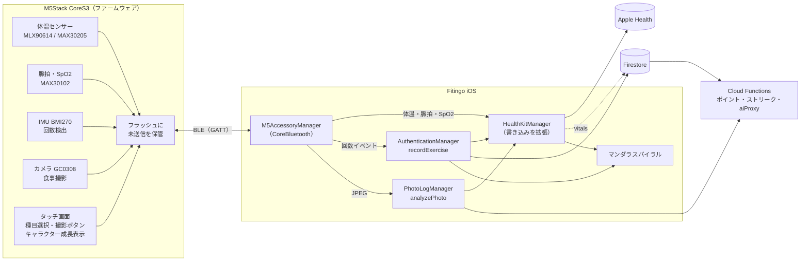

# M5Stack CoreS3 アクセサリー連携 設計書（案）

M5Stack CoreS3 を Fitingo の**追加アクセサリー**として使い、①体温・脈拍、②筋トレの回数、③食事の写真を、Fitingo と Apple Health に連携する構成の設計案です。実装前の提案であり、コードはまだありません。

> 前提: 「M5StackS3」は **M5Stack CoreS3** を指すものとして設計します（ESP32-S3、2.0 インチタッチ画面、カメラ GC0308 0.3MP、6 軸 IMU BMI270 + 磁気センサー、BLE 5 / Wi-Fi、RTC、バッテリー内蔵、Grove ポート）。カメラ付きの機種はこれです。AtomS3 系にはカメラも十分な画面もありません。

---

## 1. 最重要の制約: Apple Health には iPhone アプリからしか書けない

HealthKit は iPhone / Apple Watch 上のアプリ経由でのみ書き込めます。**M5Stack から直接 Apple Health へは書けません**。したがって経路は必ず次の形になります。

```
M5Stack CoreS3 ──BLE──▶ Fitingo（iPhone）──┬─▶ Apple Health（HealthKit）
                                            └─▶ Firestore（Web・ポイント・スパイラル）
```

Fitingo が「ゲートウェイ」になります。これは既存の構成とも相性が良く、Fitingo にはすでに HealthKit 書き込み（`HealthKitManager.saveExercise` / `saveMealNutrition` など）、食事写真の AI 解析（`PhotoLogManager.analyzePhoto`）、トレーニング記録（`AuthenticationManager.recordExercise`）があります。M5 は「入力デバイス」に徹し、判断・保存・課金制御は iPhone 側に置きます。

---

## 2. 全体構成



---

## 3. 機能ごとの設計

### 3.1 体温・脈拍 → Fitingo / Apple Health

**センサー案（Grove Port A の I2C に接続）**

| 用途 | 候補 | 備考 |
|---|---|---|
| 体温（非接触） | MLX90614（M5Stack の NCIR ユニット） | 額・手首の皮膚温。体温計の値とは差が出る |
| 体温（接触） | MAX30205 / TMP117 | ±0.1℃ 級。腋下・指で測る用途向き |
| 脈拍・SpO2 | MAX30102（M5Stack の Heart ユニット） | 指を当てる PPG。動きに弱い |

I2C アドレスは重複しない組み合わせ（MLX90614 0x5A、MAX30102 0x57、MAX30205 0x48）ですが、同一バスの共存は**実機で要確認**です。

**BLE**: 標準プロファイルを使います。

- Heart Rate Service（0x180D）: 脈拍
- Health Thermometer Service（0x1809）: 体温

標準にしておくと、Fitingo 以外の BLE 対応アプリでも読めます。SpO2 は標準の Pulse Oximeter Service（0x1822）か独自特性にします。

**Apple Health への書き込み**（`HealthKitManager` の `writeTypes` に追加が必要。現在は含まれていません）

| データ | HealthKit の型 |
|---|---|
| 体温 | `bodyTemperature` |
| 脈拍 | `heartRate` |
| 酸素飽和度 | `oxygenSaturation` |

- 各サンプルに `HKDevice`（名前 `M5Stack CoreS3`、製造元 `M5Stack`、ファーム版）を付けて、Health アプリ上で由来が分かるようにします。
- **重複防止**: `HKMetadataKeySyncIdentifier` に「デバイス ID + シーケンス番号」を入れ、再送しても二重登録されないようにします。
- **Apple Watch との競合**: Watch のワークアウト中に M5 の脈拍も書くと二重になります。既定では「M5 の脈拍は安静時測定のみ書く」とし、Watch がワークアウト中は書かない運用にします。

**Fitingo での扱い**

- Firestore `users/{uid}/vitals/{id}` に保存（Web でも表示できる。既存ルールで本人のみ読み書き可）
- スパイラルに任意ノード「体温・脈拍を測る」を追加（体重計測ノードと同じ仕組み）

> 医療上の注意: 体温・脈拍は**健康管理の参考値**です。診断・治療用途をうたうと薬機法の対象になり得るため、アプリ内の表現に注意が必要です。

### 3.2 振動（IMU）→ 筋トレの回数 → Fitingo / Apple Health

CoreS3 を手に持つ（ダンベル代わり・胸の前・足首など）状態で回数を数えます。

**処理はデバイス側で行います。**

1. 種目を M5 の画面で選ぶ（スクワット、カール、腕立て等）
2. BMI270 を 50〜100Hz で取得し、既存の iPhone / Watch の回数検出（`MotionDetectionManager`）と同じ考え方でピーク検出
3. 1 セット終了時に**イベント**だけを BLE で送る（生データは送らない。電池と帯域の節約）

```
WorkoutEvent {
  seq:        uint32   // 重複・欠落検出
  exerciseId: uint8    // squat=1, pushup=2 ...
  reps:       uint16
  startEpoch: uint32
  endEpoch:   uint32
  formScore:  uint8    // 0-100（加速度の滑らかさ）
}
```

**iPhone 側の連携**

- `AuthenticationManager.recordExercise` / `recordCompletedSet` に流す。これで既存の仕組みがそのまま動きます。
  - Firestore の `completed-exercises` → `calculatePoints` / `checkAchievements` → ポイント・実績・ストリーク
  - スパイラルのトレーニングノード（時間帯別セット数）に反映
- Apple Health へは `HealthKitManager.saveExercise` を利用（ワークアウト + 消費カロリー）。
  - HealthKit に「回数」という型はないため、回数は `HKWorkout` の**メタデータ**に持たせます（Health アプリには表示されません。回数の正は Fitingo / Firestore です）。
  - 消費カロリーは既存の回数あたり係数による**推定値**です。

**精度の注意**: 持ち方・種目によって検出精度が大きく変わります（腕立てで手に持つのは不向き）。種目ごとにアルゴリズムと持ち方を決め、手動カウントとの誤差で検証してから対応種目を広げます。

### 3.3 カメラ → 食事写真 → Fitingo / Apple Health

Apple Health に画像を書く仕組みはありません。**写真は Fitingo に取り込み、栄養の数値を Apple Health に書く**のが正しい連携です。

1. M5 の画面のボタンで撮影 → JPEG（VGA 程度、数十 KB）
2. BLE で iPhone に転送
3. Fitingo の食事写真ログ（`PhotoLogManager`）に取り込み
4. 既存の AI 解析（`analyzePhoto` → `aiProxy` category `food`）で栄養を推定
5. `saveMealNutrition` で Apple Health に書き込み（エネルギー、たんぱく質、脂質、炭水化物など。これらは現在の `writeTypes` に含まれています）
6. スパイラルの食事ノードが完了

**画像の転送方式**

| 方式 | 内容 | 判断 |
|---|---|---|
| BLE の分割転送（推奨） | 独自特性に 200 バイト前後で分割。ヘッダーに ID・サイズ・CRC。50KB で数秒 | ペアリングだけで動き、追加設定が不要 |
| Wi-Fi + Bonjour | M5 が同一 LAN で HTTP 提供、iPhone が取得 | 高速だが Wi-Fi 設定が必要。ローカルネットワーク許可（`NSLocalNetworkUsageDescription`）は設定済み |

まず BLE で作り、遅ければ Wi-Fi を追加します。

**制約**

- **カメラ画質**: CoreS3 のカメラは 0.3MP で、暗所に弱く食材の判別には不利です。撮影ガイド（明るい場所・真上から）を画面に出す、または高画質の外付けカメラ（OV2640 系ユニット等）を検討します。
- **AI のクォータ**: `aiProxy` は 1 日の回数上限（90 秒モード 1 / 無料 1 / Plus 3）があります。M5 での撮影は何枚でも取り込めますが、**解析はクォータの範囲内**です。超過分は「写真だけ保存、後で解析」にします。
- 食事写真は個人情報です。ペアリング時の認証（後述）と、BLE 経路の暗号化が必須です。

### 3.4 画面のキャラクター成長（やる気アップ）

M5 の画面に Fitingo キャラクターを常時表示し、**長期の成長（体つき）**と**今日の頑張り（表情・演出）**の 2 軸で変化させます。「続けるほど体が変わる」ことと「今この瞬間の反応」の両方で、やる気を引き出す設計です。

**軸 1: 体つき = 長期の成長（6 ステージ）**

| ステージ | 見た目 | 進化条件（案・要調整） |
|---|---|---|
| 1 ひよこ | 細身、汗をかきながら初挑戦 | 開始時 |
| 2 ビギナー | 少し引き締まる | 累計ポイント or 連続記録の第 1 段階 |
| 3 アスリート | 腕と脚に筋肉が付く | 同 第 2 段階 |
| 4 マッスル | 胸板が厚く、ポーズを取る | 同 第 3 段階 |
| 5 ムキムキ | 全身ムキムキ、オーラ | 同 第 4 段階 |
| 6 レジェンド | 金色のオーラ、王冠 | 最終段階（以降は装飾が増える） |

進化条件は、既存の累計ポイントと連続記録（ストリーク）から iPhone 側で計算します。アプリと M5 で成長段階が食い違わないよう、**計算は iPhone に一本化**して結果だけを M5 に送ります。

**軸 2: 表情・演出 = 今日の到達度（スパイラルの達成率 %）**

| 今日の達成率 | 画面 |
|---|---|
| 0〜29% | 眠そうなキャラ、朝焼けの背景。「今日もやろう」 |
| 30〜59% | ストレッチ中。汗と笑顔 |
| 60〜99% | 力こぶ、背景が明るくなる。「あと少し！」 |
| 100% | 全身でポーズ、紙吹雪と炎。お祝いの音 |

**軸 3: 筋トレ中のリアルタイム反応（M5 単体で完結）**

- 1 レップごとに、キャラが力こぶをパンプ（画面が小さく脈動）。カウンターが弾む
- 5 レップごとに小さな演出（スパーク）、セット目標の 50% でキャラが「いい調子！」
- セット完了で紙吹雪と効果音。ここは BLE がつながっていなくても動く

**進化の瞬間（演出のハイライト）**

1. 進化条件を満たすと、画面が白くフラッシュ
2. シルエットが膨らみ、次のステージにモーフ
3. 「レベルアップ！ ムキムキになった！」と表示し、効果音
4. 「次の進化まで あと N ポイント」を進捗バーで見せ、次の目標を分かりやすくする

**やる気を保つための工夫**

- 進化までの残りを常に見せる（ゴールが近いほど動機が上がる）
- 達成率と週間ゴールの進捗を、キャラの足元の小さな 2 本のバーで表示
- **後退させない**: 数日休んでも体つきは戻さない。代わりに「ちょっと休憩中…」と眠そうな表情にし、再開の一歩を促す（罰ではなく励まし）
- 連続記録の節目（7 日・30 日など）に、専用のポーズと背景を解禁
- たまにだけ出るレア演出（変わったポーズ・背景）で、毎回の確認を楽しみにする

**iPhone → M5 の状態通知（BLE の CharacterState）**

```
CharacterState {
  stage:      uint8    // 1-6
  stageProg:  uint8    // 次の進化までの進捗 0-100
  todayPct:   uint8    // 今日のスパイラル達成率
  weekPct:    uint8    // 週間ゴールの進捗
  streak:     uint16   // 連続記録日数
  goalReps:   uint16   // 今日の目標レップ（任意）
  flags:      uint8    // お祝い・レア演出の解禁など
}
```

アプリを開いた時と、達成率が変わった時に iPhone から送ります。M5 は最後の状態を保存しておき、接続がなくても表示できます。

**画像素材と実装**

- CoreS3 の画面は 320×240。全画面のフレームは RGB565 で約 150KB のため、**ステージごとのスプライト画像を圧縮（PNG/JPEG）してフラッシュ（LittleFS、16MB）に置き**、PSRAM 上でダブルバッファ描画（M5GFX）。目標 15〜20fps
- 素材は 6 ステージ × 表情 4 種 + 演出アニメ（数〜十数フレーム）。既存の Fitingo のキャラクターと動画（`fitingo_mv_*.mp4`）からフレームを切り出して下絵にできます。動画はそのままでは M5 で再生できないため、静止画・少数フレームに変換します
- 素材パックはファームウェアと別に更新できるようにし、新しいステージや季節の演出を後から追加できるようにします
- 効果音は内蔵スピーカーで再生（短い WAV）
- 節電: 表示は常時ではなく、動かした時・レップ検出時に点灯し、数十秒で暗くする

---

## 4. BLE 仕様（案）

**ペアリング**: LE Secure Connections。M5 の画面に 6 桁を表示し iPhone で確認（Numeric Comparison / Passkey）。ボンディングを保存し、以後は自動再接続します。

| サービス | 特性 | 方向 | 用途 |
|---|---|---|---|
| Heart Rate（0x180D） | Heart Rate Measurement | M5→iPhone notify | 脈拍 |
| Health Thermometer（0x1809） | Temperature Measurement | M5→iPhone indicate | 体温 |
| Fitingo Accessory（独自 UUID） | Vitals | notify | SpO2・測定品質 |
| 〃 | WorkoutEvent | indicate（Ack あり） | 回数イベント。`seq` で欠落検出 |
| 〃 | ImageTransfer | notify + write | 画像の分割転送（ヘッダー + チャンク + CRC） |
| 〃 | Command | write | 時刻同期、種目選択、撮影要求、未送信データの再送要求 |
| 〃 | CharacterState | iPhone→M5 write | キャラクターの成長段階・達成率・連続記録（3.4） |
| 〃 | DeviceInfo | read | ファーム版、バッテリー、デバイス ID |

**オフライン蓄積**: iPhone と切断中のデータは M5 のフラッシュ（LittleFS）に `seq` 付きで溜め、再接続時に iPhone が「seq N 以降」を要求して受け取ります。時刻は接続時に iPhone から同期し、M5 の RTC（BM8563）で補完します。

---

## 5. Fitingo 側の実装項目

| 項目 | 内容 |
|---|---|
| `M5AccessoryManager`（新規） | CoreBluetooth の中央（セントラル）。スキャン、ペアリング、購読、再接続、受信データの検証と振り分け |
| `HealthKitManager` | `writeTypes` に `heartRate` / `bodyTemperature` / `oxygenSaturation` を追加。書き込み関数（`HKDevice`・`SyncIdentifier` 付き）を追加 |
| Info.plist / project.yml | `NSBluetoothAlwaysUsageDescription`、`UIBackgroundModes` の `bluetooth-central`。`NSHealthUpdateUsageDescription` の文言を体温・脈拍にも触れるよう更新（現在はいずれも未設定または未対応） |
| Firestore | `users/{uid}/vitals`（新規）。ルールは既存の `users/{userId}/{document=**}` で本人のみ可 |
| スパイラル | 「体温・脈拍」ノードの追加（任意） |
| 設定画面 | アクセサリーの接続・解除、電池残量、同期履歴、機能ごとの ON/OFF |
| キャラクター状態 | 成長段階・達成率の計算と `CharacterState` の送信（アプリ側に一本化）。既存の累計ポイントと連続記録を利用 |
| Web | 表示のみ（Firestore の vitals）。Web Bluetooth は iOS Safari 非対応のため、接続は iOS アプリに限定 |

バックグラウンドでの受信は、CoreBluetooth の状態復元（State Restoration）を有効にして、アプリが終了していても再接続できるようにします。

---

## 6. M5Stack ファームウェア

- 開発環境: PlatformIO + Arduino（M5Unified / M5CoreS3）、BLE は NimBLE-Arduino
- タスク構成: センサー取得（脈拍は PPG のため高頻度）／IMU・回数検出／BLE 送信／画面 UI／カメラ
- 電池: 内蔵バッテリーは小容量のため、待機時は Light Sleep、IMU の割り込みで復帰。撮影・測定時のみ高負荷
- 更新: Wi-Fi 経由の OTA（またはケーブル書き込み）
- 画面 UI: 待機画面はキャラクター（3.4）。ボタンは「体温」「脈拍」「筋トレ（種目選択）」「食事撮影」の 4 つ

---

## 7. 開発フェーズ

| フェーズ | 内容 | 目安 |
|---|---|---|
| 0. PoC | 脈拍を BLE で送り、iPhone で受信・表示 | 1〜2 週 |
| 1. バイタル | 体温・脈拍を HealthKit と Firestore に書き込み、重複防止・Watch 競合の扱い | 2〜3 週 |
| 2. 筋トレ | 1〜2 種目で回数検出、Fitingo・Apple Health へ連携。手動カウントで精度検証 | 3〜4 週 |
| 3. カメラ | 撮影・BLE 画像転送・AI 解析・栄養書き込み | 2〜3 週 |
| 4. キャラクター | 6 ステージの素材制作、進化演出、レップ連動の反応、CharacterState 連携 | 3〜4 週（素材制作に依存） |
| 5. 製品化 | 電池最適化、OTA、設定 UI、Web 表示、種目追加 | 継続 |

期間は目安で、実機での検証結果によって大きく変わります。

---

## 8. リスクと未確認事項

| リスク | 対応 |
|---|---|
| バックグラウンド BLE が iOS に止められる | 状態復元と再接続の実機検証。切断中は M5 側に蓄積 |
| 脈拍・体温の精度（PPG は動きに弱い） | 安静時測定に限定、測定品質を併せて送り低品質は書かない |
| 回数検出の精度が種目・持ち方で変わる | 種目ごとの検証。誤検出時は Fitingo 側で回数を手修正できる |
| カメラ画質が低く栄養推定が不安定 | 撮影ガイド、AI 結果の手修正、外付けカメラの検討 |
| Apple Watch との二重記録 | `HKDevice` と `SyncIdentifier`、Watch ワークアウト中は書かない |
| 薬機法（体温・脈拍の表現） | 「参考値」の表示、診断を思わせる表現を避ける |
| 電波法 | 国内販売の**技適マーク付き**モデルを使う（要確認） |
| センサーの I2C 共存・電力 | 実機で検証。必要なら Port B/C を利用 |
| App Store 審査 | HealthKit の用途説明（Info.plist・プライバシーラベル）を更新。BLE は MFi 不要 |

**未確認**: センサーの実測精度、CoreS3 上でのカメラと BLE 同時動作時の電力、iOS でのバックグラウンド再接続の安定性。これらは PoC（フェーズ 0〜1）で最初に確かめます。
