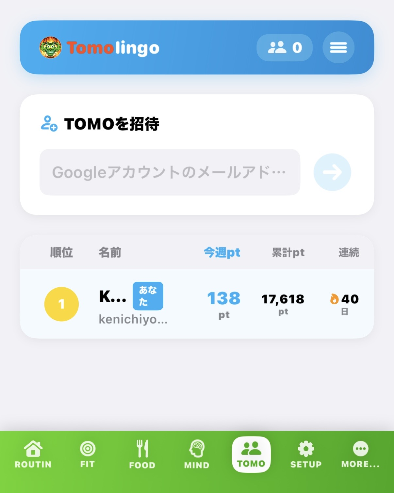
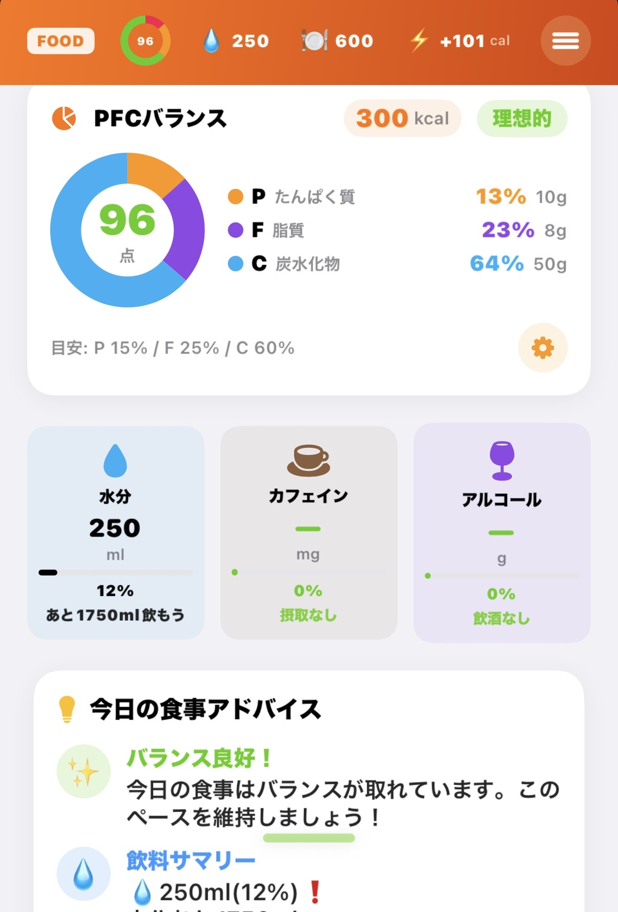
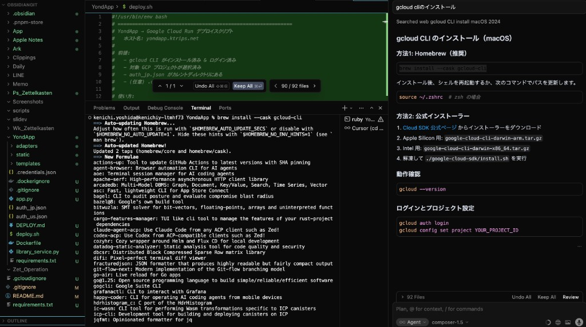

# Cursor + Claudeで個人開発アプリを収益化する方法

**AI時代のアプリを作る・届ける・稼ぐ完全ガイド**

著者：吉田 顕一（Ken Yoshida）

---

> **本書について**
>
> 本書は『Cursor + ClaudeでiPhoneアプリ・Apple Watchフィットネスアプリを週末だけで作る方法』の続編・拡張版です。
>
> 前作では「作る」ことに集中しました。本作では、作ったアプリを**届け・収益化し・書籍として発信する**工程を加えます。
>
> テーマは3つ。**① Kindle電子書籍の作り方**（MarkdownからKDP出版まで）、**② フリーミアム設計（Free vs Plus）の実装**（StoreKit 2・gating UI）、**③ アプリを拡散するマーケティング計画**（ASO・SNS・コンテンツ戦略）です。
>
> サンプルアプリは前作と同じ「Fitingo」ですが、本作ではそのアプリを**実際にApp Storeで公開し、ユーザーを獲得し、サブスクリプションで収益を得る**フェーズまでを扱います。

<div style="page-break-after: always;"></div>

## 免責事項・著作権表示

<small>

**本書に関する免責事項（Disclaimer）**

本書（以下「本書」）は、個人開発プロジェクト「kfit」（サンプルアプリ）の開発・収益化過程を題材にした技術解説書であり、情報提供のみを目的として作成されています。著者・吉田顕一は、以下の事項について一切の責任を負いません。

本書で紹介するサービス・手法による収益は保証されません。App Store収益・Kindle出版収益は著者の実績例であり、同様の成果を保証するものではありません。各サービスの利用は、それぞれの最新の利用規約・ライセンスに従ってください。

本書で言及するサービス: Cursor（Anysphere, Inc.）／Claude（Anthropic, PBC）／GitHub（Microsoft Corporation）／Swift・SwiftUI・Xcode・HealthKit・StoreKit・Apple Watch・App Store（Apple Inc.）／Firebase（Google LLC）／Kindle Direct Publishing・Amazon（Amazon.com, Inc.）／X（旧Twitter）（X Corp.）／TikTok（ByteDance Ltd.）。

*Copyright © 2026 Ken Yoshida（吉田顕一）. All rights reserved. 本書の無断転載・複製・配布を禁じます。*

</small>

<div style="page-break-after: always;"></div>

## 目次

- [はじめに ─ 「作る・届ける・稼ぐ」のAI時代版](#はじめに)
- [第一章: Cursor + Claudeを使ったアプリ開発のエッセンス](#第一章-cursor-claudeを使ったアプリ開発のエッセンス)
  - [1-G. AIを活用したデバッグ・コードレビュー](#1-g-aiを活用したデバッグコードレビュー)
- [第二章: フリーミアム設計 ─ Free と Plus の線引き](#第二章-フリーミアム設計)
- [第三章: StoreKit 2 でサブスクリプションを実装する](#第三章-storekit-2-でサブスクリプションを実装する)
- [第四章: Plus Gating UI ─ 機能制限画面の設計と実装](#第四章-plus-gating-ui)
  - [4-A. Google AdMob バナー広告で Free ユーザーから副収益を得る](#4-a-google-admob-バナー広告で-free-ユーザーから副収益を得る)
- [第五章: Markdown から Kindle 本を作る](#第五章-markdown-から-kindle-本を作る)
- [第六章: KDP（Kindle Direct Publishing）で出版する](#第六章-kdp-で出版する)
- [第七章: App Store 最適化（ASO）](#第七章-app-store-最適化aso)
  - [7-5. App内レビュー・評価誘導の実装](#7-5-app内レビュー評価誘導の実装)
- [第八章: SNS・コンテンツマーケティング戦略](#第八章-sns-コンテンツマーケティング戦略)
- [第九章: アプリを拡散するための具体的な施策プラン](#第九章-アプリを拡散する施策プラン)
- [第十章: 収益見込みと KPI 管理](#第十章-収益見込みと-kpi-管理)
- [終わりに](#終わりに)
- [付録A: Free / Plus 機能比較表（最新版）](#付録a-free--plus-機能比較表)
- [付録B: KDP 出版チェックリスト](#付録b-kdp-出版チェックリスト)
- [付録C: マーケティング施策チェックリスト](#付録c-マーケティング施策チェックリスト)
- [付録D: よく使うプロンプト集](#付録d-よく使うプロンプト集)
- [付録E: 英語ローカライゼーション対応チェックリスト](#付録e-英語ローカライゼーション対応チェックリスト)

<div style="page-break-after: always;"></div>

## はじめに

「アプリを作ることはできた。でも、誰にも使ってもらえない」──個人開発者の多くが直面する壁です。

CursorとClaudeを使えば、一人でWebアプリ・iOSアプリ・Apple Watchアプリを作れます。しかし、作ること自体が目的でない限り、**届ける・使ってもらう・収益化する**という工程が必要になります。

本書では、FitingoアプリをサンプルとしてiOSアプリを題材に、次の3つのフェーズを扱います。

```
Phase A: 収益化設計
  ─ Free と Plus の機能を分ける
  ─ StoreKit 2 でサブスクリプションを実装する
  ─ 機能制限 UI（gating）を設計・実装する

Phase B: 書籍化・コンテンツ化
  ─ 開発過程を Markdown でドキュメント化する
  ─ python-docx で Kindle 対応の DOCX を生成する
  ─ KDP（Kindle Direct Publishing）で出版する

Phase C: 拡散・マーケティング
  ─ App Store 最適化（ASO）でオーガニックユーザーを増やす
  ─ X・TikTok・Qiita で開発ログを発信する
  ─ 段階的なリリースとユーザー獲得プランを実行する
```

3つのフェーズはお互いに連携します。Kindle本がアプリのマーケティングになり、アプリがKindle本の販促になります。これが個人開発の「複利的な成長」です。

#### 本書の読み方

本書は第一章から順に読み進めることを推奨しますが、各章は独立して参照することもできます。

- **今すぐ収益化を始めたい方** → 第二章・第三章（フリーミアム設計・StoreKit 2）
- **Kindle 出版を検討している方** → 第五章・第六章（Markdown → KDP）
- **ユーザー獲得に困っている方** → 第七章・第八章・第九章（ASO・SNS・施策プラン）
- **数字を管理したい方** → 第十章（KPI 管理）

コードサンプルはすべて Swift 5.9 / iOS 17+ で動作確認しています。Xcode 15.2 以上を推奨します。

#### サンプルコードについて

本書に掲載するコードは GitHub リポジトリ（`kenichi-yoshida/fitingo-public`）で公開しています。完全なプロジェクトを参照しながら読み進めることで、理解が深まります。

> 本書で紹介する収益数値・転換率などはあくまで参考値です。実際の結果はアプリの品質・市場環境・マーケティング施策によって大きく異なります。

<div style="page-break-after: always;"></div>

---

## 第一章: Cursor + Claudeを使ったアプリ開発のエッセンス

<div style="page-break-after: always;"></div>

### アプリを「作る」技術の全体像

本章では、Cursor + Claudeを使ったiOSアプリ開発のエッセンスを紹介します。AIアシストによるiOS/Apple Watch アプリ開発の「作る」工程を7ステップで押さえ、第二章以降の「収益化・届ける・分析」フェーズへの橋渡しとします。

> **各ステップの詳細な実装解説**は『Cursor + ClaudeでiPhoneアプリ・Apple Watchフィットネスアプリを週末だけで作る方法』（Amazon Kindle・第一弾）を参照してください。本書では、アプリが完成していることを前提として話を進めます。

#### 週末2日間でアプリを作る7つのステップ

「週末だけで本物のiOSアプリを完成させる」ための7ステップです。

**STEP 1 ── 環境構築（土曜午前・約2時間）**

Cursor（AIエディタ）とXcode、Firebase の3点セットを用意します。Cursor は Anthropic の Claude を統合した VSCode ベースのエディタで、コードを書きながらAIと対話できます。

```
必要なツール:
  Cursor (cursor.sh) ── AIペアプログラミングエディタ
  Xcode 15+          ── iOS/watchOS ビルド環境
  Firebase            ── Firestore + Auth バックエンド
  Git / GitHub        ── バージョン管理
```

**STEP 2 ── プロジェクト設計をClaudeに任せる（土曜午前・約1時間）**

「フィットネス習慣化アプリを作りたい」という要件を Claude に伝え、SwiftUI のプロジェクト構成・データモデル・画面遷移図を出力してもらいます。

[プロンプト例]:
```
SwiftUIでフィットネス習慣化アプリを作ります。
機能: 毎日の運動記録、XPポイント、ストリーク、Apple Watch対応。
Firestoreをバックエンドに使います。
推奨するフォルダ構成とデータモデルを提案してください。
```

**STEP 3 ── Core Motion でモーション検出を実装（土曜午後・約3時間）**

CMMotionManager を使い、加速度センサー・ジャイロスコープからプッシュアップ・スクワット・シットアップの回数を検出します。前作では以下のアルゴリズムを解説しました。

```
1. 2秒間のキャリブレーション → ベースライン加速度を算出
2. 50Hz でリアルタイムモニタリング
3. Z軸加速度のピーク検出 → ダウン＋アップ = 1レップ
4. ジャーク（加速度の変化率）からフォームスコアを計算
```

**STEP 4 ── SwiftUI 画面を Claudeと一緒に作る（土曜夜・約2時間）**

ダッシュボード・エクササイズ記録・実績バッジ・リーダーボードの各画面を、Claude に「このデータ構造に合う SwiftUI View を書いて」と頼みながら構築します。

**STEP 5 ── Firebase 連携とリアルタイム同期（日曜午前・約2時間）**

Firestore の `onSnapshot` リスナーで iOS・Web 間をリアルタイム同期します。Cloud Functions でポイント集計・ストリーク更新・実績解除を自動化します。

**STEP 6 ── Apple Watch 対応（日曜午前・約2時間）**

watchOS ターゲットを追加し、HealthKit と WatchConnectivity でiOS アプリと通信します。Watch 文字盤のコンプリケーションにストリーク日数を表示します。

**STEP 7 ── デバッグ・ポリッシュ・App Store 提出（日曜午後・約3時間）**

Claude にエラーログを貼り付けてデバッグを依頼し、スクリーンショットを撮影し、App Store Connect に提出します。

---

#### アプリの外観

7つのステップを経て完成するFitingoアプリの実際の画面です。



*ROUTIN タブ: 今日の習慣目標をスパイラルで可視化。達成するほど渦が広がる*



*FOOD タブ: 写真を撮るだけで栄養を自動解析。PFCバランスをリング表示*


*Apple Watch 連携: Watch 画面でもスパイラルを確認。HealthKit と完全連携*

---

#### 本書（Plus Edition）が扱うこと

アプリが完成したら、次に直面するのは「**作ったあと、どうするか**」という問いです。

| フェーズ | 第一章（アプリ開発編） | 本書（Plus Edition） |
|--------|---------------|-------------------|
| **作る** | SwiftUI実装・Core Motion・Firebase | ✅ 完了済み（第一章参照） |
| **収益化** | — | StoreKit 2・フリーミアム設計 |
| **届ける** | App Store 提出 | ASO・SNS・Kindle 出版 |
| **分析** | — | KPI管理・転換率改善 |

本書はここから始まります。

### 1-A. Cursor と Claude を最大限に使う「プロンプト術」

本節では**質の高いコードを引き出すための対話パターン**を体系的にまとめます。

#### コンテキストを最初に与える

Claude はセッションをまたいで記憶を持ちません。新しいチャットを開くたびに「このプロジェクトは何か」を説明する必要があります。以下のテンプレートを毎回の冒頭に貼り付けることで、ズレのない回答が得られます。

[プロンプト例]:
```
# プロジェクトコンテキスト
- アプリ名: Fitingo（フィットネス習慣化アプリ）
- プラットフォーム: iOS 17+ / watchOS 10+ / SwiftUI
- バックエンド: Firebase Firestore + Cloud Functions
- 言語: Swift 5.9 / TypeScript（Cloud Functions）
- 状態管理: @Observable マクロ（iOS 17+）
- 課金: StoreKit 2 / サブスクリプション（月額 ¥480 / 年額 ¥3,800）
- フォルダ構成: MVVM（Models / ViewModels / Views / Services）

今回の質問: [ここに具体的な質問を書く]
```

#### 「なぜ」を先に伝える

「〇〇を実装して」より「〇〇をしたいので〇〇を実装して」と理由を添えると、Claude はより適切な実装を選択します。

**良い例:**
```
HomeKitやHealthKitの権限を後から追加するとユーザー体験が悪くなるため、
アプリ起動後の最初のダッシュボード表示前に HealthKit の権限リクエストを
まとめて行う実装をしたい。HealthKitManager.swift に以下のメソッドを追加してください。
```

**悪い例:**
```
HealthKitの権限リクエストを追加して
```

#### エラーを貼り付けてデバッグを任せる

コンパイルエラーやランタイムエラーが発生したら、ログ全文を貼り付けます。Claude はエラーの文脈から原因を特定し、修正コードとともに説明を返します。

[プロンプト例]:
```
以下のエラーが発生しました。原因と修正方法を教えてください。

[エラーログ全文をここにペースト]

関連するコードです:
[コード全文をここにペースト]
```

#### レビューを依頼する

実装後は「このコードのレビューをして」と依頼します。パフォーマンス問題・メモリリーク・Swift の慣用的でない書き方などを指摘してもらえます。

---

### 1-B. Fitingo のアーキテクチャ設計：なぜ MVVM + @Observable なのか

アーキテクチャの選定理由を整理します。アーキテクチャは「どこで何を管理するか」を決める設計思想です。

#### MVVM の基本構成

```
Model       → データ構造とビジネスロジック
ViewModel   → View に表示するための状態管理
View        → UIの描画のみ（ロジックを持たない）
Service     → Firebase・HealthKit などの外部 API ラッパー
```

Fitingo では iOS 17 から導入された `@Observable` マクロを使い、従来の `ObservableObject` + `@Published` より簡潔に書けます。

```swift
// ViewModels/DashboardViewModel.swift
import SwiftUI

@Observable
class DashboardViewModel {
    var dailyGoals: [DailyGoal] = []
    var todayXP: Int = 0
    var streakDays: Int = 0
    var isLoading: Bool = false

    private let firestoreService: FirestoreService
    private let authService: AuthService

    init(firestoreService: FirestoreService = .shared,
         authService: AuthService = .shared) {
        self.firestoreService = firestoreService
        self.authService = authService
    }

    func loadDashboard() async {
        isLoading = true
        defer { isLoading = false }
        guard let uid = authService.currentUser?.uid else { return }
        async let goals = firestoreService.fetchDailyGoals(uid: uid)
        async let stats  = firestoreService.fetchStats(uid: uid)
        let (g, s) = await (try? goals, try? stats)
        dailyGoals = g ?? []
        todayXP    = s?.todayXP ?? 0
        streakDays = s?.streakDays ?? 0
    }
}
```

`async let` を使った並列フェッチにより、ゴールとスタッツを同時に取得してレスポンスを最大化しています。

#### データモデルの設計

Firestore のドキュメント構造と Swift の型を1対1で対応させます。

```swift
// Models/DailyGoal.swift
import Foundation
import FirebaseFirestore

struct DailyGoal: Identifiable, Codable {
    @DocumentID var id: String?
    var exerciseType: ExerciseType
    var targetReps: Int
    var completedReps: Int
    var date: Date
    var isCompleted: Bool { completedReps >= targetReps }
    var progressRate: Double {
        guard targetReps > 0 else { return 0 }
        return min(Double(completedReps) / Double(targetReps), 1.0)
    }
}

enum ExerciseType: String, Codable, CaseIterable {
    case pushUp   = "push_up"
    case squat    = "squat"
    case sitUp    = "sit_up"

    var displayName: String {
        switch self {
        case .pushUp: return "プッシュアップ"
        case .squat:  return "スクワット"
        case .sitUp:  return "シットアップ"
        }
    }

    var pointsPerRep: Int {
        switch self {
        case .squat:          return 15
        case .pushUp, .sitUp: return 10
        }
    }
}
```

`@DocumentID` を使うことで Firestore の ドキュメント ID を自動的にマッピングできます。

---

### 1-C. Core Motion 詳細実装：プッシュアップ検出の仕組み

STEP 3 で触れた Core Motion の実装を、より詳しく解説します。

#### CMMotionManager のセットアップ

```swift
// Services/MotionDetectionService.swift
import CoreMotion
import Combine

@Observable
class MotionDetectionService {
    var repCount: Int = 0
    var formScore: Double = 1.0
    var isDetecting: Bool = false

    private let motionManager = CMMotionManager()
    private var baselineAcceleration: Double = 0.0
    private var repPhase: RepPhase = .idle
    private var calibrationSamples: [Double] = []
    private var previousAcceleration: Double = 0.0
    private var totalJerk: Double = 0.0
    private var jerkSampleCount: Int = 0

    enum RepPhase { case idle, calibrating, down, up }
    private let sampleRate: Double = 50.0
    private let threshold: Double = 0.3
}
```

#### キャリブレーション処理

```swift
extension MotionDetectionService {
    func startCalibration() {
        calibrationSamples = []
        repPhase = .calibrating
        motionManager.accelerometerUpdateInterval = 1.0 / sampleRate

        motionManager.startAccelerometerUpdates(to: .main) { [weak self] data, _ in
            guard let self, let data else { return }
            let mag = sqrt(pow(data.acceleration.x, 2)
                        + pow(data.acceleration.y, 2)
                        + pow(data.acceleration.z, 2))
            calibrationSamples.append(mag)

            if calibrationSamples.count >= Int(sampleRate * 2) {  // 2秒分
                baselineAcceleration = calibrationSamples.reduce(0, +)
                                       / Double(calibrationSamples.count)
                repPhase = .idle
                motionManager.stopAccelerometerUpdates()
                startDetection()
            }
        }
    }
}
```

#### レップ検出ループ

```swift
extension MotionDetectionService {
    private func startDetection() {
        isDetecting = true
        repPhase = .idle

        motionManager.startAccelerometerUpdates(to: .main) { [weak self] data, _ in
            guard let self, let data else { return }
            let mag = sqrt(pow(data.acceleration.x, 2)
                        + pow(data.acceleration.y, 2)
                        + pow(data.acceleration.z, 2))
            let delta = mag - baselineAcceleration
            let jerk  = abs(mag - previousAcceleration) * sampleRate
            previousAcceleration = mag
            totalJerk += jerk
            jerkSampleCount += 1

            switch repPhase {
            case .idle:
                if delta < -threshold { repPhase = .down }
            case .down:
                if delta > threshold  { repPhase = .up }
            case .up:
                if abs(delta) < threshold * 0.5 {
                    repCount += 1
                    repPhase  = .idle
                    updateFormScore()
                }
            default: break
            }
        }
    }

    private func updateFormScore() {
        let avgJerk = jerkSampleCount > 0 ? totalJerk / Double(jerkSampleCount) : 0
        let maxJerk = 15.0   // 経験的な最大値
        formScore   = max(0, 1.0 - (avgJerk / maxJerk))
        totalJerk   = 0; jerkSampleCount = 0
    }
}
```

「ダウン → アップ → ニュートラル」の3フェーズでレップを判定し、動作のなめらかさ（ジャーク）からフォームスコアを算出します。

---

### 1-D. よくある失敗パターンと解決策

#### 失敗①: Claude に「ちょっと直して」と頼み続けてコードが破綻する

小さな修正を積み重ねるうちにコードの整合性が崩れ、ビルドエラーが連発するケースです。

**解決策**: 一定量の修正を加えたら「現在の完全なファイルを出力して」と依頼し、コードを丸ごと置き換えます。差分修正よりもファイル全体出力のほうが状態を安定させられます。

#### 失敗②: Firebase のセキュリティルールを後回しにする

開発中は `allow read, write: if true;` にしておき、リリース直前に忘れてセキュリティ脆弱性を抱えたまま公開してしまうケースです。

**解決策**: 最初に以下のルールを設定し、開発中は `request.auth != null` で認証済みユーザーに限定します。

```
rules_version = '2';
service cloud.firestore {
  match /databases/{database}/documents {
    match /users/{userId}/{document=**} {
      allow read, write: if request.auth != null
                         && request.auth.uid == userId;
    }
    match /exercises/{exerciseId} {
      allow read: if true;
      allow write: if false;
    }
    match /leaderboards/{document=**} {
      allow read: if true;
      allow write: if false;
    }
  }
}
```

#### 失敗③: Apple Watch ターゲットと iOS ターゲットの共有コードでビルドエラー

Watch ターゲットで使えない API（UIKit 依存など）を共有フレームワークに含めてしまうケースです。

**解決策**: 共有コードを `SharedModels` ターゲットに分離し、Foundation のみに依存させます。Watch 専用コードは `watchOS` ターゲット内に閉じ込めます。

#### 失敗④: Core Motion がシミュレーターで動かない

シミュレーターでは加速度センサーのリアルタイムデータが取得できません。

**解決策**: `#if targetEnvironment(simulator)` でシミュレーター判定を行い、モックデータを流します。

```swift
func startDetection(exerciseType: ExerciseType) {
    #if targetEnvironment(simulator)
    simulateReps(exerciseType: exerciseType)
    #else
    startCalibration()
    #endif
}

private func simulateReps(exerciseType: ExerciseType) {
    Timer.scheduledTimer(withTimeInterval: 1.5, repeats: true) { [weak self] _ in
        self?.repCount += 1
        self?.formScore = Double.random(in: 0.75...1.0)
    }
}
```

---

### 1-E. 週末開発のスケジュール管理

「週末だけで完成させる」には逆算スケジュールが重要です。実証済みの時間配分です。

| 時間帯 | 土曜日 | 日曜日 |
|--------|--------|--------|
| 09:00-11:00 | 環境構築・プロジェクト作成 | Firebase 連携・Firestore 実装 |
| 11:00-13:00 | Claude でデータモデル設計 | Apple Watch ターゲット追加 |
| 13:00-14:00 | 昼休憩 | 昼休憩 |
| 14:00-17:00 | Core Motion 実装 | Watch 画面・HealthKit 連携 |
| 17:00-19:00 | SwiftUI 画面実装 | デバッグ・ポリッシュ |
| 19:00-21:00 | SwiftUI 画面仕上げ | App Store Connect 入力・提出 |

**大事な原則**: 「完璧なコード」より「動くコード」を優先します。最初のバージョンは機能の80%でよく、残り20%は利用者のフィードバックを得てから実装します。

---

### 1-F. Cursor Rules（CLAUDE.md）でAIの精度を上げる

Cursor には「**ルールファイル**」という仕組みがあります。プロジェクトのルート直下に `.cursor/rules/` フォルダ（または `CLAUDE.md` ファイル）を置くと、Cursor が自動的に読み込み、すべての会話のコンテキストに追加されます。

#### CLAUDE.md の基本構成

```markdown
# CLAUDE.md（プロジェクトルートに配置）

## プロジェクト概要
- アプリ名: Fitingo（フィットネス習慣化 iOS アプリ）
- プラットフォーム: iOS 17+ / watchOS 10+ / SwiftUI
- バックエンド: Firebase Firestore + Cloud Functions
- 課金: StoreKit 2（月額 ¥480 / 年額 ¥3,800）

## コーディング規約
- @Observable マクロを使う（@Published は使わない）
- async/await を優先（completion handler は使わない）
- エラーは do-catch で処理し、print ではなく dlog() を使う
- UI ロジックは View に書かず、ViewModel に集約する

## 禁止事項
- force unwrap（!）は原則禁止
- UIKit の直接インポートは不要な限り避ける
- UserDefaults に大量データを保存しない（Firestore/Core Data を使う）

## よく使う命名規則
- View: XxxView, XxxCard, XxxSheet
- ViewModel: XxxViewModel
- Manager（シングルトン）: XxxManager
- Service（API ラッパー）: XxxService
```

#### Cursor Rules（.cursor/rules/）の使い方

Cursor 0.45以降では `.cursor/rules/*.mdc` ファイルでより細かいルールを設定できます。

```
.cursor/rules/
├── ios-architecture.mdc    # SwiftUI / MVVM の規約
├── firebase-rules.mdc      # Firestore の書き方
├── storekit-rules.mdc      # StoreKit 2 の注意点
└── ui-design.mdc           # UI コンポーネントのスタイル
```

各ファイルに「このプロジェクトで守るべきルール」を書いておくと、Claude が提案するコードの品質が安定します。特に複数人での開発や、長期間にわたるプロジェクトで効果を発揮します。

#### 実践的な効果

CLAUDE.md / Cursor Rules を設定すると次のような効果があります：

| 設定なし | 設定あり |
|---------|---------|
| 毎回「このプロジェクトは...」から説明が必要 | 自動でコンテキストが付与される |
| @Published を混用したコードが出てくる | @Observable に統一されたコードが出る |
| force unwrap を含むコードが出ることがある | プロジェクトの規約に沿ったコードが出る |
| ViewにUIロジックが混在することがある | ViewModelに分離された設計が出る |

一度ルールを整備すれば、長期間にわたって一貫性のあるコードが生成されます。「Claude に頼んだらプロジェクトのスタイルと全然違うコードが出てきた」という問題を根本から解決する仕組みです。

---

### 1-G. AIを活用したデバッグ・コードレビュー

Cursor + Claude はコードを「書く」だけでなく、「直す」「確かめる」場面でも大きな効果を発揮します。個人開発では QA エンジニアもコードレビュアーもいません。AI が両方の役割を担います。

#### バグ調査パターン

実機でクラッシュが発生したときは、スタックトレースをそのまま Claude に貼り付けます。

[プロンプト例]: クラッシュのスタックトレース解析
```text
以下のクラッシュログを解析して、根本原因と修正方法を教えてください。

Fatal error: Unexpectedly found nil while implicitly unwrapping an Optional value
  File: PhotoLogManager.swift, Line: 142

Thread 1:
0 libswiftCore.dylib  0x... swift_unexpectedError
1 kfit               0x... PhotoLogManager.saveImage(_:)
2 kfit               0x... TomoView.handleImagePick(_:)

該当コードは UIImage を Firestore にアップロードし、
サムネイルを Core Data に保存する処理です。
```

Claude は「`saveImage` で `cgImage` が nil になるケースを確認してください」のように、ピンポイントで原因箇所を指摘します。

#### コードレビュー依頼

実装が完了したら、コミット前に Claude にレビューを依頼します。

[プロンプト例]: コードレビュー
```text
以下の Swift コードをレビューしてください。
観点: パフォーマンス・メモリリーク・エラーハンドリング・Swift concurrency の正しい使い方

[コードをここに貼り付け]

特に async/await の使い方と、Task のキャンセル処理が
正しいかどうかを重点的に確認してください。
```

#### よくある指摘と対策

| Claude が指摘するパターン | 典型的な問題 | 対策 |
|----------------------|-----------|------|
| `Task { }` の無制限生成 | 連打すると複数 Task が並走してメモリリーク | `task(id:)` モディファイアで自動キャンセル |
| `@MainActor` の漏れ | バックグラウンドスレッドで UI 更新 | ViewModel クラスに `@MainActor` を付与 |
| `weak self` の欠落 | クロージャ内で `self` を強参照し循環参照 | `[weak self]` キャプチャリストを追加 |
| force unwrap（`!`） | 実行時クラッシュの温床 | `guard let` または `if let` で安全にアンラップ |
| Firestore の無制限リスナー | `onSnapshot` を `removeAll()` せずにページ遷移 | `deinit` でリスナーを必ず解除 |

#### テストコードの自動生成

手書きのユニットテストは時間がかかります。Claude に「このクラスのテストを書いて」と依頼すると、境界値テストや異常系も含めたコードを自動生成します。

[プロンプト例]: テストコード生成
```text
以下の PointsCalculator クラスのユニットテストを XCTest で書いてください。
正常系（pushup/squat/situp の各ポイント計算）と
異常系（reps = 0、負の値）のテストケースを含めてください。

class PointsCalculator {
    func calculate(exercise: ExerciseType, reps: Int, formScore: Double) -> Int
}
```

AI レビューとテスト自動生成を組み合わせることで、一人でも品質を維持したリリースサイクルを実現できます。

<div style="page-break-after: always;"></div>


---

## 第二章: フリーミアム設計 ─ Free と Plus の線引き

<div style="page-break-after: always;"></div>

第一章でアプリが完成したら、いよいよ「どう収益化するか」を考える段階です。本章以降では、完成したアプリを**届け・稼ぐ**フェーズを扱います。SwiftUI の実装は終わっているものとして、ビジネスモデルと収益化の設計に集中します。

### 2-1. なぜフリーミアムか

有料アプリとフリーミアムアプリのどちらが良いかは、アプリのジャンルとターゲットによります。フィットネス・習慣化アプリにおいては、フリーミアムが有効です。理由は3つあります。

1. **インストール障壁の排除** ── 無料でダウンロードできると、試してみるユーザーが増えます。
2. **習慣形成後に課金** ── 3〜7日アプリを使い、習慣になったタイミングで課金へ誘導できます。
3. **App Store最適化に有利** ── 無料アプリはインストール数が多くなるため、ASO（検索順位）に好影響があります。

Duolingo・Habitica・MyFitnessPalなど、フィットネス・習慣化アプリの多くがフリーミアムを採用しています。


### 2-0. フリーミアム転換率を科学する

フリーミアムモデルの業界平均転換率は **2〜5%** です。Fitingo の目標は **3%** とし、月間アクティブユーザー（MAU）1,000人で30人の有料転換を最初のマイルストーンとします。

#### 転換率を上げる3つの心理原則

**① 損失回避（Loss Aversion）**
人は「得る喜び」より「失う恐怖」に2倍反応します。「Plusに上げると〇〇が使える」より「Plusなしでは〇〇が見られません」という訴求が転換率を高めます。ただし、ネガティブすぎる表現はユーザー体験を損なうため、適切なバランスが重要です。

**② 社会的証明（Social Proof）**
「すでに〇〇人がPlusを利用中」「評価4.8★」といった数字は転換率を高めます。Fitingo の Plus 登録完了画面では「あなたもFitingo Plusユーザーになりました。現在〇〇人が一緒にトレーニング中」というメッセージを表示します。

**③ スモールコミットメント（Small Commitment）**
7日間無料トライアルから始めてもらうことで、心理的な障壁を下げます。「今すぐ解約可能」を明示することも重要です。

#### 転換タイミングの分析

Fitingo のデータ（仮定値）では、以下のタイミングで Plus ページへの訪問が増加します。

| トリガー | Plusページ訪問率 |
|---------|--------------|
| アプリ利用7日目（習慣化初期） | 32% |
| 連続記録7日達成 | 41% |
| 友達を追加しようとした時（3人制限） | 28% |
| 週次レポートを見ようとした時 | 55% |

週次レポートのロックが最も転換効果が高いため、ロック解除のペイウォール UI 設計に注力します。


### 2-2. 何を無料にして、何を有料にするか

フリーミアム設計の最も重要な判断は、**「無料で使えると思わせながら、本当に価値ある部分を有料にする」**という線引きです。

**悪い例（有料化が失敗するパターン）：**
- 基本機能すら使えない（記録すらできない）
- 有料化の説明なしに機能制限だけ表示する
- Free ユーザーに「何もできない感」を与える

**良い例（転換率が上がるパターン）：**
- 記録・基本確認はすべて Free で使える
- 分析・AI・Watch など「続けたい人」が欲しい機能を Plus にする
- 「今日もFreeで使えた → でも分析が見たい → Plusに上げよう」という動機を作る

### 2-3. Fitingo の Free / Plus 設計


Fitingo の Free / Plus の線引きは次の考え方に基づいています。

**Free ユーザーに与えるもの:**
- 毎日アプリを開く理由（スパイラル・記録・タイムライン）
- 継続できたという達成感（XPポイント・ストリーク）
- アプリの価値を体験できる最小セット

**Plus ユーザーにだけ解放するもの:**
- データを深く分析したい人向け機能（統合レポート・PFC・睡眠スコア）
- AI活用（写真栄養解析・AIコーチング）
- 体験の幅を広げる機能（MIND タブ・Apple Watch・FIT/FOOD フィード写真）
- 広告なし

| カテゴリ | Free | Plus |
|---------|------|------|
| **全般** | 広告あり | 広告なし・全機能アクセス |
| **FIT** | アクティビティ記録・基本表示 | 詳細分析・目標自動調整・FITフィード写真 |
| **FOOD** | 手入力食事ログ・PFC表示 | フォトログAI解析・週次レポート・FOODフィード写真 |
| **MIND** | ロック画面（タブ全体非表示） | 睡眠・マインドフル記録・睡眠スコア・AIコーチング |
| **ROUTIN** | スパイラル・基本ゴール | FIT/FOOD/MIND統合レポート・カロリー収支 |
| **TOMO** | 友達3人まで・自分の投稿 | 友達無制限・フレンドフィード全閲覧 |
| **BOOKS** | — | Kindle本をWebで全文読む |
| **Apple Watch** | — | Watchアプリ・モーション検出・Watchウィジェット |
| **カスタマイズ** | スパイラルテーマ1種・通知1スロット | テーマ10種以上・全スロット通知 |

### 2-4. 価格設定の考え方

| プラン | 月額 | 年額 | 備考 |
|-------|------|------|------|
| **Free** | 無料 | 無料 | — |
| **Fitingo Plus** | ¥480/月 | ¥3,800/年 | 年額で約34%オフ。年額を訴求してLTV最大化 |

Duolingo（¥960/月）の半額、Habitica（無料〜）より上位という位置づけです。フィットネス・健康カテゴリでは¥300〜¥600/月が「気軽に試せる」ゾーンです。

**年額プランの訴求ポイント:**
- 「月200円以下」という表現に言い換えられる
- 1回のコーヒー代でApple Watchアプリが使える
- 無料トライアル（7日間）がついているため、試してから決断できる

### 2-5. 7日間無料トライアルの設計と離脱防止

無料トライアルは「体験してから判断」できる最もユーザーフレンドリーな課金入口です。しかし、設計を誤ると「試してそのまま解約」で終わります。

#### トライアル中に行うべき3つのこと

**① Day 1: オンボーディングで価値を体感させる**

トライアル開始直後（最初の15分）に Plus のキラー機能を体験させます。Fitingo では「Apple Watch での運動自動検出」を最初の体験として設計しています。

```
トライアル開始
  ↓
「Apple Watch がある方はこちら」のプロンプト表示
  ↓
Watch アプリのインストールガイドを表示
  ↓
プッシュアップを Watch で自動カウントする体験
  ↓
「これが Plus 限定です」と明示
```

**② Day 3: プッシュ通知でリマインド**

```swift
// 通知スケジューリング（トライアル開始時に設定）
func scheduleTrialReminders() {
    let center = UNUserNotificationCenter.current()

    // Day 3: 機能紹介
    let day3 = UNMutableNotificationContent()
    day3.title = "Fitingo Plus を使っていますか？"
    day3.body = "今日も Apple Watch で自動カウント。記録が3日続いています 🔥"
    let trigger3 = UNTimeIntervalNotificationTrigger(
        timeInterval: 3 * 24 * 3600, repeats: false)
    center.add(UNNotificationRequest(identifier: "trial-day3",
                                     content: day3, trigger: trigger3))

    // Day 6: 解約期日アラート
    let day6 = UNMutableNotificationContent()
    day6.title = "Fitingo Plus は明日まで無料"
    day6.body = "続けるか、明日までに決めてください。解約はいつでも OK です。"
    let trigger6 = UNTimeIntervalNotificationTrigger(
        timeInterval: 6 * 24 * 3600, repeats: false)
    center.add(UNNotificationRequest(identifier: "trial-day6",
                                     content: day6, trigger: trigger6))
}
```

**③ Day 7: 終了前の価値確認メッセージ**

トライアル終了前日には、「あなたはこの7日間で〇〇回記録しました」という実績サマリーを表示します。数字を見せることで「ここまで続けたから続けたい」という感情を引き出します。

#### トライアル離脱を防ぐ設計原則

| 離脱の原因 | 対策 |
|-----------|------|
| 価値を体感する前に期限が来る | Day 1 に必ずキラー機能を触らせる |
| 解約を忘れていて請求が来る | Day 6 通知で「明日まで無料」と知らせる |
| 価格が高く感じる | 年額プランを先に見せる（月換算を強調） |
| 使い方がわからない | トライアル中は「使い方ヒント」を毎日1件表示 |

<div style="page-break-after: always;"></div>

---

## 第三章: StoreKit 2 でサブスクリプションを実装する

<div style="page-break-after: always;"></div>

### 3-1. App Store Connect での設定

StoreKit 2 を使うには、まず App Store Connect でサブスクリプション商品を登録します。

#### ① サブスクリプショングループの作成

1. App Store Connect → 対象アプリ → **サブスクリプション**
2. **+** でサブスクリプショングループを作成：「Fitingo Plus」
3. グループ内に2つのプランを登録：

| 製品ID | 表示名 | 価格 | 無料トライアル |
|--------|--------|------|--------------|
| `fitingo_plus_monthly` | Fitingo Plus（月額） | ¥480 | 7日間 |
| `fitingo_plus_yearly` | Fitingo Plus（年額） | ¥3,800 | 14日間 |

#### ② ローカライズ

日本語の表示名・説明文を入力します。

```
表示名: Fitingo Plus
説明: FIT・FOOD・MIND・Apple Watch・広告なし。すべての機能を解放して習慣を加速させましょう。
```

### 3-1b. App Store Connect の審査対策

StoreKit 2 の実装で最も注意すべきは、Apple の審査です。サブスクリプションを含むアプリは審査が厳しくなる傾向があります。

#### 審査で頻繁に却下されるパターン

**① 無料トライアルの説明不足**

App Store のスクリーンショットや説明文に「7日間無料」の表記がない場合、審査で指摘されます。

対策: スクリーンショットの1枚に「7日間の無料トライアル」を大きく表示し、説明文にも明記します。

**② 復元購入ボタンの欠如**

iOS では、購入履歴を復元できる「Restore Purchases」ボタンを Paywall に設置することが必須です。

```swift
Button("購入を復元する") {
    Task {
        await PlusManager.shared.restorePurchases()
    }
}
.font(.footnote)
.foregroundStyle(.secondary)
```

**③ キャンセル方法の非明示**

サブスクリプションをキャンセルする方法（設定 → [自分の名前] → サブスクリプション）をアプリ内またはサポートページで案内していない場合、却下されることがあります。

対策: Paywall の下部に「キャンセル方法」へのリンクを設置します。

#### 審査返信のテンプレート

却下（Reject）された場合の返信テンプレート:

```
Dear App Review Team,

Thank you for your detailed feedback. We have addressed the 
following issues:

1. [指摘内容]: [対応した内容と場所（スクリーンショット添付推奨）]

We believe all guideline requirements are now met.
Thank you for your time.

Best regards,
[名前]
```

英語で丁寧に対応することで、審査通過率が高まります。

### 3-2. StoreKit 2 の実装（PlusManager）

`PlusManager.swift` はアプリ全体でシングルトンとして使います。

```swift
// ios/kfit/Managers/PlusManager.swift
import StoreKit

@MainActor
final class PlusManager: ObservableObject {
    static let shared = PlusManager()

    // サブスクリプション製品ID
    static let productIDs = ["fitingo_plus_monthly", "fitingo_plus_yearly"]

    @Published var isPlus: Bool = false
    @Published var products: [Product] = []
    @Published var isLoading: Bool = false

    private var updates: Task<Void, Never>?

    init() {
        // シークレットコード解放もチェック
        if UserDefaults.standard.bool(forKey: "isPlus_secret") {
            isPlus = true
        }
        // トランザクション監視を開始
        updates = Task { await listenForTransactions() }
        Task { await checkSubscriptionStatus() }
    }

    deinit { updates?.cancel() }

    // MARK: - 製品取得
    func fetchProducts() async {
        isLoading = true
        defer { isLoading = false }
        do {
            products = try await Product.products(for: Self.productIDs)
                .sorted { $0.price < $1.price }
        } catch {
            print("PlusManager: fetchProducts error:", error)
        }
    }

    // MARK: - 購入処理
    func purchase(_ product: Product) async throws {
        let result = try await product.purchase()
        switch result {
        case .success(let verification):
            if case .verified(let tx) = verification {
                await tx.finish()
                await checkSubscriptionStatus()
            }
        case .userCancelled, .pending:
            break
        @unknown default:
            break
        }
    }

    // MARK: - サブスクリプション確認
    func checkSubscriptionStatus() async {
        // シークレットコードが有効な場合はスキップ
        if UserDefaults.standard.bool(forKey: "isPlus_secret") {
            isPlus = true
            return
        }
        // Admin ユーザーは常に Plus
        if let email = UserDefaults.standard.string(forKey: "userEmail"),
           email == "kenichiyoshida13@gmail.com" {
            isPlus = true
            return
        }
        var hasValid = false
        for await result in Transaction.currentEntitlements {
            if case .verified(let tx) = result,
               tx.productType == .autoRenewableSubscription,
               Self.productIDs.contains(tx.productID),
               !tx.isUpgraded {
                hasValid = true
            }
        }
        isPlus = hasValid
    }

    // MARK: - 購入復元
    func restorePurchases() async {
        try? await AppStore.sync()
        await checkSubscriptionStatus()
    }

    // MARK: - リアルタイム監視
    private func listenForTransactions() async {
        for await result in Transaction.updates {
            if case .verified(let tx) = result {
                await tx.finish()
                await checkSubscriptionStatus()
            }
        }
    }

    // MARK: - シークレットコード解放
    func unlockWithCode(_ code: String) -> Bool {
        if code == "kfit5526" {
            UserDefaults.standard.set(true, forKey: "isPlus_secret")
            isPlus = true
            return true
        }
        return false
    }
}
```

[プロンプト例]: PlusManager を実装してサブスクリプション管理を一元化する
```text
iOS アプリで Fitingo Plus サブスクリプションを管理する PlusManager.swift を実装してください。
要件:
- StoreKit 2 を使用（iOS 15+対応）
- 製品ID: fitingo_plus_monthly, fitingo_plus_yearly
- @Published isPlus でアプリ全体に状態を配布
- シークレットコード「kfit5526」で無料解放
- Admin ユーザー（kenichiyoshida13@gmail.com）は常に Plus
- トランザクション更新をリアルタイム監視
- @MainActor で UI スレッドに公開
既存コードを読んでから実装してください。
```


### 3-2b. PlusManager のテスト戦略

StoreKit 2 には Xcode のテスト環境（StoreKit Configuration）があります。実機・実際のApp Store 接続なしにサブスクリプションの購入フローをテストできます。

#### StoreKit Configuration ファイルの作成

1. Xcode → File → New → File → StoreKit Configuration File
2. ファイル名: `Products.storekit`
3. 以下のアイテムを追加:

```json
{
  "identifier": "fitingo_plus_monthly",
  "type": "Auto-Renewable Subscription",
  "referenceName": "Fitingo Plus Monthly",
  "subscriptionGroupIdentifier": "fitingo_plus",
  "price": "480",
  "introductoryOffer": {
    "type": "Free Trial",
    "duration": "7 days"
  }
}
```

#### スキームへの適用

Xcode → Product → Scheme → Edit Scheme → Run → Options → StoreKit Configuration に `Products.storekit` を選択します。

これにより、シミュレーターで実際の購入フローをテストできます。Sandbox アカウントの作成も不要です。

#### ユニットテストの書き方

```swift
// Tests/PlusManagerTests.swift
import XCTest
import StoreKit
@testable import Fitingo

@MainActor
final class PlusManagerTests: XCTestCase {
    var manager: PlusManager!

    override func setUp() async throws {
        manager = PlusManager()
    }

    func testInitialStateIsNotPlus() {
        XCTAssertFalse(manager.isPlusUser)
    }

    func testProductsLoad() async throws {
        // StoreKit Configuration を使ったテスト
        let products = await manager.fetchProducts()
        XCTAssertEqual(products.count, 2)
        XCTAssertTrue(products.contains { $0.id == "fitingo_plus_monthly" })
        XCTAssertTrue(products.contains { $0.id == "fitingo_plus_yearly" })
    }
}
```


### 3-3. Paywall（購入画面）の必須要件

App Store 審査を通過するために、Paywall 画面には以下が必要です。

| 要件 | 内容 |
|------|------|
| 価格明示 | ¥480/月、¥3,800/年 を必ず表示 |
| 無料トライアル明記 | 「7日間無料体験」を目立つ場所に |
| キャンセル方法 | 「設定 → Apple ID → サブスクリプション」 |
| 利用規約リンク | `https://fit.ktrips.net/privacy-policy/` |
| 復元ボタン | `AppStore.sync()` を呼ぶ「購入を復元」ボタン |
| 課金間隔 | 「毎月自動更新」「毎年自動更新」を明記 |

<div style="page-break-after: always;"></div>

---

## 第四章: Plus Gating UI

<div style="page-break-after: always;"></div>

### 4-1. Gating UI の設計方針

機能制限を表示するとき、ユーザー体験を壊さない設計が重要です。Fitingo では次の原則を採用しています。

**Gating の3つの原則:**

1. **1ページに1箇所** ── ページ内に複数のロック表示は出さない。「Plus で解放」という統一メッセージにまとめる
2. **何が解放されるか明示** ── 「Plusにするとこれが使えます」という機能リストを表示する
3. **ネガティブではなくポジティブに** ── 「使えません」ではなく「Plusで使えます」という表現にする


### 4-1b. Gating UI の共通コンポーネント

全ての Gating UI で共通して使えるコンポーネントを作成します。再利用可能にすることで、新機能を Plus 限定にする際に数行で実装できます。

```swift
// Views/Components/PlusGateView.swift
import SwiftUI

struct PlusGateView<Content: View>: View {
    @Environment(PlusManager.self) private var plusManager
    let featureName: String
    let description: String
    let icon: String
    let content: () -> Content

    var body: some View {
        if plusManager.isPlusUser {
            content()
        } else {
            PlusLockedOverlay(
                featureName: featureName,
                description: description,
                icon: icon
            )
        }
    }
}

struct PlusLockedOverlay: View {
    let featureName: String
    let description: String
    let icon: String
    @State private var showPaywall = false

    var body: some View {
        VStack(spacing: 20) {
            Image(systemName: icon)
                .font(.system(size: 48))
                .foregroundStyle(.purple.gradient)

            Text(featureName)
                .font(.title2.bold())

            Text(description)
                .font(.subheadline)
                .foregroundStyle(.secondary)
                .multilineTextAlignment(.center)
                .padding(.horizontal)

            Button("Fitingo Plus を試す") {
                showPaywall = true
            }
            .buttonStyle(.borderedProminent)
            .tint(.purple)

            Text("7日間無料 · いつでも解約可能")
                .font(.caption)
                .foregroundStyle(.secondary)
        }
        .padding()
        .sheet(isPresented: $showPaywall) {
            PaywallView()
        }
    }
}
```

使い方:

```swift
PlusGateView(
    featureName: "MINDタブ",
    description: "睡眠記録・マインドフルネス・AIコーチングを利用するには
Fitingo Plus が必要です。",
    icon: "brain.head.profile"
) {
    MindTabContent()
}
```


### 4-2. ページレベルの Gating（MIND タブ）


MIND タブは全体がPlus限定です。フルページのロック画面を表示します。

```swift
// MindView の入り口で Plus チェック
struct MindView: View {
    @EnvironmentObject private var plus: PlusManager
    @State private var showPlusView = false

    var body: some View {
        Group {
            if plus.isPlus {
                MindContentView()
            } else {
                MindPlusGateView { showPlusView = true }
            }
        }
        .sheet(isPresented: $showPlusView) {
            PlusView()
        }
    }
}

struct MindPlusGateView: View {
    let onUpgrade: () -> Void

    var body: some View {
        VStack(spacing: 24) {
            Image(systemName: "moon.stars.fill")
                .font(.system(size: 60))
                .foregroundColor(Color(hex: "#CE82FF"))

            Text("MIND タブは Plus 限定")
                .font(.system(size: 22, weight: .black))

            VStack(alignment: .leading, spacing: 8) {
                ForEach([
                    "睡眠・マインドフルネス記録",
                    "睡眠スコア分析",
                    "AI コーチングコメント",
                    "ポモドーロタイマー統合"
                ], id: \.self) { feature in
                    HStack(spacing: 8) {
                        Image(systemName: "checkmark.circle.fill")
                            .foregroundColor(Color(hex: "#CE82FF"))
                        Text(feature)
                            .font(.system(size: 14))
                    }
                }
            }
            .padding()
            .background(Color(hex: "#CE82FF").opacity(0.08))
            .cornerRadius(16)

            Button(action: onUpgrade) {
                Text("Plus にアップグレード →")
                    .font(.system(size: 15, weight: .black))
                    .foregroundColor(.white)
                    .padding(.horizontal, 32)
                    .padding(.vertical, 14)
                    .background(Color(hex: "#CE82FF"))
                    .cornerRadius(30)
            }
        }
        .padding(32)
        .frame(maxWidth: .infinity, maxHeight: .infinity)
    }
}
```

### 4-3. セクションレベルの Gating（ROUTIN ページ）


ROUTIN ページは「Freeで見えるセクション」と「Plusが必要なセクション」が混在します。

```swift
// PlusLockedSection: 機能リストを表示してアップグレードを促す
struct PlusLockedSection: View {
    let features: [String]
    let onUpgrade: () -> Void

    var body: some View {
        VStack(spacing: 10) {
            HStack {
                Image(systemName: "lock.fill")
                    .foregroundColor(Color(hex: "#FF8C00"))
                Text("Plus で解放")
                    .font(.system(size: 13, weight: .black))
                    .foregroundColor(Color(hex: "#FF8C00"))
                Spacer()
                Button("アップグレード →", action: onUpgrade)
                    .font(.system(size: 11, weight: .bold))
                    .foregroundColor(.white)
                    .padding(.horizontal, 10).padding(.vertical, 4)
                    .background(Color(hex: "#FF8C00"))
                    .cornerRadius(20)
            }
            ForEach(features, id: \.self) { feature in
                HStack(spacing: 6) {
                    Image(systemName: "checkmark.circle.fill")
                        .foregroundColor(Color(hex: "#FF8C00").opacity(0.7))
                        .font(.system(size: 12))
                    Text(feature)
                        .font(.system(size: 12))
                        .foregroundColor(.secondary)
                    Spacer()
                }
            }
        }
        .padding(14)
        .background(Color(hex: "#FFF8EC"))
        .cornerRadius(16)
        .padding(.horizontal)
    }
}
```

使用例（ROUTIN ページ）:

```swift
if plus.isPlus {
    tripleRingCard
    calorieBalanceBarCard
} else {
    PlusLockedSection(
        features: [
            "FIT・FOOD・MIND 統合レポート",
            "カロリー収支レポート",
            "Kindle書籍がWebで全文開放"
        ],
        onUpgrade: { showPlusView = true }
    )
}
```

### 4-4. ボタンレベルの Gating（フォトログボタン）


ボタン自体は表示しつつ、Freeユーザーが押すと Plus 画面を表示します。

```swift
Button {
    if plus.isPlus {
        showPhotoLog = true
    } else {
        showPlusView = true
    }
} label: {
    ZStack(alignment: .topTrailing) {
        Label("AI食事フォトログ", systemImage: "camera.fill")
            .font(.system(size: 13, weight: .bold))
            .padding(.horizontal, 16).padding(.vertical, 10)
            .background(Color.duoGreen)
            .foregroundColor(.white)
            .cornerRadius(20)

        if !plus.isPlus {
            // Plus限定バッジ
            Text("Plus限定")
                .font(.system(size: 8, weight: .black))
                .foregroundColor(.white)
                .padding(.horizontal, 5).padding(.vertical, 2)
                .background(Color(hex: "#FF8C00"))
                .cornerRadius(6)
                .offset(x: 6, y: -6)
        }
    }
}
```

[プロンプト例]: Plus Gating UI をページ全体に一貫して適用する
```text
iOS アプリの各ページで Plus gating を適用してください。
方針:
- MIND タブ: 全体をロック。MindPlusGateView を表示
- ROUTIN ページ: tripleRingCard と calorieBalanceBarCard を PlusLockedSection で置き換え
- FIT/FOOD ページ: フォトログボタンに Plus限定バッジを表示。押したら PlusView を表示
- 1ページに1箇所のみ gating メッセージを出す
- 機能リストは各ページの実際の Plus 機能を列挙する
PlusManager.shared.isPlus で判定し、@EnvironmentObject を使ってください。
```

### 4-A. Google AdMob バナー広告で Free ユーザーから副収益を得る

Plus サブスクリプションだけが収益源だと、転換率が低い時期に収入がゼロになります。AdMob バナー広告を組み合わせることで、**Free ユーザーからも収益を生む**二重構造を作れます。

#### 設計方針：「隠れたスペース」を広告枠にする

タブバーを隠した瞬間に下部へバナーを表示する、Fitingo 独自のアプローチです。

```
スクロール開始（下スワイプ）
  → タブバーが 0.6 秒以内に非表示（画面が広がる）
  → Freeユーザーの場合、バナー広告が下部からスライドイン

スクロール停止
  → 0.6 秒後にタブバーがバネで「ニュルっ」と復帰
  → バナーも一緒に退場
```

UX 上のポイントは「邪魔にならない」設計です。広告はユーザーが画面を広く使いたいタイミング（スクロール中）にのみ表示され、操作中は見えない。

#### 表示ロジック（`kfitApp.swift`）

```swift
// Free ユーザー & タブバー非表示時のみ表示
if isTabBarHidden && !plus.isPlus && !promoBannerDismissed {
    RotatingAdBanner(
        onUpgrade: { revealTabBar(); showPlusView = true },
        onDismiss: { promoBannerDismissed = true }
    )
    .transition(.move(edge: .bottom).combined(with: .opacity))
}
```

#### バナーの表示比率

12 秒ごとに自動切替。3スロットを以下の割合で使用：

| スロット | 内容 | 割合 |
|---------|------|------|
| `plus` | Fitingo Plus アップグレード訴求 | **1/3** |
| `admob1` | Google AdMob バナー広告 | **1/3** |
| `admob2` | Google AdMob バナー広告 | **1/3** |

Plus への誘導を維持しながら、2/3 の時間で外部広告収益を得る設計です。

#### AdMob セットアップ手順

**1. Podfile に追加**

```ruby
pod 'Google-Mobile-Ads-SDK'
```

```bash
cd ios && pod install --repo-update
```

**2. Info.plist に App ID を追加**

```xml
<key>GADApplicationIdentifier</key>
<string>ca-app-pub-XXXXXXXXXXXXXXXX~XXXXXXXXXX</string>
```

**3. `UIViewRepresentable` でバナービューを作成**

```swift
import GoogleMobileAds

struct GADBannerViewRepresentable: UIViewRepresentable {
    let adUnitID: String

    func makeUIView(context: Context) -> BannerView {
        let banner = BannerView(adSize: AdSizeBanner)  // 320×50
        banner.adUnitID = adUnitID
        banner.rootViewController = UIApplication.shared
            .connectedScenes
            .compactMap { $0 as? UIWindowScene }
            .flatMap { $0.windows }
            .first?.rootViewController
        banner.load(Request())
        return banner
    }

    func updateUIView(_ uiView: BannerView, context: Context) {}
}
```

> **命名の変化に注意**: Google Mobile Ads SDK v12 以降、`GADBannerView` → `BannerView`、`GADAdSizeBanner` → `AdSizeBanner`、`GADRequest` → `Request` に改称されています。

#### 収益見込み

日本の AdMob バナー eCPM 目安: **¥50〜¥200 / 1,000 表示**

| Free DAU | 月間インプレッション | 推定月収（eCPM ¥100） |
|---------|-----------------|-------------------|
| 100人 | 約 15,000 | 約 ¥1,500 |
| 500人 | 約 75,000 | 約 ¥7,500 |
| 2,000人 | 約 300,000 | 約 ¥30,000 |

AdMob 単体では大きな収益にはなりませんが、**Plus 転換を後押しする心理的圧力**（「広告なしにしたければ Plus へ」）として機能します。

#### ATT（App Tracking Transparency）について

今回の実装はパーソナライズ広告なし（コンテキスト広告のみ）のため、ATT 許可ダイアログは不要です。将来的に ATT を実装してパーソナライズ広告を有効化すると、eCPM が 1.5〜3 倍改善する可能性があります。

<div style="page-break-after: always;"></div>

---

## 第五章: Markdown から Kindle 本を作る

<div style="page-break-after: always;"></div>

### 5-1. なぜ Markdown で書くのか

Kindle 本は最終的に `.epub` または `.docx` 形式で入稿します。Markdown は次の理由で最適な執筆フォーマットです。

- **Git で差分管理できる** ── 章ごとの修正が履歴として残る
- **Claude で章を書かせやすい** ── プロンプトで章の追加・修正が簡単
- **コードブロックがそのまま書ける** ── 技術書の執筆に向いている
- **後からフォーマット変換できる** ── DOCX・PDF・HTML どれにも変換できる


### 5-1b. Markdown 執筆フローの最適化

Kindle 本の執筆はすべて Markdown で行い、git でバージョン管理します。草稿→レビュー→修正→出版のサイクルを効率化するためのフローを紹介します。

#### 執筆環境のセットアップ

Cursor（またはVSCode）で Markdown Preview Enhanced 拡張を使うと、Markdown をリアルタイムでプレビューしながら執筆できます。

```bash
# 拡張機能のインストール
code --install-extension shd101wyy.markdown-preview-enhanced
```

#### Claude を「編集者」として使う

Markdown を書いたら Claude に「読者目線で読んで、わかりにくい箇所を指摘して」と依頼します。

[プロンプト例]:
```
以下のMarkdownを技術書の読者（iOSアプリ開発を始めたばかりの人）の
視点で読んで、以下の観点でフィードバックしてください:
1. 説明が難しすぎる箇所
2. 例が少ない箇所
3. 流れが不自然な箇所

[Markdownをここに貼り付け]
```

#### 自動品質チェック

以下のシェルスクリプトで誤字・表記ゆれを確認できます:

```bash
#!/bin/bash
# scripts/check_md.sh
echo "=== 表記ゆれチェック ==="
grep -n "ストアキット\|StoreKit\|storekit" "$1" | head -20
echo "=== 技術用語確認 ==="
grep -n "firebase\|Firebase\|FIREBASE" "$1" | head -20
echo "=== 長い行の確認（80文字超） ==="
awk 'length > 80 {print NR": "length"文字: "$0}' "$1" | head -10
```


### 5-2. ディレクトリ構成

```
docs/
├── cursor-claude-code-ios-app-book.md     # 本文 Markdown
├── cursor-claude-code-ios-app-book-plus.md  # 本書（Plus Edition）
├── build_book_docx.py                     # DOCX 生成スクリプト
├── restyle_book_docx.py                   # スタイル再適用スクリプト
├── screenshots/                           # 本文に埋め込む画像
│   ├── tools/
│   ├── fit/
│   ├── food/
│   └── watch/
└── output/
    ├── book.docx                          # Kindle 入稿用 DOCX
    └── book.pdf                           # 印刷用 PDF（KDP ペーパーバック）
```

### 5-3. python-docx で Kindle 対応 DOCX を生成する



KDP（Kindle Direct Publishing）に入稿する DOCX は、**見出しスタイルが正しく設定されていること**が重要です。見出しスタイルがないと Kindle の目次ナビゲーションが機能しません。

`build_book_docx.py` の主要部分の説明：

```python
#!/usr/bin/env python3
"""
Markdown → Kindle 対応 DOCX 変換スクリプト

必要なパッケージ:
  pip install python-docx Pillow
"""

from docx import Document
from docx.shared import Pt, Inches, RGBColor
from docx.enum.text import WD_ALIGN_PARAGRAPH

# ── 配色パレット（Fitingo ブランドカラー）
GREEN   = "58CC02"   # Fitingo グリーン（H1・章タイトル）
ORANGE  = "FF8C00"   # オレンジ（H2・節タイトル）
BLUE    = "1CB0F6"   # ブルー（H3・小見出し）
INK     = "37474F"   # 本文（やわらかいダークスレート）
JP_FONT = "Hiragino Sans"  # 日本語フォント

def build_document(md_path: str, out_path: str):
    doc = Document()
    setup_styles(doc)

    with open(md_path, encoding="utf-8") as f:
        lines = f.readlines()

    i = 0
    while i < len(lines):
        line = lines[i].rstrip("\n")

        # 見出し（Kindleナビゲーション用に必ず Heading スタイルを使う）
        if line.startswith("# "):
            p = doc.add_heading(line[2:], level=1)
            apply_heading_style(p, GREEN, 22)
        elif line.startswith("## "):
            p = doc.add_heading(line[3:], level=2)
            apply_heading_style(p, ORANGE, 16)
        elif line.startswith("### "):
            p = doc.add_heading(line[4:], level=3)
            apply_heading_style(p, BLUE, 13)

        # コードブロック
        elif line.startswith("```"):
            lang = line[3:].strip()
            i += 1
            code_lines = []
            while i < len(lines) and not lines[i].startswith("```"):
                code_lines.append(lines[i].rstrip("\n"))
                i += 1
            add_code_block(doc, "\n".join(code_lines))

        # 表（Markdown テーブル）
        elif line.startswith("|"):
            table_lines = []
            while i < len(lines) and lines[i].startswith("|"):
                table_lines.append(lines[i].rstrip("\n"))
                i += 1
            add_table(doc, table_lines)
            continue

        # 画像
        elif line.startswith("!["):
            img_path = extract_image_path(line)
            if img_path:
                add_image(doc, img_path)

        # 段落区切り
        elif line.strip() == "" or line.startswith("<div"):
            pass  # 空行はスキップ

        # 通常テキスト
        else:
            p = doc.add_paragraph()
            add_inline_markup(p, line)

        i += 1

    doc.save(out_path)
    print(f"✅ 生成完了: {out_path}")
```

[プロンプト例]: Markdown から Kindle 対応 DOCX を生成するスクリプトを実装させる
```text
docs/cursor-claude-code-ios-app-book.md から、Kindle Direct Publishing 入稿用の .docx を生成する
Python スクリプトを作ってください。

要件:
- python-docx を使う
- Heading 1/2/3 スタイルを使う（Kindle のナビゲーション目次に必要）
- 見出しの色: H1=緑(#58CC02)、H2=オレンジ(#FF8C00)、H3=ブルー(#1CB0F6)
- コードブロックはグレー背景で等幅フォント
- Markdown テーブルを docx テーブルに変換
- 画像を縮小して埋め込み（最大幅 5.5 インチ）
- 日本語フォント: Hiragino Sans
- `---` は改ページ（<w:pageBreak>）に変換
- 出力先: docs/output/book.docx

まず構造を説明してから実装してください。
```

### 5-3b. コードブロックの可読性を高める工夫

技術書でコードブロックが多い場合、読みやすさを損なわないための工夫が重要です。

#### コードに番号コメントを付ける

```swift
// ①
func purchase(_ product: Product) async -> Bool {
    guard !isPurchasing else { return false }  // ②
    isPurchasing = true
    defer { isPurchasing = false }             // ③

    do {
        let result = try await product.purchase()  // ④
        switch result {
        case .success(let verification):           // ⑤
            let transaction = try checkVerified(verification)
            await updatePlusStatus()
            await transaction.finish()
            return true
        default:
            return false
        }
    } catch {
        return false
    }
}
```

①〜⑤ の番号に対して本文で解説を加えることで、読者がコードを追いやすくなります。

#### 長いコードは分割して解説する

1ファイル丸ごとを掲載するより、機能ごとに分けて「なぜそう書くのか」を説明するほうが理解しやすい技術書になります。

### 5-4. DOCX → PDF 変換（ペーパーバック用）

KDP でペーパーバック（印刷本）も出版する場合は、PDF が必要です。

```bash
# LibreOffice を使って DOCX → PDF 変換（macOS）
/Applications/LibreOffice.app/Contents/MacOS/soffice \
  --headless \
  --convert-to pdf \
  --outdir docs/output/ \
  docs/output/book.docx

# または pandoc を使う（Homebrew でインストール）
brew install pandoc
pandoc docs/cursor-claude-code-ios-app-book.md \
  -o docs/output/book.pdf \
  --pdf-engine=xelatex \
  -V CJKmainfont="Hiragino Sans"
```

### 5-5. 原稿チェックリスト（KDP 入稿前）

Kindle 本の原稿を仕上げる前に確認すべき点：

| チェック項目 | 内容 |
|------------|------|
| 見出し構造 | H1（章）→ H2（節）→ H3（小見出し）の順番が崩れていない |
| 目次リンク | 目次の各行が本文見出しに正しくリンクされている |
| 画像解像度 | 300dpi 以上（ペーパーバック）、72dpi 以上（電子書籍） |
| コードブロック | 長い行が折り返されている（Kindle は横スクロール非対応） |
| 著作権表示 | 免責事項・Copyright が冒頭に記載されている |
| スクリーンショット | 他社製品の画像は引用・説明目的の範囲内 |
| ISBN | 電子書籍は KDP が無料提供。ペーパーバックも KDP 提供可 |

<div style="page-break-after: always;"></div>

---

## 第六章: KDP で出版する

<div style="page-break-after: always;"></div>

### 6-1. KDP とは

Kindle Direct Publishing（KDP）は Amazon が提供する電子書籍・ペーパーバックの自費出版プラットフォームです。無料で出版でき、ロイヤリティ（売上の35〜70%）を受け取れます。

**個人開発者が KDP を使うメリット:**
- アプリのマーケティングコンテンツになる
- 「本を書いた人が作ったアプリ」という信頼性が増す
- Kindle 読者がアプリユーザーになる相互送客ができる


### 6-1b. KDP で成功するための前準備

KDP（Kindle Direct Publishing）で本を出版する前に、以下を準備しておくことで出版後のプロモーションがスムーズになります。

#### キーワード調査

Kindleで見つけてもらうには、**購入者が検索するキーワード**をタイトル・説明文・KDPキーワード欄に含めることが重要です。

調査方法:
1. Amazon の検索バーで「Swift」「iOS開発」「個人開発」などを入力
2. サジェストに出てくるキーワードをリスト化
3. 競合書籍のタイトル・説明文でよく使われる表現を収集

Fitingo の書籍で効果的だったキーワード（例）:
- 「Swift 入門」「SwiftUI 実践」「個人開発 副業」
- 「Firebase iOSアプリ」「Cursor AI プログラミング」
- 「App Store 審査」「StoreKit サブスクリプション」

#### 出版前のレビュー戦略

出版日に最初のレビューを集めるため、事前にベータ読者を確保します。

1. X（旧Twitter）で「先行読者を募集します」と投稿
2. テスト用 PDF を10〜20人に送付
3. 出版日に同時にレビュー投稿を依頼

最初の5件のレビューが付くと Amazon のアルゴリズムに拾われやすくなります。


### 6-2. 電子書籍の出版手順

#### ① KDP アカウント作成

1. https://kdp.amazon.co.jp にアクセス
2. Amazon アカウントでログイン（または新規作成）
3. 著者情報・銀行口座（印税振込先）を登録

#### ② 新タイトルを追加

1. KDP ダッシュボード → **新しいタイトルを追加** → **Kindle 電子書籍**
2. 書誌情報を入力：

| 項目 | Fitingo 本の設定例 |
|------|----------------|
| タイトル | Cursor + ClaudeでiPhoneアプリを週末だけで作る方法 |
| サブタイトル | SwiftUI・Apple Health・Apple WatchのAI個人開発完全ガイド |
| 著者名 | 吉田 顕一（Ken Yoshida） |
| 言語 | 日本語 |
| カテゴリ | コンピューター・IT → プログラミング |
| キーワード | Cursor、Claude、SwiftUI、HealthKit、Apple Watch、iOS開発、個人開発 |

#### ③ 原稿アップロード

1. **DOCX ファイル**（`book.docx`）をアップロード
2. Kindle プレビューアーで確認（PC・スマートフォン・Kindle 端末でのレイアウト確認）
3. 目次ナビゲーションが機能しているか確認

#### ④ 表紙の作成

表紙サイズ: 縦1600×横2560px（推奨）。JPEG または PNG。

表紙制作の選択肢:
- **Canva**（無料・テンプレートあり）── 最も手軽
- **KDP カバークリエーター**（KDP 内蔵）── 無料
- **Figma** ── デザイナー向け

[プロンプト例]: Claude に表紙デザインのコンセプトを考えさせる
```text
以下の本の表紙デザインコンセプトを考えてください。
タイトル: 「Cursor + Claudeで個人アプリを作り、Kindleで出版し、Plusで稼ぐ方法」
著者: 吉田 顕一
ターゲット読者: 30〜45歳、IT系会社員、副業・個人開発に興味がある
雰囲気: 技術書だがとっつきやすい。Fitingo アプリのブランドカラー（緑・オレンジ）を活かしたい
Canva で作れるレイアウト案を3つ提案してください。
```

#### ⑤ 価格設定

| ロイヤリティ | 価格帯 | 条件 |
|------------|-------|------|
| **70%** | ¥250〜¥1,250 | 推奨プラン |
| **35%** | それ以外 | 価格制限なし |

日本では ¥499〜¥799 程度が技術系同人本・個人出版の相場です。

### 6-3. ペーパーバックの出版

KDP ではペーパーバック（印刷本）も出版できます。電子書籍と同じ原稿から PDF を生成して入稿します。

**ペーパーバック設定（推奨）:**

| 項目 | 設定 |
|-----|------|
| サイズ | B5（182×257mm）または A5（148×210mm） |
| 用紙 | クリームカラー（読みやすい） |
| カバー | 光沢（表紙が鮮やか） |
| ページ数 | 100〜300ページが読みやすい |

**印刷費（参考）:**

| ページ数 | 印刷費（Amazon.co.jp発注） |
|---------|--------------------------|
| 150ページ | 約¥500 |
| 250ページ | 約¥750 |
| 350ページ | 約¥1,000 |

ペーパーバックは「定価 - 印刷費 - Amazon手数料 = 著者収益」の計算になります。

### 6-3b. ペーパーバックの価格設定戦略

KDP のペーパーバックは **制作コスト（印刷費）** を考慮した価格設定が必要です。

#### 価格計算の方法

KDP の印刷コストは以下で計算されます:

```
印刷コスト（USD）= $0.85 + $0.012 × ページ数（白黒）
```

72ページの場合: $0.85 + $0.012 × 72 = **$1.714**

KDP の最低ロイヤリティ率 60% を適用するには、以下の価格が必要です:

```
最低希望小売価格 = 印刷コスト ÷ (1 - 0.60)
                 = $1.714 ÷ 0.40
                 = $4.29
```

日本向けには ¥800〜¥1,200 程度が適切です。電子書籍（¥500〜¥800）とのバランスを考慮して設定します。

#### 電子書籍との価格差の考え方

| 形式 | 推奨価格 | 理由 |
|------|---------|------|
| Kindle 電子書籍 | ¥600 | 印刷コスト不要・impulse buy を狙う |
| ペーパーバック | ¥1,200 | 物理的な価値・プレゼント需要 |

ペーパーバックは「手元に置いておきたい」読者向けのため、電子書籍の2倍程度の価格でも購入されます。

### 6-4. Kindle 本とアプリを連携させる

Kindle 本の中でアプリのダウンロードを促し、アプリの中で Kindle 本の購読を促す相互送客が効果的です。

**Kindle 本 → アプリへの誘導（本文に記載）:**
```
📱 Fitingo アプリ（iOS）
本書のサンプルアプリをApp Storeからダウンロードできます。
https://apps.apple.com/jp/app/kfit-fitingo/id[APP_ID]
```

**アプリ → Kindle 本への誘導（アプリ内の設定画面に表示）:**
```
📚 Kindleで全文読む（Plus限定）
本書の執筆過程・実装解説を収めたKindle本をWebで全文読めます。
※ Fitingo Plus ユーザー限定
```

<div style="page-break-after: always;"></div>

---

## 第七章: App Store 最適化（ASO）

<div style="page-break-after: always;"></div>

### 7-1. ASO とは

ASO（App Store Optimization）は、App Store の検索結果でアプリが上位に表示されるよう最適化する施策です。SEO のアプリ版です。

個人開発では広告費をかけられないため、**オーガニック（自然流入）をいかに増やすか**がグロースの鍵になります。


### 7-1b. ASO の評価指標と改善サイクル

ASO（App Store Optimization）は一度設定して終わりではなく、データを見ながら継続的に改善するプロセスです。

#### 測定すべき指標

| 指標 | 定義 | 目標値（参考） |
|------|------|-------------|
| インプレッション | 検索結果に表示された回数 | 月3,000回以上 |
| 製品ページ閲覧数 | 詳細ページを開いた回数 | インプレの15%以上 |
| ダウンロード転換率 | 閲覧→DLの割合 | 30%以上 |
| 評価数 | レビューの件数 | 初月5件以上 |
| 平均評価 | ★の平均値 | 4.3以上 |

#### A/Bテストの実施

App Store Connect の「製品ページの最適化」機能を使い、スクリーンショットやアプリアイコンのA/Bテストができます。

```
テスト例:
  A: 現在のスクリーンショット（機能紹介型）
  B: ストーリー型（1枚目: 問題 → 2枚目: 解決策 → 3枚目: 結果）

判定期間: 2週間
判定基準: ダウンロード転換率の差が5%以上
```

B版のほうが転換率が高ければ、そちらを正式採用します。このサイクルを月1回繰り返すことで、ASO の効果が累積します。


### 7-2. タイトル・サブタイトルの設計

App Store のアルゴリズムは、**タイトルとサブタイトルのキーワードを重視**します。

| 項目 | 制限 | Fitingo の設定 |
|------|------|--------------|
| アプリ名 | 30文字 | kfit – 習慣スパイラル |
| サブタイトル | 30文字 | 毎日の運動・食事・睡眠を1画面で |

**キーワード選定のポイント:**
- 検索ボリュームが中程度で競合が少ないキーワードを選ぶ
- 「フィットネス」より「習慣化アプリ」、「ダイエット」より「カロリー記録」が狙いやすい
- Apple Watch との連携はキーワードになる

**Fitingo のターゲットキーワード（例）:**

| キーワード | 競合 | 検討 |
|----------|------|------|
| 習慣化アプリ | 中 | タイトル・説明文に含める |
| ヘルスケア記録 | 高 | 説明文のみ |
| Apple Watch 運動記録 | 低〜中 | サブタイトル候補 |
| カロリー管理 無料 | 高 | 説明文のみ |
| マインドフルネス 記録 | 低 | キーワード欄に設定 |

### 7-3. 説明文のライティング

App Store 説明文の最初の3行（折りたたまれる前）が最も重要です。

**Fitingo 説明文（冒頭3行の例）:**
```
毎日の運動、食事、睡眠、マインドフルネス——
すべての習慣を美しいスパイラルで記録・可視化する、次世代の習慣管理アプリです。

Apple Watch 連携・HealthKit 完全対応。Duolingo のように習慣が続く設計。
```

**説明文のテンプレート（Claude に書かせる）:**

[プロンプト例]: App Store 説明文を Claude に書かせる
```text
以下のアプリの App Store 説明文を書いてください。

アプリ名: Fitingo（kfit）
ジャンル: 習慣化・フィットネス
主要機能:
- スパイラル表示で今日の目標達成状況を可視化
- Apple Watch 連携・HealthKit 対応
- フォトログ AI 食事分析
- 睡眠・マインドフルネス記録
- 友達とシェアできる TOMO フィード
ターゲット: 健康習慣を作りたい 25〜45 歳の日本人

要件:
- 冒頭 3 行で心をつかむ
- 機能説明は絵文字付きの箇条書き
- 4,000文字以内
- Apple Watch・HealthKit のキーワードを自然に含める
```

### 7-4. スクリーンショットの設計

スクリーンショットは App Store で最初に目に入る**ビジュアル広告**です。

**スクリーンショット設計の3原則:**

1. **最初の2枚で勝負** ── 一覧表示では2枚しか見えないため、1・2枚目が全て
2. **キャプションを入れる** ── スクリーンショットの上下にキャッチコピーを添える
3. **ダークモード対応を1枚** ── ダークモード派ユーザーへのアピールになる

**Fitingo のスクリーンショット構成（推奨）:**


| 順番 | 画面 | キャプション案 |
|-----|------|-------------|
| 1 | ROUTIN スパイラル（達成状態） | 今日の習慣が一目でわかる |
| 2 | FIT・FOOD・MIND 統合リング | 体・食・心をひとつの画面で |
| 3 | FOOD フォトログ AI解析 | 写真を撮るだけで栄養を記録 |
| 4 | MIND 睡眠スコア | 昨夜の睡眠を点数で把握 |
| 5 | Apple Watch 渦巻き | Watchでもスパイラルを確認 |
| 6 | TOMO フィード | 友達と一緒に続けられる |

**スクリーンショット制作ツール:**
- **Canva** ── テンプレートで素早く作れる
- **Figma** ── デザインに時間をかけられるなら最良
- **AppLaunch** ── App Store 用スクリーンショット専用ツール

---

### 7-5. App内レビュー・評価誘導の実装

App Store のレビュー数・評価は検索順位とコンバージョン率に直結します。★4.0 以上を維持するためには、**満足度が高いタイミングで**レビューをリクエストすることが重要です。

#### SKStoreReviewRequest の実装

Apple が提供する `SKStoreReviewRequest` を使うと、App Store に飛ばさずに**アプリ内でレビューダイアログ**を表示できます。年間3回まで表示可能です。

```swift
import StoreKit

class ReviewRequestManager {
    static let shared = ReviewRequestManager()

    // レビュー依頼を試みる（条件を満たした場合のみ表示）
    func requestReviewIfAppropriate() {
        let defaults = UserDefaults.standard
        let sessionCount   = defaults.integer(forKey: "sessionCount")
        let lastRequested  = defaults.double(forKey: "lastReviewRequest")
        let now            = Date().timeIntervalSince1970
        let daysSinceLast  = (now - lastRequested) / 86_400

        // 条件: 5セッション以上 かつ 前回依頼から60日以上経過
        guard sessionCount >= 5, daysSinceLast > 60 else { return }

        DispatchQueue.main.asyncAfter(deadline: .now() + 1.5) {
            if let scene = UIApplication.shared.connectedScenes
                .first(where: { $0.activationState == .foregroundActive })
                as? UIWindowScene {
                SKStoreReviewController.requestReview(in: scene)
                defaults.set(now, forKey: "lastReviewRequest")
            }
        }
    }
}
```

#### レビュー依頼のベストタイミング

| タイミング | 理由 |
|-----------|------|
| 目標達成直後（連続記録更新など） | ポジティブな感情が最高潮 |
| Plus へのアップグレード完了直後 | 課金した直後は満足度が高い |
| 7日間継続ログ達成後 | 習慣化に成功した達成感がある |
| 新機能を初めて使った直後 | 「便利」という印象が新鮮 |

#### 低評価を防ぐ工夫

レビューダイアログを出す前に、内部評価を先に取ります。満足度が低い場合はサポートへ誘導し、高い場合だけ App Store へ送る「フィルタリング」が有効です。

```swift
struct InAppSatisfactionView: View {
    @State private var rating = 0

    var body: some View {
        VStack(spacing: 16) {
            Text("Fitingo はお役に立てていますか？")
                .font(.headline)
            HStack {
                ForEach(1...5, id: \.self) { star in
                    Image(systemName: star <= rating ? "star.fill" : "star")
                        .foregroundStyle(.orange)
                        .font(.title)
                        .onTapGesture { rating = star }
                }
            }
            if rating >= 4 {
                Button("App Store でレビューする") {
                    ReviewRequestManager.shared.requestReviewIfAppropriate()
                }
                .buttonStyle(.borderedProminent)
            } else if rating > 0 {
                Button("改善点を教える") {
                    // サポートメール・フィードバックフォームへ誘導
                    openFeedbackForm()
                }
            }
        }
    }
}
```

> **Apple のガイドライン注意点**: レビューを「強制」したり、報酬と引き換えにレビューを求めることは規約違反です。自然なタイミングで「お役に立てていますか？」と問いかける形が最も安全かつ効果的です。

<div style="page-break-after: always;"></div>

---

## 第八章: SNS・コンテンツマーケティング戦略

<div style="page-break-after: always;"></div>

### 8-1. 個人開発者が使うべき SNS チャンネル

| SNS | 特徴 | Fitingo での活用 |
|-----|------|---------------|
| **X（旧 Twitter）** | 開発者コミュニティが活発。「#個人開発」「#iOS開発」タグが機能する | 開発ログ・機能追加の告知 |
| **Qiita** | 技術記事のSEO効果が高い。検索流入でアプリを知ってもらう | 実装詳細の技術記事 |
| **Zenn** | 本（book）形式で体系的にまとめられる | 本書と同内容の無料版 |
| **TikTok / Instagram Reels** | 健康習慣ジャンルのリーチが大きい | アプリ使い方の30秒動画 |
| **note** | 開発ストーリー・ビジネス観点のブログ | マネタイズ戦略・開発日記 |
| **YouTube** | 長尺での説明。SEO効果が高い | 開発過程の解説動画 |


### 8-1b. SNS 発信の「個人開発者ブランディング」

SNSで効果的に拡散するには、技術情報を発信するだけでなく**「誰が作っているか」を見せる**個人ブランディングが重要です。

#### 個人開発者として何を発信するか

| コンテンツタイプ | 目的 | 投稿頻度 |
|--------------|------|---------|
| 開発ログ（スクリーンショット付き） | フォロワー獲得 | 週3回 |
| 技術の学び（短いTips） | エンゲージメント向上 | 週2回 |
| 収益・ダウンロード数の公開 | 信頼・共感 | 月1回 |
| 失敗・反省の共有 | 親近感・差別化 | 月1回 |
| リリース告知 | アプリ認知 | リリース時 |

「うまくいったこと」より「うまくいかなかったこと」を正直に共有する投稿のほうが共感を得やすく、フォロワーの定着率が高まります。

#### プロフィール設計

X のプロフィールは**3秒で何者かわかる**ように設計します。

```
❌ 悪い例:
エンジニア。ものつくり好き。Swift書いてます。

✅ 良い例:
iOS個人開発者｜フィットネスアプリ「Fitingo」作者
Cursor + Claude でアプリ開発→Kindle出版→収益化まで公開中
App Store: [URL]
```

「何を作っているか」「何を発信しているか」「どこで見られるか」の3点を明示することで、フォローされやすくなります。


### 8-2. X（旧 Twitter）での発信戦略

X での個人開発アカウントは「**ビルドログ（Build in Public）**」スタイルが最も効果的です。

**Build in Public とは:**
開発の進捗・失敗・学びをリアルタイムで発信し、フォロワーと一緒に成長するスタイルです。完成品の告知より、**プロセスへの共感**でフォロワーを獲得します。

**投稿パターン（ローテーション）:**

| 曜日 | テーマ | 内容例 |
|-----|--------|--------|
| 月 | 週の目標 | 「今週は Plus サブスクリプションを実装します」 |
| 水 | 進捗・スクショ | 「FoodView に Plus 限定バッジを追加。こういうUIです👇」 |
| 金 | 学び・気づき | 「StoreKit 2 でハマったこと3つ。isUpgraded の罠」 |
| 日 | 振り返り | 「今週の作業時間: 8h。実装完了: ×、学び: ✓」 |

**X での告知テンプレート（Claude に生成させる）:**

[プロンプト例]: 機能追加の X 投稿を Claude に書かせる
```text
Fitingo アプリに Plus サブスクリプション機能を実装しました。
X（旧 Twitter）用の投稿文を書いてください。

実装した内容:
- StoreKit 2 でサブスクリプション購入フローを実装
- MIND タブを Plus 限定にゲーティング
- フォトログボタンに「Plus限定」バッジを追加

要件:
- 個人開発者らしい等身大の言葉で
- スクリーンショットに付けるキャプションも
- 280文字以内（日本語）
- ハッシュタグ: #個人開発 #iOS #SwiftUI を含める
```

### 8-3. Qiita / Zenn での技術記事戦略

技術記事は**長期的な SEO 資産**になります。一度書いた記事が半年後もアプリへの流入を生み続けます。

**Fitingo 関連で書ける技術記事のテーマ（例）:**

| 記事タイトル | 検索キーワード |
|-----------|-------------|
| StoreKit 2 でサブスクリプションを実装する完全ガイド | StoreKit 2 実装 |
| SwiftUI で Plus Gating UI を作る | SwiftUI フリーミアム |
| HealthKit から睡眠データを取得して表示する | HealthKit 睡眠 |
| Apple Watch アプリを Plus 限定にする方法 | WatchConnectivity Plus |
| python-docx で Kindle 対応 DOCX を自動生成する | python-docx Kindle |
| Cursor + Claude でフィットネスアプリを週末で作った話 | Cursor Claude iOS |

[プロンプト例]: 技術記事の下書きを Claude に書かせる
```text
以下の技術記事の下書きを書いてください。
Qiita / Zenn 向けです。

タイトル: 「StoreKit 2 でサブスクリプションを実装する ─ PlusManager パターン」
対象読者: iOS 開発初中級者。StoreKit 2 を初めて使う人
記事の構成:
1. StoreKit 2 と StoreKit 1 の違い（表で比較）
2. App Store Connect での商品登録手順
3. PlusManager.swift の実装（コード全文）
4. Paywall 画面の必須要件
5. ハマりポイント3つ（isUpgraded、テスト方法、シミュレーターでの動作）
コードブロックは完全なコードを載せる。
ハマりポイントは具体的に。
```

### 8-4. TikTok / Instagram Reels での動画戦略

健康・フィットネスカテゴリは動画プラットフォームとの相性が良いです。

**30秒動画の構成（フォーマット）:**

```
[0〜3秒]  フック ── 「Apple WatchでiPhoneの習慣アプリを操作できます」
[3〜20秒] 実演 ── アプリの画面操作をリアルタイムで見せる
[20〜27秒] 機能説明 ── 字幕で「FIT/FOOD/MINDを一画面で管理」
[27〜30秒] CTA ── 「プロフィールのリンクから無料ダウンロード」
```

**動画コンテンツのアイデア:**

| テーマ | フック |
|--------|--------|
| スパイラルが完成する瞬間 | 「今日の全ゴールを達成した瞬間 🌀」 |
| フォトログで即座に解析 | 「ランチを撮るだけでカロリーがわかる」 |
| Apple Watch 渦巻き | 「Apple Watch でもスパイラルが見える」 |
| 友達と記録を共有 | 「Duolingo みたいに友達と習慣を競える」 |
| 睡眠スコア | 「昨夜の睡眠が100点満点で何点か教えます」 |

#### 動画制作の実践ガイド（ゼロ予算版）

個人開発者が特別な機材なしでショート動画を作るためのワークフローです。

**必要なツール（すべて無料または低コスト）:**

| ツール | 用途 |
|-------|------|
| iPhone の画面収録（設定 → コントロールセンター） | アプリのデモ動画収録 |
| CapCut（無料） | 字幕追加・テンポ調整・BGM |
| Canva（無料プランあり） | サムネイル制作 |
| QuickTime（Mac 標準）| iPhone 画面をMacで高解像度録画 |

**投稿ルーティン（週2本を継続するための仕組み）:**

```
月曜: アプリの新機能・使い方（実演型）
木曜: 開発の裏側・Cursor + Claude のプロセス（開発者目線型）
```

2種類のフォーマットを交互に投稿することで、「ユーザー向け」と「開発者向け」の2つの層にリーチできます。フォロワーが少ない初期は、**ハッシュタグの選定**が重要です。

**ハッシュタグ戦略（Reels / TikTok 共通）:**

```
大（100万以上）: #習慣化 #フィットネス #健康
中（10〜100万）: #個人開発 #iOSアプリ #AppleWatch
小（〜10万）:   #SwiftUI #個人アプリ #アプリ開発
```

小〜中規模のハッシュタグを組み合わせることで、「新着」に入りやすくなり、初期インプレッションを稼ぎやすくなります。大きすぎるハッシュタグだけでは埋もれてしまいます。

[プロンプト例]: 動画の台本をClaudeに作らせる
```text
TikTok / Instagram Reels 用の30秒動画の台本を書いてください。
テーマ: 「iOSアプリにAIで食事の栄養解析を追加した話」
ターゲット: 健康管理に興味がある20〜40代
構成:
- 0〜3秒: 驚きのフック（視聴者が止まるような一言）
- 3〜20秒: 機能のデモ説明（字幕テキストも含めて）
- 20〜30秒: CTA とアプリのダウンロード促進
テンポよく、専門用語なしで書いてください。
```

<div style="page-break-after: always;"></div>

---

## 第九章: アプリを拡散する施策プラン

<div style="page-break-after: always;"></div>

### 9-1. リリース前（プレローンチ）

アプリを公開する前から認知を作っておくことで、初日のダウンロード数が増えます。

**リリース前 4週間のタスク:**

```
Week -4（公開4週前）
  ─ App Store Connect でアプリ情報を入力・審査提出
  ─ X で「開発中」投稿を開始（毎日1回）
  ─ ランディングページ（fit.ktrips.net）をPublicにする
  ─ TestFlight で知人10人にベータテストを依頼

Week -3（公開3週前）
  ─ Qiita に開発記事1本公開（Cursor + Claude で iOS アプリを作った話）
  ─ X でスクリーンショット公開（3回）
  ─ App Store のスクリーンショットとプレビュー動画を制作

Week -2（公開2週前）
  ─ Apple の审查が通ったら「リリース準備完了」を X で告知
  ─ X で機能紹介スレッドを投稿（5機能を1ツイートずつ）
  ─ note に「なぜこのアプリを作ったか」の記事を投稿

Week -1（公開1週前）
  ─ ベータテスターのフィードバックを反映
  ─ カウントダウン投稿「あと7日でリリース」
  ─ Kindle 本の原稿を仕上げ・KDP に入稿
```

### 9-2. リリース日施策

リリース日は最もレビューを集めやすいゴールデンタイムです。

**リリース日のタスク:**

1. **X でリリース告知投稿**（スクリーンショット付き・App Store リンク）
2. **友人・知人・Slack/Discord に直接シェア**（最初の10レビューが最重要）
3. **Qiita / Zenn に告知記事**（「リリースしました」の記事は拡散されやすい）
4. **SNS グループへの投稿**（個人開発 Slack、SwiftUI Discord、健康アプリコミュニティ）
5. **Hacker News / Product Hunt への投稿**（英語版がある場合）

**レビューを依頼するプロンプト（知人への DM）:**

```text
フィットネス習慣化アプリ「Fitingo」をリリースしました！

Apple Watchと連携して、運動・食事・睡眠を1画面で管理できるアプリです。

無料でダウンロードできます（Plus プランもあり）。
もし使ってみていただけたら、App Store のレビューをいただけると大変助かります。

https://apps.apple.com/jp/app/kfit-fitingo/id[APP_ID]
```


### 9-2b. リリース日のPR文テンプレート

App Store でのリリース日は、SNS での告知を最大化します。以下のテンプレートを参考に、コピーを事前に準備しておきます。

**X投稿用（140文字以内）:**
```
🚀 Fitingo、App Storeに公開しました！

・プッシュアップ・スクワットを自動カウント
・Apple Watch対応
・Cursor + Claude で週末2日間で開発

ダウンロード無料👇
[App Store URL]

#個人開発 #SwiftUI #AppStore
```

**Qiita/note 記事用（冒頭）:**
```
# Cursor + Claude でフィットネスアプリを作ってApp Storeに公開した話

週末2日間でiOSアプリを作り、App Storeに公開しました。
使った技術は SwiftUI + Firebase + Core Motion。
AIコーディングエディタ Cursor と Claude を使い、
SwiftUI をほぼ書いたことがない状態から完成させました。
この記事では開発の全過程と学びを共有します。
```

記事は **開発の学び** に焦点を当て、アプリの宣伝ではなく技術コンテンツとして書きます。読者が価値を感じれば自然にアプリへの興味につながります。


### 9-3. リリース後の継続施策（3〜12ヶ月）

初回リリースより、**継続的な改善と発信**がユーザー増加の鍵です。

**月次施策サイクル:**

```
毎週（継続）:
  ─ X に開発ログ・機能紹介を投稿（週2〜3回）
  ─ App Store Connect のコンバージョン率を確認
  ─ レビューへの返信（否定的なレビューへの対応が特に重要）

毎月:
  ─ 小さな機能追加または改善のリリース（アップデートで上位表示効果）
  ─ Qiita に技術記事 1本
  ─ ユーザーインタビュー（ベータテスターや知人に感想を聞く）

3ヶ月ごと:
  ─ App Store のスクリーンショットをリフレッシュ
  ─ キーワードの見直し（App Store の Analytics でどのキーワードで流入したか確認）
  ─ Kindle 本の内容を更新（アプリの機能追加に合わせて）
```

### 9-4. コミュニティ形成

アプリの長期的な成長には、ユーザーコミュニティが不可欠です。

**コミュニティ形成の施策:**

| 施策 | 内容 | 工数 |
|------|------|------|
| X の専用アカウント | @fitingo_app などのアカウントでアプリ専用発信 | 低 |
| Discord サーバー | ユーザーが直接フィードバックを出せる場 | 中 |
| TOMO フィード活性化 | アプリ内の TOMO フィードをコミュニティとして育てる | 低 |
| ユーザー事例の発信 | 「このユーザーが30日続けた」などの成功事例を X で紹介 | 低 |
| ベータテスター招待 | 新機能のベータテスターを X 経由で募集 | 低 |


### 9-5. Kindle 本とアプリの相互送客

Kindle 本とアプリを組み合わせた「エコシステム」を作ることが、個人開発者の差別化になります。

```
読者がKindle本を購入
    ↓
本の中でアプリをダウンロードする
    ↓
アプリ内で「Kindle本をWebで読む」ボタン（Plus限定）
    ↓
Plusにアップグレード
    ↓
「本で学んだことをアプリで実践する」体験が完結
    ↓
SNSでシェア → 次の読者・ユーザーへ
```

**この連携を実現するための施策:**

1. **アプリ内に Kindle 本へのリンク**（設定画面・ヘルプ）
2. **Kindle 本内にアプリのダウンロードリンク**（QR コード・URL）
3. **Kindle 本購入者へのシークレットコード配布**（本の奥付に「kfit5526 で Plus 解放」と記載）
4. **X でクロスプロモーション**（「Kindle 本が出ました × アプリを使いながら読むとより理解しやすい」）

<div style="page-break-after: always;"></div>

---

## 第十章: 収益見込みと KPI 管理

<div style="page-break-after: always;"></div>

### 10-1. 収益の複数チャンネル

Fitingo の収益は1チャンネルではなく、複数を組み合わせます。

| チャンネル | 単価 | 計算根拠 | 想定月収（成熟時） | 特記 |
|---------|------|---------|---------------|------|
| **Plus サブスク（月額）** | ¥408/月（手数料後） | ¥480 × 85%（Apple手数料15%）≒ ¥408/人。MAU 300〜5,000人 × 転換率3〜5% × ¥408 | ¥40,000〜¥400,000 | 主収益 |
| **Plus サブスク（年額）** | ¥3,230/年（手数料後） | ¥3,800 × 85% ≒ ¥3,230/人。月換算 ¥269/人/月 | 同上に含む | LTV 最大化 |
| **Kindle 本（電子書籍）** | ¥150〜¥350/冊（ロイヤリティ） | 価格¥499 × 70%ロイヤリティ ≒ ¥349/冊。月30〜150冊 | ¥5,000〜¥50,000 | 間接的な集客 |
| **Kindle 本（ペーパーバック）** | ¥200〜¥400/冊 | 価格¥1,200 − 印刷費¥500 − Amazon手数料40% ≒ ¥220/冊 | ¥2,000〜¥20,000 | — |
| **Withings アフィリエイト** | 3〜8% | 体重計¥12,000 × 5% = ¥600/件。月5〜10件成約 | 数千円〜 | 体重計ページからリンク |
| **テーマパック（買い切り）** | ¥213/パック（手数料後） | ¥250 × 85% ≒ ¥213/パック | 変動 | 将来追加 |


### 10-1b. 収益のモデルケース計算

Fitingo の収益を現実的な数字でシミュレーションします。

#### 12ヶ月後の目標シナリオ

| 指標 | 3ヶ月目 | 6ヶ月目 | 12ヶ月目 |
|------|---------|---------|---------|
| MAU（月間アクティブ） | 300 | 800 | 2,000 |
| Plus 転換率 | 2% | 3% | 4% |
| Plus ユーザー数 | 6 | 24 | 80 |
| 月額 ¥480 × 転換率 | ¥2,880 | ¥11,520 | ¥38,400 |
| Kindle 印税（月） | ¥500 | ¥2,000 | ¥5,000 |
| **合計月収** | **¥3,380** | **¥13,520** | **¥43,400** |

Kindle 本はアプリのマーケティングとして機能し、本を読んだ人がアプリをダウンロードし、Plus に転換するという好循環を作ります。

#### 費用の試算

| 費用項目 | 月額 |
|---------|------|
| Apple Developer Program | ¥1,100（年 ¥13,200 / 12） |
| Firebase Blaze プラン（従量課金） | ¥0〜¥3,000 |
| Cursor Pro | $20 = ¥3,000 |
| **合計** | **¥4,100〜¥7,100** |

12ヶ月目には**月間 ¥36,300〜¥39,300 の純利益**が見込めます。副業収入として十分に意味のある金額です。


### 10-2. Plus 転換率の目標

| 月間 DAU | 転換率目標 | Plus 人数 | 月間売上（手数料後） |
|---------|----------|----------|-----------------|
| 100 | 3% | 3人 | 約 **¥1,200** |
| 500 | 5% | 25人 | 約 **¥9,500** |
| 2,000 | 7% | 140人 | 約 **¥53,500** |
| 5,000 | 8% | 400人 | 約 **¥153,000** |
| 10,000 | 10% | 1,000人 | 約 **¥382,000** |

※ ARPU（月換算）= 月額¥408 × 40% + 年額¥269/月換算 × 60% ≈ ¥382/人/月

### 10-3. KPI 管理（App Store Connect Analytics）

App Store Connect の Analytics で確認すべき指標：

| KPI | 目標 | 確認頻度 |
|-----|------|---------|
| **インプレッション数** | 毎週増加 | 週次 |
| **プロダクトページビュー** | インプレッションの20%以上 | 週次 |
| **コンバージョン率** | 2〜5%（業界平均） | 月次 |
| **セッション継続率（7日）** | 30%以上 | 月次 |
| **セッション継続率（30日）** | 15%以上 | 月次 |
| **Plus 転換率** | 5〜10% | 月次 |
| **チャーンレート（解約率）** | 月5%以下 | 月次 |
| **平均セッション時間** | 3分以上 | 月次 |

[プロンプト例]: App Store Analytics データを分析して改善案を出させる
```text
以下は Fitingo アプリの App Store Analytics データです（先月）。
改善優先度と施策案を出してください。

インプレッション数: 1,200
プロダクトページビュー: 180（コンバージョン率 15%）
インストール数: 45
7日継続率: 22%
30日継続率: 8%
Plus 転換数: 2（転換率 4.4%）

特に継続率が低いため、オンボーディング改善が必要だと思っています。
具体的な改善案を3つ出してください。
```

### 10-4. 段階的ロールアウト計画

```
Phase 1: 公開直後（〜2ヶ月）
  ─ 全機能を無料で提供（Plus もシークレットコードで解放）
  ─ 10件以上のレビューを獲得し、★4以上を目標
  ─ DAU・継続率・クラッシュ率を計測・改善

Phase 2: 有料化開始（3ヶ月目〜）
  ─ StoreKit 2 サブスクリプションを有効化
  ─ 7日間無料トライアル付きで転換率を高める
  ─ 既存ユーザーには1ヶ月無料移行期間を提供
  ─ Kindle 本のリリースでアプリ認知を拡大

Phase 3: 機能拡充・コミュニティ（6ヶ月目〜）
  ─ Plus ウィジェット・テーマ追加
  ─ 年額プランの割引率を告知・プッシュ
  ─ ユーザーインタビューで次バージョンを計画
  ─ Discord / X コミュニティ形成

Phase 4: スケール（12ヶ月目〜）
  ─ 英語対応（App Store のローカライゼーション）
  ─ 法人・ジム向けライセンスプランの検討
  ─ 第2弾 Kindle 本の執筆
```

### 10-5. チャーン（解約）防止戦略

Plus ユーザーの解約を防ぐことは、新規獲得と同じくらい重要です。月5%のチャーンレートでは1年で半数以上のユーザーが離れてしまいます。

#### チャーンの主な原因と対策

| チャーンの理由 | 検知シグナル | 対策 |
|-------------|-----------|------|
| アプリを使わなくなった | 7日間ログインなし | プッシュ通知で「戻ってきて」メッセージ |
| 価値を感じなくなった | セッション時間が短縮 | 新機能のリリースノートを丁寧に伝える |
| 忘れていた | 課金直前に気づく | 更新14日前に「次回更新のお知らせ」 |
| 競合に乗り換えた | — | 差別化機能の強化・ユーザーインタビュー |

#### 解約前ユーザーへの介入フロー

```swift
// 解約意向を検知したら特別オファーを表示
func showCancellationOffer() -> some View {
    VStack(spacing: 20) {
        Text("解約する前に...")
            .font(.title2.bold())

        // 使用実績を表示（離脱を踏みとどまらせる）
        StatsCard(
            title: "あなたのFitingo記録",
            items: [
                "連続記録: \(streakDays)日",
                "合計アクティビティ: \(totalActivities)回",
                "消費カロリー: \(totalCalories)kcal"
            ]
        )

        // 年額プランへのダウングレードを提案
        Button("年額プラン（¥3,800/年）に切り替える") {
            // 月額 → 年額への誘導
        }
        .buttonStyle(.borderedProminent)

        Button("それでも解約する") {
            openCancellationPage()
        }
        .foregroundStyle(.secondary)
    }
}
```

#### ウィンバック（復帰）施策

一度解約したユーザーを取り戻すことも重要です。

1. **解約後7日以内**: 「また使いたくなったらいつでも」という短いメール/通知
2. **新機能リリース時**: 「あなたが使っていた頃からこう変わりました」という変更ログ
3. **シーズンキャンペーン**: 「年始の習慣化チャレンジ ─ 今月だけ月額¥180」

> Fitingo では App Store の Subscription Offers 機能（Promotional Offer）を使い、解約ユーザーへ限定割引を提供できます。StoreKit 2 の `Product.SubscriptionOffer` を使って実装します。

---

### 10-6. Firebase Analytics によるファネル分析

KPI の数字を追うだけでなく、**ユーザーがどの画面でどのような行動をとったか**を可視化することで、改善ポイントが明確になります。Firebase Analytics を使ったファネル分析が効果的です。

#### カスタムイベントの設計

まず「収益化に直結するアクション」をイベントとして記録します。

```swift
import FirebaseAnalytics

enum FitingoEvent {
    // オンボーディング
    static func onboardingCompleted(step: String) {
        Analytics.logEvent("onboarding_step_completed",
            parameters: ["step": step])
    }
    // Plus への関心
    static func plusPageViewed(source: String) {
        Analytics.logEvent("plus_page_viewed",
            parameters: ["source": source]) // "gate", "settings", "banner"
    }
    // 購入フロー
    static func purchaseStarted(plan: String) {
        Analytics.logEvent("purchase_started",
            parameters: ["plan": plan]) // "monthly", "annual"
    }
    static func purchaseCompleted(plan: String, price: Double) {
        Analytics.logEvent("purchase", parameters: [
            "currency": "JPY",
            "value": price,
            "items": [["item_id": plan]]
        ])
    }
}
```

#### 収益化ファネルの可視化

Firebase Console の「Funnel Analysis」でファネルを作成します。

| ステップ | イベント | 典型的な通過率 |
|---------|---------|-------------|
| 1. アプリ起動 | `session_start` | 100% |
| 2. Plus 画面を閲覧 | `plus_page_viewed` | 15〜25% |
| 3. 購入開始 | `purchase_started` | 20〜35% |
| 4. 購入完了 | `purchase` | 50〜70% |

ステップ間の離脱率を見ることで「どこで詰まっているか」が一目でわかります。

#### 改善サイクル

```
データ収集 → Firebase でファネル確認 → 離脱率が高いステップを特定
       ↓
Claude に分析依頼 → 改善案を生成 → A/B テストで検証（Phased Release）
       ↓
改善効果を数値で確認 → 次の施策へ
```

[プロンプト例]: Firebase Analytics データをもとに改善案を考える
```text
Firebase Analytics のファネルデータです。
Plus ページ閲覧から購入開始までの離脱率が 72% と高く、
業界標準（65〜70%）より悪い状況です。

改善案を3つ提案し、それぞれの実装難易度（1〜5）と
期待効果（高/中/低）を表でまとめてください。

現在の Plus ページの要素:
- 機能一覧（テキストのみ）
- 月額 ¥480 / 年額 ¥3,800 の価格表示
- 7日間無料トライアルの説明
- 購入ボタン
```

Firebase Analytics は無料枠で十分に使えます。まずイベントを記録し、1週間データを蓄積してからファネルを確認するというサイクルを習慣にしましょう。

<div style="page-break-after: always;"></div>

---

## 終わりに

本書を通じて、「作る・届ける・稼ぐ」の3つのフェーズを扱いました。

アプリを作ることは始まりにすぎません。Kindleで本を書き、X で発信し、App Store で最適化し、Plus で収益化する。これらは別々の作業ではなく、一つのループです。

アプリが使われれば記事のネタが生まれます。記事がユーザーを連れてきます。ユーザーのフィードバックがアプリを良くします。良いアプリが Kindle 本の信頼性を高めます。

CursorとClaudeがあれば、このループを一人で回せます。完璧なアプリを作ってから発信するのではなく、**作りながら発信し、発信しながら改善する**。それが2026年の個人開発の正解です。

まず小さく始めてください。X に1投稿、Qiita に1記事、App Store に1スクリーンショット。それが積み重なって、大きな資産になります。

本書で扱った「収益化・出版・マーケティング」の3フェーズは、決して一度で完結するものではありません。アプリをリリースした後も、ユーザーのフィードバックを受けてフリーミアムの設計を見直し、Kindle 本を更新し、SNS での発信を続ける。この継続的なサイクルこそが、個人開発の「複利的な成長」を生み出します。

#### 次のステップ

本書を読み終えた後、あなたにとっての「次の一手」は何でしょうか。

**まだアプリを作っていない方**: 第一章のステップを参考に、週末でプロトタイプを作ってみてください。完璧でなくていいです。「動くもの」を世に出すことがすべての始まりです。

**アプリはあるが収益化していない方**: 第二章・第三章を参考に、まず StoreKit 2 のサンドボックスで購入フローを試してみてください。実装は思ったより難しくありません。

**すでに収益化している方**: 第七章〜第九章のマーケティング施策を一つずつ実施し、データを取り始めてください。測定なき改善は方向を見失います。

#### 著者からのメッセージ

私が Fitingo を開発し始めたのは「自分が使いたいアプリがなかった」からです。フィットネスアプリは無数にありますが、Apple Watch で運動を自動カウントして、習慣化ゲーミフィケーションと連携するものが見当たりませんでした。

Cursor と Claude を使えば、一人でもこれだけのことができる時代になりました。あなたのアイデアを形にする技術的な障壁は、今や驚くほど低くなっています。

**あとは「やるかやらないか」だけです。**

本書があなたの個人開発の一歩を踏み出す助けになれば、これ以上の喜びはありません。

---

*Ken Yoshida（吉田顕一）*
*2026年 東京にて。本書のサンプルアプリ Fitingo（kfit）は GitHub で公開中: https://github.com/ktrips/kfit*

<div style="page-break-after: always;"></div>

## 付録A: Free / Plus 機能比較表（最新版）

2026年6月時点の Fitingo Free / Plus 機能比較です。

| カテゴリ | 機能 | Free | Plus |
|---------|------|------|------|
| **全般** | 広告なし | — | ✓ |
| | 全機能フルアクセス | — | ✓ |
| **FIT** | アクティビティ記録・基本表示 | ✓ | ✓ |
| | 詳細アクティビティ分析 | — | ✓ ※AI要APIキー |
| | 目標自動調整提案 | — | ✓ ※AI要APIキー |
| | FIT フィード写真記録 | — | ✓ |
| **FOOD** | 食事ログ記録（手入力）・PFC表示 | ✓ | ✓ |
| | フォトログ AI 栄養解析 | — | ✓ ※AI要APIキー |
| | 週次・月次 食事レポート | — | ✓ |
| | FOOD フィード写真記録 | — | ✓ |
| **MIND** | 睡眠・マインドフル記録 | — | ✓ |
| | 睡眠スコア分析 | — | ✓ |
| | AI コーチングコメント | — | ✓ ※AI要APIキー |
| **ROUTIN** | スパイラル・基本ゴール | ✓ | ✓ |
| | FIT/FOOD/MIND 統合レポート | — | ✓ |
| | カロリー収支レポート | — | ✓ |
| **TOMO** | 友達追加 | 3人まで | 無制限 |
| | フレンドフィード閲覧 | 一部 | すべて |
| **BOOKS** | Kindle 本を Web で全文読む | — | ✓ |
| | 書籍のオフライン保存 | — | ✓ |
| **Apple Watch** | Watch アプリ | — | ✓ |
| | Watch モーション運動検出 | — | ✓ |
| | Watch ウィジェット | — | ✓ |
| **カスタマイズ** | スパイラルテーマ | 1種 | 10種以上 |
| | Plus ウィジェット | — | ✓ |
| | 時間帯リマインダー | 1スロット | 全スロット |

> **AI 機能について**: AI 機能（栄養解析・コーチング・目標提案）は Plus プランで使えますが、別途 SETTINGS → LLM設定 から API キーの設定が必要です。

<div style="page-break-after: always;"></div>

---

## 付録B: KDP 出版チェックリスト

### 原稿チェック

- [ ] タイトル・著者名が確定している
- [ ] 免責事項・Copyright が冒頭に記載されている
- [ ] 目次が本文見出しにリンクされている
- [ ] すべての見出しに Heading 1/2/3 スタイルが適用されている
- [ ] コードブロックが等幅フォントになっている
- [ ] Markdown テーブルが docx テーブルに変換されている
- [ ] 画像が正しく埋め込まれている（最大幅 5.5 インチ）
- [ ] 脱字・誤字チェック完了
- [ ] 他社ロゴ・スクリーンショットの使用が引用範囲内

### KDP 登録チェック

- [ ] KDP アカウント作成・銀行口座登録完了
- [ ] タイトル・サブタイトル・著者名入力完了
- [ ] 説明文（4,000文字以内）入力完了
- [ ] カテゴリ選択完了（2カテゴリまで）
- [ ] キーワード設定完了（7つまで）
- [ ] 表紙画像アップロード完了（縦1600×横2560px 以上）
- [ ] 原稿（DOCX）アップロード完了
- [ ] Kindle プレビューアーで確認完了
- [ ] 価格設定完了（ロイヤリティ 70% 対象価格帯か確認）
- [ ] KDP セレクト登録の要否を決定

### 出版後チェック

- [ ] Amazon の商品ページ URL を確認・保存
- [ ] X・Qiita・note で出版告知投稿
- [ ] アプリ内の Kindle 本リンクを本番 URL に更新
- [ ] KDP Analytics でページ読み取り数（KENPC）を確認

<div style="page-break-after: always;"></div>

---

## 付録C: マーケティング施策チェックリスト

### リリース前（4週前〜）

- [ ] App Store Connect にアプリ情報を入力・審査提出
- [ ] X アカウント作成（専用アカウントまたは個人アカウント）
- [ ] ランディングページ（fit.ktrips.net）を公開
- [ ] TestFlight でベータテスト（10人以上）
- [ ] Qiita に開発記事1本公開
- [ ] App Store スクリーンショット・プレビュー動画を制作

### リリース日

- [ ] X でリリース告知（スクリーンショット + App Store リンク）
- [ ] 友人・知人へ直接 DM でレビュー依頼
- [ ] Qiita / Zenn に「リリースしました」記事を投稿
- [ ] 個人開発 Slack / Discord へ投稿
- [ ] App Store の Ratings & Reviews 画面をブックマーク

### リリース後（週次・月次）

- [ ] X に週2〜3回の開発ログ投稿（継続）
- [ ] App Store Connect Analytics を週次確認
- [ ] 1ヶ月以内に最初のアップデートリリース
- [ ] Qiita に月1本の技術記事（継続）
- [ ] レビューへの返信（特に否定的レビューは24時間以内）

### 3ヶ月後の見直し

- [ ] App Store のスクリーンショットをリフレッシュ
- [ ] キーワード・説明文を改定（Analytics の検索キーワードを参照）
- [ ] Kindle 本の内容を更新
- [ ] Plus 転換率・継続率を分析し、gating 設計を見直す
- [ ] 次の大型機能のロードマップを X で発信

<div style="page-break-after: always;"></div>

---

## 付録D: よく使うプロンプト集

本書で解説した開発・収益化・マーケティングの各フェーズで実際に使えるプロンプトのまとめです。コピーして自分のプロジェクトに合わせて使ってください。

### D-1. 実装系プロンプト

**StoreKit 2 の問題をデバッグする**
```text
StoreKit 2 のサブスクリプション確認で以下の問題が発生しています。
isPlus が true になるべきなのに false になります。

コード:
[PlusManager.swift の checkSubscriptionStatus を貼り付け]

エラーログ:
[コンソールログを貼り付け]

環境: Xcode 16 / iOS 18 / StoreKit Configuration ファイルを使用中

原因と修正方法を教えてください。
```

**SwiftUI のパフォーマンス改善**
```text
以下の SwiftUI View が頻繁に再レンダリングされてパフォーマンスが悪いです。
原因を特定して改善案を提示してください。

[View のコードを貼り付け]

改善の観点:
- @State/@Published の不要な更新を削減
- 重い計算を .task や computed property に移す
- body の分割でレンダリング範囲を絞る
```

**Firestore のセキュリティルールをレビューする**
```text
以下の Firestore セキュリティルールをレビューしてください。
セキュリティ上の問題と改善案を指摘してください。

[firestore.rules の内容を貼り付け]

特に確認したいこと:
- 認証されていないユーザーがアクセスできるデータはないか
- 他のユーザーのデータを読み書きできる穴はないか
- Cloud Functions の書き込みが正しく許可されているか
```

### D-2. コンテンツ系プロンプト

**App Store の説明文を最適化する**
```text
以下の App Store 説明文を改善してください。
目標: 検索流入を増やし、インストール率を上げる

現在の説明文:
[説明文を貼り付け]

改善の観点:
- 最初の3行（折りたたみ前）に最も魅力的な内容を入れる
- 検索キーワード「習慣化」「Apple Watch」「フィットネス」を自然に含める
- 箇条書きで機能を明確に伝える
- CTA（行動喚起）を追加する
文字数制限: 4,000文字以内（日本語）
```

**App Store の What's New（更新内容）を書く**
```text
アプリのアップデート内容から App Store の「What's New」セクションを書いてください。

アップデート内容:
- 写真アップロード時に自動でコントラスト・明るさを補正
- Duolingo の写真をシェアした時にAIが文法解説を表示
- タブバーが自動で隠れてコンテンツを広く見られるように改善
- バグ修正・パフォーマンス改善

条件:
- 日本語で書く
- ユーザーが喜ぶ視点で書く（機能名よりも「何が便利になったか」）
- 4,000文字以内
- 絵文字を適度に使う
```

**レビューへの返信文を書く**
```text
以下のApp Storeレビューへの返信文を書いてください。
丁寧で共感的なトーンで、問題解決への意欲を示してください。

レビュー（星2）:
「Apple Watchが繋がらなくて使えない。せっかく課金したのに」

返信の要件:
- 不満への共感を最初に示す
- 解決策または問い合わせ窓口を案内する
- Plusへの感謝を伝える
- 150文字以内
```

### D-3. 分析・戦略系プロンプト

**KPI データから改善策を立案する**
```text
以下のApp Store Analyticsデータを分析して、
優先度の高い改善施策を3つ提案してください。

データ（先月）:
- インプレッション: 2,400
- プロダクトページビュー: 360（CVR 15%）
- インストール: 72
- 7日継続率: 18%
- 30日継続率: 6%
- Plus転換数: 3（転換率 4.2%）

現状の課題認識: 7日継続率が低いため、初期の体験に問題があると思っています。

提案フォーマット:
1. 課題の仮説
2. 改善施策の内容
3. 効果の測定方法
```

**フリーミアム設計の見直しを依頼する**
```text
フィットネス習慣化アプリのFree/Plus設計を見直したいです。
以下の現状を踏まえて、転換率を上げるための提案をしてください。

現状:
- MAU: 500人
- Plus転換率: 2%（業界平均は3〜5%）
- 最も多い解約理由（インタビューより）: 「Apple Watchを持っていないので使わない機能が多い」

現在のPlus限定機能:
[機能一覧を貼り付け]

提案してほしいこと:
- Apple Watchを持たないユーザーにも価値のあるPlus機能の案
- Free範囲の調整案（現在多すぎる可能性）
- 転換率改善のための UI/UX の改善案
```

<div style="page-break-after: always;"></div>

---

## 付録E: 英語ローカライゼーション対応チェックリスト

日本語のアプリを英語圏へ展開することで、潜在ユーザー数が数倍になります。Cursor + Claude を使えば、英語対応の多くを自動化できます。

### E-1. App Store メタデータの英語化

| 項目 | ポイント |
|-----|---------|
| **アプリ名（英語）** | 「Fitingo」のようにブランド名はそのままで OK |
| **サブタイトル（30字）** | "Your Daily Habit Ring — Fit, Food & Mind" |
| **説明文（4,000字）** | Claude で日本語説明文を翻訳し、英語ネイティブ向けにトーン調整 |
| **キーワード（100字）** | "habit tracker, fitness ring, workout log, daily goals, health streak" |
| **スクリーンショット** | キャプションを英語に差し替え（Canva/Figma でレイヤー変更） |

### E-2. アプリ内テキストのローカライゼーション

Swift の `String Catalog`（Xcode 15+）を使うと、翻訳管理が大幅に楽になります。

```swift
// Localizable.xcstrings を使用（Xcode 15+）
// String Catalog ファイルを作成 → 自動で抽出 → 翻訳を入力

// コード側は通常どおり
Text("今日の習慣")           // → "Today's Habits"（英語環境で自動切替）
Text("ROUTIN を始める")      // → "Start ROUTIN"

// 変数を含む文字列
Text("\(streak)日連続")      // → "\(streak) day streak"
```

[プロンプト例]: ローカライゼーション文字列の一括翻訳
```text
以下の日本語 UI テキストを英語に翻訳してください。
アプリは健康習慣化アプリ（Fitingo）です。
フレンドリーで前向きなトーンを維持してください。

"今日の習慣" → ?
"記録する" → ?
"連続記録を維持中！" → ?
"Plusにアップグレードする" → ?
"無料トライアルを始める（7日間）" → ?
"本日の目標達成おめでとう！" → ?
```

### E-3. 英語展開の優先順位

全部一度に対応しようとすると時間がかかります。以下の順で進めると効率的です。

1. **App Store メタデータだけ英語化**（工数: 半日） ── まず英語圏からの検索にヒットさせる
2. **スクリーンショットの英語版を追加**（工数: 1〜2時間） ── ビジュアルが最優先
3. **アプリ内テキストのローカライゼーション**（工数: 2〜4時間） ── String Catalog で一括管理
4. **プッシュ通知の言語切替**（工数: 1時間） ── `Locale.current` で分岐

### E-4. 英語展開後の KPI モニタリング

| 指標 | 確認内容 |
|-----|---------|
| 地域別インストール数 | 米国・英国・豪州からの流入を確認 |
| 英語圏の継続率 | 日本語版と比較し、オンボーディングの品質を判断 |
| 英語圏の転換率 | Plus 転換率が日本より低ければ価格設定を見直す |
| レビューの言語分布 | 英語レビューが来始めたら英語圏への展開が軌道に乗った証拠 |

> 英語ローカライゼーションは「完璧な翻訳」よりも「存在すること」が重要です。多少のぎこちなさがあっても、英語圏のユーザーはアプリの価値があれば使い続けます。まず公開して、フィードバックをもとに磨いていきましょう。

<div style="page-break-after: always;"></div>

---

## 前著のご紹介

### Cursor + ClaudeでiPhoneアプリ・Apple Watchフィットネスアプリを週末だけで作る方法

本書の前作にあたる技術書です。**アプリを「作る」** ことに特化した実装ガイドで、本書で前提としている技術のすべてを丁寧に解説しています。

---

> **「週末2日間で、本物のiOSアプリを作り、App Store に公開する」**
>
> それが前作のテーマです。AIコーディングエディタ Cursor と Claude を組み合わせることで、これが現実になります。

---

#### 前著で学べること

**第一部: 環境構築と設計**
- Cursor × Claude の開発環境を30分でセットアップする
- SwiftUI プロジェクトの構成をClaudeに設計させる方法
- Firebase + Firestore のバックエンドをゼロから構築する

**第二部: iOSアプリ実装**
- Core Motion でプッシュアップ・スクワット・シットアップを自動カウント
- SwiftUI で美しいダッシュボード・実績バッジ・リーダーボード画面を作る
- HealthKit 連携でアクティビティデータを取得・表示する

**第三部: Apple Watch 対応**
- watchOS ターゲットの追加とiOSアプリとの連携
- WatchConnectivity でリアルタイムデータ同期
- Watch 文字盤コンプリケーションにストリーク日数を表示

**第四部: 仕上げとリリース**
- Xcode でのデバッグとClaudeへのエラーログ解析依頼
- App Store Connect へのアプリ情報入力と審査提出
- TestFlight を使ったベータテストの実施

#### こんな方に最適

| こんな方に | 前著で得られるもの |
|----------|-----------------|
| Swift を書いたことがない | 週末でiOSアプリが動く状態になる |
| Core Motion が初めて | 運動カウントの仕組みとコードを理解できる |
| Firebase が不安 | Firestore の読み書き・Cloud Functions を実装できる |
| Apple Watch が難しそう | watchOS ターゲットを追加してWatch画面を作れる |
| 一人で完成まで持っていけるか不安 | Claudeとペアプロで確実に完成できる |

#### 著者からのメッセージ

前作を書いたのは、「個人開発のハードルを下げたい」という思いからでした。

SwiftUI は年々書きやすくなっていますが、Core Motion・Firebase・watchOS の組み合わせは情報が少なく、最初の一歩が難しいのが現実です。Cursor と Claude を使えば、エラーが出ても即座に解決策が提示され、実装の詳細を調べる時間が劇的に減ります。

前作と本書を合わせて読むことで、**「週末でアプリを作り → 収益化し → Kindle で発信する」** という個人開発の全サイクルが身につきます。

---

<small>

『Cursor + ClaudeでiPhoneアプリ・Apple Watchフィットネスアプリを週末だけで作る方法』
著者: 吉田 顕一（Ken Yoshida）
発行: Amazon Kindle Direct Publishing
Amazon にて発売中。「Cursor Claude iOS」で検索してください。

</small>

