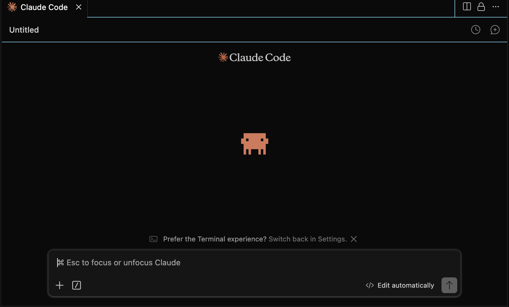
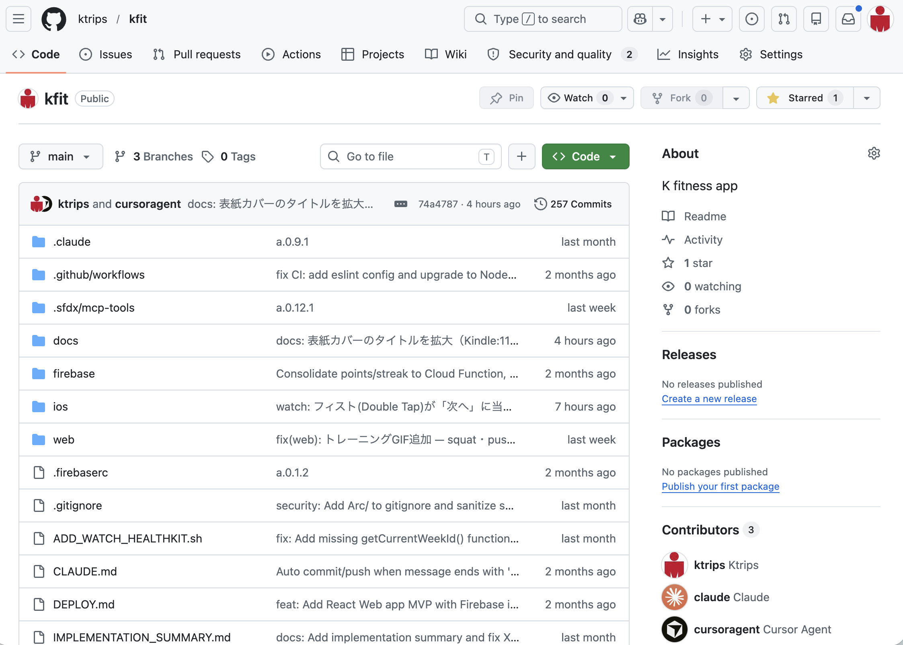
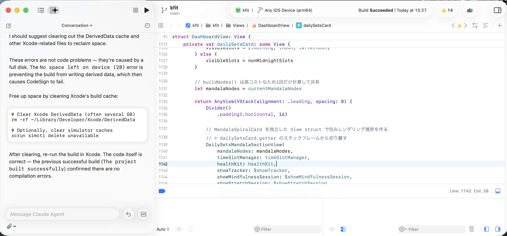
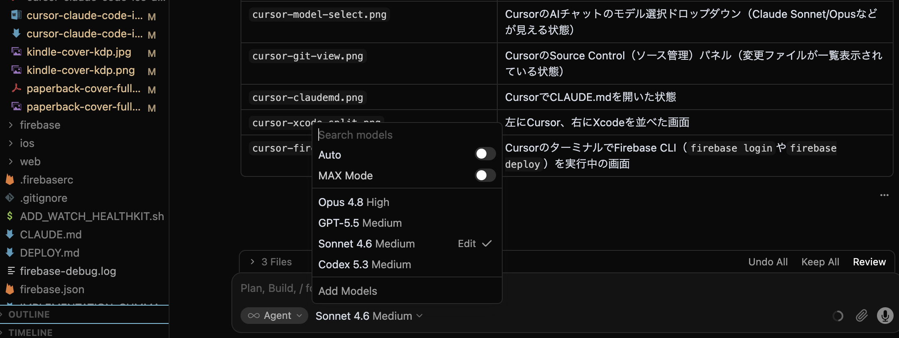
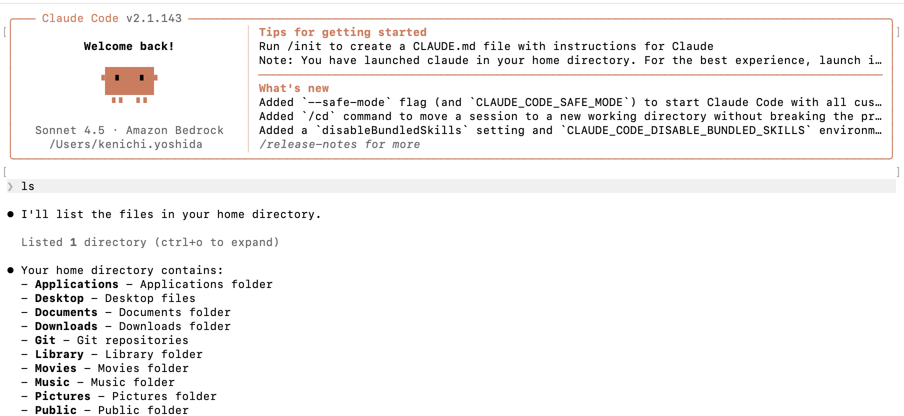
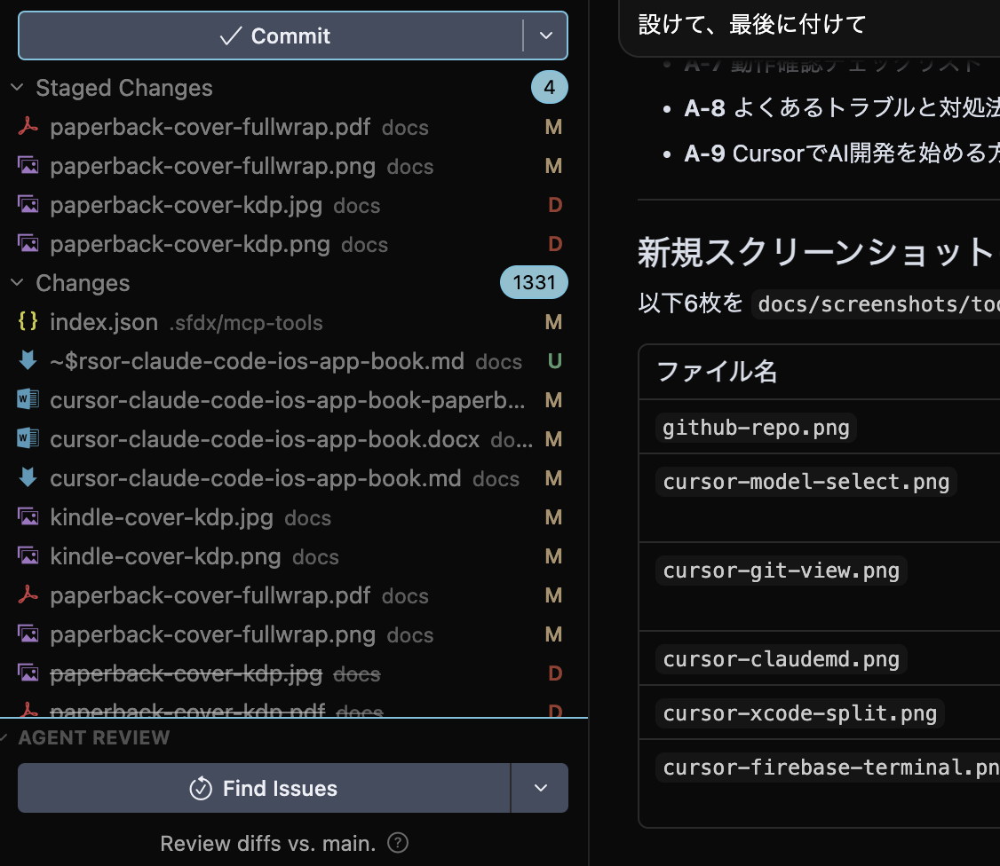
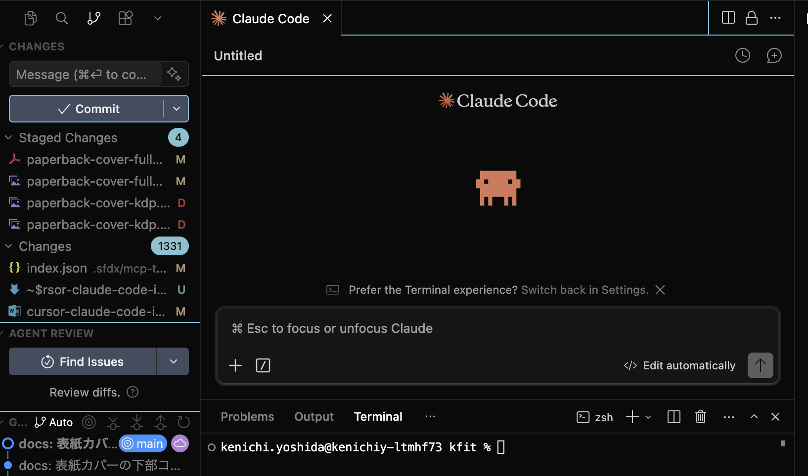
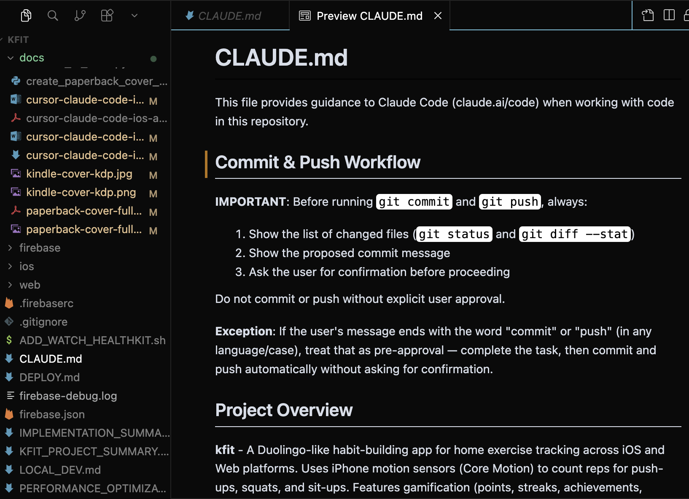
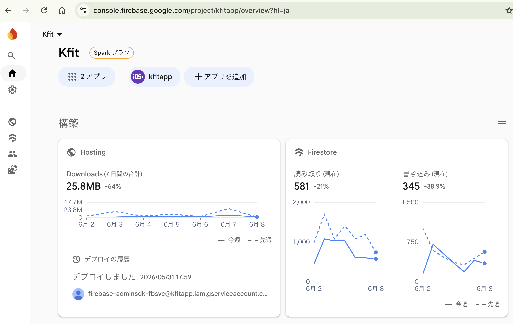

# Cursor + ClaudeでiPhoneアプリ・Apple Watchフィットネスアプリを週末だけで作る方法

**Cursor と Claude で SwiftUI・Apple Health・モーションセンサー を動かす個人アプリ開発完全ガイド**

著者：吉田 顕一（Ken Yoshida）


---

> **本書について**
>
> 「週末だけでiOS・Apple Watchアプリを作りたい」——そんな個人開発者のために書いた実践書です。
>
> CursorというAI統合IDEを開発の中心に置き、Claude Sonnet/Opusを活用しながら、SwiftUI・Apple Health（HealthKit）・モーションセンサー（Core Motion）・Apple Watch連携を実装します。Xcodeはビルド・署名・実機デプロイ専用のツールとして使います。
>
> 題材はフィットネス習慣化アプリ「Fitingo」。マンダラ目標表示・AI食事分析・HRVストレス分析・ポモドーロタイマーなど、盛りだくさんの機能を**Claudeとペアプロしながら**一人で完成させる全工程を収録しています。

<div style="page-break-after: always;"></div>

## 免責事項・著作権表示

<small>

**本書に関する免責事項（Disclaimer）**

本書（以下「本書」）は、個人開発プロジェクト「kfit」（サンプルアプリ）の開発過程を題材にした技術解説書であり、情報提供のみを目的として作成されています。著者・吉田顕一は、以下の事項について一切の責任を負いません。

**サンプルアプリについて**

本書で紹介する「kfit」および「Fitingo」（以下「サンプルアプリ」）は、著者が個人的に開発・公開しているサンプルアプリです。サンプルアプリの動作・機能・品質について、いかなる保証も行いません。サンプルアプリの使用により生じた損害（直接的・間接的・偶発的損害を含む）について、著者は一切の責任を負いません。本書のソースコード・プロンプト例は教育目的のサンプルであり、本番環境への適用による損害についても同様に責任を負いません。

**第三者のサービス・製品について**

本書では以下のサービス・製品・ブランドを参照・言及していますが、著者はこれらの企業・団体とは一切関係がなく、公式に承認・推奨・提携しているものではありません。各サービスの利用は、それぞれの利用規約・ライセンスに従ってください。Cursor（Anysphere, Inc.）／Claude・Claude Opus・Claude Sonnet（Anthropic, PBC）／GitHub・GitHub Copilot（GitHub, Inc. / Microsoft Corporation）／Duolingo（Duolingo, Inc.）／Swift・SwiftUI・Xcode・HealthKit・Core Motion・iPhone・Apple Watch・macOS（Apple Inc.）／Firebase・Firestore（Google LLC）。本書に登場する各社のロゴ・商標・スクリーンショット・製品名は、それぞれの権利者に帰属します。これらの使用は説明・解説目的の引用の範囲内であり、権利者の承認を意味するものではありません。著者は各サービスの利用方法・コスト・機能変更・利用規約変更によって生じるいかなる損害についても責任を負いません。

**情報の正確性について**

本書の内容は執筆時点（2026年）の情報に基づいており、各サービスの仕様・価格・機能は予告なく変更される場合があります。最新情報は各サービスの公式ドキュメントを参照してください。

*Copyright © 2026 Ken Yoshida（吉田顕一）. All rights reserved. 本書の無断転載・複製・配布を禁じます。*

</small>

<div style="page-break-after: always;"></div>

## 目次

- [はじめに](#はじめに)
- [第一章: AI時代のアプリ開発](#第一章-ai時代のアプリ開発)
- [第二章: アプリの全体像](#第二章-アプリの全体像)
- [第三章: 開発のための環境準備](#第三章-開発のための環境準備)
- [コラム1: LLM比較、どれが最もコスパがいい？](#コラム1-llm比較どれが最もコスパがいい)
- [第四章: Webアプリ開発](#第四章-webアプリ開発)
- [コラム2: iPhoneからClaude CodeとGitHubで開発を続ける](#コラム2-iphoneからclaude-codeとgithubで開発を続ける)
- [第五章: iOSアプリ開発](#第五章-iosアプリ開発)
- [第六章: Apple Watchアプリ開発](#第六章-apple-watchアプリ開発)
- [第七章: テスト、デバッグ、リリース](#第七章-テストデバッグリリース)
- [第八章: まとめと開発ポイント](#第八章-まとめと開発ポイント)
- [終わりに](#終わりに)

<div style="page-break-after: always;"></div>

## はじめに

個人でアプリを作るハードルは、以前より大きく下がりました。理由の一つは、CursorのようなAI統合IDEと、Claude Sonnet/Opusのような高性能LLMを組み合わせて使えるようになったことです。

本書で使う主な3つのツールを最初に紹介します。

---

**Cursor** — AI統合IDE（開発の中心）


*▲ CursorはVSCodeベースのAI統合IDE。コード編集、ファイル検索、ターミナル、Git差分確認をすべてひとつの画面で行いながら、右側のAIチャットでClaudeに相談できる*

---

**Claude（Anthropic）** — AI言語モデル（実装・設計を支援）



*▲ Cursorから呼び出したClaudeに実装フェーズの整理を依頼した例。「Ph.1で受入準備、Ph.2で個別機能実装」のような計画も、AIに依頼すると素早くまとめてもらえる。コード実装だけでなく設計・計画にも使える*

---

**GitHub** — コード管理とレビューの場



*▲ kfitプロジェクトのGitHubリポジトリ（github.com/ktrips/kfit）。ブランチ・コミット履歴・Pull Requestをここで管理する。AIが生成したコードをbranchに分けてPRでレビューする流れが基本*

---

**Xcode** — iOS/Apple Watchアプリのビルド・デプロイ環境



*▲ XcodeでSwiftUIコードを実機デバッグしている画面。上部に接続デバイス名（KtriPhone）とビルド状態が表示され、コードの問題箇所が赤く強調される。下部のデバッガーパネルで変数の値を確認しながらデバッグできる*

---

本書では、Cursorを開発の中心に置きます。ファイル操作、コード編集、検索、ターミナル、Git連携、差分確認、複数LLMの切り替えをCursor上で行い、Claude Sonnet/OpusをCursorから呼び出して設計相談、実装、レビュー、ドキュメント作成を進めます。

Xcodeは、iOS/Watchアプリの開発で欠かせないツールですが、本書では「コードを書く中心」ではなく「Appleプラットフォームへビルド・署名・デプロイするための環境」として扱います。SwiftUIコードの編集や調査はCursorで行い、実機起動、Capabilities設定、Signing、Archive、App Store提出準備はXcodeで行うという役割分担です。

題材にするのは、フィットネス習慣化アプリ「Fitingo」です。サンプルアプリは、Web、iOS、Apple Watchに対応し、運動記録、Apple Health連携、モーションセンサーによるレップ計測、HRVストレス分析、食事・水分管理、Watchの渦巻き目標表示、Firebase同期などを含みます。

<div style="page-break-after: always;"></div>

### 本書で学べること

- CursorをIDEとして使う開発スタイル
- Cursorでのファイル操作、検索、ターミナル、Git連携
- GitHubとの連携、Issue、Pull Request、レビューの流れ
- `CLAUDE.md` と `rules.md` によるAI開発ルールの整備
- CursorからClaude Sonnet/Opusを使い分ける考え方
- XcodeをiOS/Watchデプロイ環境として使う方法
- iPhoneとApple Watchへの実機デプロイ手順
- React + TypeScriptによるWebアプリ開発
- SwiftUIによるiOSアプリ開発
- Apple Health、HealthKit、Core Motionの使い方
- Apple WatchアプリとWatchConnectivity
- テスト、デバッグ、リリース前チェック

<div style="page-break-after: always;"></div>

## 第一章: AI時代のアプリ開発

<div style="page-break-after: always;"></div>

### 1-1. AI時代の開発は何が変わったのか

以前の個人開発では、分からないことがあるたびに検索し、ドキュメントを読み、サンプルコードを探し、自分のプロジェクトに合わせて書き換える必要がありました。今も基礎理解は重要ですが、CursorとClaude Sonnet/Opusを組み合わせると、調査と実装の速度が大きく変わります。

たとえば、「iOSのMINDページに過去7日のHRV平均グラフを表示したい」と考えたとします。従来なら、HealthKitのHRV取得方法、SwiftUIのグラフ描画、既存画面の構成、データ更新タイミングをそれぞれ調べる必要があります。Cursorでプロジェクトを開き、Claude Sonnetに関連ファイルを調査させれば、既存コードを前提にした実装方針を短時間で得られます。

> **⚠️ AIは万能ではありません**
>
> アプリの方向性、ユーザー体験、健康データの扱い、ストア審査に関わる表現などは、人間が判断する必要があります。AI時代の開発では、**人間がプロダクトの意思決定を行い、AIが実装と調査を支援する**役割分担が重要です。

<div style="page-break-after: always;"></div>

### 1-2. Cursorを開発環境の中心にする

Cursorは、AI機能を備えたIDEです。Visual Studio Codeに近い操作感で、プロジェクトフォルダを開き、ファイルを編集し、検索し、ターミナルを使い、Git差分を確認しながら、AIに相談できます。

**本書でCursorを使う用途：**

- プロジェクト全体を開く
- ファイルを検索する
- Swift、TypeScript、Markdownを編集する
- ターミナルでnpmやgitコマンドを実行する
- Git差分を確認する（変更前後を並べて表示）
- Claude Sonnet/Opusなど複数LLMを切り替えて使う
- AIに実装、レビュー、説明、ドキュメント作成を依頼する

Cursorの強みは、プロジェクト全体を見ながらAIと会話できることです。サンプルアプリのように、Web、iOS、Watchが同じリポジトリにある場合、横断的な調査に向いています。

**Cursorでよく使うプロンプト例：**

[プロンプト例]: ファイルの役割と主要パターンを初心者向けに説明させる
```text
このファイルの役割を初心者向けに説明してください。
特に、@StateObject、@Published、Task、async/awaitがどう使われているか知りたいです。
```

[プロンプト例]: Webで複数プラットフォームへの影響範囲を調査させる
```text
この機能はWeb、iOS、Watchに影響しそうです。
関連ファイルを調査し、どこを変更すべきか整理してください。
まだコード変更はしないでください。
```

<div style="page-break-after: always;"></div>

### 1-3. Claude Sonnet/OpusをCursorから使う

本書では、Claudeを主にCursorから呼び出して使います。つまり、ターミナルで独立したClaude Codeを使うことを前提にするのではなく、Cursorのチャットやエージェント機能からClaude Sonnet/Opusを選び、開いているリポジトリの文脈を渡して作業します。



*▲ CursorのAIチャットパネルでモデルを切り替える。Claude Sonnet（日常作業向け）とClaude Opus（高難度タスク向け）を用途に応じて使い分ける*

| モデル | 使いどころ |
|---|---|
| **Sonnet** | 日常的な実装、調査、軽いリファクタリング、エラー修正 |
| **Opus** | 大きな設計判断、複雑なバグ調査、アーキテクチャ整理、長文ドキュメント作成 |

たとえば、単純なUI文言変更やTypeScriptエラー修正はSonnetで十分です。一方、iOSとWatchの同期ずれ、HealthKitとUserDefaultsとWatchConnectivityをまたぐ問題などは、Opusに調査と設計を頼むと安定します。

[プロンプト例]: 軽微なUI修正をSonnet（標準モデル）に限定して依頼する
```text
この変更は小さなUI修正なので、Sonnetで実装してください。
既存のデザインに合わせ、不要なリファクタリングは避けてください。
```

[プロンプト例]: 複数プラットフォームをまたぐ問題をOpus（高性能モデル）で調査させる
```text
この問題はiOS、Watch、HealthKit、WatchConnectivityをまたぎます。
Opusで関連ファイルを広く調査し、原因候補と修正方針を出してください。
まだコード変更はしないでください。
```

<div style="page-break-after: always;"></div>

### 1-4. Claude Codeについての位置づけ

Claude Codeは、ターミナルからClaudeを使ってリポジトリ内作業を進めるエージェント型ツールです。



*▲ Claude Codeのターミナル操作画面。ターミナルベースでClaudeにリポジトリ内の作業を指示できる。Cursor外でClaudeを使いたい場合や、CLIでの一括作業に適している*

便利な選択肢ですが、本書の基本方針では、主な開発体験はCursor内に集約します。

Claude Codeを使う場面は、たとえば次のような場合です。

- Cursor外のターミナル中心で作業したい
- CIやスクリプトと近い形で調査したい
- 長い自動修正や一括作業をCLIで行いたい

ただし、初心者にはまずCursor上で、ファイル、差分、チャット、ターミナルを一つの画面で見ながら進める方法をおすすめします。Git差分を目で確認しやすく、AIが何を変更したか追いやすいためです。

<div style="page-break-after: always;"></div>

### 1-5. 良いプロンプトの基本形

AIに依頼するときは、次の要素を入れると失敗が減ります。

| 要素 | 内容 |
|---|---|
| 対象画面・ファイル | どの画面、どのファイルか |
| 実現したい体験 | ユーザーがどう操作するか |
| データの取得元 | HealthKit、Firestore、UserDefaults など |
| 保存先 | どこに保存するか |
| やってほしくないこと | UIを崩さない、他の機能を壊さないなど |
| 確認してほしいこと | lintエラー確認、型チェックなど |

**良い例：**

[プロンプト例]: 具体的で的確な実装依頼の良い例
```text
iOSのMINDページで、今日のまとめの3分ストレッチの下に、過去7日のHRV平均グラフを表示してください。
20msの赤い基準線を入れてください。
HealthKitManagerに7日平均を取得する処理を追加し、MindViewで表示してください。
既存のSwiftUIデザインに合わせ、不要なリファクタリングは避けてください。
```

**作業前の制約プロンプト：**

[プロンプト例]: 作業前に既存変更を守るための制約指示
```text
既存のユーザー変更を戻さないでください。
関連ファイルを読んでから実装してください。
不要なリファクタリングは避けてください。
変更後に関連ファイルのlinter/診断を確認してください。
実装内容と未確認事項を最後に短く報告してください。
```

<div style="page-break-after: always;"></div>

### 1-6. GitHubとAI開発の関係

CursorとClaudeを使った開発では、GitHubは単なるコード置き場ではありません。作業履歴、Issue、Pull Request、レビュー、CI結果、リリース管理をまとめる中心になります。AIに実装を依頼するほど、GitHub上で差分を管理し、人間が確認できる状態にしておくことが重要です。



*▲ CursorのSource Control（ソース管理）パネルで変更ファイル一覧を確認し、commit・pushを行う。AIが変更したファイルを一覧で確認してから、GitHubへ送る流れが基本*

**初心者が最初に覚えるべきGitHub連携：**

1. リポジトリをGitHubに作る
2. ローカルのCursorでそのリポジトリを開く
3. 変更をGitで確認する
4. Pull Requestで変更内容を説明する
5. CIやレビュー結果を見て修正する

CursorではGit差分を見ながらClaudeに修正を依頼できます。ただし、最終的にマージするかどうかは人間が判断します。

[プロンプト例]: GitHubの基本ワークフローを説明させる
```text
このプロジェクトをGitHubで管理します。
初心者向けに、clone、branch作成、commit、push、Pull Request作成、レビュー対応、mergeまでの流れを説明してください。
Cursor上でどの操作を確認できるかも含めてください。
```

<div style="page-break-after: always;"></div>

### 1-7. `CLAUDE.md` と `rules.md` の役割

AI開発では、毎回同じ注意事項をチャットに書くのは大変です。そこで、プロジェクト内にAI向けのルールファイルを置きます。代表的なのが `CLAUDE.md` や `rules.md` です。



*▲ CursorでCLAUDE.mdを開いた状態。プロジェクトの設計方針・コマンド・安全ルールなどをここに書いておくと、AIが毎回参照して動作してくれる*

**`CLAUDE.md` に書くとよい項目：**

[プロンプト例]: CLAUDE.md のプロジェクトルール例
```text
# Project Rules

## Project Overview
- アプリ名
- 対応プラットフォーム
- 主要機能
- 技術スタック

## Development Commands
- Webの起動コマンド
- type-checkコマンド
- iOSの開き方
- Firebaseのデプロイ方法

## Safety Rules
- ユーザーの変更を戻さない
- 破壊的なgit操作をしない
- コミット前に差分を見せる
- APIキーや.envをコミットしない

## Architecture Notes
- 主要ディレクトリ
- データ同期の流れ
- HealthKitやWatchConnectivityの注意点
```

**`rules.md` に書くとよい項目：**

[プロンプト例]: rules.md のコーディングルール例
```text
# Coding Rules

- 既存の設計に合わせる
- 不要なリファクタリングをしない
- SwiftUIの巨大なViewは小さく分割する
- HealthKitデータは未取得を正常系として扱う
- Watch UIでは文字を増やしすぎない
- Webではtype-checkを通す
- 変更後は確認結果と未確認事項を報告する
```

[プロンプト例]: CLAUDE.md の改善案を生成させる
```text
このプロジェクトのCLAUDE.mdを改善したいです。
README、ios/README.md、web/README.mdを読み、AIが開発時に参照すべきルールを整理してください。
コミット、プッシュ、HealthKit、WatchConnectivity、Firebase、Web type-checkの注意点を含めてください。
```

<div style="page-break-after: always;"></div>

## 第二章: アプリの全体像

<div style="page-break-after: always;"></div>

### 2-1. サンプルアプリとは何を作るのか

サンプルアプリは、「毎日の運動を習慣にする」ことを目的にしたフィットネスアプリです。Duolingoのように、短い達成感、連続記録、ポイント、キャラクター表示を使い、ユーザーが毎日少しずつ体を動かすきっかけを作ります。

本書で作るのは、**iPhone・Apple Watch・Webの3プラットフォームに対応したアプリ**です。まず完成形のスクリーンショットで、何を作るのか全体像をつかみましょう。

---

#### iOSアプリ ─ メインページ（メイン画面）

**マンダラ形式の渦巻き目標表示**が最大の特徴です。時間帯（朝・昼・午後・夜）ごとに、トレーニング・食事・水分・マインドフルネスなど各タスクがノードとして円形に並び、達成するたびにノードが色づいていきます。


*▲ 中央に今日の達成率（%）を表示し、外周のノードが各タスクの完了状況を色で示す。ストリーク日数・今日の日付・達成率がヘッダーに一覧表示される*

---

#### iOSアプリ ─ ホーム画面ウィジェット

iOSのホーム画面にウィジェットを配置して、アプリを開かずに今日の進捗を確認できます。


*▲ 連続日数・達成度・カロリー収支・XPポイントを4マスで表示。カレンダーと並べた大型ウィジェットで、日々の習慣の定着状況を一目で把握できる*


*▲ ホーム画面の小型ウィジェット。40日連続・達成度9%・カロリー収支・XPのほか、トレーニング・マインドフル・食事・水分の今日の進捗も表示*

---

#### Apple Watchアプリ ─ 3つの画面

Watchアプリは独立したアプリとして動作し、iPhone不在でも記録できます。

**① アプリ一覧 ─ サンプルアプリのアイコン**


*▲ Apple Watchのアプリ一覧画面。中央にサンプルアプリのキャラクター（FITINGO）アイコンが表示される*

**② メインダッシュボード ─ Watchでもマンダラ表示**


*▲ Watchのメイン画面。iPhoneと同様のマンダラ形式で今日の達成率（46%）を表示。TRAIN・MINDの進捗、日付、連続ストリーク数をコンパクトに配置*

**③ トレーニング開始 ─ タップ1回でセット開始**


*▲ トレーニング回数・マインドフル回数を上部に表示し、「今日のFitingoトレーニング」ボタンをタップするだけでセットを開始できる。腕を動かしながらでも操作しやすい大型ボタン*

---

**主な構成まとめ：**

| プラットフォーム | 技術 | 主な機能 |
|---|---|---|
| **iOSアプリ** | SwiftUI | マンダラメイン、Apple Health、Core Motion、フォトログ、MIND、FIT、ウィジェット |
| **Apple Watchアプリ** | SwiftUI for watchOS | マンダラ表示、クイック記録、心拍/HRV、瞑想/ストレッチ、トレーニング |
| **Webアプリ** | React + TypeScript + Vite | ダッシュボード、手動記録、週間目標、90日チャレンジ、設定 |

<div style="page-break-after: always;"></div>

### 2-2. 技術スタック

[プロンプト例]: （実装・調査プロンプトの例）
```text
Web:
├── React 18
├── TypeScript
├── Vite
├── Tailwind CSS
├── Firebase Authentication
└── Firestore

iOS:
├── SwiftUI
├── HealthKit
├── Core Motion
├── Firebase iOS SDK
└── WidgetKit

Apple Watch:
├── SwiftUI for watchOS
├── HealthKit
├── Core Motion
├── WatchConnectivity
└── Haptics

開発環境:
├── Cursor
├── Claude Sonnet/Opus
├── Xcode
├── Git / GitHub
├── Node.js / npm
├── CocoaPods
└── Firebase CLI
```

<div style="page-break-after: always;"></div>

### 2-3. データの流れ

[プロンプト例]: （実装・調査プロンプトの例）
```text
Webで記録
  → Firestore
  → iOSが読み込み
  → DashboardやHistoryに表示

iOSで運動記録
  → Firestoreへ保存
  → Webに反映
  → Watchへ今日の進捗を同期

Watchで運動完了
  → WatchConnectivityでiOSへ送信
  → iOSがFirestoreへ保存
  → Webにも反映

Apple Health
  → iOS/WatchがHealthKitから取得
  → Dashboard、MIND、FIT、Watch履歴に表示
```

> **📌 役割分担のポイント**
>
> - **Firestore**: クラウド同期、複数デバイス間の状態共有
> - **HealthKit**: 心拍・HRV・睡眠・歩数などの健康データ
> - **WatchConnectivity**: iPhoneとApple Watchの近距離リアルタイム同期

<div style="page-break-after: always;"></div>

### 2-4. 全体像をClaudeに説明させるプロンプト

[プロンプト例]: プロジェクト全体の構成をClaudeに把握させる
```text
このプロジェクトは、Web、iOS、Apple Watch対応のフィットネス習慣化アプリです。
README、CLAUDE.md、ios/README.md、web/README.mdを読んで、全体像を初心者向けに説明してください。
まだコード変更はしないでください。
```

[プロンプト例]: ディレクトリ構成とデータ同期の流れを説明させる
```text
このリポジトリの主要ディレクトリを調査し、Web、iOS、Watch、Firebaseがどのように分かれているか説明してください。
データ同期の流れも、FirestoreとWatchConnectivityに分けて説明してください。
```

<div style="page-break-after: always;"></div>

## 第三章: 開発のための環境準備

<div style="page-break-after: always;"></div>

### 3-1. 必要なもの

サンプルアプリのようなWeb、iOS、Apple Watch対応アプリを作るには、次の環境が必要です。

| カテゴリ | ツール・環境 | 備考 |
|---|---|---|
| **OS** | macOS | iOS/Watch開発にはmacOS必須 |
| **IDE** | Cursor | メインの開発環境 |
| **AI** | Claude Sonnet/Opus | Cursor経由で利用 |
| **Apple** | Xcode | ビルド・デプロイ専用 |
| **JS環境** | Node.js / npm | Web開発 |
| **iOS依存** | CocoaPods | Firebaseなど |
| **Backend** | Firebase CLI | Firestore・Hosting |
| **バージョン管理** | Git / GitHub | 変更履歴管理 |
| **実機** | iPhone + Apple Watch | HealthKit・モーションの実機確認に必須 |

> **💡 実機を用意する理由**
>
> HealthKitやCore Motion、Apple Watch連携はシミュレータだけでは確認しにくいため、できれば実機を用意します。特に心拍数、HRV、Watchのモーション検知は**実機確認が必須**です。

<div style="page-break-after: always;"></div>

### 3-2. Cursorのセットアップ

Cursorは公式サイト（cursor.com）からmacOS版をダウンロードしてインストールします。インストール後、アカウントでサインインし、`File > Open Folder` からプロジェクトフォルダを開きます。

サンプルアプリの場合は、次のフォルダを開きます。

[プロンプト例]: Cursorで開くプロジェクトフォルダのパス例
```text
~/Git/kfit
```

**Cursorを使う準備で確認すること：**

- プロジェクトルートを開いている
- CursorのチャットでClaude Sonnet/Opusを選べる
- ターミナルがCursor内で開ける
- Git差分がCursor上で確認できる
- ファイル検索が使える
- `.md`、`.swift`、`.tsx` を編集できる

[プロンプト例]: プロジェクト開封後の初回構成説明依頼
```text
このリポジトリを開きました。
まずREADME、CLAUDE.md、ios/README.md、web/README.mdを読み、初心者向けに開発手順を説明してください。
まだコード変更はしないでください。
```

<div style="page-break-after: always;"></div>

### 3-3. CursorのGit連携

Cursorでは、Git差分を見ながらAIに変更を依頼できます。初心者にとって重要なのは、AIが変更したファイルをそのまま信じるのではなく、差分を読むことです。

**作業前に確認するコマンド：**

```bash
git status
git diff --stat
```

CursorのGitビューでは、変更ファイルを一覧し、どの行が追加・削除されたか確認できます。AIに依頼した後は、必ず差分を見て、意図しないファイルが変更されていないか確認します。

[プロンプト例]: Git状態の確認と既存変更の保護指示
```text
作業前にgit statusを確認し、未コミット変更を把握してください。
ユーザーが変更した可能性のあるファイルは戻さないでください。
今回の作業に関係するファイルだけを編集してください。
```

<div style="page-break-after: always;"></div>

### 3-4. Cursorで複数LLMを使う

Cursorでは、Claude Sonnet/Opus以外のモデルも選べる場合があります。重要なのは、作業内容に応じてモデルを使い分けることです。

| 用途 | おすすめモデル |
|---|---|
| 軽い修正・文言変更 | 速いモデルまたはSonnet |
| 複数ファイル調査 | Sonnet |
| 複雑な設計・レビュー | Opus |
| 長文ドキュメント作成 | Opus |
| 実装後の説明 | Sonnet |

[プロンプト例]: モデル使い分け: 小さな修正はSonnetで依頼する
```text
この変更は小さなUI調整なので、Sonnetで既存の実装に合わせて修正してください。
```

[プロンプト例]: モデル使い分け: 複雑な問題はOpusで調査させる
```text
この問題は複数プラットフォームにまたがるため、Opusで広く調査してください。
まず原因候補を整理し、私が確認するまでコード変更はしないでください。
```

<div style="page-break-after: always;"></div>

### 3-5. Xcodeの役割

本書では、コード編集の中心はCursorです。Xcodeは主に次の用途で使います。

- iOSアプリを実機にインストールする
- Apple Watchアプリを実機にインストールする
- Signing & Capabilitiesを設定する
- HealthKit、Watch App、Push NotificationsなどのCapabilityを確認する
- Schemeを選んでビルドする
- ArchiveしてApp Store提出準備を行う
- 実機ログやクラッシュを確認する

> **📌 役割分担の原則**
>
> **Cursorでコードを書き、Xcodeでデプロイする**
>
> SwiftUIコードの編集・調査・デバッグ支援はCursorで行います。実機へのインストール、証明書・プロビジョニング設定、Capabilityの追加はXcodeで行います。

<div style="page-break-after: always;"></div>

### 3-6. XcodeにClaudeを直接連携する方法

基本はCursorからClaudeを使いますが、Xcodeで作業中にClaudeを使いたい場合もあります。代表的な方法は次の3つです。

1. **Cursorで同じリポジトリを開き、Xcodeと並べて使う** ← 最も安定
2. Xcodeのエラーや該当コードをコピーして、CursorのClaudeに貼って相談する
3. Claudeのデスクトップアプリやブラウザを横に開き、Xcodeのエラー内容を渡す



*▲ 左にCursor（AIチャット・コード編集）、右にXcode（ビルド・実機確認）を並べて使うスタイル。Xcodeで見つけたエラーをCursorのAIチャットにコピーして修正を依頼し、修正後にXcodeでビルド確認する流れが基本*

[プロンプト例]: XcodeのSwiftエラーをClaudeで解決させる
```text
Xcodeで次のSwiftエラーが出ています。
エラー内容と該当ファイルをもとに、原因と最小限の修正案を教えてください。
UIの見た目は変えないでください。
```

<div style="page-break-after: always;"></div>

### 3-7. Xcodeのセットアップ

XcodeはApp Storeからインストールします。初回起動時に追加コンポーネントのインストールを求められる場合があります。

```bash
xcode-select -p
xcodebuild -version
```

Command Line Toolsが未設定の場合は、次のコマンドを使います。

```bash
xcode-select --install
```

サンプルアプリでは、iOSプロジェクトを次のように開きます。

```bash
cd ios
pod install
open kfit.xcworkspace   # ← .xcworkspace を開くこと（.xcodeprojではない）
```

**Xcodeで確認する項目：**

- iOSアプリターゲットにHealthKit Capabilityがある
- Watch Appターゲットが正しく含まれている
- Signing & CapabilitiesでTeamが設定されている
- `GoogleService-Info.plist` がiOSターゲットに含まれている
- HealthKitやカメラなどの権限説明文が `Info.plist` に入っている
- 実機iPhoneとApple Watchでビルドできる

<div style="page-break-after: always;"></div>

### 3-8. iPhone実機の準備

**iPhoneにアプリをデプロイする手順：**

1. iPhoneをMacにUSB接続する
2. iPhone側で「このコンピュータを信頼」を選ぶ
3. Xcodeの上部デバイス選択で接続したiPhoneを選ぶ
4. XcodeのSigning & CapabilitiesでTeamを設定する
5. Bundle Identifierが一意であることを確認する
6. 必要なCapabilityを有効にする
7. Runボタンで実機へインストールする

**実機で確認する設定：**

- 設定アプリで開発者モードが有効か
- Healthアプリへのアクセス許可が出るか
- Firebaseログインができるか
- ネットワーク接続があるか
- 通知やヘルスケア権限の許可文言が自然か

[プロンプト例]: iPhoneへの実機デプロイ手順を整理させる
```text
iPhone実機にこのiOSアプリをデプロイする手順を初心者向けに整理してください。
XcodeのScheme選択、Team設定、Bundle Identifier、HealthKit Capability、実機側の信頼設定を含めてください。
```

<div style="page-break-after: always;"></div>

### 3-9. Apple Watch実機の準備

Apple Watchアプリを実機にデプロイするには、iPhoneとApple Watchがペアリングされている必要があります。

**準備手順：**

1. iPhoneとApple Watchをペアリングする
2. Apple Watchのロックを解除して腕に装着する
3. iPhoneとApple Watchが近くにある状態にする
4. XcodeでWatch Appを含むSchemeを選ぶ
5. 実行先として、ペアリング済みのApple Watchを選ぶ
6. RunしてWatchへインストールする

**Watchで確認する設定：**

- Watch側でアプリがインストールされているか
- HealthKit権限が許可されているか
- 心拍数、HRV、ワークアウト、マインドフルネスのデータが取得できるか
- WatchConnectivityでiPhoneと通信できるか
- 1分瞑想、3分ストレッチ、運動記録が実機で動くか

[プロンプト例]: Apple Watchへの実機デプロイ手順を整理させる
```text
Apple Watch実機にWatchアプリをデプロイする手順を初心者向けに説明してください。
iPhoneとのペアリング、Xcodeの実行先選択、Watch App Scheme、HealthKit権限、WatchConnectivity確認を含めてください。
```

<div style="page-break-after: always;"></div>

### 3-10. Web開発環境

Web側はNode.jsとnpmで動かします。

```bash
cd web
npm install
npm run dev
```

型チェックとビルドは次のように実行します。

```bash
npm --prefix web run type-check
npm --prefix web run build
```

<div style="page-break-after: always;"></div>

### 3-11. Firebaseの準備

Firebaseでは、Authentication、Firestore、Hostingを使います。Webでは `.env.local` にFirebase設定を入れます。iOSではFirebase Consoleから取得した `GoogleService-Info.plist` をXcodeプロジェクトに追加します。

Firebase CLIをインストールしてログインする際、以下のようなGoogle認証画面がブラウザで開きます。

```bash
firebase login
# または gcloud 認証の場合:
gcloud auth login
```



*▲ CursorのターミナルパネルでFirebase CLI（`firebase login` / `firebase deploy`）を実行する。コードの編集とデプロイ操作をCursor上で一元管理できる*

[プロンプト例]: Firebaseのセットアップ手順を説明させる
```text
Firebaseのセットアップ手順を初心者向けに整理してください。
Webの.env.local、iOSのGoogleService-Info.plist、Googleログイン、Firestoreルール、Firebase Hostingを分けて説明してください。
```

<div style="page-break-after: always;"></div>

### 3-12. GitHub連携のセットアップ

GitHubを使うと、ローカルの作業をクラウドに保存し、履歴を管理し、Pull Requestで変更内容を確認できます。AIにコードを書かせるほど、GitHubで差分を管理することが重要になります。

```bash
# GitHub上でリポジトリを作成したあと
git remote add origin git@github.com:your-name/kfit.git
git branch -M main
git push -u origin main
```

**CursorでGitHub連携を使う流れ：**

1. GitHubからリポジトリをcloneする
2. Cursorでフォルダを開く
3. 作業用ブランチを作る
4. Claudeに実装を依頼する
5. CursorのGitビューで差分を見る
6. type-checkやXcode実機確認を行う
7. commitする
8. pushする
9. GitHubでPull Requestを作る

**ブランチ名の例：**

[プロンプト例]: Gitブランチ名の命名規則の例
```text
feature/watch-hrv-history
fix/ios-healthkit-refresh
docs/cursor-claude-book
```

[プロンプト例]: Pull Request本文案をClaudeに作成させる
```text
この変更をGitHubのPull Requestに出したいです。
git statusとgit diff --statを確認し、変更内容をSummaryとTest planに分けてPR本文案を作ってください。
まだcommitやpushはしないでください。
```

<div style="page-break-after: always;"></div>

### 3-13. GitHubで安全にcommit/pushする

AIに実装を頼んだあと、すぐにcommitするのは危険です。必ず差分を確認します。

```bash
git status
git diff --stat
git diff
```

コミットメッセージは、何をしたかだけでなく、なぜ必要だったかが分かるようにします。

[プロンプト例]: Conventional Commits形式のコミットメッセージ例
```text
Add Watch HRV impact history

Record heart rate and HRV before and after mindfulness sessions
so users can review stress changes over time.
```

[プロンプト例]: コミット前の変更内容をClaudeにレビューさせる
```text
コミット前レビューをしてください。
変更ファイル、変更理由、リスク、テスト状況、コミットメッセージ案を出してください。
.env、APIキー、個人情報が含まれていないかも確認してください。
```

<div style="page-break-after: always;"></div>

### 3-14. `CLAUDE.md` と `rules.md` を育てる

AI開発では、ルールファイルを一度書いて終わりにしません。プロジェクトが育つほど、よく起きるミス、よく使うコマンド、注意すべき設計判断が増えます。それらを `CLAUDE.md` や `rules.md` に追記します。

**サンプルアプリで書いておくとよいルール例：**

[プロンプト例]: CLAUDE.mdのルール例（サンプルアプリ向け）
```text
- HealthKitの値は権限未許可や未取得を正常系として扱う
- WatchConnectivityではiOS側のTimeSlotManagerを正とする
- Watch UIは小さい画面を前提に、文字量を増やしすぎない
- Webのアプリ名変更ではmanifest、index.html、package.json、localStorageキーも確認する
- iOS/Watchの実機確認が必要な変更は、最終報告で未確認事項を明記する
- SwiftUIの巨大なViewは独立したView構造体に分割してスタックオーバーフローを防ぐ
```

[プロンプト例]: 実装から得た知見をCLAUDE.mdのルールとして整理させる
```text
今回の実装で得られた注意点を、CLAUDE.mdまたはrules.mdに追記する案としてまとめてください。
特に、次回同じミスを防ぐための具体的なルールにしてください。
```

<div style="page-break-after: always;"></div>

## コラム1: LLM比較、どれが最もコスパがいい？

Cursorでは、Claudeだけでなく、OpenAIやGemini系のモデルを選べる場合があります。モデルは「一番賢いものを常に使う」のではなく、作業内容に合わせて選ぶとコスパが良くなります。

> **⚠️ 価格について**
>
> ここでの価格は、2026年6月時点で公開されているAPI価格を目安にしたものです。実際のCursor内の利用料金やプランは、Cursor側の料金体系、契約プラン、キャッシュ、バッチ、プロモーション、為替によって変わります。最新の正確な価格は各社の公式価格ページを確認してください。

<div style="page-break-after: always;"></div>

### 比較の前提

LLMのコスパは、単純な1トークンあたりの価格だけでは決まりません。開発では、次の観点を合わせて見ます。

- 実装の正確さ
- 長いコードベースを読めるか
- SwiftやTypeScriptの修正が得意か
- 指示に従う安定性
- 出力の長さと品質
- 何回やり直しが必要か
- 入力価格と出力価格

> **💡 コスパの考え方**
>
> 安いモデルでも何度も修正が必要なら総コストは上がります。高いモデルでも一回で正しく設計できるなら結果的に安いことがあります。

<div style="page-break-after: always;"></div>

### Claude系: Cursorでの本命候補

Claudeは、長いコードの読解、既存設計に合わせた修正、文章化、レビューに強い傾向があります。

| モデル | 位置づけ | 目安価格/100万token | 向いている作業 |
|---|---|---:|---|
| Claude Opus 4.8 | **最新（2026/5/28）** | 入力 $5 / 出力 $25 | 最高品質の推論・設計・コードレビュー |
| Claude Opus 4.7 | 高性能・安定 | 入力 $5 / 出力 $25 | 複雑な設計、長文ドキュメント、難しいバグ調査 |
| Claude Sonnet 4.6 | 普及・標準 | 入力 $3 / 出力 $15 | 日常的な実装、複数ファイル調査、レビュー |
| Claude Haiku 4.5 | 軽量・安価 | 入力 $1 / 出力 $5 | 要約、分類、単純な文言変更 |

**Claudeを使うと効率が良い場面：**

- SwiftUIの大きなViewを読み解く
- HealthKitやWatchConnectivityの影響範囲を調査する
- `CLAUDE.md` や技術書原稿を書く
- Pull Requestのレビュー観点を洗い出す
- 既存設計を壊さずに修正する

<div style="page-break-after: always;"></div>

### OpenAI系: コード生成と軽量モデルの選択肢

| モデル | 位置づけ | 目安価格/100万token | 向いている作業 |
|---|---|---:|---|
| GPT-4.1 | 最新API系・コード強化 | 入力 $2 / 出力 $8 | コード生成、指示追従、長文コンテキスト |
| GPT-4.1 mini | 普及・低価格 | 入力 $0.40 / 出力 $1.60 | 軽い修正、要約、単純な変換 |
| GPT-4.1 nano | 超軽量 | 入力 $0.10 / 出力 $0.40 | 分類、短い文言生成、単純抽出 |
| GPT-4o | 普及・マルチモーダル | 入力 $2.50 / 出力 $10 | 画像を含む相談、一般的な開発補助 |
| o3 | reasoning | 入力 $2 / 出力 $8 | 複雑な推論、設計判断、分析 |

<div style="page-break-after: always;"></div>

### Gemini系: 低コスト・長文・Google連携が強い

| モデル | 位置づけ | 目安価格/100万token | 向いている作業 |
|---|---|---:|---|
| Gemini 2.5 Pro | 高性能・長文 | 入力 $1.25 / 出力 $10 | 長い資料、設計比較、複雑な調査 |
| Gemini 2.5 Flash | 普及・高速・安価 | 入力 $0.30 / 出力 $2.50 | 要約、分類、軽いコード調査 |
| Gemini Flash-Lite | 超低価格 | 入力 $0.10前後 | 大量分類、抽出、単純変換 |

<div style="page-break-after: always;"></div>

### 用途別のおすすめ

| 作業 | 最もコスパが良い候補 | 理由 |
|---|---|---|
| 日常的なCursorでの実装 | Claude Sonnet / GPT-4.1 | 既存コード理解と実装品質のバランスが良い |
| 複雑な設計・バグ調査 | Claude Opus / o3 | 失敗時の手戻りが高いので高性能モデルが得 |
| SwiftUI/WatchConnectivityの横断調査 | Claude Sonnet or Opus | 長い文脈と既存設計の読解に強い |
| Webの軽い修正 | GPT-4.1 mini / Gemini Flash | 安く速い |
| 大量の要約・分類 | Gemini Flash / GPT-4.1 nano | 低単価で処理できる |
| 技術書原稿の長文生成 | Claude Opus / Gemini Pro | 長文構成と文脈維持が重要 |
| PRレビュー | Claude Sonnet / Opus | バグ、リスク、未テスト箇所の指摘が得意 |
| UIスクリーンショットを見て相談 | GPT-4o / Gemini Pro | マルチモーダル相談に向く |

<div style="page-break-after: always;"></div>

### 結論: 最初はSonnet中心、重い判断だけOpus

この本のようにCursorを中心に開発する場合、最初のおすすめはClaude Sonnet中心です。普段の実装、調査、レビュー、説明のバランスが良く、既存コードに合わせる力もあります。

**コスパを最大化する基本方針：**

[プロンプト例]: コスパを最大化するモデル使い分け戦略の例
```text
1. まず安い/標準モデルで調査する
2. 難しければ高性能モデルに切り替える
3. 実装後は別モデルでレビューする
4. 長い共通文脈はCLAUDE.mdやrules.mdに移す
5. 同じ説明を毎回プロンプトに書かない
```

**参考価格ソース：**
- Anthropic: https://platform.claude.com/docs/en/about-claude/pricing
- OpenAI: https://developers.openai.com/api/docs/pricing
- Google: https://ai.google.dev/gemini-api/docs/pricing

<div style="page-break-after: always;"></div>

## 第四章: Webアプリ開発

<div style="page-break-after: always;"></div>

### 4-1. Webアプリの役割

サンプルアプリのWebアプリは、PCやスマホブラウザから記録を確認・編集できる入口です。iOSアプリほどHealthKitやモーションセンサーに深くは関わりませんが、ダッシュボード、手動記録、週間目標、90日チャレンジ、設定画面を提供します。

Web版は、React + TypeScript + Viteで作ります。Cursor上でTypeScriptファイルを編集し、Cursor内ターミナルで開発サーバーや型チェックを実行します。

<div style="page-break-after: always;"></div>

### 4-2. Webの構成

[プロンプト例]: Webアプリのソースディレクトリ構成
```text
web/src/
├── components/
│   ├── DashboardView.tsx
│   ├── LoginView.tsx
│   ├── SettingsView.tsx
│   └── ...
├── services/
│   └── firebase.ts
├── store/
├── types/
├── App.tsx
└── main.tsx
```

<div style="page-break-after: always;"></div>

### 4-3. ダッシュボード開発

Webダッシュボードでは、今日の運動状況、記録、DIET、SLEEP、週間セット目標、90日チャレンジを表示します。

[プロンプト例]: Webダッシュボードのカード表示レイアウト変更依頼
```text
Webのダッシュボード構成を変更してください。
MINDカードとFOODカードは非表示にし、DIETカードを横幅いっぱいにしてください。
DIETカードには現在体重、目標体重、体脂肪、摂取目標、消費目標、日次バランスを表示してください。
カードを押したらGOAL設定画面へ遷移するようにしてください。
既存のデザインシステムとTailwindのクラスに合わせてください。
```

<div style="page-break-after: always;"></div>

### 4-4. アプリ名の変更

Webアプリ名を変更する場合、画面表示だけでは不十分です。`index.html`、`manifest.json`、`package.json`、README、localStorageキーも確認します。

```ts
const SETTINGS_KEY = 'fitingo_settings'
const LEGACY_SETTINGS_KEY = 'duofit_settings'
```

[プロンプト例]: アプリ名の全面変更（UI・設定ファイル・localStorage互換対応）
```text
Webアプリ名をFitingoに全面変更してください。
画面表示、index.html、manifest.json、package.json、README、localStorageキーを確認してください。
localStorageキーは旧キーから新キーへ読み替える互換処理を入れてください。
変更後にtype-checkを実行できるようにしてください。
```

<div style="page-break-after: always;"></div>

### 4-5. Firestore同期

Webで記録した運動や目標は、Firestoreに保存します。iOS側も同じデータを読むことで、WebとiOSの同期ができます。

[プロンプト例]: FirestoreのデータモデルとドキュメントID体系の例
```text
users/{userId}/
├── profile
├── completed-exercises/
├── daily-goals/
├── time-slot-goals/
├── achievements/
└── statistics/
```

[プロンプト例]: Firestore共通データ基盤の設計案を生成させる
```text
FirestoreをWeb、iOS、Watchの共通データ基盤として使います。
ユーザーごとの運動履歴、日次目標、時間帯別進捗、プロフィールを保存する設計案を出してください。
セキュリティルールでは、ユーザー本人だけが自分のデータを読み書きできるようにしてください。
```

<div style="page-break-after: always;"></div>

### 4-6. Webのテスト

```bash
npm --prefix web run type-check
npm --prefix web run build
```

[プロンプト例]: TypeScriptの型エラーを原因から解決させる
```text
Webのtype-checkでエラーが出ています。
エラー全文を読んで、原因を説明し、最小限の修正をしてください。
修正後にもう一度type-checkを実行してください。
```

<div style="page-break-after: always;"></div>

## コラム2: iPhoneからClaude CodeとGitHubで開発を続ける

### モバイル開発は「完結」より「継続」を目指す

外出中にiPhoneだけで本格的なiOSアプリをビルドするのは現実的ではありません。Xcodeによる実機ビルドやWatchデプロイはMacが必要です。しかし、GitHubとClaude Code、あるいはGitHub Codespacesやリモート開発環境を組み合わせると、iPhoneからでも設計、Issue整理、レビュー、軽微な修正、ドキュメント更新を続けられます。

**モバイル上で向いている作業：**

- GitHub Issueを書く
- Pull Requestの差分を読む
- レビューコメントを書く
- Claudeに調査プロンプトを作る
- READMEやMarkdownを修正する
- 小さなWeb修正を行う
- 次にMacで実機確認するためのチェックリストを作る

<div style="page-break-after: always;"></div>

### iPhoneからGitHubを使う流れ

1. GitHub Mobileまたはブラウザでリポジトリを開く
2. Issueにやりたいことを書く
3. ClaudeアプリやブラウザでIssue内容を整理する
4. 必要ならGitHub上でMarkdownや小さなファイルを編集する
5. Pull Requestを作る
6. Macに戻ったらCursorでpullし、Xcodeで実機確認する

<div style="page-break-after: always;"></div>

### モバイルから使うプロンプト例

[プロンプト例]: iPhoneからCursorの作業準備のためのIssue作成依頼
```text
いまiPhoneからGitHub Issueを書いています。
次にMacでCursorを開いたときにすぐ作業できるように、要件、影響範囲、実装ステップ、テスト項目に分けてIssue本文を作ってください。
```

[プロンプト例]: 外出中の実機確認チェックリスト作成依頼
```text
外出中なので実機確認はできません。
この変更について、Macに戻ったあとXcodeで確認すべき項目をチェックリストにしてください。
iPhone実機、Apple Watch実機、HealthKit権限、WatchConnectivityを含めてください。
```

> **⚠️ モバイル開発の注意点**
>
> モバイル上では、差分を見落としやすく、テストも限定されます。特に、HealthKit、WatchConnectivity、Core Motion、Xcode SigningはiPhoneだけでは確認できません。スマホで作業した内容は、必ずMacのCursorとXcodeで確認してからマージします。

<div style="page-break-after: always;"></div>

## 第五章: iOSアプリ開発

<div style="page-break-after: always;"></div>

### 5-1. iOSアプリの役割

iOSアプリはサンプルアプリの中心です。HealthKit、Core Motion、写真ログ、Diet Goal、MIND、メイン、FITページなど、スマートフォンならではの機能を担当します。

本書ではSwiftUIコードの編集はCursorで行い、実機へのインストールやCapabilities設定はXcodeで行います。

[プロンプト例]: iOSプロジェクトのディレクトリ構成（Cursor開発用）
```text
ios/kfit/
├── Managers/
│   ├── AuthenticationManager.swift
│   ├── HealthKitManager.swift
│   ├── MotionDetectionManager.swift
│   ├── TimeSlotManager.swift
│   └── iOSWatchBridge.swift
├── Models/
└── Views/
    ├── DashboardView.swift    ← ROUTINページ（最大ファイル）
    ├── MindView.swift
    ├── GoalView.swift
    └── ...
```

<div style="page-break-after: always;"></div>

### 5-2. CursorでSwiftUIを編集し、Xcodeで実行する

**基本の流れ：**

1. CursorでSwiftファイルを編集する
2. Cursorで差分を確認する
3. Xcodeで `kfit.xcworkspace` を開く
4. 実行先にiPhoneを選ぶ
5. Runして実機で確認する
6. Xcodeエラーが出たら、エラー内容をCursorのClaudeへ渡す
7. Cursorで修正し、再度Xcodeでビルドする

[プロンプト例]: XcodeのSwiftコンパイルエラーを最小限の修正で解決させる
```text
Xcodeで次のSwiftエラーが出ています。
該当ファイルとエラー内容をもとに、原因と最小限の修正案を教えてください。
UIの見た目は変えないでください。
```

<div style="page-break-after: always;"></div>

### 5-3. SwiftUIでメインダッシュボードを作る

メインページは、サンプルアプリのメイン画面です。マンダラ形式の渦巻きタスク表示、時間帯別の進捗、フィットネスボタン、食事・水分ログなどを1ページに集約します。

---

**メインページ ─ メイン表示とアクションボタン**


*▲ FITINGOキャラクターをタップするとトレーニング開始。その下にマインドフルネス・3分ストレッチ・20分スタンドタイマーのボタンが並ぶ*

---

**時間帯別の記録表示（朝の例）**


*▲ 朝スロットで記録された食事・水分ログと、FITINGOのトレーニング動画（アコーディオン展開）が表示される*

---

[プロンプト例]: iOSのメインページに更新ボタンを追加（HealthKit再取得）
```text
iOSのROUTINページに、右上の更新ボタンを追加してください。
押したらHealthKitの最新データを再取得し、ロード中はアイコンを回転させ、連打できないようにしてください。
既存のdailySetsCardの構成を崩さず、最小限の変更にしてください。
```

<div style="page-break-after: always;"></div>

### 5-4. Apple Health連携

HealthKitを使うと、Apple Healthに保存された健康データをアプリから読み書きできます。サンプルアプリでは、歩数・アクティブカロリー・安静時カロリー・心拍数・HRV・睡眠・食事・PFC栄養素・体重・水分量など、幅広いデータを扱います。

#### HealthKitの仕組みと権限モデル

HealthKitはAppleのプライバシー設計が組み込まれており、ユーザーがデータ種別ごとに「読み取り」「書き込み」の権限を個別に許可します。アプリ側が要求しても、ユーザーが拒否すれば取得できません。また、ユーザーがどのデータを許可したかをアプリがプログラム的に知ることはできない仕様になっています（拒否されても「許可されていない」と判定できない）。そのため、取得失敗時は常に「データなし」として画面が壊れないよう実装することが重要です。

**Xcodeのプロジェクト設定：**

1. `Info.plist` に `NSHealthShareUsageDescription`（読み取り理由）と `NSHealthUpdateUsageDescription`（書き込み理由）を追加
2. プロジェクト設定の「Signing & Capabilities」→「+ Capability」→「HealthKit」を追加
3. HealthKit は実機専用。シミュレーターでは取得できない

#### 権限リクエストの実装

アプリ起動時に一括で権限を要求するのが一般的です。`HKHealthStore.requestAuthorization` は非同期で、iOS がシステムダイアログを表示します。

```swift
import HealthKit

class HealthKitManager: ObservableObject {
    let healthStore = HKHealthStore()

    // 読み取るデータ種別の一覧
    let typesToRead: Set<HKObjectType> = [
        HKQuantityType(.stepCount),
        HKQuantityType(.activeEnergyBurned),
        HKQuantityType(.basalEnergyBurned),
        HKQuantityType(.heartRate),
        HKQuantityType(.heartRateVariabilitySDNN),
        HKQuantityType(.bodyMass),
        HKQuantityType(.dietaryEnergyConsumed),
        HKQuantityType(.dietaryProtein),
        HKQuantityType(.dietaryFatTotal),
        HKQuantityType(.dietaryCarbohydrates),
        HKQuantityType(.dietaryWater),
        HKCategoryType(.sleepAnalysis),
    ]

    // 書き込むデータ種別
    let typesToWrite: Set<HKSampleType> = [
        HKQuantityType(.dietaryEnergyConsumed),
        HKQuantityType(.dietaryProtein),
        HKQuantityType(.dietaryFatTotal),
        HKQuantityType(.dietaryCarbohydrates),
        HKQuantityType(.dietaryWater),
        HKQuantityType(.bodyMass),
    ]

    func requestAuthorization() async throws {
        guard HKHealthStore.isHealthDataAvailable() else { return }
        try await healthStore.requestAuthorization(
            toShare: typesToWrite,
            read: typesToRead
        )
    }
}
```

#### 今日のデータを取得する（歩数・カロリー）

HealthKit のデータは「サンプル」単位で保存されます。1日分の合計は `HKStatisticsQuery` の `.cumulativeSum` オプションで取得します。

```swift
func fetchTodaySteps() async -> Double {
    let type = HKQuantityType(.stepCount)
    let now = Date()
    let startOfDay = Calendar.current.startOfDay(for: now)
    let predicate = HKQuery.predicateForSamples(
        withStart: startOfDay,
        end: now,
        options: .strictStartDate
    )
    return await withCheckedContinuation { continuation in
        let query = HKStatisticsQuery(
            quantityType: type,
            quantitySamplePredicate: predicate,
            options: .cumulativeSum
        ) { _, result, _ in
            let steps = result?.sumQuantity()?.doubleValue(for: .count()) ?? 0
            continuation.resume(returning: steps)
        }
        healthStore.execute(query)
    }
}

func fetchTodayActiveCalories() async -> Double {
    let type = HKQuantityType(.activeEnergyBurned)
    let startOfDay = Calendar.current.startOfDay(for: Date())
    let predicate = HKQuery.predicateForSamples(
        withStart: startOfDay, end: Date(), options: .strictStartDate)
    return await withCheckedContinuation { continuation in
        let query = HKStatisticsQuery(
            quantityType: type,
            quantitySamplePredicate: predicate,
            options: .cumulativeSum
        ) { _, result, _ in
            let kcal = result?.sumQuantity()?.doubleValue(for: .kilocalorie()) ?? 0
            continuation.resume(returning: kcal)
        }
        healthStore.execute(query)
    }
}
```

#### 心拍数・HRV（最新サンプルを取得）

心拍数やHRVは累計ではなく、最新の1サンプルを取る `HKSampleQuery` を使います。

```swift
func fetchLatestHeartRate() async -> Double? {
    let type = HKQuantityType(.heartRate)
    let sort = NSSortDescriptor(key: HKSampleSortIdentifierEndDate, ascending: false)
    return await withCheckedContinuation { continuation in
        let query = HKSampleQuery(
            sampleType: type,
            predicate: nil,
            limit: 1,
            sortDescriptors: [sort]
        ) { _, samples, _ in
            let bpm = (samples?.first as? HKQuantitySample)?
                .quantity.doubleValue(for: HKUnit(from: "count/min"))
            continuation.resume(returning: bpm)
        }
        healthStore.execute(query)
    }
}

func fetchLatestHRV() async -> Double? {
    let type = HKQuantityType(.heartRateVariabilitySDNN)
    let sort = NSSortDescriptor(key: HKSampleSortIdentifierEndDate, ascending: false)
    return await withCheckedContinuation { continuation in
        let query = HKSampleQuery(
            sampleType: type, predicate: nil, limit: 1, sortDescriptors: [sort]
        ) { _, samples, _ in
            let ms = (samples?.first as? HKQuantitySample)?
                .quantity.doubleValue(for: .secondUnit(with: .milli))
            continuation.resume(returning: ms)
        }
        healthStore.execute(query)
    }
}
```

#### 睡眠データの取得

睡眠は `HKCategoryType(.sleepAnalysis)` で取得します。Apple Watchが自動記録した睡眠フェーズ（Core、REM、Deep）を合算して総睡眠時間を計算します。

```swift
func fetchLastNightSleep() async -> Double {
    let type = HKCategoryType(.sleepAnalysis)
    // 昨日の昼12時〜今日の昼12時の範囲で検索
    let now = Date()
    let noon = Calendar.current.date(
        bySettingHour: 12, minute: 0, second: 0, of: now)!
    let start = Calendar.current.date(byAdding: .day, value: -1, to: noon)!
    let predicate = HKQuery.predicateForSamples(
        withStart: start, end: noon, options: .strictStartDate)
    return await withCheckedContinuation { continuation in
        let query = HKSampleQuery(
            sampleType: type,
            predicate: predicate,
            limit: HKObjectQueryNoLimit,
            sortDescriptors: nil
        ) { _, samples, _ in
            let sleepSamples = samples as? [HKCategorySample] ?? []
            // Asleep系のフェーズのみ合算（InBed を除外）
            let totalSeconds = sleepSamples
                .filter { $0.value != HKCategoryValueSleepAnalysis.inBed.rawValue }
                .reduce(0.0) { $0 + $1.endDate.timeIntervalSince($1.startDate) }
            continuation.resume(returning: totalSeconds / 3600)  // 時間に変換
        }
        healthStore.execute(query)
    }
}
```

#### 食事データをHealthKitに書き込む

フォトログや手動入力で得たカロリー・PFC値をApple Healthに記録します。

```swift
func saveNutrition(
    calories: Double, protein: Double,
    fat: Double, carbs: Double,
    water: Double, date: Date = Date()
) async throws {
    var samples: [HKQuantitySample] = []
    let metadata: [String: Any] = [HKMetadataKeyWasUserEntered: true]

    func makeSample(_ id: HKQuantityTypeIdentifier,
                    _ value: Double, _ unit: HKUnit) -> HKQuantitySample {
        HKQuantitySample(
            type: HKQuantityType(id),
            quantity: HKQuantity(unit: unit, doubleValue: value),
            start: date, end: date, metadata: metadata)
    }

    samples.append(makeSample(.dietaryEnergyConsumed, calories, .kilocalorie()))
    samples.append(makeSample(.dietaryProtein, protein, .gram()))
    samples.append(makeSample(.dietaryFatTotal, fat, .gram()))
    samples.append(makeSample(.dietaryCarbohydrates, carbs, .gram()))
    if water > 0 {
        samples.append(makeSample(.dietaryWater, water, .liter()))
    }
    try await healthStore.save(samples)
}
```

**FITページ ─ アクティビティ・カロリー収支・体重推移**


*▲ Apple Watchのアクティビティリング、消費カロリー収支、歩数、体重が一画面で確認できるFITページ*

#### 実装上の注意点

| 注意点 | 対応策 |
|---|---|
| 権限がなくてもエラーにならない | 取得結果が `nil` / `0` の場合を常に考慮して表示 |
| シミュレーターでは動かない | 実機で都度確認。シミュレーターは条件分岐でスキップ |
| バックグラウンド更新 | `HKObserverQuery` でデータ変化を監視し、ウィジェット・Watch に通知 |
| 単位の変換ミス | `HKUnit` は厳密。歩数は `.count()`、心拍は `"count/min"` などを確認 |
| 日付境界 | `startOfDay` は端末のタイムゾーンに依存。UTC変換に注意 |

[プロンプト例]: HealthKitから今日の健康データを取得してFITページに表示させる
```text
iOSでHealthKitから今日の歩数、アクティブカロリー、安静時カロリー、心拍数、HRVを取得してください。
HealthKit権限がない場合は画面が壊れないようにし、0または未取得表示にしてください。
既存のHealthKitManagerに合わせて実装してください。
```

<div style="page-break-after: always;"></div>

### 5-5. FITページ ─ 目標プランと週間実績

**FITページ ─ 目標プランと体重推移グラフ**


*▲ スタート体重・現在体重・目標体重を一本線で表示し、週間の燃焼カロリー・食事カロリー・カロリー収支をグラフで確認できる*


*▲ 週単位の燃やしたカロリー（安静時/活動）と食事カロリー（朝/昼前/昼後/夕/夜）を色分けして視覚化*

<div style="page-break-after: always;"></div>

### 5-6. Diet Goalとカロリー目標

Apple Healthで摂取カロリー計測をONにした場合は、HealthKitの実測値を使います。OFFの場合は、1日の目標を時間帯別に配分し、その時間帯になったら自動的に取得済みとして扱います。

**時間帯別カロリー配分の例（1日2000kcal）：**

| 時間帯 | 配分 |
|---|---|
| 朝 (6〜10時) | 400 kcal |
| 昼 (10〜14時) | 600 kcal |
| 午後 (14〜18時) | 200 kcal |
| 夜 (18〜24時) | 800 kcal |

**FOODページ ─ クイック記録とフォトログ**


*▲ 朝食・昼食・夕食・スナック・ドリンク・アルコールをワンタップで記録できるクイック記録、フォトログ（AI食事分析）へのアクセスも同じ画面から*

[プロンプト例]: 食事カロリー入力欄の追加とApple Health連携の実装
```text
ダイエット目標の摂取カロリー目標に入力欄を設けて、2000kcalをデフォルトにしてください。
Apple Healthで計測をONにしたら、実際の摂取カロリーはApple Healthの登録を使ってください。
OFFの場合は、1日の摂取目標を時間帯別に配分し、その時間になったら自動的にそのカロリーを取得したようにしてください。
```

<div style="page-break-after: always;"></div>

### 5-7. フォトログ ─ AI食事分析

フォトログは「写真を撮る → 説明文を入力 → AIが食事を解析 → カロリー・栄養素を推定・記録」という流れで動作する機能です。

#### 全体の処理フロー

```
[1] 写真を選択
    ├─ カメラで今撮影
    └─ アルバムから選択（PHPicker）

[2] 説明文を入力（任意）
    └─ 「チキン丼 大盛り」「コンビニサラダ」など

[3] AI解析リクエスト
    ├─ 画像をBase64エンコード
    ├─ 説明文をプロンプトに添付
    └─ Claude / GPT-4o Vision APIに送信

[4] AI解析結果を受信
    ├─ 料理名の推定
    ├─ カロリー（kcal）
    ├─ タンパク質・脂質・炭水化物（g）
    ├─ 水分量（ml）
    └─ 推定確度（%）

[5] 結果の確認・修正
    └─ 数値をタップして手動修正

[6] 記録・保存
    ├─ Apple Health（HealthKit）に書き込み
    ├─ Firestore にフォトログとして保存
    └─ FOODフィード一覧に追加
```

#### 写真の選択・撮影（PHPickerViewController / カメラ）

SwiftUIでカメラとアルバムを統合するには、`PHPickerViewController`（アルバム）と `UIImagePickerController`（カメラ）を `UIViewControllerRepresentable` でラップして使います。

```swift
import PhotosUI
import SwiftUI

struct PhotoLogPickerView: UIViewControllerRepresentable {
    @Binding var selectedImage: UIImage?
    var sourceType: UIImagePickerController.SourceType = .photoLibrary

    func makeUIViewController(context: Context) -> UIImagePickerController {
        let picker = UIImagePickerController()
        picker.sourceType = sourceType
        picker.delegate = context.coordinator
        picker.allowsEditing = false
        return picker
    }

    func updateUIViewController(_ uiViewController: UIImagePickerController,
                                context: Context) {}

    func makeCoordinator() -> Coordinator { Coordinator(self) }

    class Coordinator: NSObject, UINavigationControllerDelegate,
                       UIImagePickerControllerDelegate {
        let parent: PhotoLogPickerView
        init(_ parent: PhotoLogPickerView) { self.parent = parent }

        func imagePickerController(
            _ picker: UIImagePickerController,
            didFinishPickingMediaWithInfo info: [UIImagePickerController.InfoKey: Any]
        ) {
            if let image = info[.originalImage] as? UIImage {
                parent.selectedImage = image
            }
            picker.dismiss(animated: true)
        }
    }
}
```

SwiftUIのビュー側では、撮影とアルバム選択をシートで切り替えて表示します。

```swift
struct PhotoLogEntryView: View {
    @State private var selectedImage: UIImage?
    @State private var showCamera = false
    @State private var showAlbum = false
    @State private var descriptionText = ""

    var body: some View {
        VStack(spacing: 16) {
            // 写真表示エリア
            if let image = selectedImage {
                Image(uiImage: image)
                    .resizable().scaledToFit()
                    .frame(maxHeight: 280)
                    .cornerRadius(12)
            } else {
                RoundedRectangle(cornerRadius: 12)
                    .fill(Color.gray.opacity(0.2))
                    .frame(height: 200)
                    .overlay(Text("写真を選択").foregroundColor(.secondary))
            }

            // 選択ボタン
            HStack(spacing: 12) {
                Button("カメラで撮影") { showCamera = true }
                    .buttonStyle(.borderedProminent)
                Button("アルバムから") { showAlbum = true }
                    .buttonStyle(.bordered)
            }

            // 説明文入力
            TextField("食事の説明を入力（例: チキン丼 大盛り）",
                      text: $descriptionText, axis: .vertical)
                .textFieldStyle(.roundedBorder)
                .lineLimit(2...4)
        }
        .sheet(isPresented: $showCamera) {
            PhotoLogPickerView(selectedImage: $selectedImage,
                               sourceType: .camera)
        }
        .sheet(isPresented: $showAlbum) {
            PhotoLogPickerView(selectedImage: $selectedImage,
                               sourceType: .photoLibrary)
        }
    }
}
```

#### AI解析リクエスト（Vision API）

写真をBase64エンコードし、説明文とともにAI APIに送信します。サンプルアプリでは Claude（Anthropic）のVision機能を使います。

```swift
func analyzeFoodImage(
    image: UIImage,
    description: String
) async throws -> FoodAnalysisResult {

    // 画像をJPEGに変換してBase64エンコード（品質0.7で圧縮）
    guard let imageData = image.jpegData(compressionQuality: 0.7) else {
        throw FoodAnalysisError.imageConversionFailed
    }
    let base64Image = imageData.base64EncodedString()

    // プロンプト構築
    let userDescription = description.isEmpty
        ? "" : "ユーザーのメモ：「\(description)」。"

    let prompt = """
    この食事の写真を解析してください。\(userDescription)
    以下の形式でJSONのみを返してください：
    {
      "food_name": "料理名",
      "calories": カロリー数値(kcal),
      "protein_g": タンパク質(g),
      "fat_g": 脂質(g),
      "carbs_g": 炭水化物(g),
      "water_ml": 水分量(ml),
      "confidence": 推定確度(0〜100の整数),
      "notes": "補足コメント（分量が不明な場合など）"
    }
    数値は整数または小数1桁で返してください。
    """

    // API呼び出し（Claude）
    let requestBody: [String: Any] = [
        "model": "claude-opus-4-5",
        "max_tokens": 1024,
        "messages": [[
            "role": "user",
            "content": [
                ["type": "image",
                 "source": ["type": "base64",
                            "media_type": "image/jpeg",
                            "data": base64Image]],
                ["type": "text", "text": prompt]
            ]
        ]]
    ]

    var request = URLRequest(url: URL(string: "https://api.anthropic.com/v1/messages")!)
    request.httpMethod = "POST"
    request.setValue("application/json", forHTTPHeaderField: "Content-Type")
    request.setValue(APIConfig.anthropicKey, forHTTPHeaderField: "x-api-key")
    request.setValue("2023-06-01", forHTTPHeaderField: "anthropic-version")
    request.httpBody = try JSONSerialization.data(withJSONObject: requestBody)

    let (data, _) = try await URLSession.shared.data(for: request)
    return try parseAnalysisResponse(data)
}
```

#### 解析結果のパース

```swift
struct FoodAnalysisResult: Codable {
    var foodName: String
    var calories: Double
    var proteinG: Double
    var fatG: Double
    var carbsG: Double
    var waterMl: Double
    var confidence: Int
    var notes: String
}

func parseAnalysisResponse(_ data: Data) throws -> FoodAnalysisResult {
    // Claude APIのレスポンスからcontent[0].textを取り出す
    let json = try JSONSerialization.jsonObject(with: data) as! [String: Any]
    let content = (json["content"] as! [[String: Any]])[0]
    let text = content["text"] as! String

    // JSON部分を抽出（AIが余分な文字を返すことがあるため）
    let jsonStart = text.firstIndex(of: "{") ?? text.startIndex
    let jsonEnd = text.lastIndex(of: "}").map { text.index(after: $0) } ?? text.endIndex
    let jsonString = String(text[jsonStart..<jsonEnd])

    let resultData = jsonString.data(using: .utf8)!
    let raw = try JSONDecoder().decode([String: AnyCodable].self, from: resultData)

    return FoodAnalysisResult(
        foodName:   raw["food_name"]?.value as? String ?? "不明",
        calories:   raw["calories"]?.value as? Double ?? 0,
        proteinG:   raw["protein_g"]?.value as? Double ?? 0,
        fatG:       raw["fat_g"]?.value as? Double ?? 0,
        carbsG:     raw["carbs_g"]?.value as? Double ?? 0,
        waterMl:    raw["water_ml"]?.value as? Double ?? 0,
        confidence: raw["confidence"]?.value as? Int ?? 0,
        notes:      raw["notes"]?.value as? String ?? ""
    )
}
```

#### 結果の確認と手動修正

AIの推定値はあくまで推定です。ユーザーが数値を修正できる入力欄を設けることで、実用性が大きく向上します。

```swift
struct FoodAnalysisResultView: View {
    @State var result: FoodAnalysisResult
    let onSave: (FoodAnalysisResult) -> Void

    var body: some View {
        Form {
            Section("AIの推定結果（確度：\(result.confidence)%）") {
                HStack {
                    Text("料理名")
                    Spacer()
                    TextField("料理名", text: $result.foodName)
                        .multilineTextAlignment(.trailing)
                }
                nutrientRow("カロリー", value: $result.calories, unit: "kcal")
                nutrientRow("タンパク質", value: $result.proteinG, unit: "g")
                nutrientRow("脂質", value: $result.fatG, unit: "g")
                nutrientRow("炭水化物", value: $result.carbsG, unit: "g")
                nutrientRow("水分", value: $result.waterMl, unit: "ml")
            }

            if !result.notes.isEmpty {
                Section("AIのコメント") {
                    Text(result.notes).font(.caption).foregroundColor(.secondary)
                }
            }

            Button("Apple HealthとFOODフィードに保存") {
                onSave(result)
            }
            .buttonStyle(.borderedProminent)
        }
    }

    func nutrientRow(_ label: String,
                     value: Binding<Double>, unit: String) -> some View {
        HStack {
            Text(label)
            Spacer()
            TextField("0", value: value, format: .number)
                .keyboardType(.decimalPad)
                .multilineTextAlignment(.trailing)
                .frame(width: 80)
            Text(unit).foregroundColor(.secondary)
        }
    }
}
```

#### Apple Health・Firestoreへの保存

確認・修正後、HealthKitとFirestoreの両方に書き込みます。

```swift
func savePhotoLog(
    image: UIImage,
    result: FoodAnalysisResult,
    description: String,
    userId: String
) async throws {
    // 1. HealthKitに栄養データを書き込む
    try await healthKitManager.saveNutrition(
        calories: result.calories,
        protein:  result.proteinG,
        fat:      result.fatG,
        carbs:    result.carbsG,
        water:    result.waterMl / 1000  // ml → L
    )

    // 2. 画像をFirebase Storageにアップロード
    let imageUrl = try await uploadImageToStorage(image, userId: userId)

    // 3. Firestoreにフォトログドキュメントを保存
    let logData: [String: Any] = [
        "userId":      userId,
        "imageUrl":    imageUrl,
        "description": description,
        "foodName":    result.foodName,
        "calories":    result.calories,
        "proteinG":    result.proteinG,
        "fatG":        result.fatG,
        "carbsG":      result.carbsG,
        "waterMl":     result.waterMl,
        "confidence":  result.confidence,
        "createdAt":   FieldValue.serverTimestamp(),
        "isFavorite":  false
    ]
    try await Firestore.firestore()
        .collection("users").document(userId)
        .collection("photoLogs").addDocument(data: logData)
}
```

**フォトログ選択と分析結果**


*▲ カメラで撮影またはアルバムから選択。過去の記録をサムネイル一覧で素早く再選択できる*


*▲ AIが画像を解析し、カロリー・タンパク質・脂質・炭水化物・水分を自動推定。確度も表示され、HealthKitやFOODフィードへ保存できる*

**FOODフィード ─ フォトログの一覧**


*▲ お気に入りに登録したフォトログをグリッド表示。カロリーと撮影日が各カードに表示され、過去の食事記録をひとめで振り返れる*

[プロンプト例]: フォトログ機能の実装をAIに依頼する
```text
iOSのフォトログ機能を実装してください。
・カメラ撮影またはアルバムから写真を選択する画面
・説明文（テキスト）を任意で入力できる欄
・写真と説明文をClaude Vision APIに送り、カロリー・PFC・水分をJSON形式で返させる
・AIの推定結果をユーザーが手動で修正できる画面
・確認後にHealthKitとFirestoreの両方に保存する

既存のHealthKitManagerのsaveNutritionメソッドを使ってください。
API キーはAPIConfigから参照してください。
```

<div style="page-break-after: always;"></div>

### 5-8. Motion Sensorで運動を数える

サンプルアプリでは、iPhoneのCore Motionフレームワークを使って加速度センサーとジャイロスコープのデータをリアルタイム取得し、運動の繰り返し回数（レップ）を自動カウントします。

#### Core Motionの仕組み

`CMMotionManager` はiPhoneに内蔵されたセンサーにアクセスするためのクラスです。

| センサー | データ | 用途 |
|---|---|---|
| 加速度計 | x・y・z軸の加速度（g） | 上下・前後・左右の動きを検出 |
| ジャイロスコープ | x・y・z軸の角速度（rad/s） | 回転・傾きの変化を検出 |
| デバイスモーション | 重力補正済みの合成データ | より精度の高い姿勢推定 |

iPhoneを胸ポケットや腰に置いた状態での運動は、主に **Z軸の加速度変化** と **加速度の合成ベクトル** でレップを検出します。

#### CMMotionManagerのセットアップ

```swift
import CoreMotion

class MotionDetectionManager: ObservableObject {
    private let motionManager = CMMotionManager()
    private let operationQueue = OperationQueue()

    // 設定値
    let samplingFrequency: Double = 50  // 50Hz（1秒に50回サンプリング）
    var threshold: Double = 1.4          // ピーク検出の閾値（種目ごとに調整）
    var cooldownSeconds: Double = 0.6    // 同一レップを二重カウントしない間隔

    // 状態
    @Published var repCount: Int = 0
    @Published var isDetecting: Bool = false
    @Published var formScore: Double = 100  // フォームスコア

    private var lastPeakTime: Date = .distantPast
    private var accelerationHistory: [Double] = []

    func startDetection(exercise: ExerciseType) {
        guard motionManager.isAccelerometerAvailable else { return }
        motionManager.accelerometerUpdateInterval = 1.0 / samplingFrequency

        // 種目に応じて閾値を調整
        threshold = exercise.motionThreshold

        isDetecting = true
        repCount = 0
        accelerationHistory.removeAll()

        motionManager.startAccelerometerUpdates(to: operationQueue) { [weak self] data, error in
            guard let self = self, let data = data else { return }
            self.processAccelerometerData(data)
        }
    }

    func stopDetection() {
        motionManager.stopAccelerometerUpdates()
        isDetecting = false
    }
}
```

#### レップ検出アルゴリズム

加速度センサーのノイズを除去し、ピーク（最大値点）を検出して1レップとカウントします。

```swift
private func processAccelerometerData(_ data: CMAccelerometerData) {
    // 合成加速度ベクトルの大きさを計算
    let raw = sqrt(
        data.acceleration.x * data.acceleration.x +
        data.acceleration.y * data.acceleration.y +
        data.acceleration.z * data.acceleration.z
    )

    // 移動平均でノイズを平滑化（直近10サンプルの平均）
    accelerationHistory.append(raw)
    if accelerationHistory.count > 10 {
        accelerationHistory.removeFirst()
    }
    let smoothed = accelerationHistory.reduce(0, +) / Double(accelerationHistory.count)

    // ピーク検出：閾値を超え、かつクールダウン期間を過ぎている場合
    let now = Date()
    if smoothed > threshold &&
       now.timeIntervalSince(lastPeakTime) > cooldownSeconds {
        lastPeakTime = now
        DispatchQueue.main.async {
            self.repCount += 1
            self.updateFormScore(acceleration: raw)
        }
    }
}
```

#### 種目別の検出パラメータ

運動の種類によって体の動きが異なるため、閾値とクールダウンを調整します。

```swift
enum ExerciseType: String, CaseIterable {
    case pushUp    = "腕立て伏せ"
    case squat     = "スクワット"
    case sitUp     = "腹筋"
    case jumpingJack = "ジャンピングジャック"

    var motionThreshold: Double {
        switch self {
        case .pushUp:      return 1.5  // 体が下がって上がる際の縦方向の加速度
        case .squat:       return 1.4  // 膝の屈伸で発生する上下の動き
        case .sitUp:       return 1.6  // 上体を起こす際の急激な加速度変化
        case .jumpingJack: return 1.8  // 跳躍時の強い加速度
        }
    }

    var cooldownSeconds: Double {
        switch self {
        case .pushUp:      return 0.7
        case .squat:       return 0.8
        case .sitUp:       return 0.6
        case .jumpingJack: return 0.5
        }
    }

    // iPhoneの推奨配置
    var phonePlacement: String {
        switch self {
        case .pushUp:      return "胸ポケット（縦置き）"
        case .squat:       return "腰のポケット（縦置き）"
        case .sitUp:       return "腹部（縦置き）"
        case .jumpingJack: return "手に持つまたは腰"
        }
    }
}
```

#### フォームスコアの計算

加速度の「ジャーク（加速度の変化率）」を使って動きの滑らかさを評価します。動きが急すぎたり不規則なほどスコアが下がります。

```swift
private func updateFormScore(acceleration: Double) {
    // ジャーク（加速度の変化率）= 前回との差の絶対値
    let history = accelerationHistory
    guard history.count >= 2 else { return }
    let jerk = abs(history.last! - history[history.count - 2])

    // ジャークが小さいほど（滑らかなほど）スコアが高い
    let maxAcceptableJerk = 1.0
    let penalty = min(jerk / maxAcceptableJerk, 1.0) * 20
    DispatchQueue.main.async {
        self.formScore = max(0, self.formScore - penalty)
    }
}
```

#### 2段階キャリブレーション

運動を始める前に2秒間の静止状態を計測し、個人差（iPhoneの向き・重力成分）を補正します。

```swift
func calibrate() async {
    // 2秒間のデータを収集してベースラインを算出
    var calibrationSamples: [Double] = []
    motionManager.startAccelerometerUpdates(to: operationQueue) { data, _ in
        guard let data = data else { return }
        let mag = sqrt(pow(data.acceleration.x, 2) +
                       pow(data.acceleration.y, 2) +
                       pow(data.acceleration.z, 2))
        calibrationSamples.append(mag)
    }
    try? await Task.sleep(nanoseconds: 2_000_000_000)  // 2秒待機
    motionManager.stopAccelerometerUpdates()

    let baseline = calibrationSamples.reduce(0, +) / Double(calibrationSamples.count)
    // ベースラインを加味して閾値を動的に設定
    threshold = baseline + 0.5
}
```

#### SwiftUIでのUI実装

```swift
struct ExerciseTrackerView: View {
    @StateObject private var motionManager = MotionDetectionManager()
    @State private var selectedExercise: ExerciseType = .pushUp
    @State private var isCalibrating = false

    var body: some View {
        VStack(spacing: 24) {
            // 種目選択
            Picker("種目", selection: $selectedExercise) {
                ForEach(ExerciseType.allCases, id: \.self) {
                    Text($0.rawValue).tag($0)
                }
            }
            .pickerStyle(.segmented)

            // レップカウント表示
            Text("\(motionManager.repCount)")
                .font(.system(size: 96, weight: .bold, design: .rounded))
                .foregroundColor(.green)

            // フォームスコア
            HStack {
                Text("フォームスコア")
                Spacer()
                Text("\(Int(motionManager.formScore))点")
                    .foregroundColor(motionManager.formScore > 70 ? .green : .orange)
            }
            .padding(.horizontal)

            // 手動補正ボタン
            HStack(spacing: 16) {
                Button("-1") {
                    motionManager.repCount = max(0, motionManager.repCount - 1)
                }
                .buttonStyle(.bordered)
                Button("+1") {
                    motionManager.repCount += 1
                }
                .buttonStyle(.bordered)
            }

            // 開始・停止ボタン
            if motionManager.isDetecting {
                Button("停止して記録") {
                    motionManager.stopDetection()
                    saveWorkout()
                }
                .buttonStyle(.borderedProminent).tint(.red)
            } else {
                Button("キャリブレーション → 開始") {
                    Task {
                        isCalibrating = true
                        await motionManager.calibrate()
                        isCalibrating = false
                        motionManager.startDetection(exercise: selectedExercise)
                    }
                }
                .buttonStyle(.borderedProminent)
                .disabled(isCalibrating)
            }

            if isCalibrating {
                Text("静止して2秒待ってください…").foregroundColor(.secondary)
                ProgressView()
            }

            // iPhone配置のヒント
            Text("💡 iPhoneは\(selectedExercise.phonePlacement)に置いてください")
                .font(.caption).foregroundColor(.secondary)
        }
        .padding()
    }

    func saveWorkout() {
        // HealthKitへの記録・Firestoreへの保存
    }
}
```

#### 実装上の注意点

| 注意点 | 対応策 |
|---|---|
| シミュレーターでは使えない | `isAccelerometerAvailable` で分岐。シミュレーターはタップで手動カウント |
| 電池消費 | 検出中のみ `startAccelerometerUpdates` を呼ぶ。停止後は必ず `stop` |
| 誤検出 | クールダウンと移動平均を組み合わせてノイズを排除 |
| 種目ごとの精度差 | ジャンプ系は精度が高い。ゆっくりした動作（スローSQ）は閾値を下げる |
| バックグラウンド遷移 | アプリがバックグラウンドに入ったら自動停止。NotificationCenter で検知 |

**トレーニング計測画面 ─ モーション検出中**


*▲ 選択した種目（ここでは腹筋）のGIF動画を見ながら実施。iPhoneのモーションセンサーがレップを自動カウントし、手動補正ボタンで調整も可能*

[プロンプト例]: Core Motionで腕立て・スクワット・腹筋の自動カウントを実装させる
```text
iOSでCore Motionを使い、腕立て、スクワット、腹筋の回数を自動カウントしたいです。
まず既存のMotionDetectionManagerとExerciseTrackerViewを調査し、
現在の検出ロジック、サンプリング周波数、閾値、フォームスコアの計算方法を説明してください。
その後、以下を改善してください：
・2秒キャリブレーション後に計測開始するフロー
・種目ごとに閾値とクールダウンを切り替える
・フォームスコアをジャーク（加速度変化率）で計算する
・シミュレーターでは手動カウントモードにフォールバックする
```

<div style="page-break-after: always;"></div>

### 5-9. MINDページとHRV分析

MINDページは、現在のストレスレベル（心拍・HRV）、1分瞑想タイマー、3分ストレッチ、HRV推移グラフ、今日のまとめを1ページで提供します。

**MINDページ ─ ストレスレベルと瞑想タイマー**


*▲ 心拍数・HRV・ストレスレベルをリアルタイム表示。「1分瞑想タイマー」ボタンから即座にセッション開始できる*

**MINDページ ─ HRV推移グラフと今日のまとめ**


*▲ 今日のHRV推移を折れ線グラフで表示。マインドフル履歴のアコーディオン、平均心拍・HRV・ストレス・睡眠時間のサマリーも確認できる*


*▲ 睡眠時間・日光下時間・運動時間のサマリーと、睡眠状態に合わせたアドバイス。「3分ストレッチ」ボタンからセッションを開始できる*

[プロンプト例]: MINDページへのHRV7日平均グラフ追加
```text
iOSのMINDページで、3分ストレッチの下に過去7日のHRV平均グラフを表示して。
20msの赤い基準線を入れて。HealthKitManagerに7日平均取得メソッドを追加し、
既存のSwiftUIデザインに合わせて。
```

<div style="page-break-after: always;"></div>

### 5-10. メイン全体のサマリー表示

メインページの中段には、FIT・FOOD・MINDの3つのサマリーカードが並びます。

**メイン ─ FIT・FOOD・MINDのサマリーカード**


*▲ FITカード（消費カロリー・体重・歩数）、FOODカード（摂取カロリー・水分スコア）、MINDカード（睡眠・心拍・HRV・ストレス）を一覧表示*

**ポイント・90日チャレンジ・ハビットスタック**


*▲ 今日/今週/累計XP、90日チャレンジの進捗バー、日課とトレーニングをリンクするハビットスタック機能*

**TOMOページ ─ 友達とのランキング**


*▲ Googleアカウントのメールアドレスで友達を招待し、今週のポイント・累計ポイント・連続日数でランキング比較*

<div style="page-break-after: always;"></div>

### 5-11. SETUPページ ─ 習慣・目標の設定

**SETUPページ ─ メニューカスタマイズとタブ設定**


*▲ ライト/ダークテーマの切り替えと、各タブ（メイン・FIT・FOOD・MIND・TOMO）の表示/非表示・並び替えを設定できる*

**毎日の習慣・目標設定**


*▲ 食事記録・摂取カロリー・水分量目標・体重計測・睡眠計測・目標睡眠時間をトグルとスライダーで設定。Duolingoのような「スクリーンショット完了」カスタム項目も追加できる*

**曜日毎の目標設定**


*▲ 曜日ごとに「活動」「勉強」「禁酒」「読書」「英語学習」などのバッジを設定。アクティブなバッジは緑・非アクティブはグレーで視覚的に管理*

**時間帯別の目標設定**


*▲ 朝（6:00-10:00）・昼・午後・夜の時間帯別にトレーニング回数・マインドフル時間・20分スタンドのON/OFFを設定。リマインダー時刻もスロットごとに指定できる*

<div style="page-break-after: always;"></div>

### 5-12. iPhoneへのデプロイ手順

**iPhone実機で動かす手順：**

1. iPhoneをMacに接続する
2. iPhoneで「このコンピュータを信頼」を選ぶ
3. Xcodeで `ios/kfit.xcworkspace` を開く
4. SchemeにiOSアプリを選ぶ
5. 実行先に接続したiPhoneを選ぶ
6. Signing & CapabilitiesでTeamを設定する
7. HealthKitなど必要なCapabilityを確認する
8. RunしてiPhoneへインストールする
9. 初回起動時にHealthKitや通知の権限を許可する
10. Cursorで修正、Xcodeで再実行を繰り返す

[プロンプト例]: iPhoneへの実機デプロイ手順を整理させる
```text
iPhone実機にこのiOSアプリをデプロイする手順を初心者向けに整理してください。
XcodeのScheme選択、Team設定、Bundle Identifier、HealthKit Capability、実機側の信頼設定を含めてください。
```

<div style="page-break-after: always;"></div>

## 第六章: Apple Watchアプリ開発

<div style="page-break-after: always;"></div>

### 6-1. Apple Watchアプリの役割

Apple Watchアプリは、iPhoneアプリの小さい版ではありません。画面が小さく、操作時間が短く、通知やハプティクスとの相性が重要です。

**Watchダッシュボード ─ 心拍・HRV・マインドフルネス**


*▲ Watch画面上部に心拍数（bpm）・HRV（ms）・ストレスレベルをリアルタイム表示。下部のマインドフルネスカードからすぐにセッション開始できる*

**Watchダッシュボード ─ アクションカード**


*▲ スワイプで切り替えられるカードUI。マインドフルネス（紫）・3分ストレッチ（緑〜青）・20分スタンドタイマー（オレンジ〜赤）の各セッションをWatchから直接開始できる*

<div style="page-break-after: always;"></div>

### 6-2. WatchConnectivityで同期する

サンプルアプリでは、iOS側からWatchへ今日の進捗や目標を送り、Watch側からiOSへ運動完了やマインドフルネス完了を送ります。

**Watchで同期するタスクの種類：**

- `training` ─ トレーニングセット完了
- `meal` ─ 食事記録
- `drink` ─ 水分記録
- `mind-input` ─ メンタル入力
- `mindfulness` ─ 瞑想完了
- `stretch` ─ ストレッチ完了
- `stand` ─ 20分スタンド完了

[プロンプト例]: WatchとiOSのタスク達成状態の同期問題を修正させる
```text
Watchで、渦巻き表示の達成済みマークがiOSの達成済みとそろっていません。
iOSの達成状態を正として、Watchの達成済み表示が必ず同期するようにしてください。
meal、drink、mind-input、mindfulness、stretch、trainingは別々に扱ってください。
```

<div style="page-break-after: always;"></div>

### 6-3. Watchのモーション計測

Apple Watchは手首に装着されているため、iPhoneとは違うモーションデータが取れます。腕立て伏せ、スクワット、ランジ、バーピーのような動作は、Watchの加速度・ジャイロから特徴を拾えます。

**Watchトレーニング計測画面**


*▲ Watch画面で腕立て伏せの目標回数と現在カウントを表示。モーション検出中はリアルタイムでカウントアップ。手動+1ボタンで補正も可能*

[プロンプト例]: WatchのモーションカウントロジックをiOSと比較・整合させる
```text
Watch側でモーション検知を行うWatchMotionDetectionManagerを調査してください。
iPhone側のMotionDetectionManagerとの違い、サンプリング頻度、検出対象、ハプティクスの使い方を説明してください。
```

<div style="page-break-after: always;"></div>

### 6-4. 水分記録とクイック記録

**Watch水分記録**


*▲ Watchから水・コーヒー・ビール・ワインをワンタップで記録。腕を動かさずにすぐ記録できるのがWatchならではの利点*

<div style="page-break-after: always;"></div>

### 6-5. 1分瞑想と3分ストレッチ

Watch画面では、タイトルを左上に表示し、閉じるボタンを時計に重ならないように配置します。また、呼吸アニメーションは、吸う/吐くの違いが分かるように大きくします。

[プロンプト例]: Watchの瞑想・ストレッチ画面UI改善依頼
```text
Watchの1分瞑想と3分ストレッチ画面を改善してください。
タイトルを左上に表示し、閉じるXボタンは右上の時計に重ならないよう少し下げてください。
呼吸アニメーションは吸う/吐くの違いが分かるように大きくしてください。
```

<div style="page-break-after: always;"></div>

### 6-6. 心拍数とHRVの前後変化を履歴表示する

履歴には、心拍数、HRV、ストレススコアを表示します。

| 指標 | 表示内容 |
|---|---|
| 心拍数 | `前 → 後` と差分（bpm） |
| HRV | `前 → 後` と差分（ms） |
| ストレス | `前 → 後`、差分、改善/上昇/維持 |

[プロンプト例]: 瞑想・ストレッチ完了時の心拍とHRV前後差分の記録と表示
```text
1分瞑想と3分ストレッチで、心拍数とHRVの前後の変化はデータを保持して、履歴に表示してください。
履歴には、心拍数、HRV、ストレススコアの前後、差分、改善/上昇/維持を表示してください。
HealthKitのマインドフルネス記録メタデータにも保存してください。
```

<div style="page-break-after: always;"></div>

### 6-7. Apple Watchへのデプロイ手順

Apple Watchアプリを実機にデプロイするには、iPhoneとApple Watchがペアリングされている必要があります。

**手順：**

1. iPhoneとApple Watchをペアリングする
2. Apple Watchのロックを解除して腕に装着する
3. iPhoneとApple Watchを近くに置く
4. MacにiPhoneを接続する
5. XcodeでWatch Appを含むworkspaceを開く
6. SchemeでWatch AppまたはiOS App with Watch Appを選ぶ
7. 実行先としてペアリング済みApple Watchを選ぶ
8. Signing & CapabilitiesのTeamを確認する
9. RunしてWatchへインストールする
10. Watch側でHealthKit権限や通知許可を確認する

**確認項目：**

- Watch側でアプリが起動する
- iPhoneアプリとWatchアプリが通信できる
- Watchで記録した運動がiOS側に反映される
- iOS側の達成状態がWatchの渦巻き表示に反映される
- 心拍数、HRV、マインドフルネス履歴が取得できる

[プロンプト例]: Apple Watchへの実機デプロイ手順を整理させる
```text
Apple Watch実機にWatchアプリをデプロイする手順を初心者向けに説明してください。
iPhoneとのペアリング、Xcodeの実行先選択、Watch App Scheme、HealthKit権限、WatchConnectivity確認を含めてください。
```

<div style="page-break-after: always;"></div>

## 第七章: テスト、デバッグ、リリース

<div style="page-break-after: always;"></div>

### 7-1. Webのテスト

```bash
npm --prefix web run type-check
npm --prefix web run build
```

[プロンプト例]: TypeScriptの型エラーを原因から解決させる
```text
Webのtype-checkでエラーが出ています。
エラー全文を読んで、原因を説明し、最小限の修正をしてください。
修正後にもう一度type-checkを実行してください。
```

<div style="page-break-after: always;"></div>

### 7-2. iOSとWatchのテスト

iOSでは、Xcodeビルド、実機でのHealthKit権限確認、モーション検知、Watch同期を確認します。

**確認項目：**

- Googleログインできる
- Firestoreに運動記録が保存される
- iOSのメイン画面でトレーニングが開始できる
- Apple Healthの歩数、心拍、HRV、睡眠が表示される
- HealthKitオフ時に摂取カロリーが時間帯別に自動反映される
- Watchの渦巻き達成マークがiOSと一致する
- 1分瞑想と3分ストレッチの履歴に心拍/HRV前後差分が表示される

[プロンプト例]: Watch実機でHRV履歴が表示されない問題のデバッグ依頼
```text
Watch実機で、瞑想完了後にHRV履歴が表示されません。
WatchHealthKitManager、WatchBreatheFlowView、WatchDashboardViewのデータの流れを調査してください。
HealthKitから値が取れていないのか、UserDefaults保存が失敗しているのか、UIに反映されていないのかを切り分けてください。
```

<div style="page-break-after: always;"></div>

### 7-3. Cursorでデバッグする流れ

1. Xcodeやnpmのエラーを確認する
2. エラー全文をCursorのClaudeへ渡す
3. Claudeに原因候補を出させる
4. 変更前に関連ファイルを読ませる
5. Cursor上で修正する
6. Git差分を確認する
7. Xcodeまたはnpmで再テストする

> **💡 EXC_BAD_ACCESS クラッシュへの対処**
>
> SwiftUIの`EXC_BAD_ACCESS (code=2)`は、多くの場合スタックオーバーフローが原因です。巨大な`@ViewBuilder`に複数の`let`宣言が入ると型チェックが深くなりすぎます。
>
> **対処法：** 重い部分を独立した`View`構造体（`struct`）に切り出すことで、SwiftUIのレンダリンググラフに評価の境界ができ、ピークスタック深度が大幅に下がります。

[プロンプト例]: SwiftUIのコンパイルエラーの原因と修正方針を説明させる
```text
このエラーを初心者向けに説明し、原因と修正方針を分けて教えてください。
修正は最小限にし、既存の動作を変えないでください。
```

<div style="page-break-after: always;"></div>

### 7-4. リリース前チェック

**App Store向けの確認項目：**

- HealthKit使用目的の説明が明確か
- 医療診断のような表現をしていないか
- Apple Watchなしでも主要機能が使えるか
- ログインできない場合の導線があるか
- ネットワーク不通時に致命的に壊れないか
- 個人情報やAPIキーをリポジトリに含めていないか

[プロンプト例]: App Store提出前のiOS/Watchアプリレビュー依頼
```text
App Store提出前の観点で、このiOS/Watchアプリをレビューしてください。
HealthKitの権限説明、医療的に誤解を招く表現、個人情報、ログ出力、APIキー混入、Watchなしユーザーの体験を重点的に確認してください。
```

[プロンプト例]: Firebase Hostingデプロイ前の確認項目をチェックリスト化させる
```text
WebアプリをFirebase Hostingへデプロイする前に確認すべき項目をチェックリスト化してください。
環境変数、manifest、アプリ名、アイコン、ビルド、Firestoreルール、認証設定を含めてください。
```

<div style="page-break-after: always;"></div>

### 7-5. GitHub Pull Requestでレビューする

Pull Requestは、変更をmainブランチへ入れる前の確認場所です。AIに実装を頼んだ場合でも、Pull Requestで人間が読み直すことで安全性が上がります。

**PR本文の基本構成：**

[プロンプト例]: PR本文の基本構成のテンプレート例
```text
## Summary
- 何を変更したか
- なぜ変更したか

## Test plan
- 実行したコマンド
- 実機で確認したこと
- 未確認のこと

## Notes
- レビューしてほしい箇所
- リスクや注意点
```

[プロンプト例]: git diffをもとにPull Request本文を自動生成させる
```text
git diffをもとにPull Request本文を作ってください。
Summary、Test plan、Notesに分けてください。
確認していないことは、確認済みのように書かないでください。
```

<div style="page-break-after: always;"></div>

### 7-6. GitHub ActionsとCI

GitHub Actionsを使うと、Pull RequestごとにWebのtype-checkやbuildを自動実行できます。

**Web用CIの例：**

```yaml
name: Web CI

on:
  pull_request:
    paths:
      - 'web/**'

jobs:
  web:
    runs-on: ubuntu-latest
    steps:
      - uses: actions/checkout@v4
      - uses: actions/setup-node@v4
        with:
          node-version: 20
      - run: npm ci
        working-directory: web
      - run: npm run type-check
        working-directory: web
      - run: npm run build
        working-directory: web
```

[プロンプト例]: GitHub ActionsのCI設定（型チェックとビルド）を作成させる
```text
GitHub ActionsでWebのtype-checkとbuildをPull Request時に実行したいです。
このリポジトリのweb/package.jsonを確認し、適切なworkflow YAMLを提案してください。
secretsやFirebase環境変数が必要な場合は、その扱いも説明してください。
```

<div style="page-break-after: always;"></div>

## 第八章: まとめと開発ポイント

<div style="page-break-after: always;"></div>

### 8-1. Cursorを中心に据える

サンプルアプリ開発では、CursorをIDEとして中心に置きます。ファイル操作、Git差分確認、ターミナル、複数LLMの呼び出し、ドキュメント作成をCursorに集約すると、初心者でも変更内容を追いやすくなります。

<div style="page-break-after: always;"></div>

### 8-2. Claude Sonnet/Opusを使い分ける

Sonnetは日常的な実装、Opusは複雑な設計やレビューに向いています。モデルを使い分けることで、速度と品質のバランスを取りやすくなります。

<div style="page-break-after: always;"></div>

### 8-3. XcodeはデプロイとApple設定のために使う

Xcodeは、iOS/WatchアプリをAppleの実機へ届けるために必要です。Signing、Capabilities、Scheme、実機選択、Archive、WKBackgroundModesなどのCapabilityの設定はXcodeの担当です。コード編集はCursor、デプロイはXcodeという役割分担が分かりやすいです。

<div style="page-break-after: always;"></div>

### 8-4. 健康データは慎重に扱う

HealthKit、心拍数、HRV、睡眠、ストレス推定は便利ですが、医療診断ではありません。アプリ内では「傾向」「目安」「提案」として表示し、断定的な表現は避けます。

<div style="page-break-after: always;"></div>

### 8-5. 実際に使ったプロンプト集

ここでは、サンプルアプリ開発で実際に使った、またはそのまま応用できるプロンプトをまとめます。初心者は、対象画面やファイル名だけを自分のアプリに置き換えて使うとよいでしょう。

#### 全体調査

[プロンプト例]: リポジトリ全体の構成と主要機能を初心者向けに把握させる
```text
このリポジトリはWeb、iOS、Apple Watch対応のフィットネス習慣化アプリです。
まずREADME、CLAUDE.md、ios/README.md、web/README.mdを読み、構成と主要機能を把握してください。
その後、初心者にも分かるように、どのディレクトリに何があるか説明してください。
まだコード変更はしないでください。
```

[プロンプト例]: 実装前に影響ファイルと計画を整理させる（コード変更は後回し）
```text
この機能は複数ファイルに影響しそうです。
まず実装計画を出してください。
対象ファイル、データモデル、UI変更、同期処理、テスト観点を分けて整理してください。
私が確認するまでコード変更はしないでください。
```

#### Web

[プロンプト例]: Webダッシュボードのカード表示変更（MIND・FOOD非表示、DIET拡大）
```text
Webのダッシュボードで、MINDカードとFOODカードを非表示にしてください。
DIETカードは横幅いっぱいにし、なるべく多くの情報を出してください。
カードを押すとGOAL設定画面へ移動してください。
```

[プロンプト例]: アプリ名の全面変更（UI・設定ファイル・localStorage互換対応）
```text
Webのアプリ名をFitingoに全面的に変更してください。
UI文言、HTML title、manifest、package.json、README、localStorageキーを確認してください。
旧localStorageキーからの互換読み込みも入れてください。
```

#### iOS

[プロンプト例]: iOSのGOALページにトレーニング開始ボタンを追加させる
```text
iOSのGOALページで、今日のアクティビティカードの上にFitingoトレーニングボタンを追加してください。
ボタンはシンプルでよく、タップしたらトレーニング画面に遷移して開始できるようにしてください。
```

[プロンプト例]: ページ名とヘッダー表示のリブランディング依頼
```text
FITページの名称は全体的にROUTINにしてください。
ヘッダー表示はRoutingoにし、Routinまでを炎の赤色にしてください。
関連するヘルプ文言やタブ名も確認してください。
```

#### HealthKit

[プロンプト例]: 食事カロリー入力欄の追加とApple Health連携の実装
```text
ダイエット目標の摂取カロリー目標に入力欄を設けて、2000kcalをデフォルトにしてください。
Apple Healthで計測をONにしたら、実際の摂取カロリーはApple Healthの登録を使ってください。
OFFの場合は、1日の摂取目標を時間帯別に配分し、その時間になったら自動的にそのカロリーを取得したようにしてください。
```

[プロンプト例]: MINDページへのHRV7日平均グラフ追加
```text
iOSのMINDページで、3分ストレッチの下に過去7日のHRV平均グラフを表示して。
20msの赤い基準線を入れて。HealthKitManagerに7日平均取得メソッドを追加し、
既存のSwiftUIデザインに合わせて。
```

#### Watch

[プロンプト例]: WatchとiOSのタスク達成状態の同期問題を修正させる
```text
Watchで、渦巻き表示の達成済みマークがiOSの達成済みとそろっていません。
iOSの達成状態を正として、Watchの達成済み表示が必ず同期するようにしてください。
meal、drink、mind-input、mindfulness、stretch、trainingは別々に扱ってください。
```

[プロンプト例]: 瞑想・ストレッチ完了時の心拍とHRV記録と履歴表示
```text
Watchで、1分瞑想と3分ストレッチの完了時に心拍数とHRVの前後差分を保存して。
履歴には心拍、HRV、ストレススコアの前後と改善/上昇/維持を表示して。
```

#### GitHub

[プロンプト例]: Pull Request本文案をClaudeに作成させる
```text
この変更をGitHubのPull Requestに出したいです。
git statusとgit diff --statを確認し、変更内容をSummaryとTest planに分けてPR本文案を作ってください。
まだcommitやpushはしないでください。
```

[プロンプト例]: PRレビューコメントへの対応方針の分類
```text
Pull Requestのレビューコメントに対応します。
コメント内容を読み、対応が必要なもの、質問として返すもの、対応しない理由を書くものに分類してください。
その後、対応が明確なものだけ修正してください。
```

#### ドキュメント

[プロンプト例]: 実装内容を技術書の1章として初心者向けに説明させる
```text
今回の実装内容を、初心者向けの技術書の1章として説明してください。
何を作ったか、なぜ必要か、どのファイルが関係するか、Claudeへ渡したプロンプト例も含めてください。
```

<div style="page-break-after: always;"></div>

## 終わりに

サンプルアプリの開発を通じて見えてくるのは、AI開発の本質は「速くコードを書くこと」だけではないということです。CursorをIDEとして使い、Claude Sonnet/Opusをそこから呼び出し、XcodeでiPhoneとApple Watchへデプロイする。この役割分担を作ることで、Web、iOS、Watch、Firebase、Apple Health、Motion Sensorのように領域が広いアプリでも、一つずつ前に進められます。

良いアプリにするためには、人間の判断が必要です。どの健康データを見せるか。どのメッセージを一つだけ出すか。どのタイミングで通知するか。どこまで自動化し、どこに手動入力を残すか。これらはプロダクト設計の問題です。

CursorとClaudeを使えば、一人でもかなり大きなアプリを作れます。ただし、成功の鍵はAIに丸投げすることではありません。小さく依頼し、差分を確認し、実機で試し、また改善する。その繰り返しです。

最後に、AI時代の開発で最も大切な姿勢を一つ挙げるなら、**「作りながら学ぶ」** ことです。CursorとClaudeは、その学びの速度を大きく上げてくれる相棒になります。

---

*本書に登場するFitingo（kfit）は個人開発プロジェクトです。スクリーンショットはすべて実機での動作画面です。*

<div style="page-break-after: always;"></div>

## 付録: kfitをGitHubからクローンして動かす

本書のサンプルアプリ「kfit」は、GitHubで公開されています。ここでは、リポジトリをクローンしてWebアプリ・iOSアプリ・Apple Watchアプリを実際に動かすまでの手順を詳しく説明します。

---

<div style="page-break-after: always;"></div>

### A-1. 前提条件

作業を始める前に、次のツールが揃っているか確認してください。

| ツール | バージョン | 確認コマンド |
|---|---|---|
| macOS | 13 (Ventura) 以上 | `sw_vers` |
| Xcode | 14 以上 | App Storeから確認 |
| Xcode Command Line Tools | Xcode付属 | `xcode-select -p` |
| Node.js | 18 以上 | `node -v` |
| npm | 9 以上 | `npm -v` |
| CocoaPods | 1.12 以上 | `pod --version` |
| Git | 2.x 以上 | `git --version` |
| Firebase CLI | 最新 | `firebase --version` |

**ツールのインストール（未インストールの場合）：**

```bash
# Homebrew（未インストールの場合）
/bin/bash -c "$(curl -fsSL https://raw.githubusercontent.com/Homebrew/install/HEAD/install.sh)"

# Node.js（Homebrewで管理する場合）
brew install node

# CocoaPods
sudo gem install cocoapods

# Firebase CLI
npm install -g firebase-tools
```

> **💡 実機の準備**
>
> HealthKit・Core Motion・Apple Watch連携はシミュレータでは一部動作しません。特に心拍数測定、HRV取得、Watchのモーション検知は**実機（iPhone + Apple Watch）での確認が必須**です。

---

<div style="page-break-after: always;"></div>

### A-2. リポジトリのクローン

```bash
# 任意の作業ディレクトリに移動
cd ~/Git   # または任意のパス

# リポジトリをクローン
git clone https://github.com/ktrips/kfit.git

# クローンしたフォルダに移動
cd kfit
```

クローン後のフォルダ構成：

```
kfit/
├── ios/           # iOSアプリ（SwiftUI）
│   ├── kfit/      # iPhoneアプリ本体
│   ├── kfitWatch/ # Apple Watchアプリ
│   └── Podfile    # CocoaPods依存関係
├── web/           # Webアプリ（React + TypeScript）
│   ├── src/
│   └── package.json
├── firebase/      # Firebase設定・Cloud Functions
└── CLAUDE.md      # AI開発ルールファイル
```

---

<div style="page-break-after: always;"></div>

### A-3. Webアプリのセットアップと起動

#### ① 依存パッケージのインストール

```bash
cd web
npm install
```

#### ② 環境変数ファイルの作成

```bash
cp .env.example .env.local
```

`.env.local` をテキストエディタで開き、FirebaseのAPIキーを入力します：

```
VITE_FIREBASE_API_KEY=your_api_key
VITE_FIREBASE_AUTH_DOMAIN=your_project.firebaseapp.com
VITE_FIREBASE_PROJECT_ID=your_project_id
VITE_FIREBASE_STORAGE_BUCKET=your_project.appspot.com
VITE_FIREBASE_MESSAGING_SENDER_ID=your_sender_id
VITE_FIREBASE_APP_ID=your_app_id
```

> **💡 FirebaseのAPIキーの取得方法**
>
> 1. [Firebase Console](https://console.firebase.google.com/) を開く
> 2. プロジェクトを選択 → **プロジェクトの設定**（歯車アイコン）
> 3. **マイアプリ** → Webアプリを選択
> 4. 「SDKの設定と構成」に表示されるキーをコピー

#### ③ 開発サーバーの起動

```bash
npm run dev
```

ブラウザで `http://localhost:5173` を開くとアプリが表示されます。

**主なnpmコマンド：**

```bash
npm run dev          # 開発サーバー起動
npm run build        # 本番ビルド
npm run preview      # 本番ビルドをローカルでプレビュー
npm run lint         # ESLintチェック
npm run type-check   # TypeScript型チェック
```

---

<div style="page-break-after: always;"></div>

### A-4. iOSアプリのセットアップと起動

#### ① CocoaPods依存パッケージのインストール

```bash
cd ../ios   # kfit/ios に移動
pod install
```

> **⚠️ `pod install` でエラーが出た場合**
>
> ```bash
> # Podキャッシュを削除して再実行
> rm -rf Pods Podfile.lock
> pod install --repo-update
> ```

#### ② Xcodeでワークスペースを開く

```bash
open kfit.xcworkspace
```

> **⚠️ 注意: `kfit.xcodeproj` ではなく `kfit.xcworkspace` を開いてください**
>
> CocoaPods使用時は `.xcworkspace` を使わないとFirebase等のライブラリが認識されません。

#### ③ FirebaseのGoogleService-Info.plistを追加

1. [Firebase Console](https://console.firebase.google.com/) → プロジェクト → **プロジェクトの設定**
2. **マイアプリ** → iOS アプリを選択（Bundle ID: `com.ktrips.kfit`）
3. `GoogleService-Info.plist` をダウンロード
4. XcodeのProject Navigator（左ペイン）で `kfit` フォルダにドラッグ＆ドロップ
5. ダイアログで **「Copy items if needed」** にチェックを入れて **Add** をクリック

#### ④ Signingの設定

1. Xcodeで `kfit.xcodeproj` → **kfit** ターゲット → **Signing & Capabilities** タブを開く
2. **Team** にApple Developerアカウントを選択
3. **Bundle Identifier** を確認（`com.ktrips.kfit` またはご自身のIDに変更）

> **💡 無料のApple IDでも実機インストール可能**
>
> Apple Developer Program（年間約12,000円）に未加入でも、無料のApple IDをXcodeに登録すれば実機で7日間動作確認できます。ただしApp Storeへの提出や一部Capabilityにはメンバーシップが必要です。

#### ⑤ HealthKit・モーションのCapabilityを確認

Signing & Capabilities タブで以下が有効になっているか確認します：

- **HealthKit** — 心拍数、HRV、歩数、睡眠データの取得に必要
- **Background Modes** → Background fetch にチェック（バックグラウンド同期）

#### ⑥ iPhoneに実機ビルド

1. iPhoneをUSBでMacに接続
2. Xcodeのデバイス選択プルダウン（上部）で接続したiPhoneを選択
3. `Cmd + R` でビルドとインストールを実行

初回は「開発元を信頼する」設定が必要です：
- iPhone → **設定** → **一般** → **VPNとデバイス管理** → 自分のApple IDを選択 → **信頼**

---

<div style="page-break-after: always;"></div>

### A-5. Apple Watchアプリのセットアップと起動

Apple WatchアプリはiOSアプリと同じXcodeワークスペース（`kfit.xcworkspace`）に含まれています。

#### ① Watchアプリのスキームを確認

Xcodeのスキームプルダウン（上部）で `kfitWatch` が確認できます。iOSアプリをインストールすると、Watchアプリも自動的にペアリング済みApple Watchにインストールされます。

#### ② Apple Watchとのペアリング確認

1. iPhoneで **Watch** アプリを開く
2. ペアリング済みのApple Watchに `kfitWatch` アプリが表示されているか確認
3. アプリが表示されない場合は、iOSアプリを再インストールする

#### ③ WatchConnectivityの動作確認

iOSアプリとWatchアプリ両方を起動した状態で、iPhone側で運動記録を行うと、数秒でWatchのダッシュボードに反映されます。

**Apple Watch固有の機能：**

| 機能 | 説明 |
|---|---|
| 渦巻き目標表示 | 1日の目標達成状況を渦巻き状に可視化 |
| ワンタップ記録 | プッシュアップ・スクワット・腹筋をWatchで素早く記録 |
| モーション検知 | Watchの加速度センサーで自動レップカウント（20Hz） |
| ハプティクスフィードバック | 目標達成時にWatchが振動で通知 |
| GIFアニメーション | Fitingoマスコットがトレーニングをアニメーションで表示 |

---

<div style="page-break-after: always;"></div>

### A-6. Firebaseのセットアップ（同期機能を使う場合）

WebアプリとiOSアプリをFirestoreでリアルタイム同期するには、Firebaseプロジェクトの設定が必要です。

#### ① FirebaseプロジェクトへのログインとCLI初期化

```bash
# Firebaseにログイン（ブラウザが開きます）
firebase login

# プロジェクト一覧を確認
firebase projects:list

# kfitフォルダでFirebaseプロジェクトを紐付け
cd ~/Git/kfit
firebase use <your-project-id>
```

#### ② Firestoreセキュリティルールのデプロイ

```bash
firebase deploy --only firestore:rules
```

#### ③ Cloud Functionsのデプロイ（ポイント計算・ストリーク管理）

```bash
cd firebase/functions
npm install
npm run build
cd ../..
firebase deploy --only functions
```

#### ④ Webアプリのデプロイ（Firebase Hosting）

```bash
cd web
npm run build
cd ..
firebase deploy --only hosting
```

デプロイ後、`https://your-project-id.web.app` でアクセスできます。

---

<div style="page-break-after: always;"></div>

### A-7. 動作確認チェックリスト

セットアップ完了後、以下の順で動作を確認します。

**Webアプリ（localhost:5173）：**

- [ ] Googleアカウントでログインできる
- [ ] ダッシュボードが表示される
- [ ] 運動記録を追加できる
- [ ] Firebase Consoleでデータが書き込まれている

**iOSアプリ（実機）：**

- [ ] Googleアカウントでログインできる
- [ ] HealthKitの権限許可ダイアログが表示される
- [ ] ホーム画面（マンダラ表示）が表示される
- [ ] 運動記録を追加するとFirestoreに同期される
- [ ] Webアプリ側でも即座にデータが更新される

**Apple Watchアプリ（実機）：**

- [ ] WatchにFitingo（kfitWatch）アプリが表示される
- [ ] iOSアプリの達成状況がWatchに反映される
- [ ] Watchで運動記録するとiPhoneアプリに同期される

---

<div style="page-break-after: always;"></div>

### A-8. よくあるトラブルと対処法

**`pod install` が失敗する**

```bash
# gemのバージョン問題の場合
sudo gem update cocoapods
pod install --repo-update

# それでも失敗する場合
sudo gem uninstall cocoapods
sudo gem install cocoapods
pod install
```

**Xcodeでビルドエラー「No such module 'Firebase'」**

→ `kfit.xcworkspace` を使っているか確認してください。`.xcodeproj` を直接開いている場合はCloseしてWorkspaceを開き直します。

**iOSアプリでGoogleログインが失敗する**

1. `GoogleService-Info.plist` がXcodeプロジェクトに追加されているか確認
2. XcodeのTarget → Info → URL Types に `REVERSED_CLIENT_ID` が設定されているか確認（フォーマット: `com.googleusercontent.apps.XXXX`）

**Firestore同期が動かない**

```bash
# Firestoreルールを確認
cat firebase/firestore.rules

# Firebase CLIでルールを再デプロイ
firebase deploy --only firestore:rules

# Cloud Function のログを確認
firebase functions:log
```

**Apple WatchにアプリがインストールされWatchに表示されない**

1. iPhoneで Watch アプリ → 一般 → 「App Store」からアプリを探す
2. または iOSアプリを一度削除して再インストールすると、Watchアプリも再インストールされる

---

<div style="page-break-after: always;"></div>

### A-9. CursorでkfitをAI開発する

クローンしたkfitをCursorで開くと、本書で説明した開発フローをそのまま体験できます。

```bash
# Cursorでkfitを開く（Cursorインストール済みの場合）
cursor ~/Git/kfit

# またはCursorアプリを起動して File > Open Folder で ~/Git/kfit を選択
```

最初にCursorのAIチャットで次のプロンプトを送ると、リポジトリ全体の構成をClaudeが説明してくれます：

```text
このリポジトリを開きました。
README.md、CLAUDE.md、ios/README.md、web/README.mdを読み、
初心者向けにアプリの構成・開発手順・主要ファイルを説明してください。
まだコード変更はしないでください。
```

AIの説明をもとに、自分の追加したい機能を絞り込み、小さなプロンプトで依頼するのが上達への近道です。

---

> **📌 本付録のまとめ**
>
> | ステップ | コマンド |
> |---|---|
> | クローン | `git clone https://github.com/ktrips/kfit.git` |
> | Web起動 | `cd web && npm install && npm run dev` |
> | iOS起動 | `cd ios && pod install && open kfit.xcworkspace` |
> | Firebaseデプロイ | `firebase deploy` |
> | Cursorで開く | `cursor ~/Git/kfit` |
